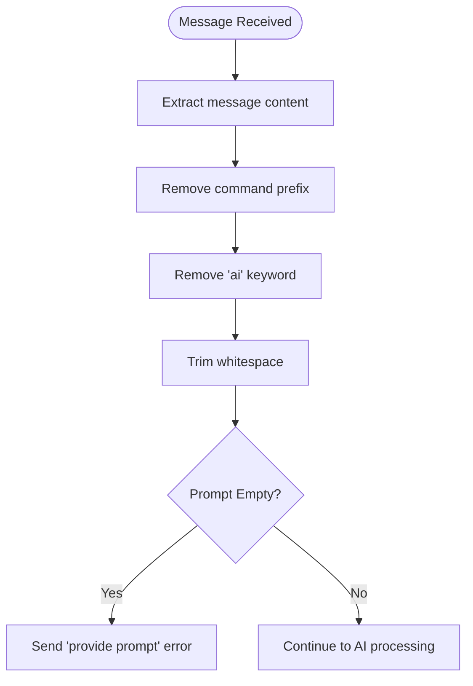
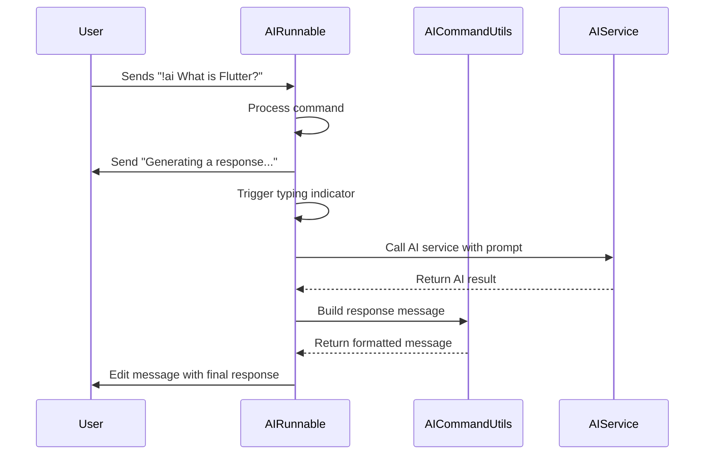
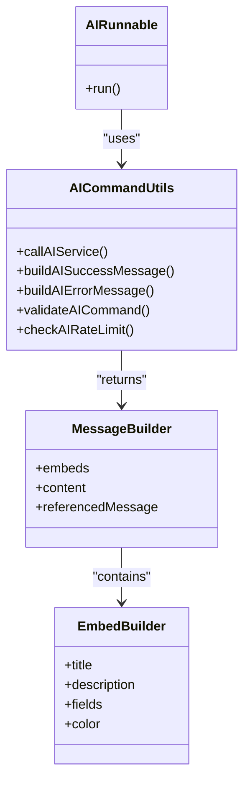
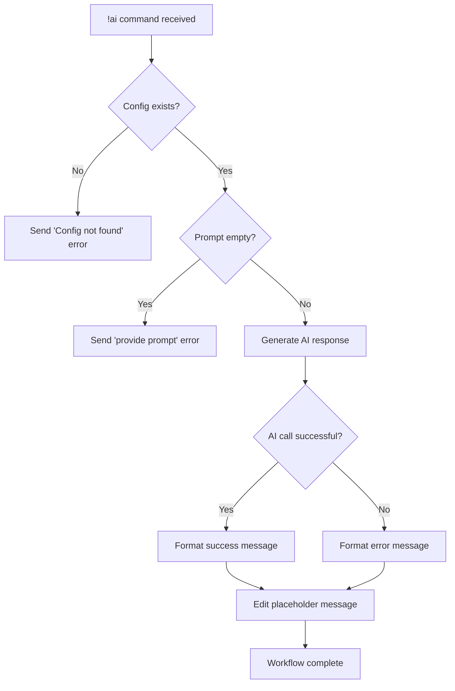

# AI Command Execution

<cite>
**Referenced Files in This Document**   
- [ask.dart](file://src/runnables/ask.dart)
- [discord_response_utils.dart](file://src/utils/discord_response_utils.dart)
- [runnables.dart](file://src/runnables/runnables.dart)
</cite>

## Table of Contents
1. [Introduction](#introduction)
2. [Core Components](#core-components)
3. [Prompt Processing and Validation](#prompt-processing-and-validation)
4. [Response Handling and User Feedback](#response-handling-and-user-feedback)
5. [Integration with AICommandUtils](#integration-with-aicommandutils)
6. [User Context Resolution](#user-context-resolution)
7. [Success and Failure Flow Examples](#success-and-failure-flow-examples)
8. [Edge Case Handling](#edge-case-handling)
9. [Performance Implications and Optimization](#performance-implications-and-optimization)

## Introduction
The AIRunnable class is responsible for executing the '!ai' prefixed command in the Discord bot, enabling users to interact with an AI service through natural language prompts. This document details the implementation of the run method, its integration with Riverpod for dependency injection, and the complete lifecycle of command processing from input parsing to response delivery. The system follows a two-phase response pattern to provide immediate feedback and maintain user engagement during AI processing.

## Core Components

The AIRunnable class extends the base Runnable abstract class and implements the run method to handle AI command execution. It leverages Riverpod for dependency injection, accessing critical services like the bot instance and configuration through ProviderContainer. The command processes messages containing the '!ai' prefix, extracts the user's prompt, and orchestrates the AI response workflow.

**Section sources**
- [ask.dart](file://src/runnables/ask.dart#L10-L64)
- [runnables.dart](file://src/runnables/runnables.dart#L6-L27)

## Prompt Processing and Validation

The prompt extraction logic begins by retrieving the full message content from the MessageCreateEvent object. It then strips the command prefix (e.g., "!") and the "ai" keyword using string replacement operations. The process involves two sequential replaceFirst calls followed by trimming whitespace. If the resulting prompt is empty after processing, the system responds with an error message requesting the user to provide input. This validation occurs before any AI service invocation to prevent unnecessary processing.

**Diagram sources**
- [ask.dart](file://src/runnables/ask.dart#L25-L35)

**Section sources**
- [ask.dart](file://src/runnables/ask.dart#L20-L40)

## Response Handling and User Feedback

The system implements a two-phase response pattern to enhance user experience. First, it sends a placeholder message indicating that a response is being generated, accompanied by a typing indicator triggered through the channel manager. This immediate feedback acknowledges the command receipt. After the AI service returns a result, the system edits the original placeholder message in place with the final AI response, maintaining conversation context and avoiding message clutter. This approach provides a seamless user experience while the AI processes the request.

**Diagram sources**
- [ask.dart](file://src/runnables/ask.dart#L45-L60)

**Section sources**
- [ask.dart](file://src/runnables/ask.dart#L42-L64)

## Integration with AICommandUtils

The AIRunnable class integrates with the AICommandUtils utility class for service invocation and response formatting. It calls the callAIService method with the processed prompt and user ID, passing the ProviderContainer for dependency resolution. The AICommandUtils class handles the actual interaction with the Google AI service through Riverpod injection. For response formatting, it uses buildAISuccessMessage and buildAIErrorMessage methods to create embed-based messages that provide rich, structured feedback to users, including the original prompt and appropriate error categorization.

**Diagram sources**
- [ask.dart](file://src/runnables/ask.dart#L55-L64)
- [discord_response_utils.dart](file://src/utils/discord_response_utils.dart#L17-L224)

**Section sources**
- [ask.dart](file://src/runnables/ask.dart#L55-L64)
- [discord_response_utils.dart](file://src/utils/discord_response_utils.dart#L17-L224)

## User Context Resolution

The system resolves user context by performing a guild and member lookup using the bot's guild collection and the message's guild ID. It first retrieves the guild from the bot's guilds collection, then fetches the specific member using the member ID from the message event. The user object is extracted from the member for ID purposes. If the user lookup fails, the system falls back to using the partial member ID. This user ID is passed to the AI service to maintain context across interactions, enabling personalized responses and tracking.

**Section sources**
- [ask.dart](file://src/runnables/ask.dart#L28-L32)

## Success and Failure Flow Examples

In success scenarios, the system follows the complete workflow: prompt extraction, AI service call, success message construction, and in-place message editing. The final response appears as an edited version of the initial "Generating a response..." message, containing a formatted embed with the AI's answer. In failure cases, such as empty prompts or configuration issues, the system sends immediate error messages with appropriate color coding (red for errors, orange for rate limiting). API failures trigger error-specific messages that categorize the issue (quota exceeded, authentication errors, content blocked, etc.) to help users understand the cause.

**Diagram sources**
- [ask.dart](file://src/runnables/ask.dart#L15-L64)

**Section sources**
- [ask.dart](file://src/runnables/ask.dart#L15-L64)

## Edge Case Handling

The system handles several edge cases to ensure robust operation. Missing configuration is detected at the beginning of execution and results in an immediate error response. Empty prompts after prefix removal trigger a specific validation error. Failed user lookups are handled gracefully by falling back to the partial member ID. The system also manages API-level errors through categorized error messages that distinguish between quota limits, authentication issues, content filtering, and network problems. Each edge case follows a consistent pattern of immediate feedback with actionable information.

**Section sources**
- [ask.dart](file://src/runnables/ask.dart#L15-L40)
- [discord_response_utils.dart](file://src/utils/discord_response_utils.dart#L17-L224)

## Performance Implications and Optimization

The current implementation uses sequential async operations which create a linear execution path: config check → prompt extraction → user lookup → AI service call → response editing. This sequence introduces latency as each operation must complete before the next begins. The user lookup could potentially be parallelized with the AI service preparation, and the typing indicator could be triggered earlier in the process. Future optimizations might include caching user lookups, implementing request batching, or adding timeout handling for external service calls to improve responsiveness and resource utilization.

**Section sources**
- [ask.dart](file://src/runnables/ask.dart#L15-L64)