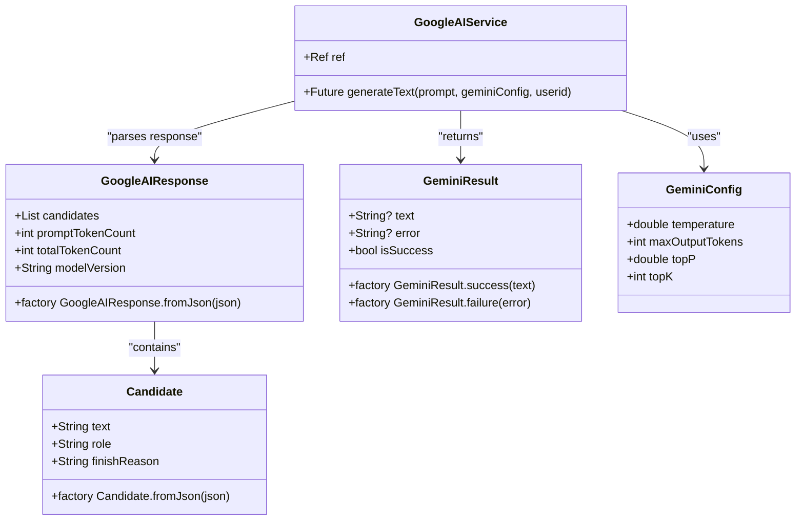
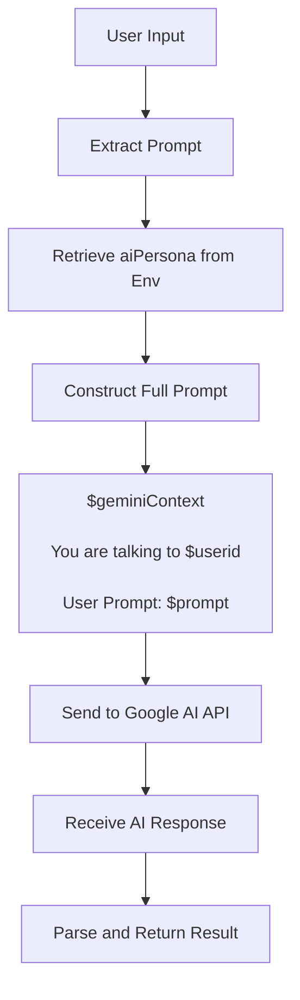
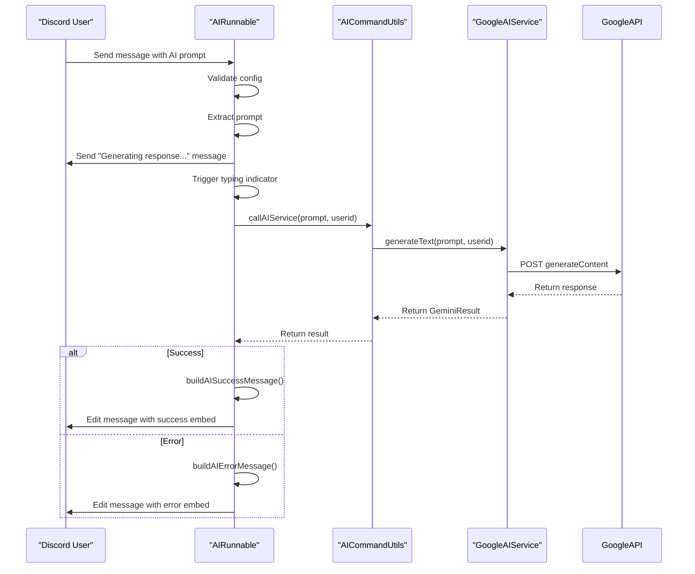
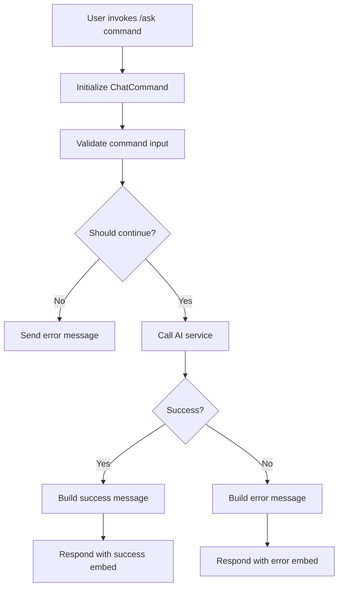
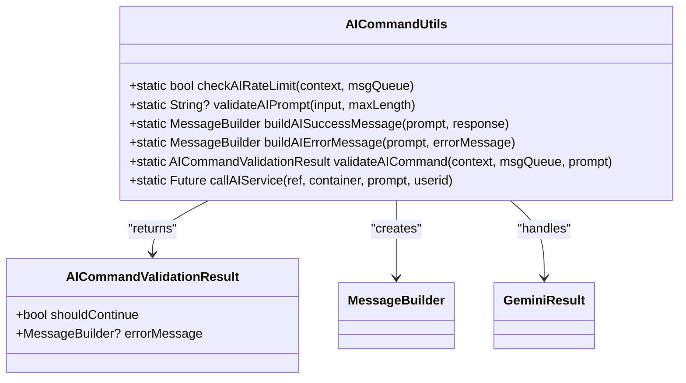
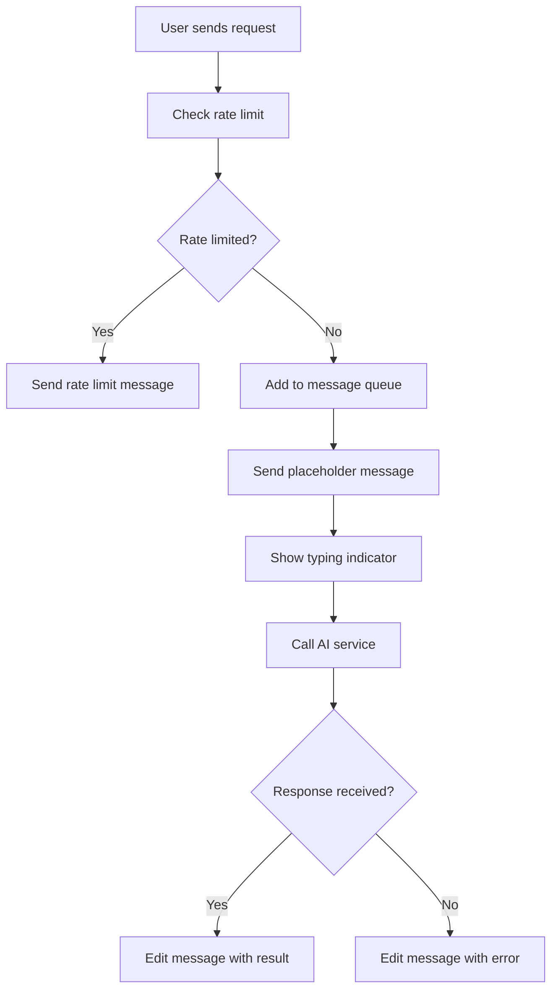

# AI Integration

<cite>
**Referenced Files in This Document**   
- [google_ai_service.dart](file://src/google_ai_service.dart)
- [ask.dart](file://src/runnables/ask.dart)
- [ask_command.dart](file://src/commands/ask_command.dart)
- [discord_response_utils.dart](file://src/utils/discord_response_utils.dart)
- [config.dart](file://src/config.dart)
- [env.dart](file://src/env.dart)
- [constants.dart](file://src/constants.dart)
- [msg_queue.dart](file://src/msg_queue.dart)
</cite>

## Table of Contents
1. [Introduction](#introduction)
2. [AI Service Implementation](#ai-service-implementation)
3. [Prompt Engineering and Configuration](#prompt-engineering-and-configuration)
4. [AIRunnable Execution Flow](#airunnable-execution-flow)
5. [Slash Command Interface](#slash-command-interface)
6. [Response Formatting and Error Handling](#response-formatting-and-error-handling)
7. [Rate Limiting and Performance](#rate-limiting-and-performance)
8. [Configuration Requirements](#configuration-requirements)

## Introduction
The AI-powered response system in the discord_bot enables users to interact with Google's AI API through both message-based and slash command interfaces. This document details the implementation of the AI integration, focusing on the Google AI service interface, prompt engineering approach, execution flow, and user interaction patterns. The system provides consistent response styling through persona configuration, handles errors gracefully with appropriate Discord embeds, and implements rate limiting to prevent abuse.

## AI Service Implementation

The core AI functionality is implemented in `google_ai_service.dart`, which provides a service class that interfaces with Google's Generative Language API. The `GoogleAIService` class uses Riverpod for dependency injection and manages the API calls to the Google AI service.

The service processes user queries by constructing a request body that includes the user's prompt and contextual information, then sends this to the Google AI API endpoint. The response is parsed into structured data models including `GoogleAIResponse`, `Candidate`, and `GeminiResult` to handle the API's output format.

**Diagram sources**
- [google_ai_service.dart](file://src/google_ai_service.dart#L1-L166)

**Section sources**
- [google_ai_service.dart](file://src/google_ai_service.dart#L1-L166)

## Prompt Engineering and Configuration

The system implements a sophisticated prompt engineering approach that incorporates a configurable AI persona to ensure consistent response style. The `aiPersona` is loaded from environment variables through the `Env` interface and is prepended to every user prompt before being sent to the AI service.

The prompt construction follows a specific format that includes the AI persona context, the user ID, and the user's actual prompt. This contextual information helps guide the AI's responses to be more personalized and consistent with the desired personality. The service also configures safety settings to allow most content while blocking only high-severity harmful content.

**Diagram sources**
- [google_ai_service.dart](file://src/google_ai_service.dart#L100-L150)
- [env.dart](file://src/env.dart#L50-L100)

**Section sources**
- [google_ai_service.dart](file://src/google_ai_service.dart#L100-L150)
- [env.dart](file://src/env.dart#L50-L100)

## AIRunnable Execution Flow

The `AIRunnable` class in `ask.dart` implements the message-based interface for the AI feature. This runnable processes user queries that begin with the configured prefix followed by "ai", calls the AI service, and formats responses with typing indicators and error handling.

The execution flow begins when a user sends a message that matches the AI command pattern. The system first validates the configuration, extracts the prompt by removing the command prefix, and sends a placeholder message indicating that a response is being generated. It then triggers a typing indicator to provide visual feedback before calling the AI service.

**Diagram sources**
- [ask.dart](file://src/runnables/ask.dart#L1-L65)
- [discord_response_utils.dart](file://src/utils/discord_response_utils.dart#L1-L225)

**Section sources**
- [ask.dart](file://src/runnables/ask.dart#L1-L65)

## Slash Command Interface

The `AskCommand` class in `ask_command.dart` provides a modern slash command interface to the AI feature, offering an alternative to the message-based approach. This implementation uses the nyxx_commands framework to define a slash command that users can invoke with a clean, structured interface.

The slash command initialization sets up the command with a name, description, and input parameter for the user's prompt. When invoked, the command performs validation (including rate limiting), calls the AI service, and responds with appropriately formatted embeds for both success and error cases.

**Diagram sources**
- [ask_command.dart](file://src/commands/ask_command.dart#L1-L71)

**Section sources**
- [ask_command.dart](file://src/commands/ask_command.dart#L1-L71)

## Response Formatting and Error Handling

The system implements comprehensive response formatting and error handling through the `AICommandUtils` class in `discord_response_utils.dart`. This utility class provides methods to create consistent embeds for different response types, including success, error, and unexpected crash scenarios.

For successful responses, the system creates green-colored embeds with the AI response and the original prompt. For errors, it categorizes the error type (quota exceeded, authentication issues, content blocked, network errors) and displays appropriate messages with orange or red embeds. The system also handles edge cases like very long prompts or responses by truncating content and indicating truncation in the response.

**Diagram sources**
- [discord_response_utils.dart](file://src/utils/discord_response_utils.dart#L1-L225)

**Section sources**
- [discord_response_utils.dart](file://src/utils/discord_response_utils.dart#L1-L225)

## Rate Limiting and Performance

The AI system implements rate limiting through the `MsgQueue` class to prevent abuse and manage API costs. Each user is limited to 10 requests within a 10-minute window, after which they receive a rate limit warning. The `MsgQueue` automatically clears old entries every 10 minutes to maintain performance.

The system uses a message editing pattern rather than sending multiple messages, which reduces clutter in Discord channels. After sending an initial "Generating response..." message, the system edits this message with the final AI response or error information. This approach provides a cleaner user experience and reduces the number of messages in the channel.

Performance considerations include the asynchronous nature of AI queries, which can take several seconds to complete. The typing indicator provides feedback during this waiting period. The system also handles long responses by truncating them to fit within Discord's embed limits while indicating that truncation has occurred.

**Diagram sources**
- [msg_queue.dart](file://src/msg_queue.dart#L1-L39)
- [ask.dart](file://src/runnables/ask.dart#L1-L65)
- [discord_response_utils.dart](file://src/utils/discord_response_utils.dart#L1-L225)

**Section sources**
- [msg_queue.dart](file://src/msg_queue.dart#L1-L39)

## Configuration Requirements

The AI integration requires several configuration elements to function properly. These are managed through environment variables defined in the `env.dart` file, which are loaded at startup. The required configuration includes:

- `AI_API_KEY`: The authentication key for accessing Google's AI API
- `RED_DOOR_AI_PERSONA`: The persona context that defines the AI's response style and behavior
- `AI_MODEL`: The specific AI model to use for text generation
- `BOT_TOKEN`: Authentication token for the Discord bot
- Other required environment variables for bot operation

The system validates all required environment variables at startup and will fail to initialize if any are missing. The configuration is injected using Riverpod's provider pattern, making it accessible throughout the application while maintaining separation of concerns.

**Section sources**
- [env.dart](file://src/env.dart#L1-L100)
- [config.dart](file://src/config.dart#L1-L78)