# AI Response Handling

<cite>
**Referenced Files in This Document**   
- [discord_response_utils.dart](file://src/utils/discord_response_utils.dart)
- [ask.dart](file://src/runnables/ask.dart)
- [ask_command.dart](file://src/commands/ask_command.dart)
- [constants.dart](file://src/constants.dart)
</cite>

## Table of Contents
1. [Introduction](#introduction)
2. [Core Components](#core-components)
3. [Response Formatting System](#response-formatting-system)
4. [Success Response Design](#success-response-design)
5. [Error Response Patterns](#error-response-patterns)
6. [Message Editing Strategy](#message-editing-strategy)
7. [Visual Design and Branding](#visual-design-and-branding)
8. [Accessibility Considerations](#accessibility-considerations)
9. [Error Handling Best Practices](#error-handling-best-practices)
10. [Conclusion](#conclusion)

## Introduction
The AI response handling system in the Discord bot provides a consistent and user-friendly interface for both prefix and slash commands. This system ensures that users receive clear, visually distinct responses for successful AI generations and various error conditions. The implementation leverages shared utility functions to maintain consistency across different command types while adapting to the specific message patterns of each command style.

## Core Components
The AI response handling system is built around the `AICommandUtils` class in the `discord_response_utils.dart` file, which provides shared functionality for both prefix and slash commands. This utility class handles response formatting, error classification, rate limiting, and AI service integration. The system is used by both the `AIRunnable` class for prefix commands and the `AskCommand` class for slash commands, ensuring consistent behavior across command types.

**Section sources**
- [discord_response_utils.dart](file://src/utils/discord_response_utils.dart#L42-L225)
- [ask.dart](file://src/runnables/ask.dart#L0-L65)
- [ask_command.dart](file://src/commands/ask_command.dart#L0-L71)

## Response Formatting System
The response formatting system is centered around the `AICommandUtils` class, which provides a comprehensive set of methods for creating consistent embed responses. The system uses a message builder pattern to construct Discord messages with embedded content, leveraging constants for visual consistency. The formatting system is designed to handle both success and error conditions with appropriate visual cues and structured information.

```mermaid
classDiagram
class AICommandUtils {
+static bool checkAIRateLimit(ChatContext, MsgQueue)
+static String? validateAIPrompt(String, int)
+static MessageBuilder buildAISuccessMessage(String, String)
+static MessageBuilder buildAIErrorMessage(String, String)
+static MessageBuilder buildAICrashMessage(String, String)
+static EmbedBuilder createAISuccessEmbed(String, String)
+static EmbedBuilder createAIErrorEmbed(String, String)
+static EmbedBuilder createAICrashEmbed(String, String)
+static AICommandValidationResult validateAICommand(ChatContext, MsgQueue, String, int)
+static Future<GeminiResult> callAIService(Ref, String, String)
}
class EmdedColor {
+red
+green
+orange
}
AICommandUtils --> EmdedColor : "uses"
AICommandUtils --> "EmbedBuilder" : "creates"
AICommandUtils --> "MessageBuilder" : "creates"
```

**Diagram sources**
- [discord_response_utils.dart](file://src/utils/discord_response_utils.dart#L42-L225)
- [constants.dart](file://src/constants.dart#L0-L86)

## Success Response Design
Success responses are designed with a clear visual hierarchy and consistent structure. The system uses green color coding (via `EmdedColor.green`) to indicate successful operations, providing immediate visual feedback. Success embeds feature a title of "🤖 AI Response" and organize information into fields that display the user's original prompt and the AI-generated response.

For responses that exceed Discord's description length limit (4096 characters), the system intelligently truncates the content and adds a "💬 Response" field to display the truncated text. Prompts are also handled with care—when they exceed 1024 characters (the field value limit), they are truncated with an ellipsis to maintain readability while preserving context.

```mermaid
flowchart TD
Start([Create Success Embed]) --> AddTitle["Set title to '🤖 AI Response'"]
AddTitle --> SetColor["Set color to green (EmdedColor.green)"]
SetColor --> CheckPromptLength{"Prompt ≤ 1024 chars?"}
CheckPromptLength --> |Yes| AddPromptField["Add '📝 Your Prompt' field with full prompt"]
CheckPromptLength --> |No| TruncatePrompt["Truncate prompt to 1020 chars + '...'"]
TruncatePrompt --> AddPromptField
AddPromptField --> CheckResponseLength{"Response ≤ 4096 chars?"}
CheckResponseLength --> |Yes| SetDescription["Set description to full response"]
CheckResponseLength --> |No| AddResponseField["Add '💬 Response' field with truncated response"]
AddResponseField --> AddTruncationNote["Add note: 'Response truncated due to length'"]
SetDescription --> AddFooter["Add footer: 'Red Door AI'"]
AddTruncationNote --> AddFooter
AddFooter --> Complete([Return Embed])
```



**Diagram sources**
- [discord_response_utils.dart](file://src/utils/discord_response_utils.dart#L60-L70)
- [constants.dart](file://src/constants.dart#L40-L50)

## Error Response Patterns
The system implements a sophisticated error classification system that translates technical error conditions into user-friendly messages. Error responses use red color coding (via `EmdedColor.red`) to clearly indicate failure states. The system categorizes errors into specific types, each with an appropriate emoji and message:

- **🚫 API Quota Exceeded**: Triggered when usage limits are reached
- **🔑 Authentication Error**: Indicates configuration issues with AI service credentials
- **🛡️ Content Blocked**: Appears when safety filters block a prompt
- **🌐 Network Error**: Shown for connectivity issues
- **⚠️ AI Service Error**: Generic error for unclassified issues

All error responses include the user's original prompt in a "📝 Your Prompt" field, which helps users understand what was processed and aids in troubleshooting. Long prompts are truncated to fit within Discord's field limits while preserving the essential context.

```mermaid
flowchart TD
Start([Create Error Embed]) --> ClassifyError{"Analyze error message"}
ClassifyError --> |Contains 'quota' or 'limit'| QuotaExceeded["Set title: '🚫 API Quota Exceeded'"]
ClassifyError --> |Contains 'key' or 'auth'| AuthError["Set title: '🔑 Authentication Error'"]
ClassifyError --> |Contains 'blocked' or 'safety'| Blocked["Set title: '🛡️ Content Blocked'"]
ClassifyError --> |Contains 'network' or 'timeout'| NetworkError["Set title: '🌐 Network Error'"]
ClassifyError --> |Other| GenericError["Set title: '⚠️ AI Service Error'"]
QuotaExceeded --> SetDescription["Set description: 'Usage limit reached'"]
AuthError --> SetDescription["Set description: 'Configuration issue'"]
Blocked --> SetDescription["Set description: 'Blocked by safety filters'"]
NetworkError --> SetDescription["Set description: 'Unable to reach service'"]
GenericError --> SetDescription["Set description: Use original error"]
SetDescription --> AddPromptField["Add '📝 Your Prompt' field"]
AddPromptField --> SetColor["Set color to red (EmdedColor.red)"]
SetColor --> AddFooter["Add footer: 'Red Door AI'"]
AddFooter --> Complete([Return Embed])
```



**Diagram sources**
- [discord_response_utils.dart](file://src/utils/discord_response_utils.dart#L71-L103)
- [constants.dart](file://src/constants.dart#L40-L50)

## Message Editing Strategy
The system employs different message strategies for prefix and slash commands to optimize the user experience. For prefix commands, the system implements a message editing pattern that maintains context and provides feedback throughout the processing lifecycle.

When a user issues a prefix command, the bot immediately responds with a "Generating a response..." message. This initial response serves multiple purposes: it acknowledges the command, provides immediate feedback, and establishes a message thread. Once the AI processing completes, the bot edits this original message to replace the placeholder text with the formatted success or error embed.

This editing strategy offers several advantages:
- Maintains message context and conversation flow
- Prevents message clutter in channels
- Provides clear visual progression from request to response
- Allows users to easily track the status of their requests

In contrast, slash commands send responses as new messages, leveraging Discord's built-in interaction system. This difference reflects the distinct user experience patterns of the two command types while maintaining consistent visual design through shared formatting utilities.


**Diagram sources**
- [ask.dart](file://src/runnables/ask.dart#L42-L64)
- [discord_response_utils.dart](file://src/utils/discord_response_utils.dart#L180-L200)

## Visual Design and Branding
The visual design of AI responses follows a consistent branding strategy that reinforces the bot's identity. All AI-related embeds include a footer with the text "Red Door AI", creating a cohesive brand presence across all interactions. The system uses a standardized color palette defined in the `EmdedColor` enum, with specific meanings assigned to each color:

- **Green**: Success and positive outcomes
- **Red**: Errors and failure states
- **Orange**: Warnings and rate limiting

The use of emojis in titles (🤖, 🚫, 🔑, etc.) enhances readability and provides immediate visual cues about the response type. Field names are consistently formatted with emoji prefixes (📝, 💬, 🔍) to create a scannable structure that helps users quickly identify different types of information.

This consistent visual language not only improves usability but also contributes to a professional appearance that builds user trust in the bot's reliability and attention to detail.

```mermaid
graph TD
A[Visual Design Elements] --> B[Color Coding]
A --> C[Emoji Usage]
A --> D[Consistent Structure]
A --> E[Branding]
B --> F[Green = Success]
B --> G[Red = Error]
B --> H[Orange = Warning]
C --> I[🤖 AI Response]
C --> J[🚫 API Quota]
C --> K[🔑 Auth Error]
C --> L[📝 Your Prompt]
C --> M[💬 Response]
D --> N[Title Structure]
D --> O[Field Organization]
D --> P[Truncation Handling]
E --> Q[Footer: "Red Door AI"]
E --> R[Consistent Formatting]
```

**Diagram sources**
- [constants.dart](file://src/constants.dart#L0-L86)
- [discord_response_utils.dart](file://src/utils/discord_response_utils.dart#L42-L225)

## Accessibility Considerations
The response formatting system incorporates several accessibility features to ensure that information is accessible to all users. While the system relies on color coding for quick visual identification, it also uses emojis and clear text labels to convey meaning, providing redundant cues that remain effective for users with color vision deficiencies.

The structured field layout with descriptive labels ("📝 Your Prompt", "💬 Response") ensures that screen readers can effectively convey the content's organization. Text formatting with bold markers (e.g., "**Invalid Input**") provides additional emphasis that can be detected by assistive technologies.

The system handles long content gracefully by implementing intelligent truncation with clear indicators when content has been shortened. This prevents overwhelming users with excessively long messages while maintaining the essential context needed for understanding the response.

## Error Handling Best Practices
The implementation demonstrates several error handling best practices that protect both the user experience and system integrity:

1. **User-Friendly Error Translation**: Technical errors are translated into understandable messages without exposing internal implementation details.

2. **Input Validation**: The system validates prompts for emptiness and length before processing, providing specific feedback when inputs are invalid.

3. **Rate Limiting**: Built-in rate limiting prevents abuse and ensures fair usage, with clear messaging when users exceed limits.

4. **Graceful Degradation**: When responses exceed length limits, the system provides truncated content with clear indications rather than failing entirely.

5. **Comprehensive Error Coverage**: The system anticipates and handles various failure modes (quota, authentication, network, content filtering) with appropriate responses.

6. **Error Containment**: Unexpected errors are caught and transformed into user-friendly messages, preventing crashes from affecting the overall bot stability.

The separation of concerns between error detection, classification, and response formatting allows for maintainable and extensible error handling that can easily accommodate new error types as the system evolves.

## Conclusion
The AI response handling system provides a robust, consistent, and user-friendly interface for interacting with AI services through both prefix and slash commands. By centralizing response formatting logic in the `AICommandUtils` class, the system ensures visual and behavioral consistency across command types while adapting to the specific message patterns of each interface. The thoughtful design of success and error responses, combined with effective message editing strategies and attention to accessibility, creates a professional and reliable user experience that effectively communicates the status of AI operations.