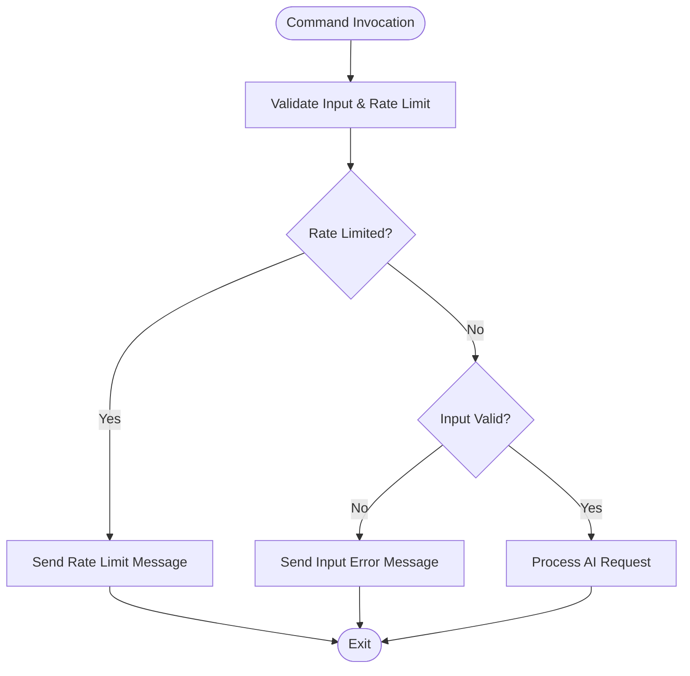
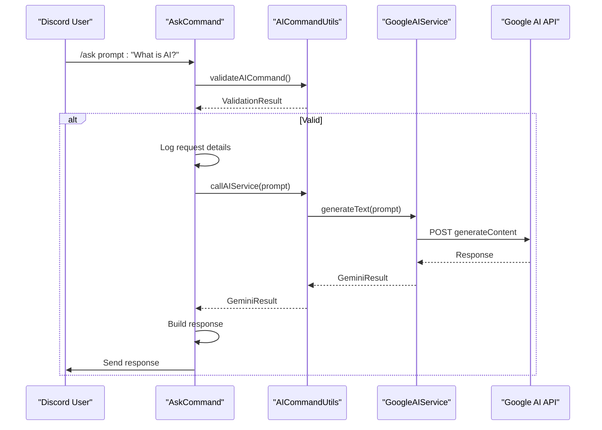

# AI Slash Command

<cite>
**Referenced Files in This Document**  
- [ask_command.dart](file://src/commands/ask_command.dart)
- [msg_queue.dart](file://src/msg_queue.dart)
- [google_ai_service.dart](file://src/google_ai_service.dart)
- [discord_response_utils.dart](file://src/utils/discord_response_utils.dart)
- [constants.dart](file://src/constants.dart)
- [commands.dart](file://src/commands/commands.dart)
</cite>

## Table of Contents
1. [Introduction](#introduction)
2. [Command Structure and Initialization](#command-structure-and-initialization)
3. [Validation and Rate Limiting](#validation-and-rate-limiting)
4. [Request Processing Flow](#request-processing-flow)
5. [Response Handling](#response-handling)
6. [Interaction Patterns: Slash vs Prefix Commands](#interaction-patterns-slash-vs-prefix-commands)
7. [Usage Examples](#usage-examples)
8. [UX Considerations](#ux-considerations)

## Introduction
The AskCommand slash command provides users with an interface to generate AI-powered text responses through Discord. Built on the nyxx_commands framework, this command integrates with Google's AI service to deliver generated content while enforcing rate limiting and input validation to ensure fair usage and system stability. The implementation follows a structured pattern of initialization, validation, processing, and response handling, with clear separation of concerns between command logic, AI service interaction, and user interface components.

## Command Structure and Initialization

The AskCommand class extends SlashRunnable and implements a structured initialization process through the `initialize` method. During initialization, the command creates a ChatCommand instance with a defined name ("ask") and description ("Generate text using Red Door AI") that appears in Discord's command interface. The command configuration includes a single required parameter: a text prompt with a user-facing description "Your prompt for AI generation" that guides users on proper input format.

The initialization process sets up the command callback that will be executed when the command is invoked. This callback receives the user's prompt as input and orchestrates the entire request lifecycle, from validation to response delivery. The command is registered within the application's command registry through the SlashCommands provider, which manages the lifecycle of all slash commands in the bot.

**Section sources**
- [ask_command.dart](file://src/commands/ask_command.dart#L10-L71)
- [commands.dart](file://src/commands/commands.dart#L30-L55)

## Validation and Rate Limiting

The command implements a comprehensive validation layer through the AICommandUtils.validateAICommand method, which performs both rate limiting and input validation before processing requests. Rate limiting is enforced by the MsgQueue class, which tracks user requests over a 10-minute window. Each user is limited to 10 requests within this period, after which they receive a rate limit notification and their request is terminated.

Input validation ensures that prompts are not empty and do not exceed 4,000 characters. The validation process returns an AICommandValidationResult object that indicates whether processing should continue and includes an error message if validation fails. This two-tiered validation approach prevents abuse while providing meaningful feedback to users who submit invalid input.



**Diagram sources**
- [ask_command.dart](file://src/commands/ask_command.dart#L25-L35)
- [discord_response_utils.dart](file://src/utils/discord_response_utils.dart#L100-L150)
- [msg_queue.dart](file://src/msg_queue.dart#L10-L30)

**Section sources**
- [ask_command.dart](file://src/commands/ask_command.dart#L25-L35)
- [discord_response_utils.dart](file://src/utils/discord_response_utils.dart#L100-L150)
- [msg_queue.dart](file://src/msg_queue.dart#L10-L30)

## Request Processing Flow

When a request passes validation, the command processes it through a defined sequence of operations. The process begins with logging the request details, including the user ID and prompt length, which aids in monitoring and debugging. The system then invokes the AI service through AICommandUtils.callAIService, which interfaces with Google's generative AI API.

The AI service call includes contextual information such as the AI's persona and user identification, enhancing the relevance of generated responses. The request is sent with safety settings configured to allow most content while blocking high-risk categories. The service returns a GeminiResult object that indicates success or failure, with the generated text or error details.



**Diagram sources**
- [ask_command.dart](file://src/commands/ask_command.dart#L36-L65)
- [google_ai_service.dart](file://src/google_ai_service.dart#L111-L165)
- [discord_response_utils.dart](file://src/utils/discord_response_utils.dart#L152-L180)

**Section sources**
- [ask_command.dart](file://src/commands/ask_command.dart#L36-L65)
- [google_ai_service.dart](file://src/google_ai_service.dart#L111-L165)

## Response Handling

The command implements conditional response handling based on the result status from the AI service. For successful responses, the system creates a formatted embed using AICommandUtils.buildAISuccessMessage that includes the original prompt and generated text. This embed is sent directly to the user through the context.respond method, maintaining the conversation context within Discord's interface.

For error responses, the system provides meaningful feedback through specialized error messages that categorize the failure type. These include quota exceeded, authentication errors, content blocked by safety filters, network issues, and unexpected errors. Each error type receives a distinct visual treatment with appropriate icons and color coding (red for errors, orange for warnings) to help users understand the nature of the problem.

The response system also handles edge cases such as extremely long prompts or responses by truncating content and indicating when information has been shortened. This ensures that users receive useful feedback even when dealing with content that exceeds Discord's message limitations.

**Section sources**
- [ask_command.dart](file://src/commands/ask_command.dart#L50-L65)
- [discord_response_utils.dart](file://src/utils/discord_response_utils.dart#L40-L95)
- [constants.dart](file://src/constants.dart#L10-L30)

## Interaction Patterns: Slash vs Prefix Commands

The slash command interface differs significantly from traditional prefix-based commands in several key aspects. Slash commands provide immediate feedback through Discord's autocomplete and parameter validation, reducing user errors before the command is even submitted. When a user types "/", they see a list of available commands with descriptions, and when they select "ask", they are prompted for the required prompt parameter with its user-facing description.

Unlike prefix commands, slash commands cannot be edited after submission, which simplifies the interaction model but removes the ability to refine prompts through message editing. The response pattern is also different: slash commands typically produce ephemeral responses that are visible only to the command issuer during processing, followed by a permanent response message. This provides a cleaner user experience compared to prefix commands that leave the original command text visible in the chat history.

The MsgQueue system plays a crucial role in preventing abuse of the slash command interface, where users might otherwise rapidly invoke commands through Discord's UI. By tracking requests at the command level rather than message level, the system ensures fair usage across all users regardless of their interaction method.

**Section sources**
- [ask_command.dart](file://src/commands/ask_command.dart#L10-L71)
- [msg_queue.dart](file://src/msg_queue.dart#L10-L40)

## Usage Examples

**Valid Interaction:**
```
/ask prompt:"Explain quantum computing in simple terms"
```
This would trigger the full processing flow, with the AI service generating an explanation and returning it in a formatted embed that includes both the original prompt and response.

**Invalid Interactions:**
```
/ask prompt:""
```
This would fail input validation and return an error message indicating that a prompt is required.

```
/ask prompt:[4500-character prompt]
```
This would exceed the maximum length and trigger a "Prompt Too Long" error with guidance on the character limit.

**Rate Limited Interaction:**
After making 10 requests within 10 minutes, a user would receive a "Rate Limited" message explaining they must wait before making additional requests.

**Section sources**
- [ask_command.dart](file://src/commands/ask_command.dart#L25-L35)
- [discord_response_utils.dart](file://src/utils/discord_response_utils.dart#L60-L90)

## UX Considerations

The slash command interface offers several UX advantages over traditional text-based commands. The structured parameter system with descriptive labels reduces user confusion and input errors. The immediate visual feedback during command entry helps users understand what information is expected before submission.

The embed-based response format provides a rich, visually appealing presentation of AI-generated content with clear separation between the user's prompt and the AI's response. Color coding and icons provide instant visual cues about the status of the request, helping users quickly understand whether their request succeeded or failed.

However, the interface has limitations compared to free-form text commands. The inability to edit submitted commands means users cannot refine their prompts without submitting a new command. The structured nature of slash commands also makes it less suitable for complex, multi-step interactions that might benefit from conversational refinement.

The system addresses these limitations through clear error messaging and rate limiting notifications that guide users toward successful interactions. The 10-minute rate limit window provides sufficient time for iterative exploration while preventing abuse, striking a balance between accessibility and system stability.

**Section sources**
- [ask_command.dart](file://src/commands/ask_command.dart#L10-L71)
- [discord_response_utils.dart](file://src/utils/discord_response_utils.dart#L40-L95)
- [constants.dart](file://src/constants.dart#L10-L30)