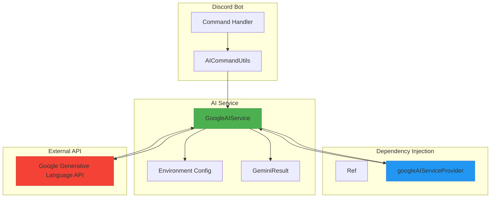
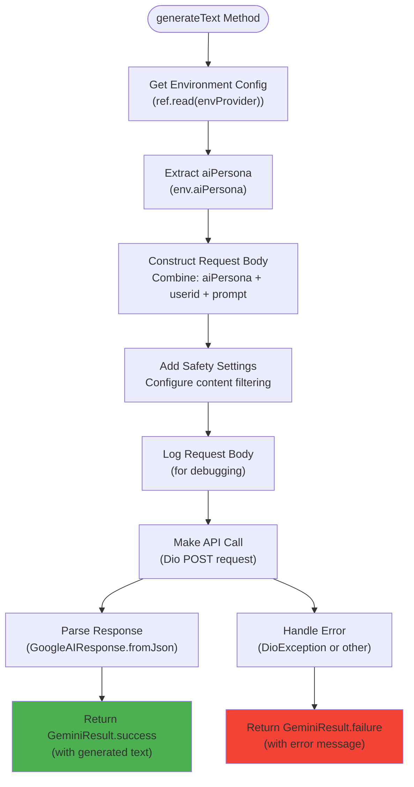
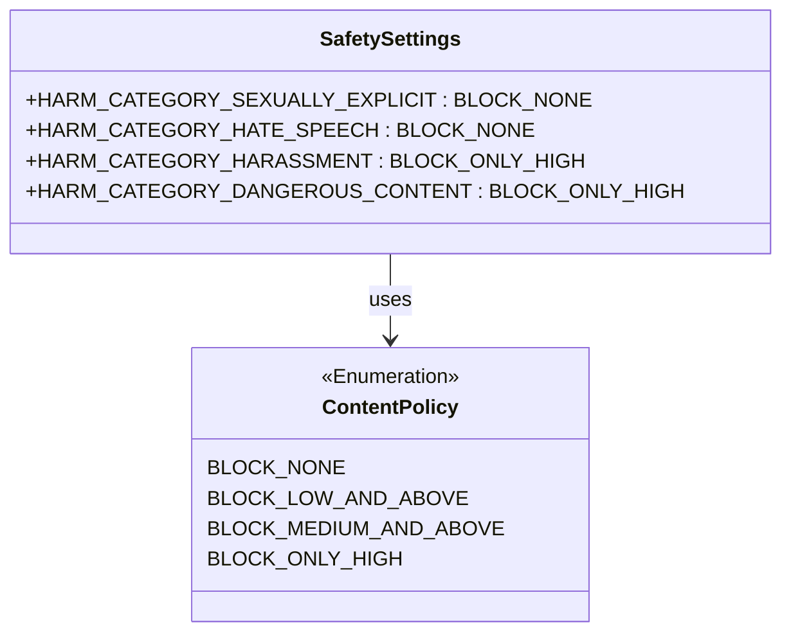
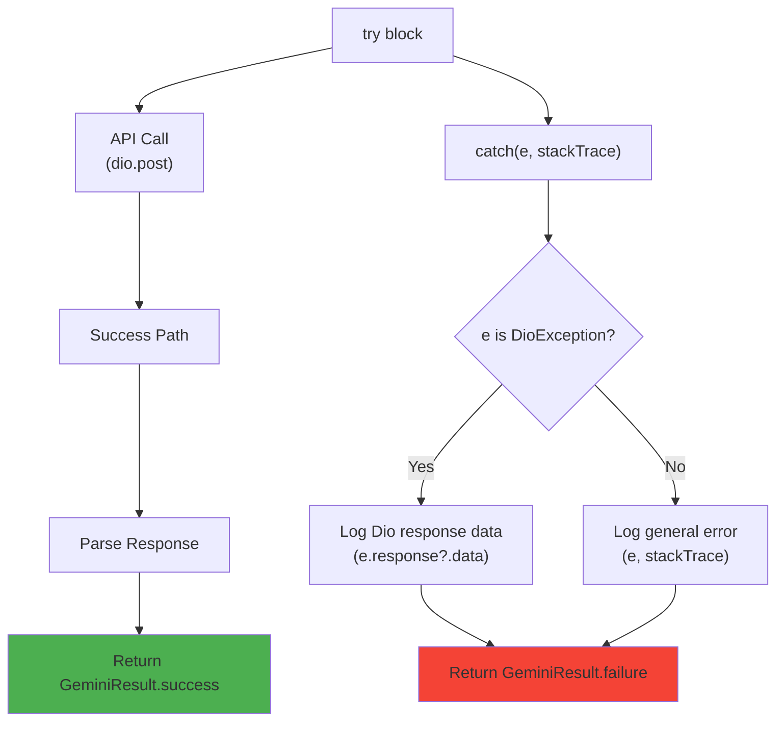
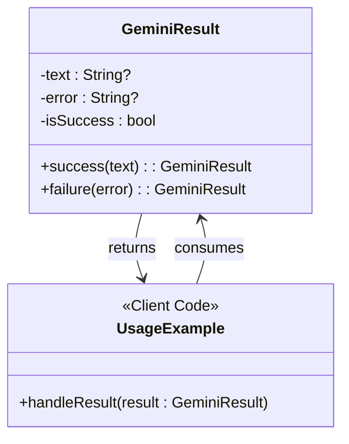
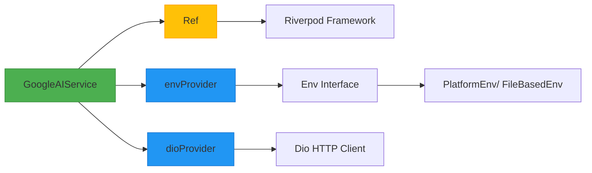

# Google AI Service

<cite>
**Referenced Files in This Document**   
- [google_ai_service.dart](file://src/google_ai_service.dart)
- [env.dart](file://src/env.dart)
- [dio.dart](file://src/dio.dart)
- [discord_response_utils.dart](file://src/utils/discord_response_utils.dart)
- [ask_command.dart](file://src/commands/ask_command.dart)
</cite>

## Table of Contents
1. [Introduction](#introduction)
2. [Core Components](#core-components)
3. [Architecture Overview](#architecture-overview)
4. [Detailed Component Analysis](#detailed-component-analysis)
5. [Dependency Analysis](#dependency-analysis)
6. [Performance Considerations](#performance-considerations)
7. [Troubleshooting Guide](#troubleshooting-guide)
8. [Conclusion](#conclusion)

## Introduction
The GoogleAIService class provides a robust interface to Google's Generative Language API (Gemini), enabling the Discord bot to generate AI-powered responses to user queries. This service integrates seamlessly with the Riverpod state management framework for dependency injection and leverages environment configuration to dynamically customize AI behavior. The implementation focuses on reliability, safety, and maintainability through structured error handling, request logging, and a clear response pattern.

## Core Components

The GoogleAIService implementation consists of several key components that work together to provide AI text generation capabilities. The service uses Riverpod for dependency injection, reads configuration from environment variables, constructs API requests with dynamic prompt engineering, and handles responses through a consistent result pattern. The core functionality is centered around the generateText method, which orchestrates the entire AI request lifecycle from prompt preparation to response parsing.

**Section sources**
- [google_ai_service.dart](file://src/google_ai_service.dart#L72-L165)
- [env.dart](file://src/env.dart#L17-L40)

## Architecture Overview

The GoogleAIService follows a clean architecture pattern with clear separation of concerns. The service acts as an adapter between the application's business logic and Google's Generative Language API. It depends on Riverpod for dependency injection, uses Dio for HTTP communication, and retrieves configuration from the environment provider. The service is consumed by command handlers through a provider, enabling easy testing and dependency management.

**Diagram sources **
- [google_ai_service.dart](file://src/google_ai_service.dart#L72-L165)
- [env.dart](file://src/env.dart#L17-L40)
- [discord_response_utils.dart](file://src/utils/discord_response_utils.dart#L207-L224)

## Detailed Component Analysis

### GoogleAIService Implementation

The GoogleAIService class is the central component for interfacing with Google's Generative Language API. It uses Riverpod's Ref for dependency injection, allowing it to access configuration and HTTP client instances without tight coupling. The service is exposed through a provider that creates instances with the necessary dependencies.

#### Request Construction and Prompt Engineering

**Diagram sources **
- [google_ai_service.dart](file://src/google_ai_service.dart#L121-L165)
- [env.dart](file://src/env.dart#L17-L40)

#### Riverpod Integration and Dependency Injection
The service leverages Riverpod for dependency injection, receiving a Ref instance that provides access to other providers in the application. This approach enables loose coupling and makes the service easily testable. The envProvider supplies critical configuration values including the AI API key, model identifier, and persona context, while the dioProvider supplies the HTTP client for API communication.

**Section sources**
- [google_ai_service.dart](file://src/google_ai_service.dart#L121-L148)
- [env.dart](file://src/env.dart#L28-L30)
- [dio.dart](file://src/dio.dart#L8-L10)

### Safety Settings Configuration

The service implements a comprehensive safety configuration that balances content generation freedom with appropriate content filtering. The safety settings are hardcoded in the request construction to ensure consistent behavior across all API calls.

The configuration allows sexually explicit and hate speech content to be generated (BLOCK_NONE), while setting harassment and dangerous content to be blocked only at high levels (BLOCK_ONLY_HIGH). This permissive stance enables creative freedom while still providing some protection against the most severe content types.

**Section sources**
- [google_ai_service.dart](file://src/google_ai_service.dart#L132-L136)

### Error Handling Strategy

The service implements a robust error handling strategy that captures both expected and unexpected errors during API communication. The implementation uses try-catch blocks to handle exceptions, with special handling for DioException to provide detailed error information from the HTTP layer.

The error handling strategy ensures that all exceptions are caught and converted into a consistent GeminiResult.failure object, preventing unhandled exceptions from crashing the application. The implementation also includes comprehensive logging to aid in debugging and monitoring.

**Section sources**
- [google_ai_service.dart](file://src/google_ai_service.dart#L158-L165)

### GeminiResult Wrapper Pattern

The service uses the GeminiResult class as a wrapper pattern to represent the outcome of AI text generation operations. This pattern provides a consistent interface for handling both success and failure cases across the codebase.

The pattern uses a private constructor with a factory method pattern to create instances, ensuring that only valid states can be created. The isSuccess boolean provides a clear way to check the operation outcome, while the text and error properties contain the relevant data for each case. This pattern is used consistently throughout the codebase, making it easy to handle AI service responses.

**Section sources**
- [google_ai_service.dart](file://src/google_ai_service.dart#L72-L85)
- [discord_response_utils.dart](file://src/utils/discord_response_utils.dart#L207-L224)

## Dependency Analysis

The GoogleAIService has well-defined dependencies that follow the dependency inversion principle. The service depends on abstractions (Riverpod providers) rather than concrete implementations, making it highly testable and maintainable.

The service has direct dependencies on Riverpod's Ref for dependency injection, the envProvider for configuration, and the dioProvider for HTTP communication. These dependencies are injected through the constructor, enabling easy mocking for testing. The service has no direct dependencies on Discord-specific code, making it reusable in other contexts.

**Diagram sources **
- [google_ai_service.dart](file://src/google_ai_service.dart#L121-L148)
- [env.dart](file://src/env.dart#L1-L99)
- [dio.dart](file://src/dio.dart#L1-L10)

## Performance Considerations

The GoogleAIService implementation considers several performance aspects that affect the user experience and system reliability. Network latency is a primary concern, as API calls to Google's Generative Language API can take several seconds to complete. The asynchronous nature of the generateText method ensures that the Discord bot remains responsive during AI processing.

API rate limits are managed at the command level through the MsgQueue system, which prevents users from making too many requests in a short period. This rate limiting is implemented in the AICommandUtils class, which validates requests before they reach the GoogleAIService.

The synchronous string manipulation in request preparation (concatenating aiPersona, userid, and prompt) is minimal and occurs quickly, so it has negligible impact on performance. However, the JSON serialization and logging of the request body could become a bottleneck if very large prompts are used, as the JsonEncoder.withIndent creates a formatted string for debugging purposes.

The service does not implement caching, meaning identical prompts will result in separate API calls and potential charges. For high-traffic scenarios, implementing a response cache based on prompt content could improve performance and reduce costs.

**Section sources**
- [google_ai_service.dart](file://src/google_ai_service.dart#L121-L130)
- [ask_command.dart](file://src/commands/ask_command.dart#L47-L70)
- [discord_response_utils.dart](file://src/utils/discord_response_utils.dart#L168-L205)

## Troubleshooting Guide

When troubleshooting issues with the GoogleAIService, several common problems and their solutions should be considered:

1. **Authentication Errors**: If the service returns authentication errors, verify that the AI_API_KEY environment variable is correctly set and contains a valid Google API key with access to the Generative Language API.

2. **Quota Exceeded Errors**: These occur when the API usage limits have been reached. Check the Google Cloud Console for quota usage and consider requesting higher limits or implementing more aggressive rate limiting.

3. **Content Blocked Errors**: If prompts are being blocked, review the safety settings configuration. The current settings allow sexually explicit and hate speech content but block harassment and dangerous content at high levels.

4. **Empty Responses**: If the service returns empty responses, check that the response parsing logic can handle the API response format. The implementation assumes at least one candidate in the response.

5. **Environment Loading Issues**: If configuration values are missing, verify that all required environment variables are set according to the envKeys definition in env.dart.

The comprehensive logging in the service (request bodies, responses, and errors) provides valuable information for diagnosing issues. When debugging, examine the logged request bodies to ensure they contain the expected structure and content.

**Section sources**
- [google_ai_service.dart](file://src/google_ai_service.dart#L158-L165)
- [env.dart](file://src/env.dart#L45-L55)
- [discord_response_utils.dart](file://src/utils/discord_response_utils.dart#L145-L165)

## Conclusion

The GoogleAIService provides a well-architected interface to Google's Generative Language API, with thoughtful consideration of dependency injection, error handling, and safety configuration. The implementation follows best practices for asynchronous programming and uses a consistent result pattern to handle success and failure cases. The service is tightly integrated with the Riverpod framework, enabling clean dependency management and testability. While the current implementation meets the core requirements, opportunities for improvement include adding response caching, implementing more sophisticated rate limiting, and enhancing the safety settings configuration with dynamic rules based on user roles or content categories.