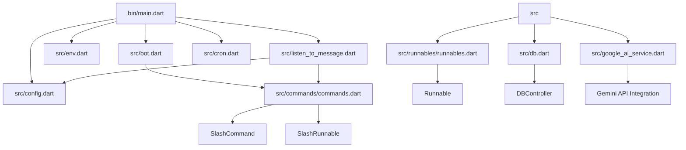
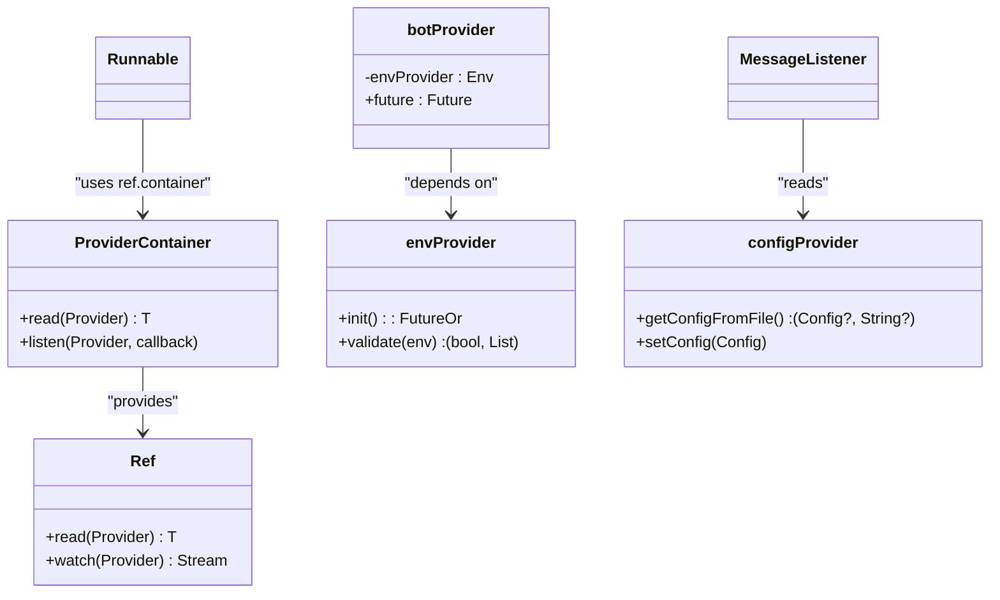
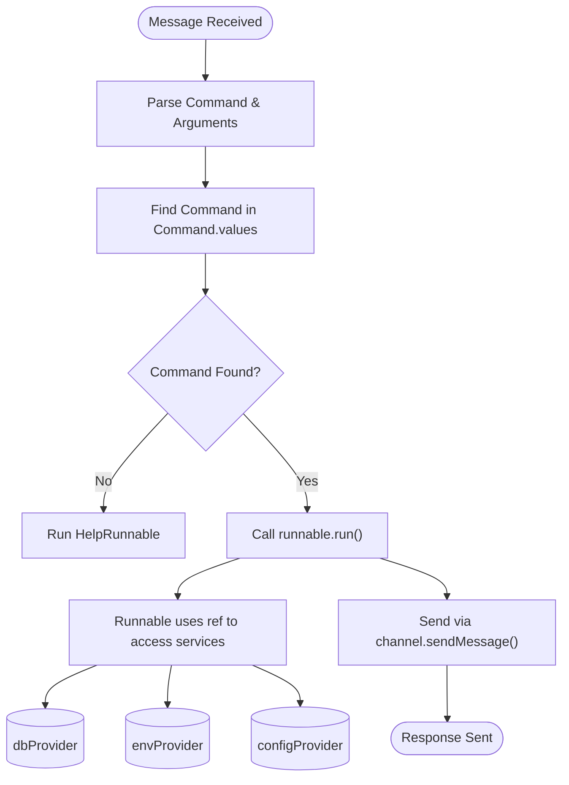

# Architecture Overview

<cite>
**Referenced Files in This Document**   
- [bin/main.dart](file://bin/main.dart)
- [src/bot.dart](file://src/bot.dart)
- [src/config.dart](file://src/config.dart)
- [src/env.dart](file://src/env.dart)
- [src/listen_to_message.dart](file://src/listen_to_message.dart)
- [src/cron.dart](file://src/cron.dart)
- [src/commands.dart](file://src/commands.dart)
- [src/commands/commands.dart](file://src/commands/commands.dart)
- [src/runnables/runnables.dart](file://src/runnables/runnables.dart)
- [src/db.dart](file://src/db.dart)
- [src/google_ai_service.dart](file://src/google_ai_service.dart)
</cite>

## Table of Contents
1. [Introduction](#introduction)
2. [Project Structure](#project-structure)
3. [Core Components](#core-components)
4. [Architecture Overview](#architecture-overview)
5. [Detailed Component Analysis](#detailed-component-analysis)
6. [Dependency Analysis](#dependency-analysis)
7. [Performance Considerations](#performance-considerations)
8. [Troubleshooting Guide](#troubleshooting-guide)
9. [Conclusion](#conclusion)

## Introduction
This document provides a comprehensive architectural overview of the `discord_bot` application, focusing on its component structure and dependency management system. The bot leverages Riverpod for state and dependency management, enabling clean separation of concerns, testability, and scalable initialization logic. The architecture follows an event-driven model centered around Discord message events, command parsing, and modular execution via runnables. This documentation details the boot sequence, provider-based dependency injection, service orchestration, and data flow from user input to command execution.

## Project Structure



**Diagram sources**
- [bin/main.dart](file://bin/main.dart#L1-L30)
- [src/bot.dart](file://src/bot.dart#L1-L54)
- [src/commands/commands.dart](file://src/commands/commands.dart#L1-L56)
- [src/listen_to_message.dart](file://src/listen_to_message.dart#L1-L142)
- [src/db.dart](file://src/db.dart#L1-L133)

**Section sources**
- [bin/main.dart](file://bin/main.dart#L1-L30)
- [src/bot.dart](file://src/bot.dart#L1-L54)
- [src/config.dart](file://src/config.dart#L1-L79)
- [src/env.dart](file://src/env.dart#L1-L100)

## Core Components

The core components of the application are orchestrated through Riverpod providers, which manage the lifecycle and dependencies of services such as the Discord bot client, configuration, environment variables, message listeners, and cron jobs. The `ProviderContainer` in `main.dart` acts as the root injector, initializing all top-level services in a defined order. Key components include:

- **botProvider**: Initializes the Nyxx Gateway client with command plugins.
- **envProvider**: Loads environment variables either from platform or file.
- **configProvider**: Manages runtime configuration stored in `config.json`.
- **messageListenerProvider**: Subscribes to Discord message events and routes commands.
- **dbProvider**: Handles persistent storage via JSON files (`db.json`).
- **googleAIServiceProvider**: Interfaces with Google’s Generative Language API.

These components are loosely coupled through dependency injection, allowing for modular testing and replacement.

**Section sources**
- [bin/main.dart](file://bin/main.dart#L1-L30)
- [src/bot.dart](file://src/bot.dart#L1-L54)
- [src/env.dart](file://src/env.dart#L1-L100)
- [src/config.dart](file://src/config.dart#L1-L79)
- [src/db.dart](file://src/db.dart#L1-L133)
- [src/google_ai_service.dart](file://src/google_ai_service.dart#L1-L167)

## Architecture Overview

```mermaid
graph TB
Client[Discord Client] --> Gateway[Nyxx Gateway]
Gateway --> |MessageCreate| Listener[MessageListener]
Listener --> Parser[Command Parser]
Parser --> |Command Match| Runnable[Runnable Execution]
Parser --> |Slash Command| SlashHandler[SlashCommands]
ProviderContainer[ProviderContainer] --> botProvider
ProviderContainer --> envProvider
ProviderContainer --> configProvider
ProviderContainer --> dbProvider
ProviderContainer --> cronProvider
botProvider --> Nyxx[Nyxx Gateway]
envProvider --> PlatformEnv
configProvider --> ConfigController
dbProvider --> DBController
cronProvider --> PingCrons
Runnable --> Ref[Ref (Riverpod)]
Ref --> envProvider
Ref --> configProvider
Ref --> dbProvider
Ref --> googleAIServiceProvider
subgraph "External Services"
DiscordAPI[(Discord API)]
GeminiAPI[(Google AI API)]
end
Nyxx < --> DiscordAPI
googleAIServiceProvider --> GeminiAPI
```

**Diagram sources**
- [bin/main.dart](file://bin/main.dart#L1-L30)
- [src/bot.dart](file://src/bot.dart#L1-L54)
- [src/listen_to_message.dart](file://src/listen_to_message.dart#L1-L142)
- [src/commands.dart](file://src/commands.dart#L1-L71)
- [src/google_ai_service.dart](file://src/google_ai_service.dart#L1-L167)

## Detailed Component Analysis

### Boot Sequence and Initialization Flow

The application boot sequence is orchestrated in `main.dart` using a `ProviderContainer`, which serves as the central dependency injection container. The initialization order ensures that dependencies are resolved before their consumers:

1. **envProvider** is read first to load environment variables.
2. **configProvider** initializes and reads `config.json`.
3. **botProvider.future** is awaited to establish the Discord connection.
4. Message and member change listeners are started.
5. Scheduled tasks (e.g., `waifuCelebrate`) are set up.

This sequential initialization prevents race conditions and ensures services are ready before event handling begins.

**Section sources**
- [bin/main.dart](file://bin/main.dart#L1-L30)

### Dependency Injection with Riverpod

Riverpod is used extensively to manage object lifecycles and dependencies. The `Ref` object allows services to access other providers safely:

- `botProvider` depends on `envProvider` to retrieve the bot token.
- `MessageListener` uses `configProvider` to determine the command prefix.
- `Runnable` implementations receive `ProviderContainer` via `ref` to access any required service.

This pattern promotes loose coupling and makes components easier to test in isolation.



**Diagram sources**
- [bin/main.dart](file://bin/main.dart#L1-L30)
- [src/bot.dart](file://src/bot.dart#L1-L54)
- [src/env.dart](file://src/env.dart#L1-L100)
- [src/config.dart](file://src/config.dart#L1-L79)
- [src/listen_to_message.dart](file://src/listen_to_message.dart#L1-L142)

### Event-Driven Message Handling

The `MessageListener` subscribes to Discord’s `onMessageCreate` event and processes messages based on prefix or mention detection. It implements intelligent routing:

- If the bot is mentioned without a command, it triggers the help menu.
- Commands starting with the configured prefix are parsed and matched against `Command.values`.
- Disabled slash commands are intercepted with appropriate feedback.

This event-driven design ensures responsiveness and scalability under high message volume.

**Section sources**
- [src/listen_to_message.dart](file://src/listen_to_message.dart#L1-L142)

### Command and Execution Separation

The architecture cleanly separates command definitions from execution logic:

- **Command class**: Declares metadata (name, description, arguments) and associates with a `Runnable`.
- **Runnable abstract class**: Defines the execution interface with access to `ref`, arguments, and Discord context.

This separation enables reusable command definitions while allowing flexible implementation of business logic.



**Diagram sources**
- [src/commands.dart](file://src/commands.dart#L1-L71)
- [src/runnables/runnables.dart](file://src/runnables/runnables.dart#L1-L29)
- [src/listen_to_message.dart](file://src/listen_to_message.dart#L1-L142)

## Dependency Analysis

```mermaid
graph LR
main --> bot
main --> env
main --> config
main --> listener
main --> cron
bot --> env
bot --> commands
commands --> runnable
listener --> config
listener --> bot
listener --> commands
runnable --> db
runnable --> env
runnable --> googleAI
db --> file[db.json]
config --> file[config.json]
env --> platform[Platform.env] ||| .env
googleAI --> GeminiAPI
```

**Diagram sources**
- [bin/main.dart](file://bin/main.dart#L1-L30)
- [src/bot.dart](file://src/bot.dart#L1-L54)
- [src/env.dart](file://src/env.dart#L1-L100)
- [src/config.dart](file://src/config.dart#L1-L79)
- [src/listen_to_message.dart](file://src/listen_to_message.dart#L1-L142)
- [src/db.dart](file://src/db.dart#L1-L133)
- [src/google_ai_service.dart](file://src/google_ai_service.dart#L1-L167)

## Performance Considerations

The application uses asynchronous initialization and non-blocking I/O operations throughout. File reads for `config.json` and `db.json` occur only at startup or when explicitly updated, minimizing disk I/O during runtime. The `MsgQueue` class implements rate limiting with automatic cleanup every 10 minutes, preventing memory bloat. Additionally, the use of `ProviderContainer` ensures single-instance services, reducing redundant object creation.

The event listener is properly managed with stream subscription lifecycle control (`start`/`stop`), avoiding memory leaks. However, long-running cron jobs or AI requests should be monitored for potential timeouts or resource exhaustion.

**Section sources**
- [src/msg_queue.dart](file://src/msg_queue.dart#L1-L40)
- [src/db.dart](file://src/db.dart#L1-L133)
- [src/cron.dart](file://src/cron.dart#L1-L44)

## Troubleshooting Guide

Common issues include missing environment variables, invalid configuration, or failed API connections:

- **Environment validation fails**: Ensure all keys in `envKeys` are present in environment or `.env` file.
- **Bot not responding**: Check if `prefix` is set via `config` command.
- **Gemini API errors**: Validate `AI_API_KEY` and model name.
- **File not found exceptions**: Confirm `config.json` and `db.json` exist or are created on first run.

Error handling is implemented at multiple levels:
- `Env.validate()` throws descriptive exceptions.
- `DBController` gracefully initializes missing files.
- `GoogleAIService` catches Dio exceptions and returns structured failures.

**Section sources**
- [src/env.dart](file://src/env.dart#L1-L100)
- [src/config.dart](file://src/config.dart#L1-L79)
- [src/db.dart](file://src/db.dart#L1-L133)
- [src/google_ai_service.dart](file://src/google_ai_service.dart#L1-L167)

## Conclusion

The `discord_bot` employs a robust, modular architecture leveraging Riverpod for dependency injection and Nyxx for Discord integration. The clear separation between command definitions and execution logic, combined with event-driven message handling, enables maintainable and scalable bot development. The boot sequence ensures proper initialization order, while the provider pattern allows flexible access to shared services. Future improvements could include enhanced error logging, database migration strategies, and support for dynamic command reloading without restarts.