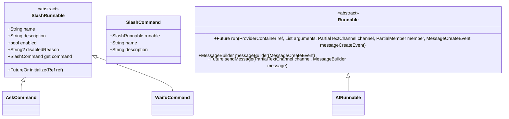
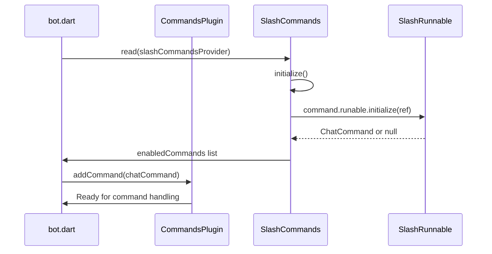

# Command Definition and Execution

<cite>
**Referenced Files in This Document**   
- [commands.dart](file://src/commands/commands.dart)
- [runnables.dart](file://src/runnables/runnables.dart)
- [bot.dart](file://src/bot.dart)
- [ask_command.dart](file://src/commands/ask_command.dart)
- [ask.dart](file://src/runnables/ask.dart)
- [waifu_command.dart](file://src/commands/waifu_command.dart)
- [discord_response_utils.dart](file://src/utils/discord_response_utils.dart)
- [msg_queue.dart](file://src/msg_queue.dart)
</cite>

## Table of Contents
1. [Introduction](#introduction)
2. [Command and Runnable Separation Pattern](#command-and-runnable-separation-pattern)
3. [Command Class Structure](#command-class-structure)
4. [Command Registration and Initialization](#command-registration-and-initialization)
5. [Execution Flow from Invocation to Runnable.run()](#execution-flow-from-invocation-to-runnablerun)
6. [Example: AskCommand and AIRunnable](#example-askcommand-and-airunnable)
7. [Example: WaifuCommand and Waifu Execution](#example-waifucommand-and-waifu-execution)
8. [Benefits of Separation for Maintainability and Testability](#benefits-of-separation-for-maintainability-and-testability)
9. [Guidelines for Creating New Commands and Runnables](#guidelines-for-creating-new-commands-and-runnables)
10. [Conclusion](#conclusion)

## Introduction
The Discord bot implements a clean architectural pattern that separates command definitions from their execution logic using the Command and Runnable patterns. This document details how commands are defined via the `SlashCommand` and `SlashRunnable` classes, how execution logic is encapsulated in `Runnable` implementations, and how these components are registered and executed through dependency injection using Riverpod. The separation enhances modularity, testability, and maintainability across the codebase.

## Command and Runnable Separation Pattern
The bot enforces a strict separation between command metadata (name, description, arguments) and execution logic. The `SlashRunnable` abstract class defines command metadata and creates a `SlashCommand` instance, while actual execution is delegated to standalone `Runnable` classes. This decoupling allows command definitions to remain lightweight and focused on interface declaration, while business logic resides in dedicated, reusable, and independently testable `Runnable` implementations.



**Diagram sources**
- [commands.dart](file://src/commands/commands.dart#L25-L55)
- [runnables.dart](file://src/runnables/runnables.dart#L5-L28)

**Section sources**
- [commands.dart](file://src/commands/commands.dart#L25-L55)
- [runnables.dart](file://src/runnables/runnables.dart#L5-L28)

## Command Class Structure
The `SlashCommand` class encapsulates essential command metadata required by the nyxx_commands framework. It contains:
- **runable**: Reference to the associated `SlashRunnable` instance that holds execution initialization logic
- **name**: The command identifier used in Discord (e.g., "ask", "waifu")
- **description**: Human-readable description shown in Discord's command interface

Each `SlashRunnable` implementation provides its own `name` and `description` and exposes a `command` getter that returns a `SlashCommand` instance pointing back to itself. The `enabled` flag and `disabledReason` allow runtime control over command availability based on initialization success.

**Section sources**
- [commands.dart](file://src/commands/commands.dart#L45-L55)

## Command Registration and Initialization
Commands are registered through the `CommandsPlugin` in `bot.dart` using the `slashCommandsProvider`. During bot startup, the `SlashCommands` class initializes all declared commands (e.g., `AskCommand`, `WaifuCommand`) by calling their `initialize()` method with a Riverpod `Ref`. Each command returns a `ChatCommand` instance that is added to the plugin if initialization succeeds. Failed or disabled commands are tracked separately in `disabledCommands`.



**Diagram sources**
- [bot.dart](file://src/bot.dart#L10-L53)
- [commands.dart](file://src/commands/commands.dart#L15-L43)

**Section sources**
- [bot.dart](file://src/bot.dart#L10-L53)
- [commands.dart](file://src/commands/commands.dart#L15-L43)

## Execution Flow from Invocation to Runnable.run()
When a user invokes a slash command, the nyxx_commands framework triggers the associated callback in the `ChatCommand` object. This callback uses dependency injection via `ProviderContainer` to access required services (e.g., database, AI service) and instantiates the appropriate `Runnable` class to execute the business logic. The `Runnable` handles message responses, typing indicators, and error recovery, ensuring consistent interaction patterns across all commands.

```mermaid
flowchart TD
A[User Invokes Command] --> B{Command Enabled?}
B --> |No| C[Show Disabled Message]
B --> |Yes| D[Execute ChatCommand Callback]
D --> E[Resolve Dependencies via ProviderContainer]
E --> F[Instantiate Runnable]
F --> G[Call Runnable.run()]
G --> H[Process Business Logic]
H --> I[Send Response via Discord API]
I --> J[End]
```

**Diagram sources**
- [ask_command.dart](file://src/commands/ask_command.dart#L25-L70)
- [ask.dart](file://src/runnables/ask.dart#L10-L65)

## Example: AskCommand and AIRunnable
The `AskCommand` class defines a slash command for AI text generation, declaring its name, description, and input validation logic within the `initialize()` method. When invoked, it delegates execution to the `AIRunnable` class, which handles the full workflow: extracting the prompt, validating input, calling the AI service via dependency injection, and formatting the response. This separation allows the command definition to focus on interface concerns while the `Runnable` manages complex execution logic and error handling.

**Section sources**
- [ask_command.dart](file://src/commands/ask_command.dart#L5-L71)
- [ask.dart](file://src/runnables/ask.dart#L5-L65)

## Example: WaifuCommand and Waifu Execution
The `WaifuCommand` demonstrates dynamic command initialization, where the command fetches available image categories (tags) during startup and disables itself if no tags are available. The execution flow involves interactive user selection (SFW/NSFW, category), rate limiting via `MsgQueue`, database updates for user points, and integration with external image generation services. While the command handles the Discord interaction flow, the actual image generation is managed through injected services, maintaining separation of concerns.

**Section sources**
- [waifu_command.dart](file://src/commands/waifu_command.dart#L5-L166)
- [msg_queue.dart](file://src/msg_queue.dart#L5-L39)

## Benefits of Separation for Maintainability and Testability
The separation between `SlashRunnable` and `Runnable` provides significant architectural advantages:
- **Testability**: `Runnable` classes can be unit tested independently of Discord's API by mocking dependencies via Riverpod
- **Reusability**: Execution logic can be reused across multiple command types (slash, prefix, button interactions)
- **Maintainability**: Changes to command metadata don't affect business logic and vice versa
- **Dependency Management**: Riverpod enables clean injection of services (database, AI, HTTP clients) without tight coupling
- **Error Isolation**: Command registration failures are handled separately from execution errors

This pattern aligns with SOLID principles, particularly the Single Responsibility Principle, by ensuring each class has one clear purpose.

**Section sources**
- [commands.dart](file://src/commands/commands.dart#L25-L55)
- [runnables.dart](file://src/runnables/runnables.dart#L5-L28)

## Guidelines for Creating New Commands and Runnables
To create a new command following the existing pattern:
1. Create a new class extending `SlashRunnable` in `src/commands/` with appropriate name and description
2. Implement `initialize()` to return a `ChatCommand` with parameter validation and interaction logic
3. Create a corresponding `Runnable` class in `src/runnables/` that extends `Runnable`
4. Implement the `run()` method with full execution logic, using `ProviderContainer` to access dependencies
5. Register the command in `SlashCommands.initialize()` within `commands.dart`
6. Ensure all Discord interactions use consistent response patterns via `discord_response_utils.dart`
7. Apply rate limiting using `MsgQueue` where appropriate
8. Handle errors gracefully and provide user-friendly messages

Always prefer injecting dependencies via Riverpod rather than direct instantiation to maintain testability.

**Section sources**
- [commands.dart](file://src/commands/commands.dart#L15-L43)
- [runnables.dart](file://src/runnables/runnables.dart#L5-L28)

## Conclusion
The command-execution separation pattern in this Discord bot provides a robust, scalable architecture for managing complex bot functionality. By decoupling command definitions from execution logic and leveraging Riverpod for dependency injection, the codebase achieves high maintainability, testability, and modularity. This pattern enables clean separation of concerns, allowing developers to independently develop, test, and modify command interfaces and business logic while ensuring consistent user experiences across all bot interactions.