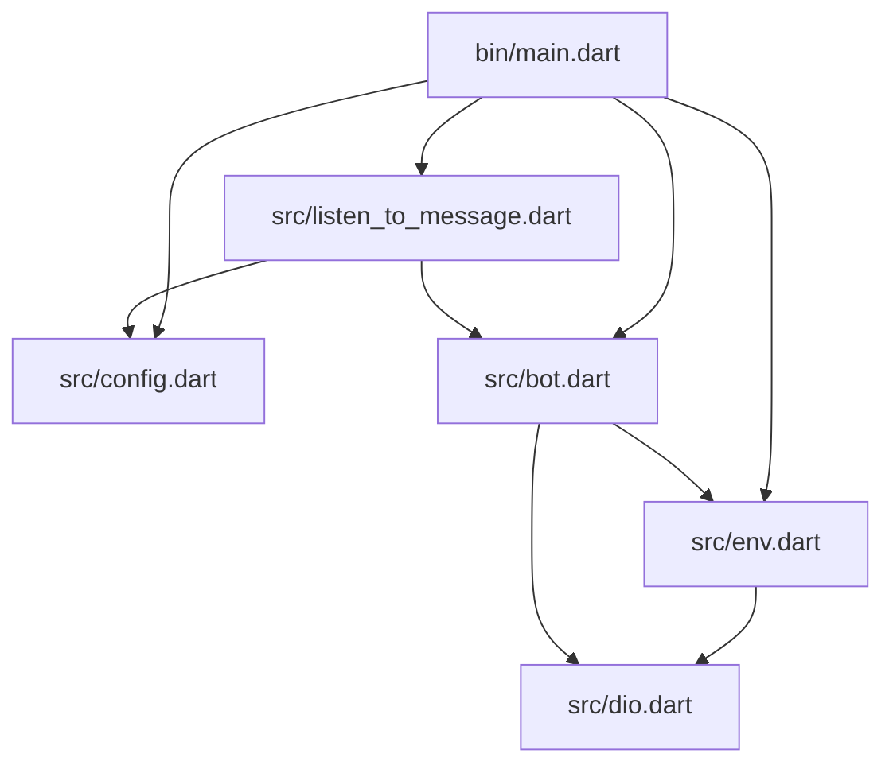
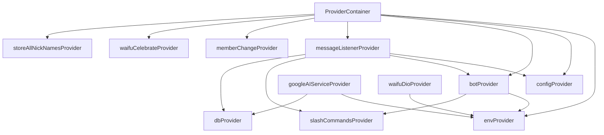
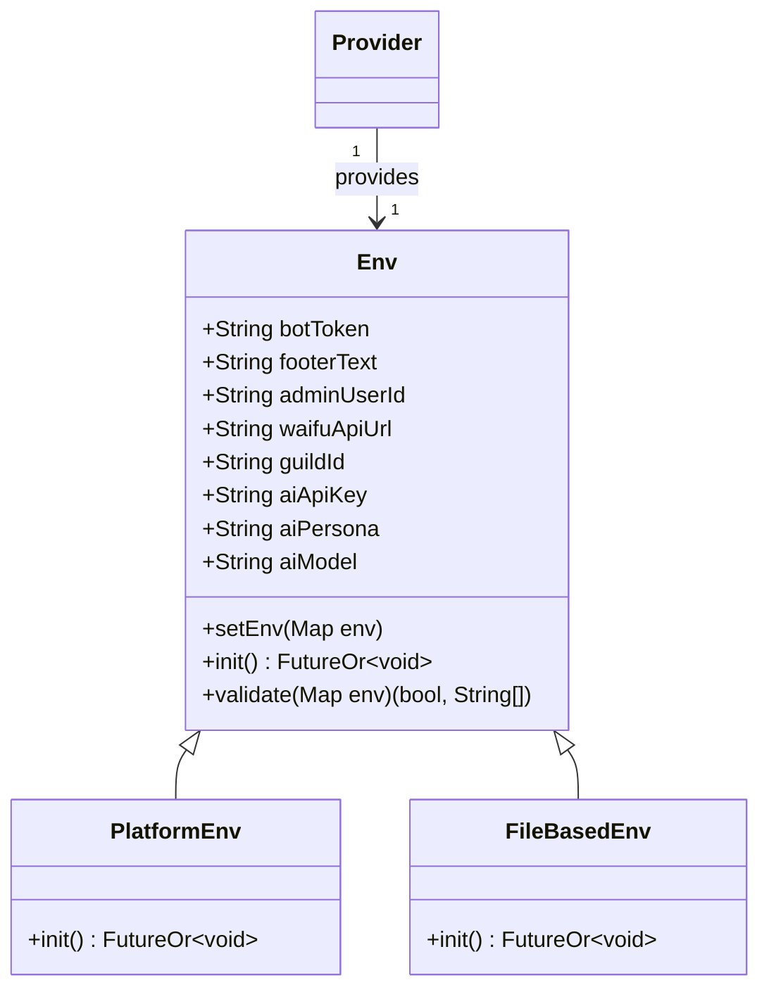
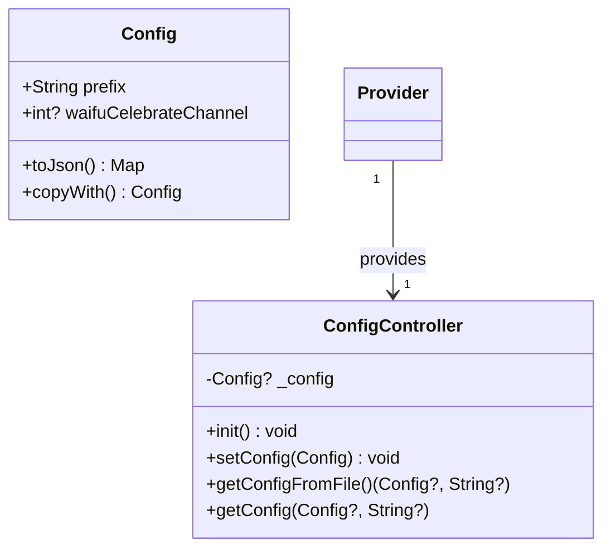
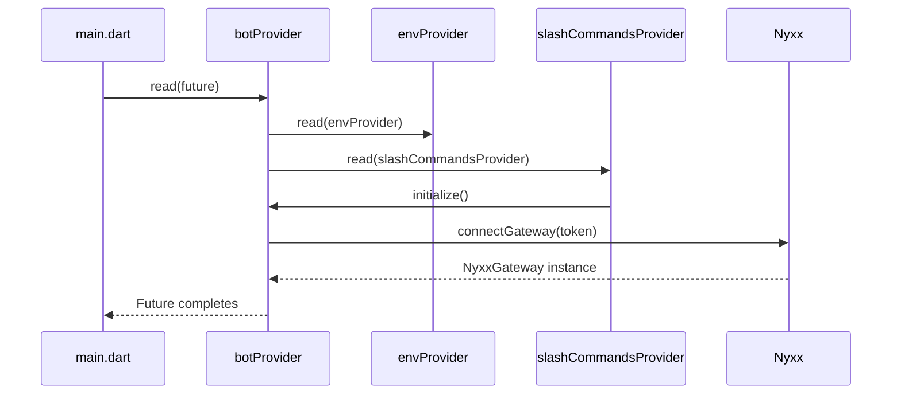
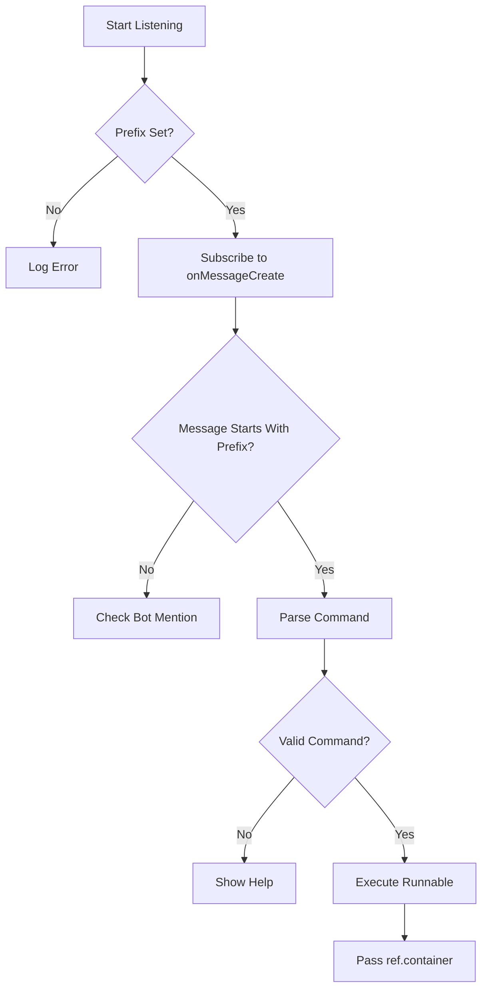
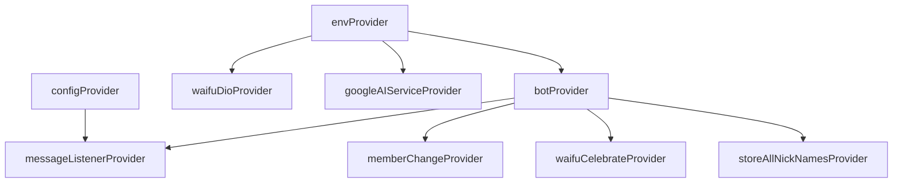
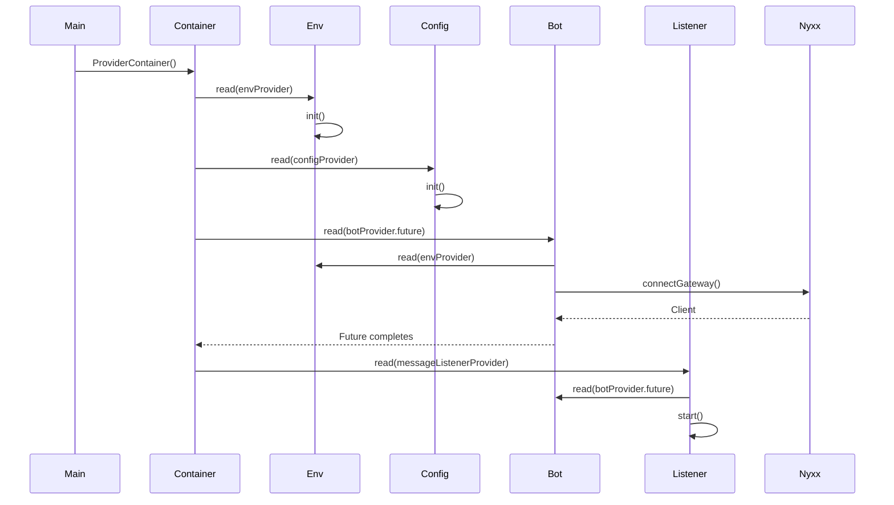

# Dependency Injection with Riverpod

<cite>
**Referenced Files in This Document**   
- [main.dart](file://bin/main.dart)
- [env.dart](file://src/env.dart)
- [config.dart](file://src/config.dart)
- [bot.dart](file://src/bot.dart)
- [listen_to_message.dart](file://src/listen_to_message.dart)
- [dio.dart](file://src/dio.dart)
- [google_ai_service.dart](file://src/google_ai_service.dart)
</cite>

## Table of Contents
1. [Introduction](#introduction)
2. [Project Structure](#project-structure)
3. [Core Components](#core-components)
4. [Architecture Overview](#architecture-overview)
5. [Detailed Component Analysis](#detailed-component-analysis)
6. [Dependency Graph and Provider Hierarchy](#dependency-graph-and-provider-hierarchy)
7. [Boot Sequence and Initialization Flow](#boot-sequence-and-initialization-flow)
8. [Provider Types: Synchronous vs Future Providers](#provider-types-synchronous-vs-future-providers)
9. [Error Handling and Initialization Safety](#error-handling-and-initialization-safety)
10. [Testing Considerations](#testing-considerations)
11. [Best Practices for Provider Scoping and Lifecycle Management](#best-practices-for-provider-scoping-and-lifecycle-management)
12. [Extending the System: Adding New Providers](#extending-the-system-adding-new-providers)
13. [Conclusion](#conclusion)

## Introduction

This document provides a comprehensive architectural overview of the Riverpod-based dependency injection system used in the `discord_bot` application. It details how the `ProviderContainer` in `main.dart` orchestrates the initialization of core services such as `envProvider`, `configProvider`, `botProvider`, and `messageListenerProvider`. The documentation explains the provider dependency graph, initialization sequence, and usage patterns across the codebase, with a focus on best practices for maintainability, testing, and extensibility.

## Project Structure

The project follows a modular structure with clear separation of concerns. Core logic is organized under the `src/` directory, with dedicated folders for commands, runnables, utilities, and service implementations. Configuration, environment handling, and bot lifecycle management are encapsulated in top-level files within `src/`. The entry point is `bin/main.dart`, which initializes the dependency injection container and starts the application.



**Diagram sources**
- [main.dart](file://bin/main.dart#L1-L28)
- [env.dart](file://src/env.dart#L1-L100)
- [config.dart](file://src/config.dart#L1-L79)
- [bot.dart](file://src/bot.dart#L1-L54)
- [listen_to_message.dart](file://src/listen_to_message.dart#L1-L142)

**Section sources**
- [main.dart](file://bin/main.dart#L1-L28)
- [env.dart](file://src/env.dart#L1-L100)
- [config.dart](file://src/config.dart#L1-L79)

## Core Components

The core components of the dependency injection system include:
- `envProvider`: Manages environment variables and secrets
- `configProvider`: Handles runtime configuration from `config.json`
- `botProvider`: Initializes the Nyxx Discord bot client asynchronously
- `messageListenerProvider`: Listens to incoming messages and dispatches commands
- `waifuDioProvider`: Configures HTTP client for external waifu API
- `googleAIServiceProvider`: Wraps AI service integration

These providers are orchestrated through a single `ProviderContainer` instance created at application startup.

**Section sources**
- [env.dart](file://src/env.dart#L10-L99)
- [config.dart](file://src/config.dart#L1-L79)
- [bot.dart](file://src/bot.dart#L1-L54)
- [listen_to_message.dart](file://src/listen_to_message.dart#L1-L142)

## Architecture Overview

The architecture follows a clean dependency injection pattern using Riverpod. The `ProviderContainer` acts as the root injector, resolving dependencies in a deterministic order. Services declare their dependencies via `Ref.read()`, enabling loose coupling and testability.



**Diagram sources**
- [main.dart](file://bin/main.dart#L10-L28)
- [env.dart](file://src/env.dart#L10-L99)
- [config.dart](file://src/config.dart#L1-L79)
- [bot.dart](file://src/bot.dart#L1-L54)
- [listen_to_message.dart](file://src/listen_to_message.dart#L1-L142)

## Detailed Component Analysis

### envProvider Analysis

The `envProvider` provides access to environment variables required for bot operation. It uses a factory pattern to return either `PlatformEnv` or `FileBasedEnv`, though currently configured for platform environment reading.



**Diagram sources**
- [env.dart](file://src/env.dart#L10-L99)

**Section sources**
- [env.dart](file://src/env.dart#L10-L99)

### configProvider Analysis

The `configProvider` manages application configuration stored in `config.json`. It uses `ConfigController` to read, write, and validate configuration state.



**Diagram sources**
- [config.dart](file://src/config.dart#L1-L79)

**Section sources**
- [config.dart](file://src/config.dart#L1-L79)

### botProvider Analysis

The `botProvider` is a `FutureProvider` that asynchronously initializes the Nyxx Discord client. It depends on `envProvider` to retrieve the bot token and configures command handling plugins.



**Diagram sources**
- [bot.dart](file://src/bot.dart#L1-L54)
- [env.dart](file://src/env.dart#L1-L99)

**Section sources**
- [bot.dart](file://src/bot.dart#L1-L54)

### messageListenerProvider Analysis

The `messageListenerProvider` creates a `MessageListener` that subscribes to Discord message events and routes them to appropriate command handlers based on prefix matching.



**Diagram sources**
- [listen_to_message.dart](file://src/listen_to_message.dart#L1-L142)

**Section sources**
- [listen_to_message.dart](file://src/listen_to_message.dart#L1-L142)

## Dependency Graph and Provider Hierarchy

The provider hierarchy forms a directed acyclic graph where higher-level services depend on lower-level configuration providers. The dependency chain ensures that configuration is loaded before services that depend on it.



**Diagram sources**
- [main.dart](file://bin/main.dart#L10-L28)
- [bot.dart](file://src/bot.dart#L1-L54)
- [listen_to_message.dart](file://src/listen_to_message.dart#L1-L142)

## Boot Sequence and Initialization Flow

The application boot sequence follows a strict order to ensure proper initialization:

1. Create `ProviderContainer`
2. Read `envProvider` and call `init()` to load environment variables
3. Read `configProvider` and call `init()` to load configuration
4. Read `botProvider.future` to await bot initialization
5. Start message listener and other background services

This sequence prevents race conditions and ensures all dependencies are ready before use.



**Diagram sources**
- [main.dart](file://bin/main.dart#L10-L28)

**Section sources**
- [main.dart](file://bin/main.dart#L10-L28)

## Provider Types: Synchronous vs Future Providers

The system uses both synchronous and asynchronous providers appropriately:

- **Synchronous providers**: `envProvider`, `configProvider`, `messageListenerProvider` – used for services that can be instantiated immediately
- **Future providers**: `botProvider` – used for asynchronous initialization (e.g., network connections)

This distinction ensures that blocking operations do not delay application startup, while synchronous providers remain lightweight and fast.

**Section sources**
- [bot.dart](file://src/bot.dart#L1-L54)
- [env.dart](file://src/env.dart#L1-L99)
- [config.dart](file://src/config.dart#L1-L79)

## Error Handling and Initialization Safety

The system implements defensive initialization patterns:
- `envProvider` validates all required environment variables before proceeding
- `configProvider` checks for `config.json` existence and provides meaningful error messages
- `botProvider` wraps Nyxx connection in try-catch (implied by async nature)
- Services are only started after their dependencies are confirmed ready

This prevents partial initialization states and provides clear failure diagnostics.

**Section sources**
- [env.dart](file://src/env.dart#L50-L99)
- [config.dart](file://src/config.dart#L46-L77)

## Testing Considerations

The Riverpod architecture enables easy testing through:
- Mockable providers via `ProviderContainer`
- Isolated service initialization
- Dependency injection via `Ref`
- No global state pollution

Test strategies include:
- Providing mock `envProvider` with test values
- Using in-memory configuration for `configProvider`
- Mocking HTTP clients in `waifuDioProvider`
- Verifying command routing in `messageListenerProvider`

**Section sources**
- [env.dart](file://src/env.dart#L1-L99)
- [config.dart](file://src/config.dart#L1-L79)
- [listen_to_message.dart](file://src/listen_to_message.dart#L1-L142)

## Best Practices for Provider Scoping and Lifecycle Management

Key best practices observed:
- **Single ProviderContainer**: Created once at startup, ensuring consistent state
- **Clear Initialization Methods**: Services expose `init()` or `start()` methods
- **Proper Disposal**: Stream subscriptions are canceled via `stop()`
- **Error Resilience**: Services validate dependencies before use
- **Lazy Initialization**: Providers are only read when needed

These practices ensure predictable behavior and prevent resource leaks.

**Section sources**
- [main.dart](file://bin/main.dart#L10-L28)
- [listen_to_message.dart](file://src/listen_to_message.dart#L1-L142)

## Extending the System: Adding New Providers

To add a new provider:
1. Define the service class in `src/`
2. Create a provider (synchronous or future) using `Provider` or `FutureProvider`
3. Declare dependencies via `ref.read()`
4. Register the provider in `main.dart` usage
5. Add to initialization sequence in `main()`

Example pattern:
```dart
final newServiceProvider = Provider<NewService>((ref) {
  final dependency = ref.read(existingProvider);
  return NewService(dependency);
});
```

**Section sources**
- [main.dart](file://bin/main.dart#L10-L28)
- [env.dart](file://src/env.dart#L1-L99)

## Conclusion

The Riverpod-based dependency injection system in `discord_bot` provides a robust, testable, and maintainable architecture. By leveraging Riverpod's features effectively—particularly `ProviderContainer`, `FutureProvider`, and dependency resolution via `Ref`—the application achieves clean separation of concerns, predictable initialization, and extensibility. The boot sequence ensures proper ordering of service startup, while the provider hierarchy maintains loose coupling between components. This architecture serves as a strong foundation for further development and scaling of the bot's capabilities.