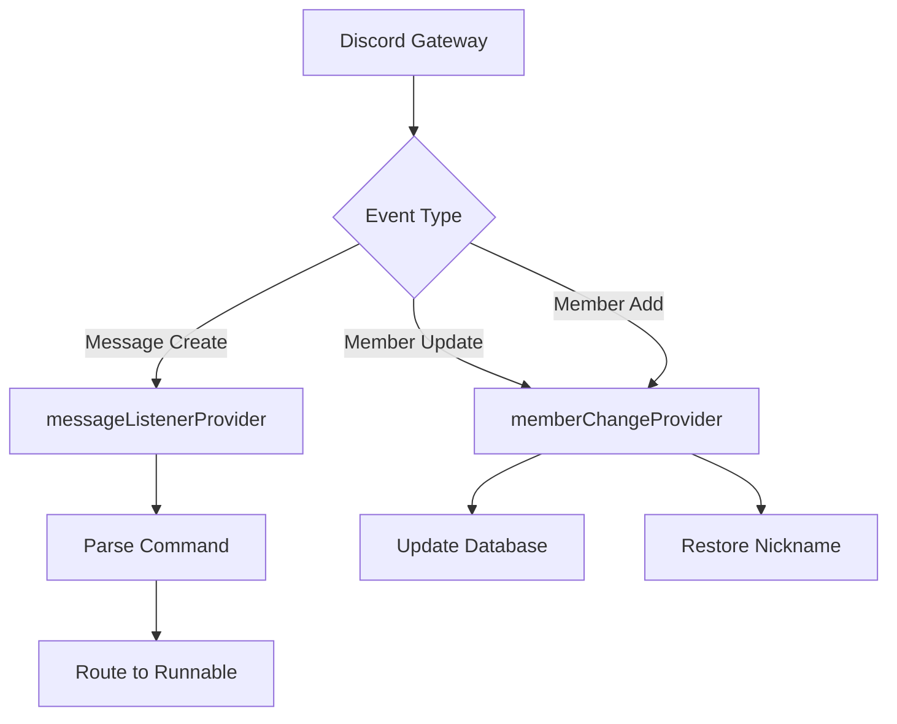
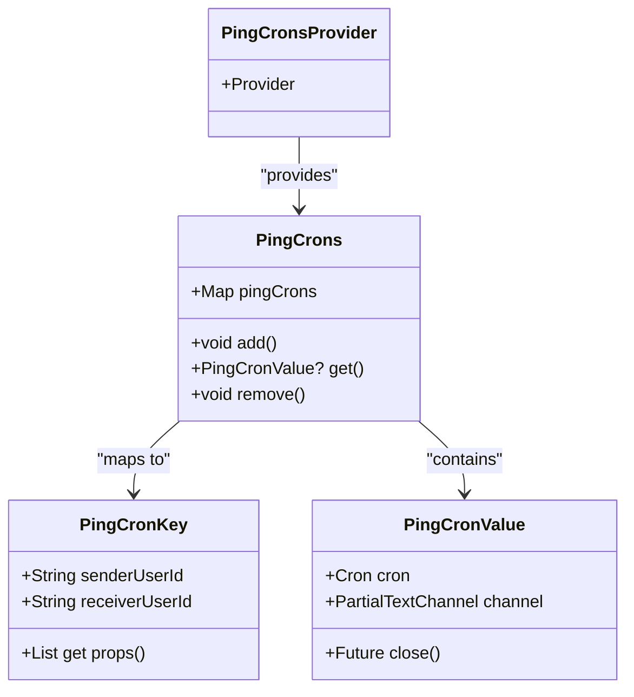

# Event-Driven Architecture

<cite>
**Referenced Files in This Document**   
- [bot.dart](file://src/bot.dart)
- [listen_to_message.dart](file://src/listen_to_message.dart)
- [member_change.dart](file://src/member_change.dart)
- [cron.dart](file://src/cron.dart)
- [config.dart](file://src/config.dart)
- [commands/commands.dart](file://src/commands/commands.dart)
</cite>

## Table of Contents
1. [Introduction](#introduction)
2. [Event Subscription with GatewayIntents](#event-subscription-with-gatewayintents)
3. [StreamSubscription and Event Handling](#streamsubscription-and-event-handling)
4. [Message and Member Event Listeners](#message-and-member-event-listeners)
5. [Command Routing via listen_to_message.dart](#command-routing-via-listen_to_messagedart)
6. [Scheduled Events with cron.dart](#scheduled-events-with-crondart)
7. [Event Subscription Patterns and Error Handling](#event-subscription-patterns-and-error-handling)
8. [Performance Considerations](#performance-considerations)
9. [Troubleshooting Common Issues](#troubleshooting-common-issues)
10. [Conclusion](#conclusion)

## Introduction
The discord_bot implements a robust event-driven architecture using the Nyxx Dart library for Discord bot development. This system enables asynchronous handling of Discord events such as message creation, member updates, and scheduled tasks through a combination of GatewayIntents, StreamSubscription, and Riverpod-based state management. The architecture is designed to be modular, scalable, and maintainable, allowing for efficient processing of real-time events while supporting long-running background operations.

## Event Subscription with GatewayIntents
Nyxx GatewayIntents are used to specify which types of Discord events the bot should receive from the gateway. In this implementation, the bot subscribes to all unprivileged intents along with `messageContent` and `guildMembers` to access message content and track member changes within the server.

The intents are configured during the initialization of the `NyxxGateway` instance in `bot.dart`. This selective subscription reduces bandwidth usage and ensures the bot only processes relevant events. The use of `GatewayIntents.allUnprivileged | GatewayIntents.messageContent | GatewayIntents.guildMembers` enables the bot to respond to message creation, member updates, and additions while complying with Discord's privileged intent requirements.

**Section sources**
- [bot.dart](file://src/bot.dart#L25-L30)

## StreamSubscription and Event Handling
The bot leverages Dart’s `StreamSubscription` mechanism to listen to and process Discord events asynchronously. Events such as `onMessageCreate`, `onGuildMemberUpdate`, and `onGuildMemberAdd` are exposed as streams by the Nyxx library, allowing the bot to register listeners that execute callback functions when specific events occur.

Each listener is encapsulated within a provider class (e.g., `MessageListener`, `MemberChange`) that manages the lifecycle of the subscription, including starting, stopping, and restarting. This pattern ensures proper resource management and prevents memory leaks by canceling existing subscriptions before creating new ones.

**Section sources**
- [listen_to_message.dart](file://src/listen_to_message.dart#L13-L140)
- [member_change.dart](file://src/member_change.dart#L11-L76)

## Message and Member Event Listeners
The event-driven system uses two primary providers to handle key Discord events: `messageListenerProvider` and `memberChangeProvider`.

### Message Listener
The `messageListenerProvider` initializes a `MessageListener` instance that subscribes to the `onMessageCreate` stream. It filters messages based on the bot’s prefix or mention, validates commands, and routes them to appropriate handlers. The listener also checks for disabled slash commands and responds accordingly.

### Member Change Listener
The `memberChangeProvider` manages subscriptions to `onGuildMemberUpdate` and `onGuildMemberAdd` events. When a member’s nickname changes, it persists the update to the database. On member join, it checks for previously stored nicknames and restores them if available, enhancing user experience through continuity.

**Diagram sources**
- [listen_to_message.dart](file://src/listen_to_message.dart#L13-L140)
- [member_change.dart](file://src/member_change.dart#L11-L76)

**Section sources**
- [listen_to_message.dart](file://src/listen_to_message.dart#L13-L140)
- [member_change.dart](file://src/member_change.dart#L11-L76)

## Command Routing via listen_to_message.dart
The command routing system in `listen_to_message.dart` processes incoming messages and dispatches them to the appropriate command runnables. After validating the message prefix and checking for bot mentions, it parses the command name and arguments from the message content.

Commands are defined as enum values in the `Command` class, each associated with a `runnable` implementation. The router uses `firstWhereOrNull` to match the input command against known commands or aliases, then invokes the corresponding `run` method with contextual parameters such as the message channel, member, and arguments.

If no valid command is found, the system defaults to showing the help menu. This modular routing approach allows for easy extension of new commands without modifying the core event loop.

**Section sources**
- [listen_to_message.dart](file://src/listen_to_message.dart#L13-L140)
- [commands/commands.dart](file://src/commands/commands.dart#L0-L55)

## Scheduled Events with cron.dart
The `cron.dart` file integrates scheduled event execution into the event loop using the `cron` package. It defines a `PingCrons` class that maintains a map of active cron jobs keyed by user pairs (`PingCronKey`). Each entry contains a `Cron` instance and target channel for message delivery.

When a recurring ping is initiated (e.g., in `mass_ping_runnable.dart`), a new cron job is scheduled to send messages at specified intervals (e.g., every 2 seconds). The system supports dynamic addition, retrieval, and removal of cron jobs, enabling time-based automation within the Discord environment.

This integration demonstrates how external scheduling mechanisms can coexist with real-time event processing in a unified architecture.

**Diagram sources**
- [cron.dart](file://src/cron.dart#L0-L43)

**Section sources**
- [cron.dart](file://src/cron.dart#L0-L43)
- [runnables/mass_ping_runnable.dart](file://src/runnables/mass_ping_runnable.dart#L150-L175)

## Event Subscription Patterns and Error Handling
The codebase follows consistent patterns for event subscription and error resilience:

- **Subscription Management**: All listeners follow a pattern of canceling existing subscriptions before creating new ones to prevent duplicate event handling.
- **Restart Capability**: Both `MessageListener` and `MemberChange` provide `restart()` methods that safely stop and reinitialize listeners.
- **Error Suppression**: The `commandsPlugin.onCommandError` stream in `bot.dart` captures converter failures and other command errors, responding appropriately without crashing the bot.
- **Graceful Degradation**: When configuration is missing (e.g., prefix not set), the bot provides informative feedback rather than failing silently.

These patterns ensure reliability and maintainability across different event types and operational states.

**Section sources**
- [bot.dart](file://src/bot.dart#L40-L53)
- [listen_to_message.dart](file://src/listen_to_message.dart#L13-L140)
- [member_change.dart](file://src/member_change.dart#L11-L76)

## Performance Considerations
The architecture includes several performance optimizations for handling high-volume events:

- **Selective Intents**: By subscribing only to necessary gateway intents, the bot minimizes network traffic and processing overhead.
- **Event Filtering**: Early return conditions in event listeners (e.g., checking message prefix) reduce unnecessary computation.
- **Database Access Optimization**: The `DBController` uses functional updates (`updateDB`) to ensure atomic operations and avoid race conditions.
- **Memory Management**: Stream subscriptions are explicitly canceled during restarts or shutdowns to prevent memory leaks.

For high-frequency events like message creation, the system avoids blocking operations and delegates heavy processing to asynchronous runnables. Additionally, the use of Riverpod providers ensures efficient dependency injection and state sharing without redundant object creation.

## Troubleshooting Common Issues
### Missed Events
- **Cause**: Incorrect GatewayIntents or subscription not started.
- **Solution**: Verify `GatewayIntents` in `bot.dart` include required privileges. Ensure `start()` is called on all listeners.

### Memory Leaks
- **Cause**: Uncanceled StreamSubscriptions.
- **Solution**: Always call `cancel()` on existing subscriptions before creating new ones. Use `stop()` methods provided by listener classes.

### Delayed Responses
- **Cause**: Blocking operations in event callbacks.
- **Solution**: Offload heavy processing to isolates or background tasks. Keep event handlers lightweight.

### Configuration Not Persisting
- **Cause**: File write permissions or path issues.
- **Solution**: Confirm `config.json` and `db.json` are writable. Validate file paths and permissions in deployment environment.

### Cron Jobs Not Firing
- **Cause**: Improper scheduling syntax or canceled cron instances.
- **Solution**: Validate cron expressions (e.g., `*/2 * * * * *` for every 2 seconds). Ensure `close()` is not prematurely called.

**Section sources**
- [bot.dart](file://src/bot.dart#L25-L30)
- [listen_to_message.dart](file://src/listen_to_message.dart#L13-L140)
- [member_change.dart](file://src/member_change.dart#L11-L76)
- [config.dart](file://src/config.dart#L0-L78)
- [db.dart](file://src/db.dart#L0-L132)

## Conclusion
The event-driven architecture of the discord_bot effectively combines Nyxx’s event streaming capabilities with Riverpod’s state management to create a responsive and maintainable system. Through careful use of GatewayIntents, StreamSubscription lifecycle management, and modular command routing, the bot handles real-time Discord events efficiently. The integration of scheduled tasks via cron further extends its functionality into time-based automation. With proper error handling, performance optimizations, and clear troubleshooting guidance, this architecture provides a solid foundation for scalable Discord bot development.