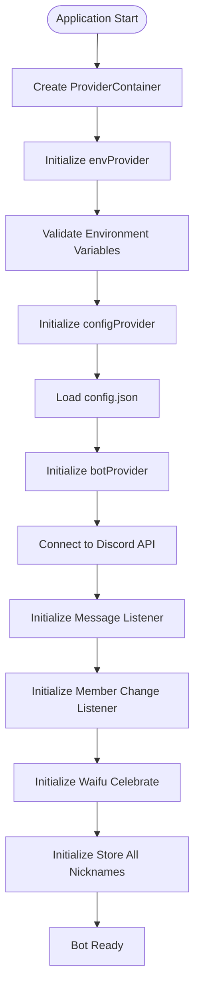
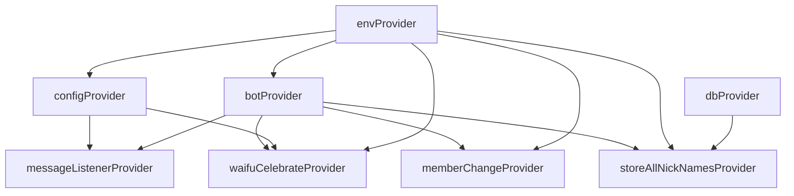
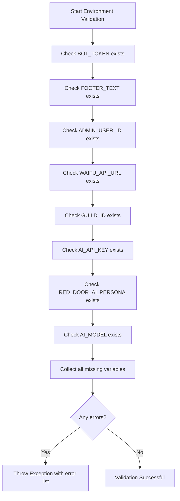

# Service Initialization Sequence

<cite>
**Referenced Files in This Document**   
- [main.dart](file://bin/main.dart)
- [env.dart](file://src/env.dart)
- [config.dart](file://src/config.dart)
- [bot.dart](file://src/bot.dart)
- [listen_to_message.dart](file://src/listen_to_message.dart)
- [member_change.dart](file://src/member_change.dart)
- [waifu_celebrate.dart](file://src/waifu_celebrate.dart)
- [store_all_nick_names.dart](file://src/store_all_nick_names.dart)
- [db.dart](file://src/db.dart)
</cite>

## Table of Contents
1. [Introduction](#introduction)
2. [Initialization Sequence Overview](#initialization-sequence-overview)
3. [Core Initialization Steps](#core-initialization-steps)
4. [Dependency Management and Order](#dependency-management-and-order)
5. [Error Handling and Validation](#error-handling-and-validation)
6. [Service-Specific Initialization Details](#service-specific-initialization-details)
7. [Best Practices for Adding New Services](#best-practices-for-adding-new-services)
8. [Troubleshooting Common Initialization Issues](#troubleshooting-common-initialization-issues)
9. [Conclusion](#conclusion)

## Introduction
The Discord bot service initialization sequence is a carefully orchestrated process that ensures all components are properly configured and ready to operate before the bot becomes active. This document details the step-by-step boot process starting from the main entry point, focusing on the dependency order of service initialization and the mechanisms that ensure proper startup sequencing. The initialization leverages Riverpod for state management and dependency injection, with services initialized in a specific order to satisfy dependencies and validate configurations before proceeding.

**Section sources**
- [main.dart](file://bin/main.dart#L1-L30)

## Initialization Sequence Overview
The service initialization begins in `main.dart` where a `ProviderContainer` is created to manage the dependency injection container. Services are initialized in a strict dependency order: environment variables first, followed by configuration, then the bot client, and finally various listeners and utility services. This sequence ensures that each service has access to the dependencies it requires before it attempts to start.

The initialization process is asynchronous, using `async/await` to ensure that each step completes before the next begins. This prevents race conditions and ensures that services are fully initialized before dependent services attempt to use them. The sequence also includes validation steps at multiple points to catch configuration issues early in the startup process.

**Diagram sources**
- [main.dart](file://bin/main.dart#L1-L30)
- [env.dart](file://src/env.dart#L1-L100)
- [config.dart](file://src/config.dart#L1-L79)

**Section sources**
- [main.dart](file://bin/main.dart#L1-L30)

## Core Initialization Steps
The core initialization process follows a specific sequence designed to establish foundational services first, followed by higher-level components that depend on them. The first step is creating the `ProviderContainer`, which serves as the central dependency injection mechanism for the application. This container allows services to be accessed via providers throughout the codebase.

The initialization sequence begins with `envProvider`, which loads environment variables from the `.env` file and validates their presence. This is followed by `configProvider`, which reads the `config.json` file to configure bot behavior. Only after these foundational services are initialized does the application proceed to create the Discord bot client through `botProvider`.

Each initialization step is marked with console output to provide visibility into the startup process, helping with debugging and monitoring. The use of `await` ensures that each service is fully initialized before the next step begins, preventing issues that could arise from accessing uninitialized services.

**Section sources**
- [main.dart](file://bin/main.dart#L1-L30)
- [env.dart](file://src/env.dart#L1-L100)
- [config.dart](file://src/config.dart#L1-L79)

## Dependency Management and Order
The initialization sequence strictly follows dependency ordering to ensure that services have access to their required dependencies. The dependency hierarchy is as follows: environment variables → configuration → bot client → listeners and utility services. This ordering is critical because each subsequent service depends on the proper configuration established by the previous ones.

For example, the `botProvider` requires the bot token from `envProvider` to establish a connection to the Discord API. Similarly, the `messageListenerProvider` depends on both the initialized bot client and the configuration to determine the command prefix. The `memberChangeProvider` also requires access to the bot client and environment variables to identify the correct guild.

The use of Riverpod's `ref.read()` method allows services to access their dependencies in a clean and predictable way. The `ProviderContainer` created in `main.dart` serves as the root container, with all providers registered within it. This centralized dependency management makes it easy to understand and maintain the initialization sequence.

**Diagram sources**
- [main.dart](file://bin/main.dart#L1-L30)
- [env.dart](file://src/env.dart#L1-L100)
- [config.dart](file://src/config.dart#L1-L79)
- [bot.dart](file://src/bot.dart#L1-L54)
- [listen_to_message.dart](file://src/listen_to_message.dart#L1-L142)
- [member_change.dart](file://src/member_change.dart#L1-L78)
- [waifu_celebrate.dart](file://src/waifu_celebrate.dart#L1-L72)
- [store_all_nick_names.dart](file://src/store_all_nick_names.dart#L1-L38)

**Section sources**
- [main.dart](file://bin/main.dart#L1-L30)

## Error Handling and Validation
The initialization process includes comprehensive validation and error handling to ensure the bot starts in a healthy state. The `envProvider` performs validation of required environment variables, checking for the presence of essential keys like `BOT_TOKEN`, `GUILD_ID`, and `AI_API_KEY`. If any required variables are missing, the initialization throws an exception with a descriptive error message.

The validation occurs in the `validate()` method of the `Env` abstract class, which is implemented by `FileBasedEnv`. This method checks each required environment variable against the `envKeys` constant and collects any missing variables in an error list. If the validation fails, an exception is thrown, preventing the bot from starting with incomplete configuration.

Similarly, the `configProvider` validates the presence of the `config.json` file and attempts to parse its contents. If the file is missing or contains invalid JSON, the initialization process will fail gracefully with an appropriate error message. This early validation helps prevent runtime errors that could occur if the bot attempted to operate with missing or incorrect configuration.

**Diagram sources**
- [env.dart](file://src/env.dart#L1-L100)
- [config.dart](file://src/config.dart#L1-L79)

**Section sources**
- [env.dart](file://src/env.dart#L1-L100)
- [config.dart](file://src/config.dart#L1-L79)

## Service-Specific Initialization Details

### Environment Provider Initialization
The `envProvider` is the first service initialized in the sequence, responsible for loading and validating environment variables. It uses the `FileBasedEnv` implementation by default, which reads variables from a `.env` file in the project root. The initialization process synchronously reads the file, parses each line into key-value pairs, and stores them in memory.

The `init()` method performs the actual loading and validation, calling the `validate()` method to ensure all required variables are present. If validation passes, the environment variables are set on the instance properties for later access. This service is critical as it provides authentication tokens and other sensitive configuration that other services depend on.

**Section sources**
- [env.dart](file://src/env.dart#L1-L100)

### Configuration Provider Initialization
The `configProvider` manages the bot's operational configuration stored in `config.json`. The `ConfigController` class handles loading, parsing, and updating the configuration file. During initialization, it checks for the existence of `config.json` and attempts to parse it into a `Config` object.

If the configuration file is missing, the initialization returns a descriptive error message suggesting the user run the config command. The configuration includes settings like the command prefix and the waifu celebrate channel ID, which are used by various bot features. The `setConfig()` method allows the configuration to be updated and persisted to disk.

**Section sources**
- [config.dart](file://src/config.dart#L1-L79)

### Bot Provider Initialization
The `botProvider` is a `FutureProvider` that asynchronously initializes the Discord bot client. It depends on both `envProvider` for the bot token and `configProvider` for command configuration. The initialization establishes a connection to the Discord API using the `NyxxGateway` client.

During initialization, it sets up the command system with the configured prefix and registers all available commands from the `slashCommandsProvider`. It also configures error handling for command execution, ensuring that converter failures and other command errors are handled gracefully without crashing the bot.

**Section sources**
- [bot.dart](file://src/bot.dart#L1-L54)

### Message Listener Initialization
The `messageListenerProvider` creates a `MessageListener` that subscribes to Discord message events. It depends on the initialized bot client and current configuration to determine how to respond to messages. The listener checks for bot mentions and command prefixes, then routes messages to the appropriate command handlers.

The initialization sets up a stream subscription to `bot.onMessageCreate`, which triggers the message processing logic for each incoming message. The listener also handles dynamic configuration changes, allowing it to be restarted with updated settings if the configuration changes during runtime.

**Section sources**
- [listen_to_message.dart](file://src/listen_to_message.dart#L1-L142)

### Member Change Initialization
The `memberChangeProvider` monitors guild member events, including updates to member nicknames and new member joins. It depends on the bot client to subscribe to these events and on the environment variables to identify the correct guild.

When a member's nickname changes, it updates the database with the new nickname. When a new member joins, it checks if they had a nickname in the past and restores it if found. This service helps maintain user preferences across server re-joins and provides a consistent user experience.

**Section sources**
- [member_change.dart](file://src/member_change.dart#L1-L78)

### Waifu Celebrate Initialization
The `waifuCelebrateProvider` manages celebration events when users reach milestone waifu points. It depends on the bot client, configuration, environment variables, and database to function properly. During initialization, it ensures the celebration channel exists, creating it if necessary.

The service listens for waifu point milestones and automatically generates and sends celebration images to the appropriate channel. It uses the user's most frequently used waifu category to personalize the celebration, creating a more engaging experience.

**Section sources**
- [waifu_celebrate.dart](file://src/waifu_celebrate.dart#L1-L72)

### Store All Nicknames Initialization
The `storeAllNickNamesProvider` initializes by fetching all current guild members and storing their nicknames in the database. This service runs once during startup and provides a baseline of nickname data for the member change service to reference.

It depends on the bot client to access guild members, the environment variables to identify the guild, and the database to store the nickname mappings. This initialization ensures that nickname restoration works correctly for members who rejoin the server.

**Section sources**
- [store_all_nick_names.dart](file://src/store_all_nick_names.dart#L1-L38)

## Best Practices for Adding New Services
When adding new services to the initialization sequence, several best practices should be followed to maintain proper dependency ordering and initialization reliability:

1. **Identify Dependencies**: Before creating a new service, identify all its dependencies and ensure they are initialized earlier in the sequence.

2. **Use Appropriate Provider Types**: Choose the correct Riverpod provider type (`Provider`, `FutureProvider`, `StreamProvider`) based on the service's initialization needs.

3. **Implement Proper Error Handling**: Include validation and error handling in the initialization process to fail fast if required dependencies or configurations are missing.

4. **Minimize Side Effects**: Keep initialization logic focused on setup and avoid performing extensive operations that could delay startup.

5. **Document Dependencies**: Clearly document the service's dependencies and initialization requirements in comments or documentation.

6. **Use Async/Await Appropriately**: For services that require asynchronous initialization, use `FutureProvider` and `await` to ensure proper sequencing.

7. **Provide Initialization Feedback**: Include console output or logging to indicate when the service has successfully initialized.

8. **Consider Restartability**: Design services to be restartable if configuration changes require reinitialization.

**Section sources**
- [main.dart](file://bin/main.dart#L1-L30)

## Troubleshooting Common Initialization Issues

### Missing Environment Variables
One of the most common initialization failures occurs when required environment variables are missing from the `.env` file. The error message will clearly indicate which variables are missing. To resolve this issue:

1. Check the `.env` file exists in the project root
2. Verify all required variables are present (BOT_TOKEN, GUILD_ID, AI_API_KEY, etc.)
3. Ensure variable names match exactly (case-sensitive)
4. Restart the bot after making corrections

### Configuration File Not Found
If the `config.json` file is missing, the bot will fail to initialize with a message suggesting to run the config command. To fix this:

1. Run the bot with the config command to generate the initial configuration
2. Manually create a `config.json` file with the required structure
3. Ensure the file has proper read/write permissions

### Network Connectivity Issues
Problems connecting to Discord or external APIs (like the waifu API) can prevent initialization. Check:

1. Internet connectivity and firewall settings
2. Correct API endpoints in environment variables
3. Rate limiting that might block initial connections
4. Token validity for Discord authentication

### Database Initialization Errors
Issues with `db.json` can occur if the file is corrupted or has invalid JSON. Solutions include:

1. Back up and remove the existing `db.json` file to allow recreation
2. Validate JSON structure if manually editing
3. Check file permissions for read/write access

**Section sources**
- [env.dart](file://src/env.dart#L1-L100)
- [config.dart](file://src/config.dart#L1-L79)
- [db.dart](file://src/db.dart#L1-L133)

## Conclusion
The service initialization sequence in the Discord bot is a well-structured process that ensures reliable startup through proper dependency management, validation, and error handling. By following the strict initialization order and leveraging Riverpod for dependency injection, the bot establishes a solid foundation before becoming active. Understanding this sequence is essential for maintaining the bot and adding new features while preserving stability and reliability.

The use of async/await ensures proper sequencing of asynchronous operations, while comprehensive validation catches configuration issues early. When adding new services, following the established patterns and best practices will help maintain the integrity of the initialization process and prevent common startup issues.