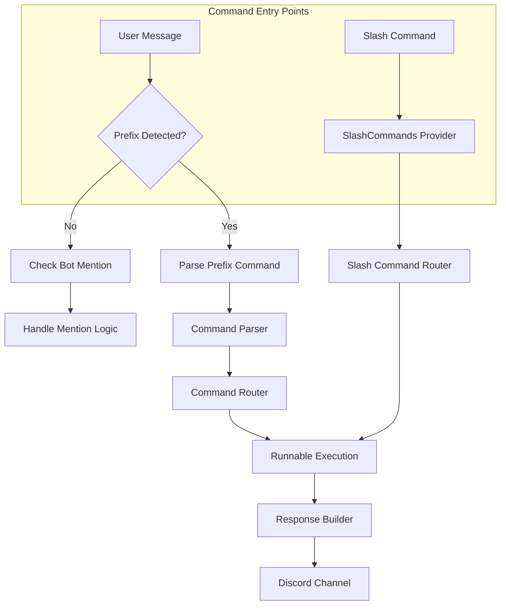
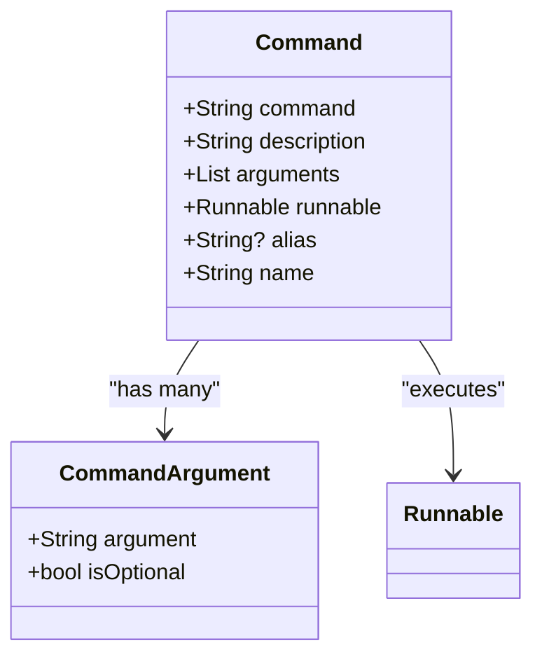
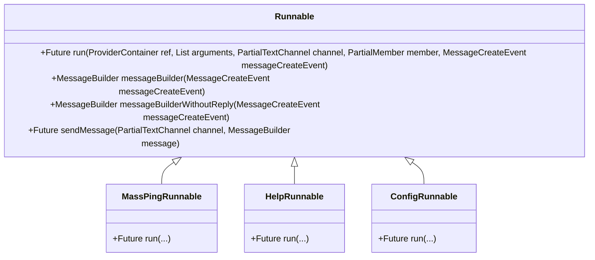
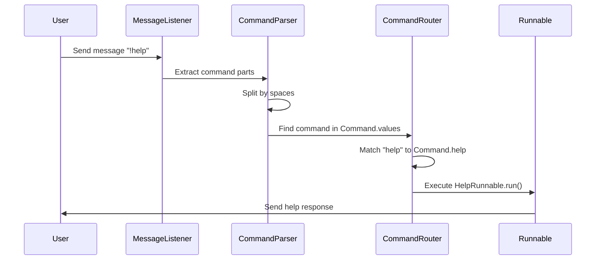
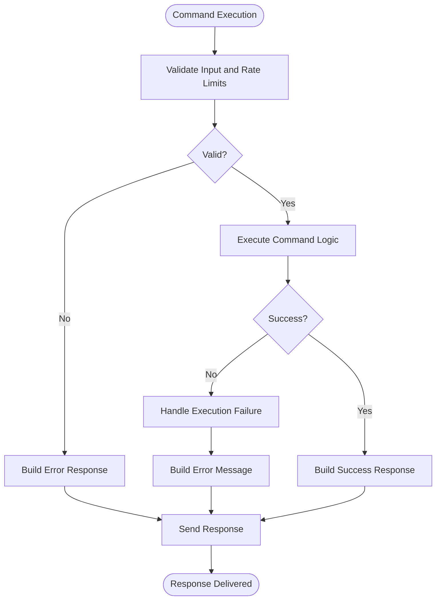

# Command System

<cite>
**Referenced Files in This Document**   
- [commands.dart](file://src/commands.dart)
- [commands/commands.dart](file://src/commands/commands.dart)
- [runnables/runnables.dart](file://src/runnables/runnables.dart)
- [utils/discord_response_utils.dart](file://src/utils/discord_response_utils.dart)
- [listen_to_message.dart](file://src/listen_to_message.dart)
- [bot.dart](file://src/bot.dart)
- [runnables/config_runnable.dart](file://src/runnables/config_runnable.dart)
- [runnables/help_runnable.dart](file://src/runnables/help_runnable.dart)
- [runnables/mass_ping_runnable.dart](file://src/runnables/mass_ping_runnable.dart)
- [commands/ask_command.dart](file://src/commands/ask_command.dart)
</cite>

## Table of Contents
1. [Introduction](#introduction)
2. [Command Architecture Overview](#command-architecture-overview)
3. [Command Class Structure](#command-class-structure)
4. [Static Command Registry](#static-command-registry)
5. [Runnable Interface](#runnable-interface)
6. [Command Parsing and Routing](#command-parsing-and-routing)
7. [Argument Extraction and Validation](#argument-extraction-and-validation)
8. [Response Building with messageBuilder](#response-building-with-messagebuilder)
9. [Error Handling and Response Patterns](#error-handling-and-response-patterns)
10. [Conclusion](#conclusion)

## Introduction
The Discord bot implements a dual command architecture supporting both prefix-based commands (e.g., !mass-ping) and slash commands (e.g., /waifu). This system enables flexible user interaction through multiple input methods while maintaining a consistent execution model. The command processing system is built around a static registry pattern with abstract execution interfaces, allowing for extensible command definitions and centralized management of command availability.

**Section sources**
- [commands.dart](file://src/commands.dart#L0-L70)
- [commands/commands.dart](file://src/commands/commands.dart#L0-L54)

## Command Architecture Overview
The command system supports two distinct interaction models: traditional prefix-based commands triggered by a configurable prefix (default '!') and modern slash commands integrated with Discord's UI. Both command types are managed through separate but parallel registration systems. Prefix commands are defined in a static registry within the Command class, while slash commands are dynamically registered through the SlashCommands provider. This dual architecture allows the bot to support legacy interaction patterns while embracing Discord's evolving command interface standards.

**Diagram sources**
- [listen_to_message.dart](file://src/listen_to_message.dart#L0-L141)
- [bot.dart](file://src/bot.dart#L0-L52)
- [commands/commands.dart](file://src/commands/commands.dart#L0-L54)

**Section sources**
- [listen_to_message.dart](file://src/listen_to_message.dart#L0-L141)
- [bot.dart](file://src/bot.dart#L0-L52)

## Command Class Structure
The Command class serves as the foundation for prefix-based commands, encapsulating essential properties including command name, description, argument specifications, and associated Runnable implementation. Each command instance contains a command string, descriptive text, list of CommandArgument objects defining expected parameters, and a reference to a Runnable object that implements the command's logic. Optional properties include an alias for alternative invocation and a human-readable name. This structure enables consistent command definition and metadata access throughout the system.

**Diagram sources**
- [commands.dart](file://src/commands.dart#L0-L70)

**Section sources**
- [commands.dart](file://src/commands.dart#L0-L70)

## Static Command Registry
The system employs a static command registry pattern implemented through the Command class's static constants. All prefix-based commands are defined as const instances of the Command class, such as massPing, config, help, waifuPoints, and ai. These static instances are collected in the Command.values list, enabling enumeration of all available prefix commands. This pattern provides compile-time command definition, type safety, and easy iteration over all registered commands, particularly useful for generating help documentation and validating user input against available commands.

**Section sources**
- [commands.dart](file://src/commands.dart#L0-L70)
- [runnables/help_runnable.dart](file://src/runnables/help_runnable.dart#L0-L78)

## Runnable Interface
The Runnable abstract class defines the execution interface for all commands, requiring implementation of the run method with standardized parameters. The run method accepts a ProviderContainer for dependency injection, List<String> for parsed arguments, PartialTextChannel for response output, PartialMember for user context, and MessageCreateEvent for message metadata. The class provides utility methods including messageBuilder for creating reply-formatted messages and sendMessage for dispatching responses. This consistent interface ensures uniform command execution patterns and simplifies response handling across different command types.

**Diagram sources**
- [runnables/runnables.dart](file://src/runnables/runnables.dart#L0-L28)
- [runnables/mass_ping_runnable.dart](file://src/runnables/mass_ping_runnable.dart#L0-L176)
- [runnables/help_runnable.dart](file://src/runnables/help_runnable.dart#L0-L78)
- [runnables/config_runnable.dart](file://src/runnables/config_runnable.dart#L0-L135)

**Section sources**
- [runnables/runnables.dart](file://src/runnables/runnables.dart#L0-L28)

## Command Parsing and Routing
Command parsing occurs in the MessageListener class, which processes incoming messages and determines appropriate command routing. For prefix-based commands, the system first checks if the message starts with the configured prefix, then splits the content into components to identify the command and arguments. The parser uses Command.values to find matching commands by comparing the input against both command names and aliases in a case-insensitive manner. Once identified, the corresponding Runnable's run method is invoked with parsed arguments and context. Slash commands are automatically handled by the nyxx_commands plugin, with routing managed through the SlashCommands provider initialization in the bot configuration.

**Diagram sources**
- [listen_to_message.dart](file://src/listen_to_message.dart#L0-L141)
- [commands.dart](file://src/commands.dart#L0-L70)

**Section sources**
- [listen_to_message.dart](file://src/listen_to_message.dart#L0-L141)

## Argument Extraction and Validation
Argument extraction occurs during command parsing, where the message content is split by spaces and arguments are collected from the third position onward (index 2). The system does not perform automatic type validation for prefix commands, leaving validation to individual Runnable implementations. However, slash commands leverage the nyxx_commands framework to provide type-safe parameter validation, as demonstrated in the AskCommand implementation where the prompt parameter is automatically validated. The AICommandUtils class provides specialized validation functions for AI-related commands, including rate limiting checks and input validation for prompt length and content, ensuring robust argument handling for critical operations.

**Section sources**
- [listen_to_message.dart](file://src/listen_to_message.dart#L0-L141)
- [commands/ask_command.dart](file://src/commands/ask_command.dart#L0-L71)
- [utils/discord_response_utils.dart](file://src/utils/discord_response_utils.dart#L0-L225)

## Response Building with messageBuilder
The messageBuilder utility, inherited by all Runnable implementations, creates consistent Discord responses with standardized formatting. The primary messageBuilder method automatically configures responses as replies to the original command message by setting the referencedMessage property. A secondary method, messageBuilderWithoutReply, provides a clean message builder without reply context when needed. These utilities ensure consistent user experience by maintaining visual continuity between commands and responses. The sendMessage helper method further standardizes response delivery by encapsulating the channel.sendMessage call, reducing boilerplate code across command implementations.

**Section sources**
- [runnables/runnables.dart](file://src/runnables/runnables.dart#L0-L28)
- [runnables/mass_ping_runnable.dart](file://src/runnables/mass_ping_runnable.dart#L0-L176)

## Error Handling and Response Patterns
The system implements comprehensive error handling at multiple levels. For slash commands, the CommandsPlugin listens to onCommandError events, specifically handling ConverterFailedException to provide user feedback when parameter conversion fails. Individual Runnables implement command-specific error handling, such as the ConfigRunnable's timeout mechanism for interactive configuration. The AICommandUtils class provides a sophisticated validation framework for AI commands, returning AICommandValidationResult objects that indicate whether execution should proceed and include appropriate error messages when validation fails. Disabled commands are gracefully handled by checking against the disabledCommands list and providing reason-specific feedback to users.

**Diagram sources**
- [bot.dart](file://src/bot.dart#L0-L52)
- [commands/ask_command.dart](file://src/commands/ask_command.dart#L0-L71)
- [utils/discord_response_utils.dart](file://src/utils/discord_response_utils.dart#L0-L225)

**Section sources**
- [bot.dart](file://src/bot.dart#L0-L52)
- [utils/discord_response_utils.dart](file://src/utils/discord_response_utils.dart#L0-L225)

## Conclusion
The command processing system in the Discord bot effectively combines traditional prefix-based commands with modern slash commands through a well-structured architecture. The static Command registry provides a simple, type-safe mechanism for defining prefix commands, while the SlashCommands provider enables dynamic registration of slash commands. The Runnable abstract class establishes a consistent execution interface, and the messageBuilder utilities ensure uniform response formatting. Comprehensive error handling and validation mechanisms, particularly for AI-powered commands, enhance reliability and user experience. This dual-architecture approach allows the bot to support multiple interaction paradigms while maintaining code organization and extensibility.