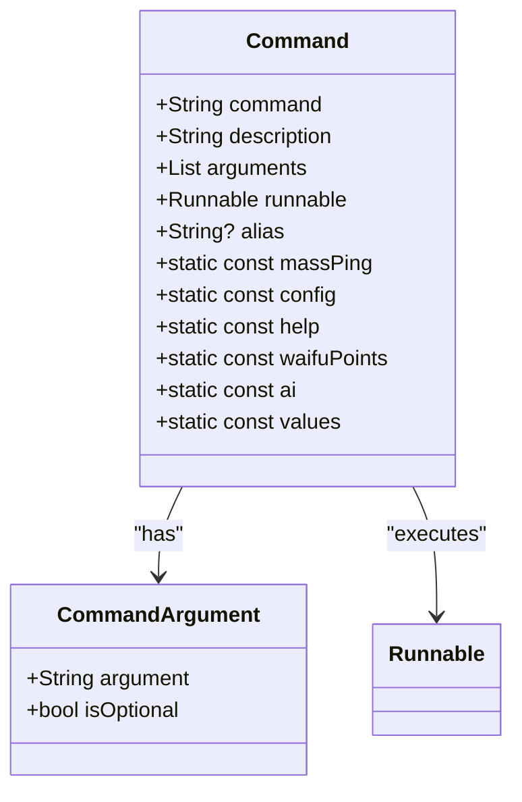
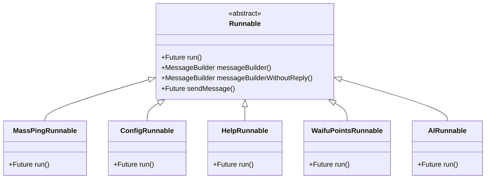
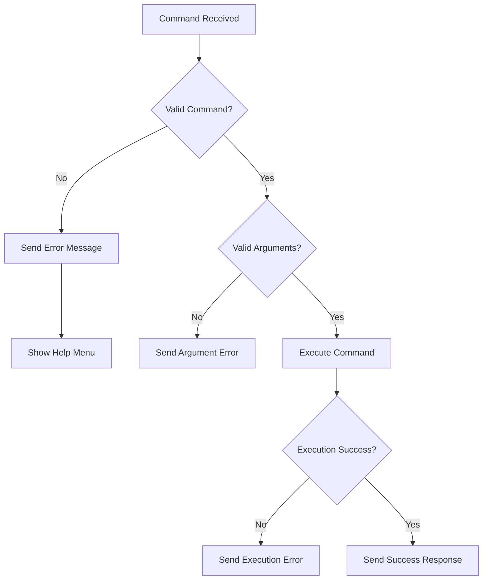

# Prefix Commands

<cite>
**Referenced Files in This Document**   
- [commands.dart](file://src/commands.dart)
- [listen_to_message.dart](file://src/listen_to_message.dart)
- [bot.dart](file://src/bot.dart)
- [mass_ping_runnable.dart](file://src/runnables/mass_ping_runnable.dart)
- [config_runnable.dart](file://src/runnables/config_runnable.dart)
- [help_runnable.dart](file://src/runnables/help_runnable.dart)
- [waifu_points.dart](file://src/runnables/waifu_points.dart)
- [ask.dart](file://src/runnables/ask.dart)
- [discord_response_utils.dart](file://src/utils/discord_response_utils.dart)
- [runnables.dart](file://src/runnables/runnables.dart)
</cite>

## Table of Contents
1. [Command Parsing and Prefix Handling](#command-parsing-and-prefix-handling)
2. [Command Registration and Routing](#command-registration-and-routing)
3. [Argument Parsing and Validation](#argument-parsing-and-validation)
4. [Runnable Interface and Execution Model](#runnable-interface-and-execution-model)
5. [Error Handling Patterns](#error-handling-patterns)
6. [Response Formatting with messageBuilder](#response-formatting-with-messagebuilder)

## Command Parsing and Prefix Handling

The prefix-based command system in discord_bot processes user messages by checking for a configured prefix at the beginning of each message. The bot supports both direct prefix invocation and bot mention detection. When a message starts with the configured prefix (e.g., "!"), the system parses the command and its arguments by splitting the message content into tokens. The first token after the prefix is treated as the command name, while subsequent tokens are collected as arguments. The system also handles cases where the bot is mentioned directly, triggering appropriate responses or command execution. Command matching is case-insensitive and supports both full command names and aliases.

**Section sources**
- [listen_to_message.dart](file://src/listen_to_message.dart#L62-L102)
- [bot.dart](file://src/bot.dart#L10-L15)

## Command Registration and Routing

Command registration is centralized in the commands.dart file, where all prefix commands are defined as static instances of the Command class. Each command is registered with its name, description, argument specifications, and associated Runnable implementation. The Command.values list contains all available commands, enabling systematic processing and help menu generation. Commands support aliases, allowing users to invoke them through alternative names (e.g., "!wp" for "!waifu-points"). The routing system uses the Command.values collection to match incoming messages to their corresponding Runnable implementations, ensuring that each command is properly dispatched to its execution logic.

**Diagram sources**
- [commands.dart](file://src/commands.dart#L16-L69)
- [commands.dart](file://src/commands.dart#L5-L14)

**Section sources**
- [commands.dart](file://src/commands.dart#L16-L69)

## Argument Parsing and Validation

Argument parsing is handled by splitting the message content after the command name and collecting all subsequent tokens into an arguments list. Each command defines its expected arguments through the CommandArgument class, specifying whether arguments are required or optional. The system performs basic validation by checking argument presence and format according to the command's requirements. For example, the !mass-ping command validates that a user mention is provided as the first argument, while the !config command ensures the new prefix is a single word. Commands implement their own validation logic within their Runnable classes, checking argument counts and formats before execution.

**Section sources**
- [listen_to_message.dart](file://src/listen_to_message.dart#L104-L118)
- [mass_ping_runnable.dart](file://src/runnables/mass_ping_runnable.dart#L20-L35)
- [config_runnable.dart](file://src/runnables/config_runnable.dart#L80-L86)

## Runnable Interface and Execution Model

The Runnable interface provides a consistent execution model for all prefix commands, decoupling command routing from implementation logic. Each command's functionality is encapsulated within a class that extends Runnable and implements the run method. This design allows for clean separation of concerns, where the command dispatcher only needs to know about the Runnable interface, not the specific implementation details of each command. The run method receives essential context including the dependency injection container (ref), parsed arguments, message channel, member information, and the original message event. This pattern enables dependency injection and promotes testability by allowing dependencies to be provided through the ref parameter.

**Diagram sources**
- [runnables.dart](file://src/runnables/runnables.dart#L7-L28)
- [mass_ping_runnable.dart](file://src/runnables/mass_ping_runnable.dart#L10-L175)
- [config_runnable.dart](file://src/runnables/config_runnable.dart#L14-L134)

**Section sources**
- [runnables.dart](file://src/runnables/runnables.dart#L7-L28)
- [mass_ping_runnable.dart](file://src/runnables/mass_ping_runnable.dart#L10-L175)
- [config_runnable.dart](file://src/runnables/config_runnable.dart#L14-L134)

## Error Handling Patterns

The system implements comprehensive error handling for both command parsing and execution failures. When an invalid command is detected, the bot automatically responds with an error message and displays the help menu. Each Runnable implementation includes specific validation and error handling for its command's requirements. For example, the ConfigRunnable validates that the new prefix is a single word, providing immediate feedback if this requirement is not met. The MassPingRunnable checks for proper user mention format and handles errors during private channel creation. The system uses consistent error response formatting through the messageBuilder utility, ensuring users receive clear and actionable feedback when commands fail.

**Diagram sources**
- [listen_to_message.dart](file://src/listen_to_message.dart#L119-L139)
- [config_runnable.dart](file://src/runnables/config_runnable.dart#L80-L100)
- [mass_ping_runnable.dart](file://src/runnables/mass_ping_runnable.dart#L20-L35)

**Section sources**
- [listen_to_message.dart](file://src/listen_to_message.dart#L119-L139)
- [config_runnable.dart](file://src/runnables/config_runnable.dart#L80-L100)

## Response Formatting with messageBuilder

The messageBuilder utility ensures consistent response formatting across all prefix commands by providing a standardized way to create message responses. Defined in the Runnable base class, messageBuilder automatically configures responses to reply to the original command message, maintaining conversation context in Discord. The utility includes methods for creating both replied and non-replied messages, allowing commands to choose the appropriate response style. All commands use the sendMessage helper method, which encapsulates the channel.sendMessage call and ensures consistent error handling. This approach guarantees that all bot responses follow the same formatting conventions, including proper message referencing and error presentation.

**Section sources**
- [runnables.dart](file://src/runnables/runnables.dart#L20-L28)
- [config_runnable.dart](file://src/runnables/config_runnable.dart#L46-L54)
- [mass_ping_runnable.dart](file://src/runnables/mass_ping_runnable.dart#L25-L30)