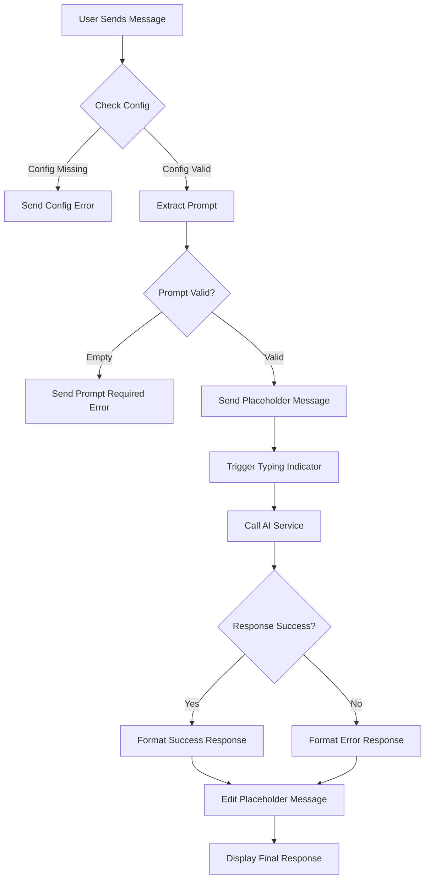
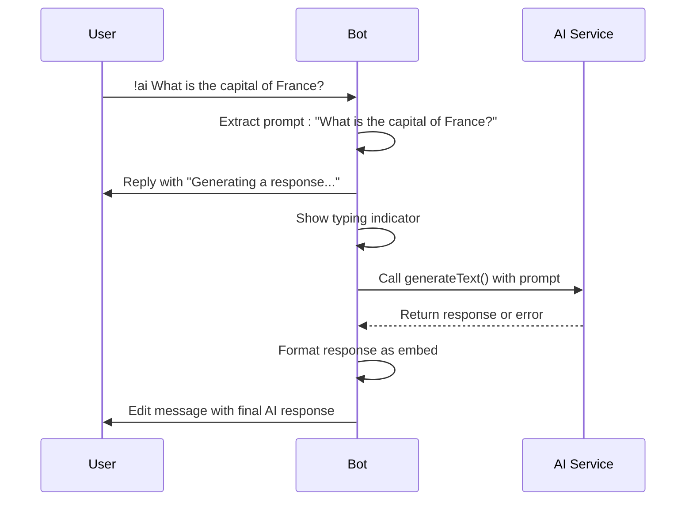
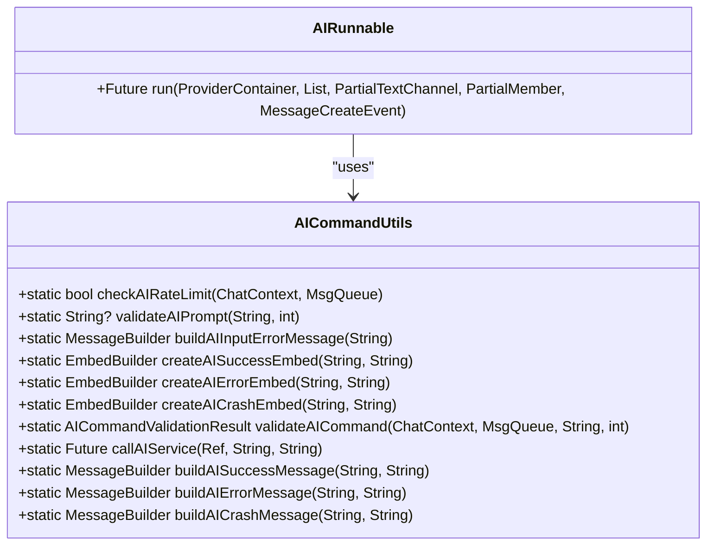
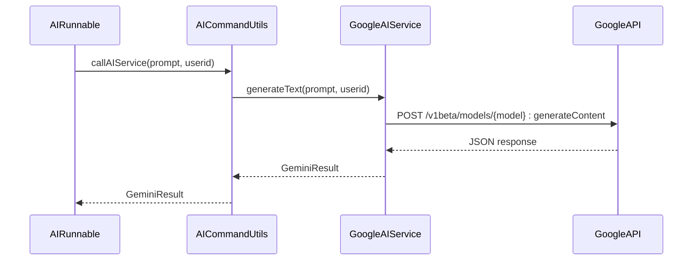
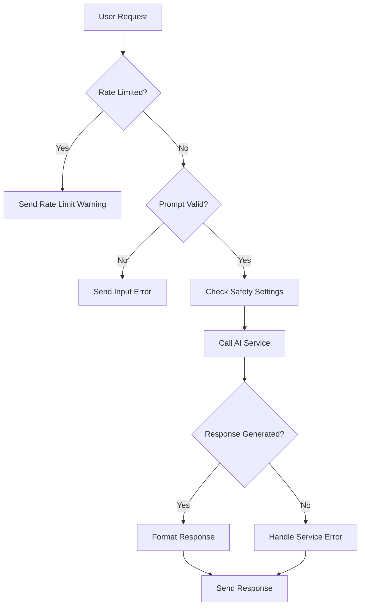

# ai Command

<cite>
**Referenced Files in This Document**   
- [ask.dart](file://src/runnables/ask.dart)
- [discord_response_utils.dart](file://src/utils/discord_response_utils.dart)
- [google_ai_service.dart](file://src/google_ai_service.dart)
- [constants.dart](file://src/constants.dart)
- [msg_queue.dart](file://src/msg_queue.dart)
</cite>

## Table of Contents
1. [Introduction](#introduction)
2. [Command Processing Flow](#command-processing-flow)
3. [Prompt Extraction and Validation](#prompt-extraction-and-validation)
4. [User Experience Flow](#user-experience-flow)
5. [Error Handling and Response Formatting](#error-handling-and-response-formatting)
6. [Google AI Service Integration](#google-ai-service-integration)
7. [Security and Rate Limiting](#security-and-rate-limiting)
8. [Best Practices for Prompt Engineering](#best-practices-for-prompt-engineering)

## Introduction

The `!ai` command in the Discord bot provides users with access to Google's AI service for generating natural language responses. This command allows users to submit prompts that are processed through the Gemini API, with responses formatted and delivered within the Discord interface. The implementation follows a structured flow from command invocation to response delivery, incorporating validation, error handling, and user experience considerations.

**Section sources**
- [ask.dart](file://src/runnables/ask.dart#L1-L65)

## Command Processing Flow

The `!ai` command processing begins with the `AIRunnable` class, which handles the execution of the command when invoked by a user. The command flow starts by extracting the configuration from the bot's provider system, specifically retrieving the command prefix defined in the configuration. This prefix is used to identify and parse the command correctly within the message context.

When a user sends a message starting with the configured prefix followed by "ai" and their prompt, the `AIRunnable` processes this input through a series of steps. The implementation uses Riverpod for state management and dependency injection, allowing for clean separation of concerns and testability. The command execution is asynchronous, ensuring that the bot remains responsive while waiting for the AI service to generate a response.

**Diagram sources**
- [ask.dart](file://src/runnables/ask.dart#L1-L65)

**Section sources**
- [ask.dart](file://src/runnables/ask.dart#L1-L65)

## Prompt Extraction and Validation

The prompt extraction process begins by removing the command prefix and the "ai" keyword from the user's message content. This is accomplished through string replacement operations that strip the configured prefix and the command identifier, leaving only the user's intended prompt. The extracted prompt is then trimmed to remove any leading or trailing whitespace.

Before proceeding to the AI service call, the system performs validation on the extracted prompt. The validation checks ensure that the prompt is not empty and does not exceed the maximum length of 4000 characters. These validation rules are implemented in the `AICommandUtils` class, which provides a centralized location for AI command-related utilities and validation logic.

The prompt processing also preserves user context by extracting the user's ID from the message event, which is then passed to the AI service. This allows the AI model to incorporate user-specific information when generating responses, potentially enabling more personalized interactions.

**Section sources**
- [ask.dart](file://src/runnables/ask.dart#L25-L35)
- [discord_response_utils.dart](file://src/utils/discord_response_utils.dart#L40-L50)

## User Experience Flow

The user experience for the `!ai` command is designed to provide clear feedback throughout the response generation process. When a user submits a prompt, the bot immediately responds with a placeholder message containing "Generating a response..." This message serves as confirmation that the command has been received and is being processed.

Concurrently with sending the placeholder message, the bot triggers a typing indicator in the channel. This visual cue informs users that the bot is actively working on their request, setting appropriate expectations for response time. The typing indicator enhances the perceived responsiveness of the bot, even when the AI service requires several seconds to generate a response.

Once the AI service returns a result, the bot edits the original placeholder message to replace it with the final response. This approach maintains conversation flow by keeping the AI response connected to the user's original message through Discord's reply functionality. The editing mechanism prevents message clutter that would occur from sending multiple separate messages.

**Diagram sources**
- [ask.dart](file://src/runnables/ask.dart#L42-L64)
- [discord_response_utils.dart](file://src/utils/discord_response_utils.dart#L207-L224)

**Section sources**
- [ask.dart](file://src/runnables/ask.dart#L42-L64)

## Error Handling and Response Formatting

The error handling system for the `!ai` command is comprehensive, addressing various failure scenarios with appropriate user feedback. When configuration is missing, the bot responds with a red alert message indicating "Config not found." If the user submits an empty prompt, a similar error message prompts them to provide input.

The `AICommandUtils` class implements sophisticated error mapping that translates technical error messages into user-friendly responses. For example, quota or limit errors are presented as "API Quota Exceeded" with a suggestion to try again later. Authentication issues are clearly identified as "Authentication Error" with guidance to contact an administrator. Content blocked by safety filters triggers a "Content Blocked" response, helping users understand why their request was denied.

Response formatting follows a consistent pattern using Discord embeds with standardized styling. Successful responses use a green embed with the title "🤖 AI Response" and include both the original prompt and the AI-generated content. Error responses use appropriate colors (red for errors, orange for rate limiting) and emojis to quickly convey the nature of the issue. The footer of all AI responses includes "Red Door AI" for branding consistency.

**Diagram sources**
- [discord_response_utils.dart](file://src/utils/discord_response_utils.dart#L15-L225)
- [ask.dart](file://src/runnables/ask.dart#L1-L65)

**Section sources**
- [discord_response_utils.dart](file://src/utils/discord_response_utils.dart#L71-L132)
- [constants.dart](file://src/constants.dart#L66-L85)

## Google AI Service Integration

The integration with Google's AI service is handled by the `GoogleAIService` class, which serves as a wrapper around the Gemini API. This service uses HTTP requests to communicate with the Google Generative Language API endpoint, sending prompts and receiving generated text responses. The service configuration includes safety settings that control content filtering, with explicit thresholds for different categories of potentially harmful content.

The AI service call includes contextual information that enhances response quality. The request body incorporates a predefined AI persona from the environment configuration, establishing the character and tone for the AI's responses. Each prompt is also prefixed with the user ID, allowing the AI model to potentially personalize responses based on the requester.

The service implementation includes robust error handling for network issues, API failures, and authentication problems. When an error occurs, the system captures the exception and returns a structured `GeminiResult` object that indicates failure along with an error message. This approach ensures that even when the AI service fails, the bot can provide meaningful feedback to users rather than crashing or timing out silently.

**Diagram sources**
- [google_ai_service.dart](file://src/google_ai_service.dart#L72-L165)
- [discord_response_utils.dart](file://src/utils/discord_response_utils.dart#L168-L205)

**Section sources**
- [google_ai_service.dart](file://src/google_ai_service.dart#L72-L165)

## Security and Rate Limiting

The `!ai` command implements several security and rate limiting measures to protect both the bot and its users. The most critical security feature is the validation of input prompts, which prevents empty or excessively long inputs that could indicate abuse or technical issues. The system also processes prompts to remove the command prefix and identifier, preventing potential command injection attacks.

Rate limiting is implemented through the `MsgQueue` class, which tracks user requests over a 10-minute window. Each user is limited to 10 requests within this period, after which they receive a rate limit warning. This mechanism prevents abuse of the AI service and helps manage API costs, as AI service calls typically have usage quotas and associated expenses.

The integration with Google's AI service includes additional security considerations through safety settings in the API request. These settings configure the content filtering behavior, with different thresholds for sexually explicit content, hate speech, harassment, and dangerous content. Notably, the system sets "BLOCK_NONE" for sexually explicit and hate speech categories, indicating a permissive approach to content filtering, while maintaining higher thresholds for harassment and dangerous content.

**Diagram sources**
- [msg_queue.dart](file://src/msg_queue.dart#L1-L40)
- [google_ai_service.dart](file://src/google_ai_service.dart#L121-L165)

**Section sources**
- [msg_queue.dart](file://src/msg_queue.dart#L1-L40)
- [google_ai_service.dart](file://src/google_ai_service.dart#L121-L165)

## Best Practices for Prompt Engineering

Effective use of the `!ai` command requires understanding how to craft prompts that yield high-quality responses. Users should provide clear, specific questions or requests rather than vague inquiries. For example, instead of asking "Tell me about history," a more effective prompt would be "Summarize the causes of World War II in three paragraphs."

The 4000-character limit provides substantial space for detailed prompts, allowing users to include context, specify response format, or provide examples of the desired output style. Users can leverage the AI's ability to understand conversational context by referencing previous interactions or specifying particular perspectives they want the AI to adopt.

When encountering content filtering, users should rephrase their requests to avoid triggering safety mechanisms while maintaining their intended meaning. The system's feedback messages help identify when prompts are being blocked, allowing users to adjust their approach. For technical queries, including specific details and constraints often produces more accurate and useful responses.

Understanding the rate limiting system helps users manage their interactions effectively. If a user reaches the limit of 10 requests in 10 minutes, they should wait before submitting additional queries. This limitation encourages thoughtful use of the AI service rather than rapid-fire questioning that may not yield better results.

**Section sources**
- [discord_response_utils.dart](file://src/utils/discord_response_utils.dart#L40-L50)
- [google_ai_service.dart](file://src/google_ai_service.dart#L121-L165)