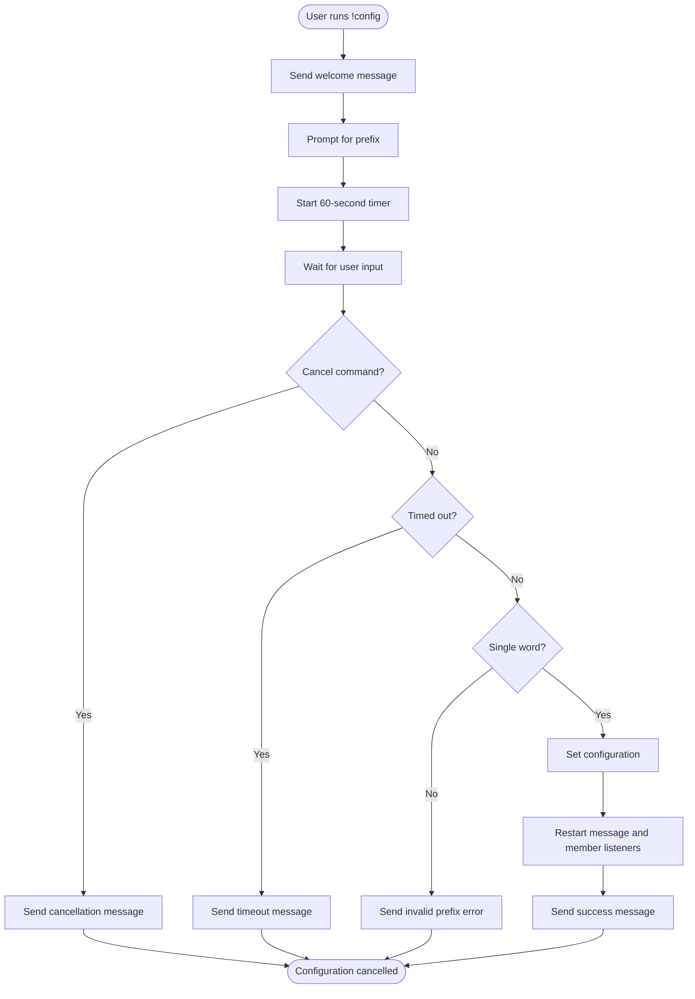
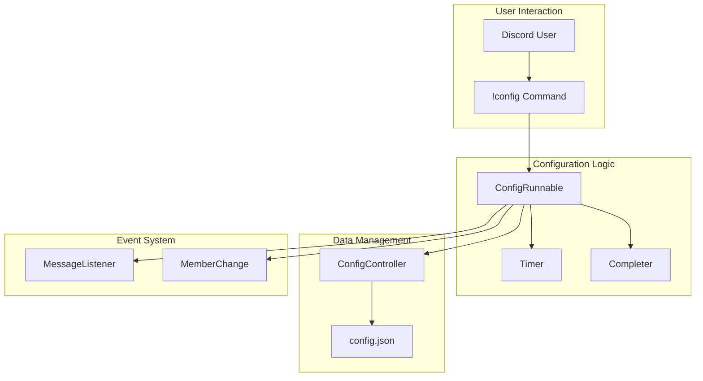
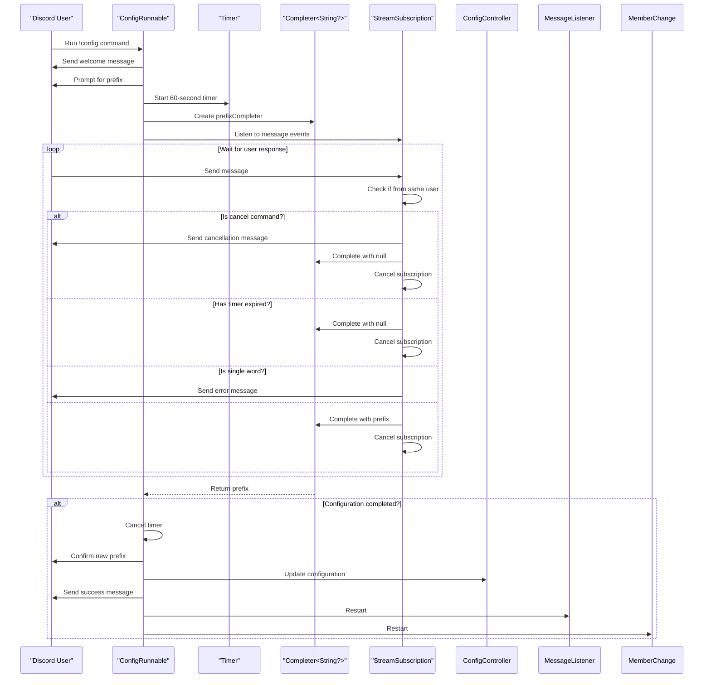
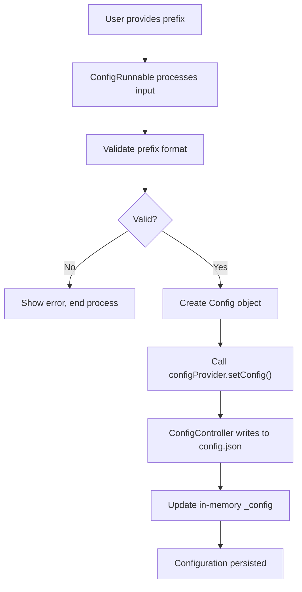
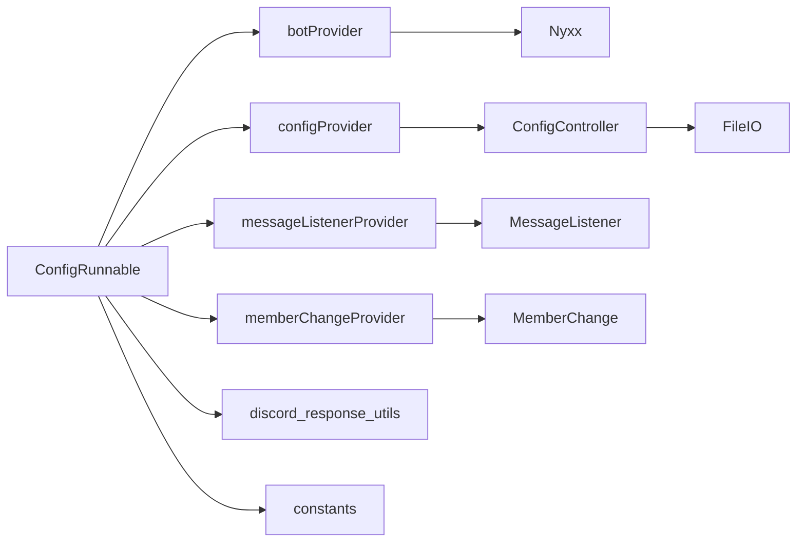

# config Command

<cite>
**Referenced Files in This Document**   
- [src/runnables/config_runnable.dart](file://src/runnables/config_runnable.dart)
- [src/config.dart](file://src/config.dart)
- [src/listen_to_message.dart](file://src/listen_to_message.dart)
- [src/member_change.dart](file://src/member_change.dart)
- [src/utils/discord_response_utils.dart](file://src/utils/discord_response_utils.dart)
- [src/bot.dart](file://src/bot.dart)
</cite>

## Table of Contents
1. [Introduction](#introduction)
2. [User Experience Flow](#user-experience-flow)
3. [Core Components](#core-components)
4. [Architecture Overview](#architecture-overview)
5. [Detailed Component Analysis](#detailed-component-analysis)
6. [Dependency Analysis](#dependency-analysis)
7. [Security and Validation](#security-and-validation)
8. [Troubleshooting Guide](#troubleshooting-guide)
9. [Conclusion](#conclusion)

## Introduction
The `!config` command in the Discord bot provides an interactive setup experience for users to configure the bot's basic settings, primarily the command prefix. This document details the implementation of the `ConfigRunnable` class that orchestrates this configuration process, including its use of asynchronous programming patterns, state management, and integration with the bot's core services. The command guides users through a step-by-step setup process with embedded messages, handles user input with timeout and cancellation mechanisms, validates input, and persists configuration changes across application restarts.

## User Experience Flow
The `!config` command provides a guided, interactive experience for users to set up the bot. When invoked, the command initiates a conversation flow that begins with a welcome message explaining the purpose of the configuration process. The bot then prompts the user to provide a custom prefix for commands. The interaction is designed to be user-friendly with clear instructions and feedback at each step.

The user has 60 seconds to respond to each prompt, after which the configuration session times out with an appropriate message. Users can also cancel the process at any time by sending a cancellation command. Upon successful configuration, the bot confirms the new settings and provides instructions on how to use the bot with the newly set prefix. Error messages are displayed when invalid input is provided, specifically when the prefix is not a single word, guiding the user toward correct input.

**Diagram sources**
- [src/runnables/config_runnable.dart](file://src/runnables/config_runnable.dart#L25-L135)

**Section sources**
- [src/runnables/config_runnable.dart](file://src/runnables/config_runnable.dart#L25-L135)

## Core Components
The `!config` command functionality is implemented through several core components that work together to provide a seamless configuration experience. The primary component is the `ConfigRunnable` class, which orchestrates the entire configuration process from start to finish. This class manages the interaction flow, handles user input, performs validation, and persists the configuration.

The configuration data is represented by the `Config` class, which encapsulates the bot's settings including the command prefix and optional channel configurations. The `ConfigController` manages the lifecycle of the configuration, handling reading from and writing to the persistent storage file. The command integrates with the bot's message handling system through providers that are restarted after configuration changes to ensure the new settings take effect immediately.

**Section sources**
- [src/runnables/config_runnable.dart](file://src/runnables/config_runnable.dart#L25-L135)
- [src/config.dart](file://src/config.dart#L1-L78)

## Architecture Overview
The `!config` command follows a reactive architecture pattern using Riverpod for state management and dependency injection. The command is triggered through the bot's command system and executes within the context of a provider container, allowing it to access various services and controllers needed for configuration.

The architecture separates concerns between the configuration logic, data persistence, and event handling. The `ConfigRunnable` focuses on the user interaction flow, while the `ConfigController` handles data persistence. The bot's message listeners are managed as separate providers that can be restarted when configuration changes require them to reinitialize with new settings.

**Diagram sources**
- [src/runnables/config_runnable.dart](file://src/runnables/config_runnable.dart#L25-L135)
- [src/config.dart](file://src/config.dart#L1-L78)
- [src/listen_to_message.dart](file://src/listen_to_message.dart#L1-L141)
- [src/member_change.dart](file://src/member_change.dart#L1-L77)

## Detailed Component Analysis

### ConfigRunnable Analysis
The `ConfigRunnable` class implements the core logic for the configuration command, managing the entire user interaction flow from initiation to completion. The class uses Dart's asynchronous programming features to handle the interactive nature of the configuration process.

#### Implementation Pattern

**Diagram sources**
- [src/runnables/config_runnable.dart](file://src/runnables/config_runnable.dart#L25-L135)

**Section sources**
- [src/runnables/config_runnable.dart](file://src/runnables/config_runnable.dart#L25-L135)

### Configuration Persistence
The configuration system uses a simple file-based persistence mechanism to store and retrieve the bot's settings. The `ConfigController` class manages access to the configuration file, providing methods to read the current configuration and update it with new values.

#### Data Flow

**Diagram sources**
- [src/config.dart](file://src/config.dart#L1-L78)

**Section sources**
- [src/config.dart](file://src/config.dart#L1-L78)

## Dependency Analysis
The `!config` command has several key dependencies that enable its functionality. The command relies on the Riverpod framework for dependency injection, allowing it to access various services through the provider container. It depends on the Nyxx library for Discord API interactions, including sending messages and listening to events.

The command has a direct dependency on the `configProvider` to persist configuration changes, and on the `messageListenerProvider` and `memberChangeProvider` to restart these services after configuration changes. The `ConfigRunnable` also depends on utility functions for creating embedded messages, which are used to provide rich feedback to users during the configuration process.

**Diagram sources**
- [src/runnables/config_runnable.dart](file://src/runnables/config_runnable.dart#L25-L135)
- [src/config.dart](file://src/config.dart#L1-L78)
- [src/listen_to_message.dart](file://src/listen_to_message.dart#L1-L141)
- [src/member_change.dart](file://src/member_change.dart#L1-L77)

**Section sources**
- [src/runnables/config_runnable.dart](file://src/runnables/config_runnable.dart#L25-L135)
- [src/config.dart](file://src/config.dart#L1-L78)
- [src/listen_to_message.dart](file://src/listen_to_message.dart#L1-L141)
- [src/member_change.dart](file://src/member_change.dart#L1-L77)

## Security and Validation
The `!config` command implements several security and validation measures to ensure robust operation. The primary validation checks that the provided prefix is a single word, preventing potential issues with command parsing. This is implemented by splitting the input on whitespace and verifying that only one element results.

The command includes a timeout mechanism that automatically cancels the configuration process after 60 seconds of inactivity, preventing resource leaks from abandoned configuration sessions. A cancellation mechanism allows users to explicitly abort the process by sending a recognized cancel command.

The implementation uses proper scoping to ensure that message listeners only respond to the initiating user, preventing other users from interfering with the configuration process. The configuration update is atomic, writing the entire configuration object to the file system in a single operation to avoid partial writes.

**Section sources**
- [src/runnables/config_runnable.dart](file://src/runnables/config_runnable.dart#L25-L135)

## Troubleshooting Guide
When encountering issues with the `!config` command, several common problems and their solutions should be considered. If the command does not respond, verify that the bot has the necessary permissions to read messages and send embeds in the channel. Check that the bot token and other environment variables are correctly configured in the environment file.

If configuration changes do not take effect, ensure that the bot has write permissions to the directory containing the `config.json` file. Verify that the file is not locked by another process. If the prefix validation is rejecting valid input, check that the input does not contain hidden whitespace characters.

For timeout issues, ensure that the bot process is not under heavy load, which could delay event processing. If message listeners fail to restart after configuration, check the console output for error messages that may indicate issues with the restart process.

**Section sources**
- [src/runnables/config_runnable.dart](file://src/runnables/config_runnable.dart#L25-L135)
- [src/config.dart](file://src/config.dart#L1-L78)
- [src/listen_to_message.dart](file://src/listen_to_message.dart#L1-L141)
- [src/member_change.dart](file://src/member_change.dart#L1-L77)

## Conclusion
The `!config` command provides a robust and user-friendly interface for configuring the Discord bot. Its implementation demonstrates effective use of asynchronous programming patterns, proper state management, and clean separation of concerns. The command's design prioritizes user experience with clear feedback and error handling, while maintaining security through input validation and timeout mechanisms. The integration with the bot's provider system ensures that configuration changes are properly propagated throughout the application, making it a critical component of the bot's overall architecture.