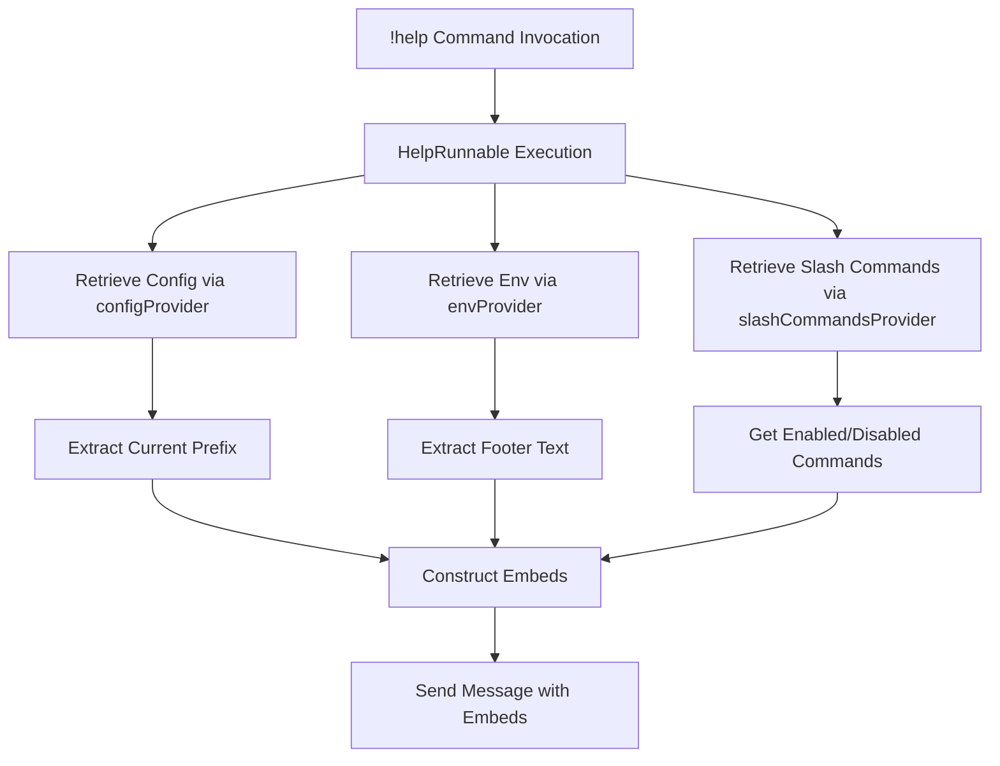
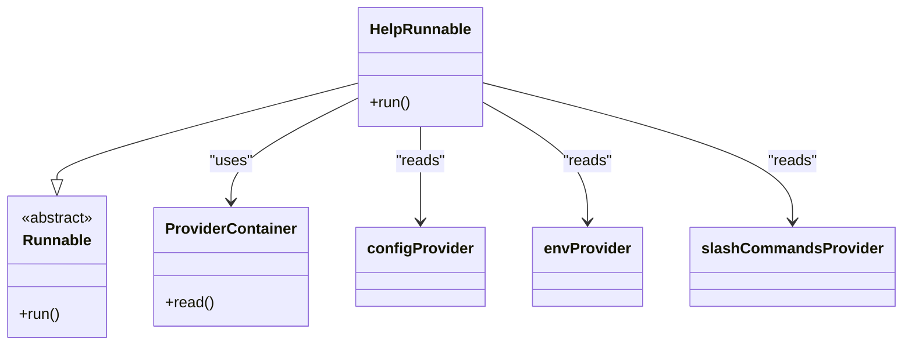
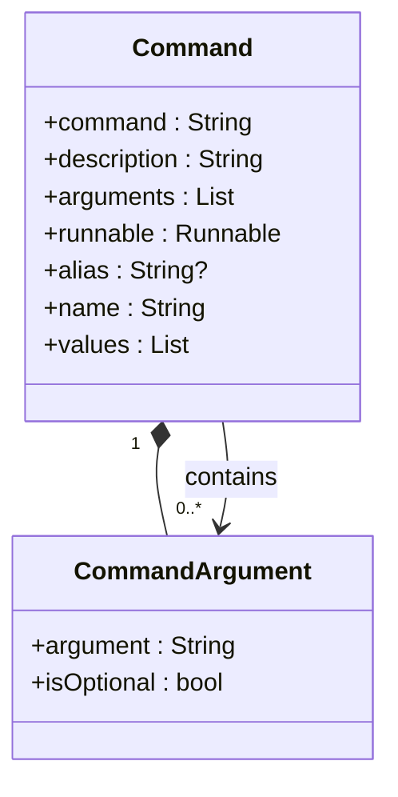
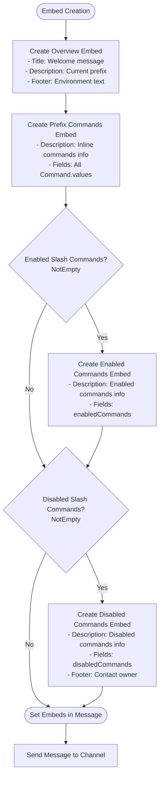
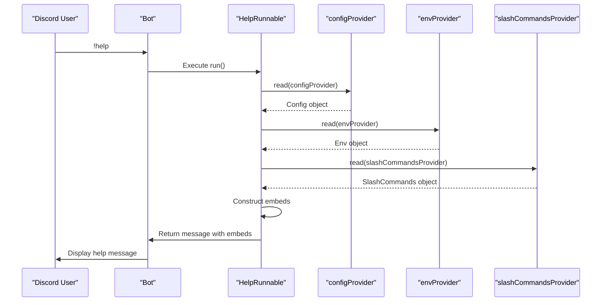

# help Command

<cite>
**Referenced Files in This Document**   
- [help_runnable.dart](file://src/runnables/help_runnable.dart)
- [commands.dart](file://src/commands.dart)
- [config.dart](file://src/config.dart)
- [env.dart](file://src/env.dart)
- [constants.dart](file://src/constants.dart)
- [bot.dart](file://src/bot.dart)
</cite>

## Table of Contents
1. [Introduction](#introduction)
2. [Core Components](#core-components)
3. [Architecture Overview](#architecture-overview)
4. [Detailed Component Analysis](#detailed-component-analysis)
5. [Data Flow and Integration](#data-flow-and-integration)
6. [Customization and Configuration](#customization-and-configuration)
7. [Conclusion](#conclusion)

## Introduction
The `!help` command in the Discord bot serves as a comprehensive documentation system that dynamically generates embeds to display all available bot features. This command provides users with immediate access to information about both prefix-based and slash commands, including their descriptions, arguments, aliases, and current status. The implementation leverages Riverpod for state management and dependency injection, retrieving configuration data and command status to create a contextualized help message. The response is structured as multiple embeds that organize commands into logical sections, providing a clear and user-friendly interface for discovering bot functionality.

## Core Components

The `!help` command functionality is implemented through several interconnected components that work together to generate the comprehensive help message. The core implementation resides in the `HelpRunnable` class, which orchestrates the retrieval of configuration data, command status, and environment variables to construct the final embed response. This component integrates with the Riverpod dependency injection system to access the current bot configuration, environment settings, and slash command registry. The command dynamically adapts its output based on the current state of the bot, displaying only relevant information about enabled and disabled features.

**Section sources**
- [help_runnable.dart](file://src/runnables/help_runnable.dart#L1-L78)
- [commands.dart](file://src/commands.dart#L1-L70)

## Architecture Overview

The architecture of the `!help` command follows a clean separation of concerns, with distinct components responsible for different aspects of the functionality. The system leverages Riverpod providers to manage state and dependencies, allowing the `HelpRunnable` to access configuration, environment variables, and command status without direct coupling. The data flow begins with the command invocation, which triggers the `HelpRunnable` to retrieve necessary data from providers, then constructs embeds using Nyxx's message building utilities, and finally sends the formatted response to the appropriate channel.

**Diagram sources **
- [help_runnable.dart](file://src/runnables/help_runnable.dart#L1-L78)
- [config.dart](file://src/config.dart#L1-L78)
- [env.dart](file://src/env.dart#L1-L99)

## Detailed Component Analysis

### HelpRunnable Implementation
The `HelpRunnable` class is the central component responsible for generating the help message. It implements the `Runnable` interface and overrides the `run` method to handle the command execution. The implementation uses Riverpod's `ref.read()` method to access three critical providers: `configProvider` for the current bot configuration, `envProvider` for environment variables, and `slashCommandsProvider` for the registry of slash commands. This dependency injection approach ensures that the help command always reflects the current state of the bot.

The `HelpRunnable` constructs a multi-embed response where each embed serves a specific purpose: the first provides an overview with the current prefix, the second lists all prefix commands, the third displays enabled slash commands, and the fourth shows disabled slash commands with their reasons. The implementation uses conditional embedding (if statements within the embeds list) to only include sections that have relevant content, ensuring the response is concise and focused.

**Diagram sources **
- [help_runnable.dart](file://src/runnables/help_runnable.dart#L1-L78)
- [config.dart](file://src/config.dart#L1-L78)
- [env.dart](file://src/env.dart#L1-L99)

**Section sources**
- [help_runnable.dart](file://src/runnables/help_runnable.dart#L1-L78)

### Command Structure and Organization
The bot's command system is organized through the `Command` enum which contains all available commands as static constants. Each command is defined with its trigger string, description, arguments, associated runnable, and optional alias. The `Command.values` list provides a comprehensive collection of all prefix commands, which the `!help` command iterates through to generate the inline commands section. This design pattern allows for easy addition of new commands while maintaining a centralized registry that can be accessed by various components.

The command structure includes metadata that enhances the user experience, such as argument definitions that are displayed in the help message and aliases that provide alternative invocation methods. This information is dynamically incorporated into the help embeds, giving users complete information about how to use each command.

**Diagram sources **
- [commands.dart](file://src/commands.dart#L1-L70)

**Section sources**
- [commands.dart](file://src/commands.dart#L1-L70)

### Embed Generation and Visual Design
The visual presentation of the help command is implemented using Nyxx's `EmbedBuilder` and related classes. The implementation creates a series of embeds with consistent styling, using a custom red color (`DiscordColor(0xFA383B)`) for brand consistency. Each embed is structured with appropriate descriptions and fields to organize information logically. The `EmbedFieldBuilder` is used to create individual command entries, with the name field displaying the command and its alias (when available), and the value field showing the description and arguments.

The embed structure follows a progressive disclosure pattern, starting with general information and moving to specific command details. The first embed welcomes users and displays the current prefix, which is dynamically retrieved from the configuration. Subsequent embeds categorize commands by type and status, making it easy for users to understand which features are available and how to access them.

**Diagram sources **
- [help_runnable.dart](file://src/runnables/help_runnable.dart#L1-L78)
- [constants.dart](file://src/constants.dart#L1-L86)

**Section sources**
- [help_runnable.dart](file://src/runnables/help_runnable.dart#L1-L78)

## Data Flow and Integration

The data flow for the `!help` command begins with the command invocation and proceeds through a series of dependency injections to gather all necessary information for the response. When a user types `!help`, the bot routes this to the `HelpRunnable` class, which then accesses three primary data sources through Riverpod providers. The `configProvider` supplies the current bot configuration, including the active prefix, which is essential for providing accurate usage instructions. The `envProvider` delivers environment variables, particularly the footer text that appears in the first embed. The `slashCommandsProvider` provides the complete registry of slash commands, categorized into enabled and disabled states.

This data is then processed and transformed into the embed structure. The configuration data is used to personalize the welcome message, showing users exactly which prefix to use. The environment variables customize the appearance with the footer text. The slash command registry determines which additional embeds are included in the response, ensuring that users only see information relevant to the current bot state. This integration of multiple data sources creates a comprehensive and contextually accurate help system.

**Diagram sources **
- [help_runnable.dart](file://src/runnables/help_runnable.dart#L1-L78)
- [config.dart](file://src/config.dart#L1-L78)
- [env.dart](file://src/env.dart#L1-L99)
- [commands.dart](file://src/commands/commands.dart#L1-L55)

**Section sources**
- [help_runnable.dart](file://src/runnables/help_runnable.dart#L1-L78)

## Customization and Configuration

The `!help` command incorporates several customization options that allow server administrators to tailor the appearance and content of the help message. The most prominent customization is the dynamic prefix display, which retrieves the current prefix from the configuration system rather than using a hardcoded value. This ensures that the help message remains accurate even if the prefix is changed through the `!config` command.

The footer text is another customizable element, sourced from environment variables through the `envProvider`. This allows deployment-specific information to be included in the help message without modifying the codebase. The embed color, while currently hardcoded to a specific red shade, could be made configurable through similar mechanisms.

The command structure itself supports customization through aliases, which provide alternative ways to invoke commands. These aliases are automatically included in the help message, with the format "command (alias)" making them immediately visible to users. This feature enhances discoverability and accommodates user preferences for command invocation.

The conditional rendering of embeds based on command status represents a form of dynamic customization, where the content adapts to the current state of the bot. Enabled slash commands are displayed in one section, while disabled commands appear in another with their specific disablement reasons. This contextual awareness makes the help system more informative and reduces confusion about unavailable features.

**Section sources**
- [help_runnable.dart](file://src/runnables/help_runnable.dart#L1-L78)
- [env.dart](file://src/env.dart#L1-L99)
- [commands.dart](file://src/commands.dart#L1-L70)

## Conclusion
The `!help` command implementation demonstrates a well-architected approach to providing comprehensive documentation within a Discord bot. By leveraging Riverpod for dependency injection, the command dynamically incorporates current configuration, environment settings, and command status into its response. The multi-embed structure organizes information into logical sections, improving readability and user experience. The integration of prefix commands, enabled slash commands, and disabled slash commands with their reasons provides a complete picture of the bot's capabilities. This implementation serves as an effective self-documenting system that helps users discover and understand the bot's features while reflecting the current state of the application.