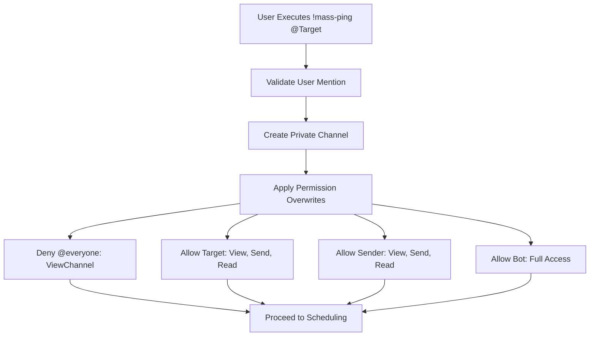
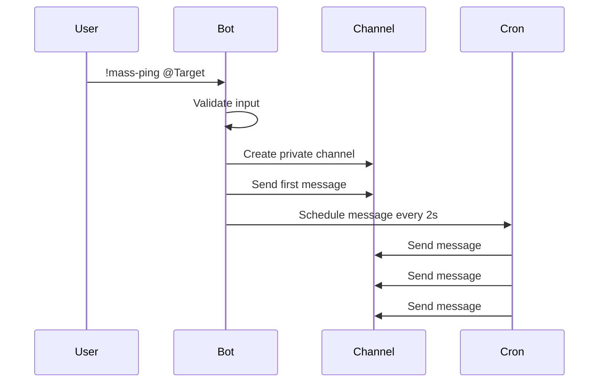
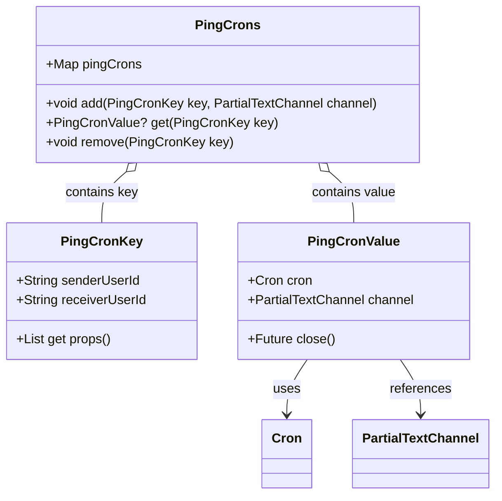

# mass-ping Command

<cite>
**Referenced Files in This Document**   
- [mass_ping_runnable.dart](file://src/runnables/mass_ping_runnable.dart)
- [cron.dart](file://src/cron.dart)
- [constants.dart](file://src/constants.dart)
- [bot.dart](file://src/bot.dart)
- [discord_response_utils.dart](file://src/utils/discord_response_utils.dart)
- [commands.dart](file://src/commands.dart)
</cite>

## Table of Contents
1. [Introduction](#introduction)
2. [Command Structure and Usage](#command-structure-and-usage)
3. [Private Channel Creation with Permission Overwrites](#private-channel-creation-with-permission-overwrites)
4. [MassPingRunnable Implementation](#masspingrunnable-implementation)
5. [Cron Scheduling and Message Frequency](#cron-scheduling-and-message-frequency)
6. [Task Tracking with PingCronKey](#task-tracking-with-pingcronkey)
7. [Authorization and Admin Overrides](#authorization-and-admin-overrides)
8. [Cleanup and Channel Deletion](#cleanup-and-channel-deletion)
9. [Error Handling in Channel Operations](#error-handling-in-channel-operations)
10. [Audit Log Integration](#audit-log-integration)
11. [Performance Considerations](#performance-considerations)

## Introduction
The `!mass-ping` command in the Discord bot enables users to initiate a targeted mass-pinging sequence in a private channel. This feature is designed to draw attention from a specific user through repeated notifications while maintaining privacy by restricting channel access. The implementation leverages Discord’s permission overwrite system to create a secure environment accessible only to the sender, receiver, bot, and server administrators. The command supports starting and stopping operations, with robust error handling, audit logging, and rate-limited scheduling to prevent abuse.

**Section sources**
- [mass_ping_runnable.dart](file://src/runnables/mass_ping_runnable.dart#L1-L176)
- [commands.dart](file://src/commands.dart#L32-L34)

## Command Structure and Usage
The `!mass-ping` command requires a user mention as its primary argument. An optional second parameter, `stop`, allows the user to terminate an ongoing mass-ping session. The syntax follows the format: `!mass-ping <user> [stop]`. For example, `!mass-ping @User` starts the mass ping, while `!mass-ping @User stop` halts it. The command validates input format and ensures a valid user mention is provided before proceeding.

**Section sources**
- [mass_ping_runnable.dart](file://src/runnables/mass_ping_runnable.dart#L15-L25)
- [commands.dart](file://src/commands.dart#L34)

## Private Channel Creation with Permission Overwrites
To ensure privacy and security, the command creates a dedicated text channel named `mass-ping-<receiver>-<sender>`. This channel uses Discord’s permission overwrites to restrict access:
- The `@everyone` role is denied `ViewChannel` permissions.
- The target user (receiver) is granted `ViewChannel`, `SendMessages`, and `ReadMessageHistory`.
- The initiating user (sender) receives the same permissions.
- The bot is allowed full access including `ManageChannels`.

This configuration ensures that only authorized participants can view or interact with the channel, preventing public disruption while enabling direct communication.

**Diagram sources**
- [mass_ping_runnable.dart](file://src/runnables/mass_ping_runnable.dart#L60-L90)

## MassPingRunnable Implementation
The `MassPingRunnable` class handles the execution of the `!mass-ping` command. It processes arguments, validates inputs, manages channel creation, and schedules recurring messages. It uses Riverpod for state management and dependency injection, accessing the bot instance and cron scheduler via providers. The class ensures that only one active mass-ping session exists per sender-receiver pair and prevents duplicate sessions.

**Section sources**
- [mass_ping_runnable.dart](file://src/runnables/mass_ping_runnable.dart#L3-L176)

## Cron Scheduling and Message Frequency
The bot schedules messages to be sent every 2 seconds using a cron-based system. The `Schedule.parse('*/2 * * * * *')` expression triggers the message send function repeatedly at the specified interval. Each message includes the targeted user mention and a standardized phrase: "ANSWER ME!!!!!!!!!!", accompanied by an embed showing the sender’s name and avatar. The first message is sent immediately upon initiation, followed by scheduled repetitions.

**Diagram sources**
- [mass_ping_runnable.dart](file://src/runnables/mass_ping_runnable.dart#L150-L170)

## Task Tracking with PingCronKey
Active mass-ping sessions are tracked using the `PingCronKey` class, which uniquely identifies a session by the sender and receiver user IDs. This key is used to store and retrieve `PingCronValue` objects containing the cron scheduler and associated channel. The `PingCrons` map allows both the sender and admin to stop the session, enabling administrative override capabilities.

**Diagram sources**
- [cron.dart](file://src/cron.dart#L3-L43)

## Authorization and Admin Overrides
The system enforces authorization by checking if the current user initiated the mass-ping or if they are the designated admin. When stopping a session, either the original sender or the admin (configured via environment variable) can invoke the `stop` command. This is achieved by checking both the user-specific key and an admin-specific key in the `pingCrons` map. Unauthorized users cannot start or stop sessions.

**Section sources**
- [mass_ping_runnable.dart](file://src/runnables/mass_ping_runnable.dart#L26-L35)
- [cron.dart](file://src/cron.dart#L38-L40)

## Cleanup and Channel Deletion
When a mass-ping session is stopped, the associated private channel is deleted to maintain server cleanliness. The `stop` command triggers channel deletion with an audit log reason: "Mass ping stopped - removing private channel". The cron job is closed, and the session is removed from the `pingCrons` map using both the sender and admin keys to ensure complete cleanup.

**Section sources**
- [mass_ping_runnable.dart](file://src/runnables/mass_ping_runnable.dart#L110-L130)

## Error Handling in Channel Operations
The implementation includes comprehensive error handling during channel creation. If the Discord API fails to create the channel, the error is caught, logged, and a user-facing message is sent indicating the failure. Similarly, errors during channel deletion are caught and logged, though the operation continues to ensure the cron job is terminated and state is cleaned up.

**Section sources**
- [mass_ping_runnable.dart](file://src/runnables/mass_ping_runnable.dart#L92-L105)

## Audit Log Integration
Every channel creation and deletion is logged in Discord’s audit log with a descriptive reason. Channel creation includes the message: "Private mass ping channel created for user X requested by Y". Deletion is logged as: "Mass ping stopped - removing private channel". This provides transparency and accountability for administrative review.

**Section sources**
- [mass_ping_runnable.dart](file://src/runnables/mass_ping_runnable.dart#L85)
- [mass_ping_runnable.dart](file://src/runnables/mass_ping_runnable.dart#L125)

## Performance Considerations
Scheduling messages every 2 seconds represents a high-frequency operation that could impact bot performance or trigger rate limits. The use of a cron scheduler with lightweight message payloads minimizes overhead. However, prolonged sessions may accumulate API calls, so the design includes immediate termination and cleanup to limit resource usage. Additionally, the private channel scope prevents spam from affecting general server channels.

**Section sources**
- [mass_ping_runnable.dart](file://src/runnables/mass_ping_runnable.dart#L165-L170)
- [cron.dart](file://src/cron.dart#L20-L25)