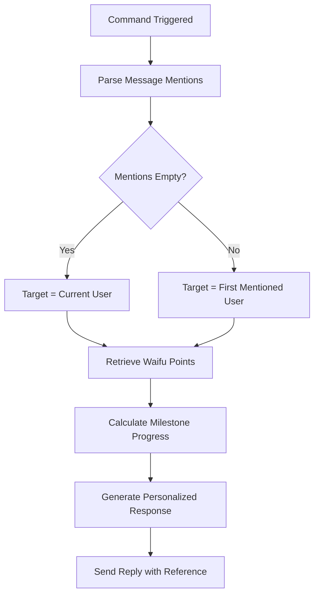
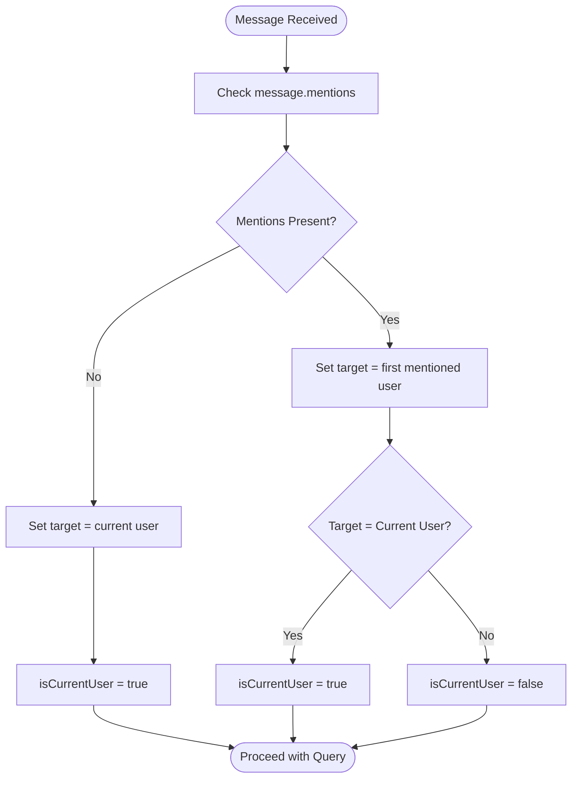
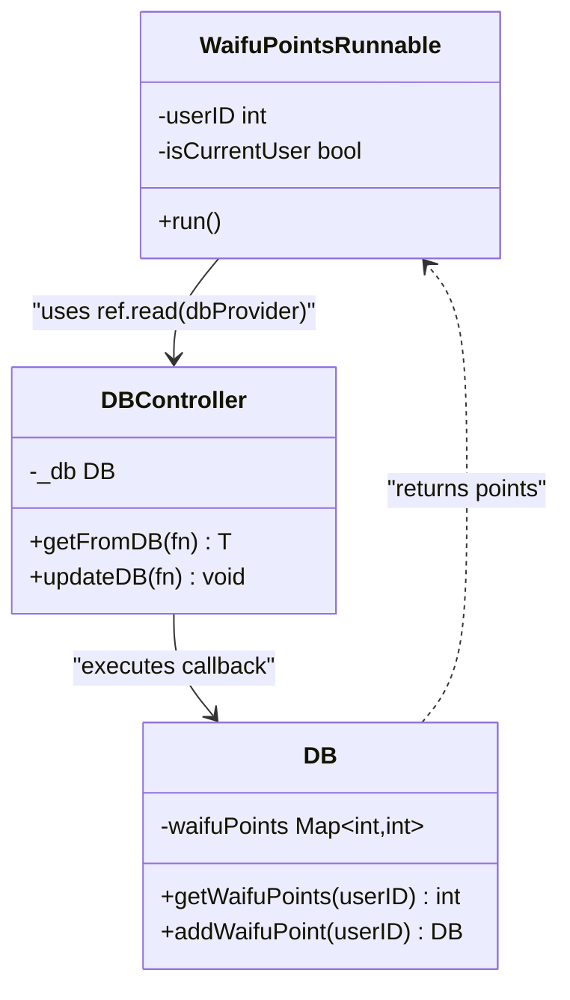
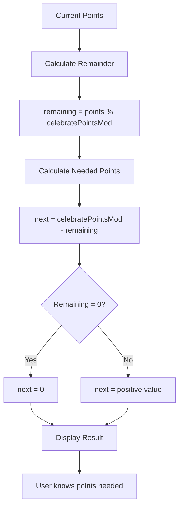
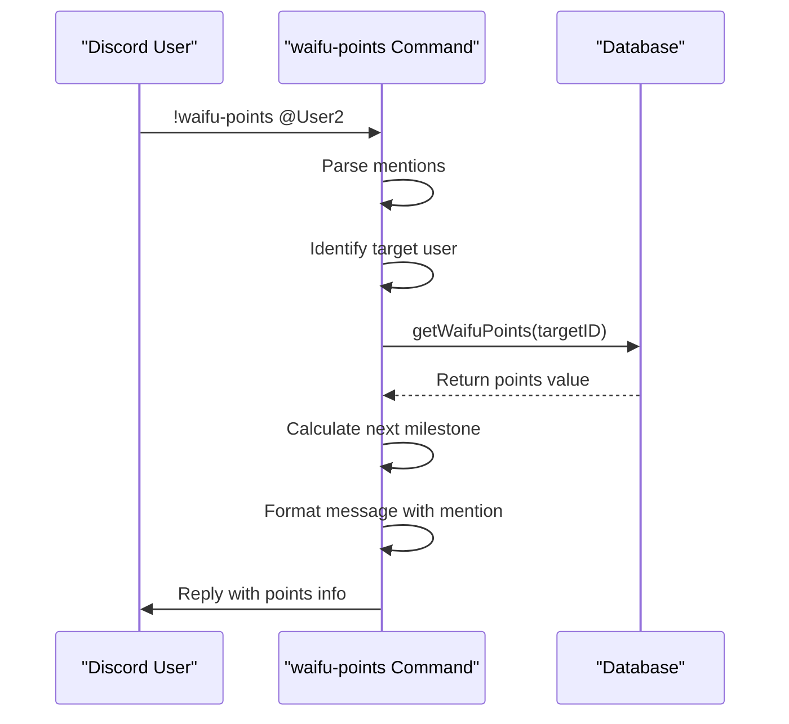

# waifu-points Command

<cite>
**Referenced Files in This Document**   
- [waifu_points.dart](file://src/runnables/waifu_points.dart)
- [waifu_celebrate.dart](file://src/waifu_celebrate.dart)
- [db.dart](file://src/db.dart)
- [commands.dart](file://src/commands.dart)
</cite>

## Table of Contents
1. [Introduction](#introduction)
2. [Command Implementation](#command-implementation)
3. [User Identification Logic](#user-identification-logic)
4. [Waifu Point Retrieval](#waifu-point-retrieval)
5. [Celebration Milestone Calculation](#celebration-milestone-calculation)
6. [Response Personalization](#response-personalization)
7. [Integration with Waifu Celebration System](#integration-with-waifu-celebration-system)
8. [Edge Case Handling](#edge-case-handling)
9. [Conclusion](#conclusion)

## Introduction
The `!waifu-points` command in the Discord bot allows users to check waifu point balances, either for themselves or for other users via mentions. This document details the implementation of the command through the `WaifuPointsRunnable` class, explaining how it retrieves data from an in-memory database, calculates progress toward celebration milestones, and generates personalized responses. The command integrates with the waifu celebration system to provide context about reward thresholds and supports both self-queries and cross-user inquiries through Discord mention parsing.

**Section sources**
- [waifu_points.dart](file://src/runnables/waifu_points.dart#L1-L45)
- [commands.dart](file://src/commands.dart#L55-L59)

## Command Implementation
The `!waifu-points` command is implemented as a `Command` constant in the commands registry, associated with the `WaifuPointsRunnable` class. This runnable processes the command execution by extracting user mentions from the message, determining the target user for the query, and retrieving the corresponding waifu points from the database. The command supports both direct invocation and alias usage (`!wp`), providing flexibility in user interaction. The implementation follows a clean separation of concerns, with the runnable focusing on business logic while relying on dependency injection for database access and configuration.



**Diagram sources**
- [waifu_points.dart](file://src/runnables/waifu_points.dart#L10-L45)
- [commands.dart](file://src/commands.dart#L55-L59)

**Section sources**
- [waifu_points.dart](file://src/runnables/waifu_points.dart#L10-L45)
- [commands.dart](file://src/commands.dart#L55-L59)

## User Identification Logic
The command determines the target user for the waifu point query by analyzing message mentions. When no mentions are present, it defaults to the current user who invoked the command. When mentions are present, it targets the first mentioned user and determines whether this represents a self-query or a cross-user inquiry by comparing the member ID with the mentioned user ID. This logic ensures appropriate response personalization, distinguishing between "You have" and "[User] has" phrasing based on the query context.



**Diagram sources**
- [waifu_points.dart](file://src/runnables/waifu_points.dart#L15-L25)

**Section sources**
- [waifu_points.dart](file://src/runnables/waifu_points.dart#L15-L25)

## Waifu Point Retrieval
The command retrieves waifu point balances through the `dbProvider` dependency, which provides access to the in-memory database controller. The `getFromDB` method executes a callback function that calls `getWaifuPoints(userID)` to retrieve the point balance for the specified user ID. If no record exists for the user, the database returns a default value of zero, effectively handling new users without requiring explicit initialization. This retrieval mechanism is thread-safe and integrates with the Riverpod state management system for proper dependency injection.



**Diagram sources**
- [waifu_points.dart](file://src/runnables/waifu_points.dart#L27-L28)
- [db.dart](file://src/db.dart#L42-L45)
- [db.dart](file://src/db.dart#L20-L21)

**Section sources**
- [waifu_points.dart](file://src/runnables/waifu_points.dart#L27-L28)
- [db.dart](file://src/db.dart#L42-L45)

## Celebration Milestone Calculation
The command calculates progress toward the next celebration milestone using the `celebratePointsMod` constant from the `WaifuCelebrate` class, which is set to 10 points. It determines the remaining points needed for the next reward by calculating the modulo of the current points with the celebration modulus, then subtracting this remainder from the modulus value. This calculation provides users with actionable information about how many more points they need to earn to receive a celebration reward, creating a gamified experience.



**Diagram sources**
- [waifu_points.dart](file://src/runnables/waifu_points.dart#L29-L31)
- [waifu_celebrate.dart](file://src/waifu_celebrate.dart#L10)

**Section sources**
- [waifu_points.dart](file://src/runnables/waifu_points.dart#L29-L31)

## Response Personalization
The command generates personalized responses based on whether the query is for the current user or another user. For self-queries, it uses first-person phrasing ("You have"), while for cross-user queries, it uses third-person phrasing that includes the requester's mention. The response includes the current point balance and the number of additional points needed to reach the next celebration milestone. The message is sent as a reply to the original command invocation, maintaining conversation context in Discord.



**Diagram sources**
- [waifu_points.dart](file://src/runnables/waifu_points.dart#L32-L36)
- [waifu_points.dart](file://src/runnables/waifu_points.dart#L37-L42)

**Section sources**
- [waifu_points.dart](file://src/runnables/waifu_points.dart#L32-L42)

## Integration with Waifu Celebration System
The `!waifu-points` command integrates with the waifu celebration system by referencing the `celebratePointsMod` static constant from the `WaifuCelebrate` class. This shared configuration ensures consistency between point accumulation and reward thresholds across the bot's functionality. When users reach multiples of the celebration modulus (10 points), the celebration system automatically triggers reward distribution through the `celebrate` method, which is invoked from the waifu command when points are awarded. This creates a cohesive ecosystem where point checking and reward distribution are synchronized.

```mermaid
graph TB
subgraph "Point Accumulation"
A[Waifu Command] --> |Add point| B[Update Database]
B --> C{Point % 10 = 0?}
C --> |Yes| D[WaifuCelebrate.celebrate()]
C --> |No| E[No Celebration]
end
subgraph "Point Inquiry"
F[waifu-points Command] --> G[Read Points]
G --> H[Calculate Progress]
H --> I[Display to User]
end
J[celebratePointsMod=10] --> C
J --> H
```

**Diagram sources**
- [waifu_points.dart](file://src/runnables/waifu_points.dart#L29)
- [waifu_celebrate.dart](file://src/waifu_celebrate.dart#L10)
- [waifu_command.dart](file://src/commands/waifu_command.dart#L105)

**Section sources**
- [waifu_points.dart](file://src/runnables/waifu_points.dart#L29)
- [waifu_celebrate.dart](file://src/waifu_celebrate.dart#L10)

## Edge Case Handling
The command implementation includes robust handling of edge cases. Invalid mentions are effectively ignored beyond the first mention, preventing errors from malformed input. Zero-point balances are handled naturally through the database's default return value of zero for non-existent user records, allowing the command to work seamlessly for new users. The modulo calculation properly handles the case when a user has exactly reached a milestone (remainder = 0), correctly reporting that zero additional points are needed for the next reward. The response formatting safely incorporates user mentions using Discord's ID-based mention syntax.

**Section sources**
- [waifu_points.dart](file://src/runnables/waifu_points.dart#L20-L25)
- [db.dart](file://src/db.dart#L42-L45)
- [waifu_points.dart](file://src/runnables/waifu_points.dart#L29-L31)

## Conclusion
The `!waifu-points` command provides a user-friendly interface for checking waifu point balances within the Discord bot ecosystem. Its implementation demonstrates clean separation of concerns, leveraging dependency injection for database access and shared configuration with the celebration system. The command effectively handles both self-queries and cross-user inquiries through mention parsing, provides meaningful feedback about reward progress, and integrates seamlessly with the broader waifu point economy. The use of Riverpod for state management and proper error handling for edge cases results in a robust and maintainable feature.