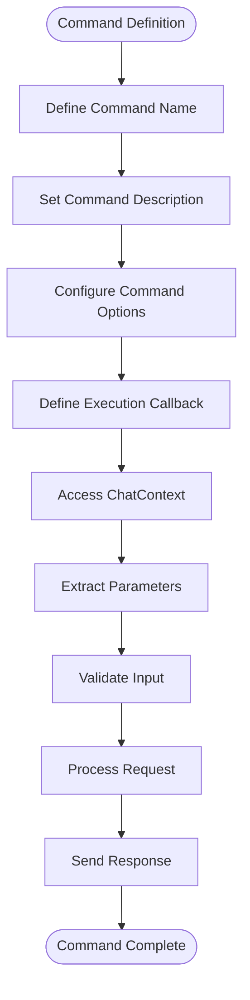

# Slash Commands

<cite>
**Referenced Files in This Document**  
- [src/commands/commands.dart](file://src/commands/commands.dart)
- [src/commands/ask_command.dart](file://src/commands/ask_command.dart)
- [src/commands/waifu_command.dart](file://src/commands/waifu_command.dart)
- [src/runnables/ask.dart](file://src/runnables/ask.dart)
- [src/utils/discord_response_utils.dart](file://src/utils/discord_response_utils.dart)
- [src/bot.dart](file://src/bot.dart)
- [src/db.dart](file://src/db.dart)
</cite>

## Table of Contents
1. [Introduction](#introduction)
2. [Command Registration and Initialization](#command-registration-and-initialization)
3. [Slash Command Structure](#slash-command-structure)
4. [Command Implementation Details](#command-implementation-details)
5. [Interaction Response System](#interaction-response-system)
6. [Input Validation and Error Handling](#input-validation-and-error-handling)
7. [Execution Flow Comparison](#execution-flow-comparison)
8. [Extending the Bot with New Slash Commands](#extending-the-bot-with-new-slash-commands)
9. [Conclusion](#conclusion)

## Introduction

This document provides comprehensive documentation for the slash command implementation in the Discord bot. It details how the `/waifu` and `/ask` commands are registered and executed using the Nyxx CommandsPlugin and SlashCommands class. The documentation covers the structure of command definitions, interaction handling, input validation, and the relationship between command declarations and their runnable implementations. This guide serves as a reference for understanding the current command system and extending it with additional functionality.

## Command Registration and Initialization

The slash command system is initialized through the `SlashCommands` class, which manages the lifecycle of all available slash commands. The registration process begins in the `bot.dart` file where the `CommandsPlugin` is configured with both prefix and slash command capabilities.

**Diagram sources**  
- [src/commands/commands.dart](file://src/commands/commands.dart#L1-L55)
- [src/bot.dart](file://src/bot.dart#L1-L53)

**Section sources**  
- [src/commands/commands.dart](file://src/commands/commands.dart#L1-L55)
- [src/bot.dart](file://src/bot.dart#L1-L53)

The `SlashCommands` class collects all command instances (currently `AskCommand` and `WaifuCommand`) and initializes them during startup. Each command's `initialize` method returns a `ChatCommand` object that is then added to the `CommandsPlugin`. This initialization process includes checking command availability, setting up dependencies through Riverpod, and configuring command options.

## Slash Command Structure

Slash commands are defined using the Nyxx framework's `ChatCommand` class, which provides the structure for Discord's slash command interface. Each command follows a consistent pattern of declaration that includes name, description, options, and execution logic.

**Diagram sources**  
- [src/commands/ask_command.dart](file://src/commands/ask_command.dart#L1-L71)
- [src/commands/waifu_command.dart](file://src/commands/waifu_command.dart#L1-L166)

**Section sources**  
- [src/commands/ask_command.dart](file://src/commands/ask_command.dart#L1-L71)
- [src/commands/waifu_command.dart](file://src/commands/waifu_command.dart#L1-L166)

The `SlashCommandBuilder` pattern is implemented through the `ChatCommand` constructor, which accepts:
- Command name and description for user interface display
- Command options specifying the command type (all channels, guild only, etc.)
- An execution callback that receives the `ChatContext` and any defined parameters

For the `/ask` command, parameters are defined using Dart's named parameter syntax with the `@Description` annotation to provide help text for users. The `/waifu` command demonstrates more complex interaction patterns by using `context.getSelection()` to present users with interactive selection menus for content type (SFW/NSFW) and category selection.

## Command Implementation Details

The implementation of slash commands follows a separation of concerns pattern, where command declarations are separated from their execution logic. This is achieved through the `SlashRunnable` abstract class, which defines the contract for all slash commands.

### Ask Command Implementation

The `/ask` command implementation demonstrates the integration between the command declaration in `ask_command.dart` and its corresponding runnable logic. While the command definition handles Discord interaction, the actual AI processing logic is encapsulated in utility classes.

**Diagram sources**  
- [src/commands/ask_command.dart](file://src/commands/ask_command.dart#L1-L71)
- [src/utils/discord_response_utils.dart](file://src/utils/discord_response_utils.dart#L1-L225)

**Section sources**  
- [src/commands/ask_command.dart](file://src/commands/ask_command.dart#L1-L71)
- [src/utils/discord_response_utils.dart](file://src/utils/discord_response_utils.dart#L1-L225)

### Waifu Command Implementation

The `/waifu` command demonstrates a more complex interaction flow that includes multiple user interactions and database operations. It retrieves waifu tags from an external API during initialization and stores user preferences in the local database.

**Diagram sources**  
- [src/commands/waifu_command.dart](file://src/commands/waifu_command.dart#L1-L166)
- [src/db.dart](file://src/db.dart#L1-L132)

**Section sources**  
- [src/commands/waifu_command.dart](file://src/commands/waifu_command.dart#L1-L166)
- [src/db.dart](file://src/db.dart#L1-L132)

## Interaction Response System

The bot uses Discord's interaction response system to handle user commands with appropriate timing and feedback. Unlike traditional message-based responses, slash commands require specific response patterns to maintain a good user experience.

The system employs immediate responses for quick feedback, followed by message editing for longer-running operations. When a command is triggered, the bot immediately responds with a message (e.g., "Generating a response...") and then edits this message once the operation completes. This approach prevents timeout issues that occur when Discord expects a response within 3 seconds.

For the `/waifu` command, the bot uses `context.respond()` to send an initial "Generating a waifu image" message, then uses `message.edit()` to update this message with the final image result. This two-step process ensures the user receives immediate feedback while the bot processes the request in the background.

The bot also uses `channel.manager.triggerTyping(channel.id)` to simulate typing indicators during longer operations, providing visual feedback that the bot is processing the request.

## Input Validation and Error Handling

Input validation is a critical component of the slash command system, ensuring that user inputs meet requirements before processing begins. The validation process occurs in multiple stages:

1. **Rate Limiting**: The `MsgQueue` system tracks command usage to prevent abuse
2. **Input Validation**: Prompts are checked for length and content requirements
3. **Error Response**: Invalid inputs receive appropriate error messages

**Diagram sources**  
- [src/utils/discord_response_utils.dart](file://src/utils/discord_response_utils.dart#L1-L225)
- [src/commands/ask_command.dart](file://src/commands/ask_command.dart#L1-L71)

**Section sources**  
- [src/utils/discord_response_utils.dart](file://src/utils/discord_response_utils.dart#L1-L225)

The `AICommandUtils.validateAICommand()` method orchestrates the validation process, first checking rate limits using the `MsgQueue` and then validating the prompt content. Error messages are constructed using standardized embed builders that provide clear feedback with appropriate icons and colors.

## Execution Flow Comparison

The execution flow for slash commands differs significantly from prefix commands in several key aspects:

### Permission Handling

Slash commands benefit from Discord's built-in permission system, where permissions can be configured at the application level. The bot checks command availability during initialization, disabling commands when required resources are unavailable (e.g., when waifu tags cannot be fetched).

Prefix commands, on the other hand, require manual permission checks within the execution logic. The `AIRunnable` class demonstrates this pattern by checking configuration availability before processing the request.

### Response Timing

Slash commands have strict timing requirements, with Discord expecting an initial response within 3 seconds. The bot addresses this by sending immediate responses and using message editing for final results.

Prefix commands have more flexible timing, allowing the bot to process requests and send responses in a single operation. However, this can lead to poor user experience if processing takes longer than expected.

### User Experience

Slash commands provide a superior user experience through Discord's native interface, with autocomplete, parameter validation, and structured input. The `/ask` command's parameter is automatically validated by Discord's interface, reducing the need for manual validation.

Prefix commands require users to format their input correctly, increasing the likelihood of errors. The bot must parse and validate the entire command string, which is more error-prone than structured slash command parameters.

## Extending the Bot with New Slash Commands

To extend the bot with additional slash commands, follow these steps:

1. **Create a new command class** that extends `SlashRunnable`
2. **Implement the required properties** (`name`, `description`, `enabled`)
3. **Override the `initialize` method** to return a `ChatCommand` instance
4. **Add the command to the `SlashCommands` initialization list**
5. **Implement any required dependencies** through Riverpod providers

When designing new commands, consider the following best practices:
- Use descriptive names and clear descriptions
- Implement appropriate rate limiting for external API calls
- Provide helpful error messages for invalid inputs
- Use Discord's interactive components (selection menus, buttons) for complex inputs
- Separate command logic from execution logic using the Runnable pattern
- Leverage existing utility classes for common operations

New commands should follow the same pattern of immediate response followed by message editing for longer operations, ensuring a consistent user experience across all bot functionality.

## Conclusion

The slash command implementation in this Discord bot demonstrates a well-structured approach to handling user interactions. By leveraging the Nyxx framework's CommandsPlugin and implementing a clear separation between command declarations and execution logic, the bot provides a robust and extensible command system. The use of Riverpod for dependency injection, standardized error handling, and thoughtful user experience design results in a reliable and maintainable bot architecture. This documentation provides a foundation for understanding the current implementation and extending it with additional functionality.