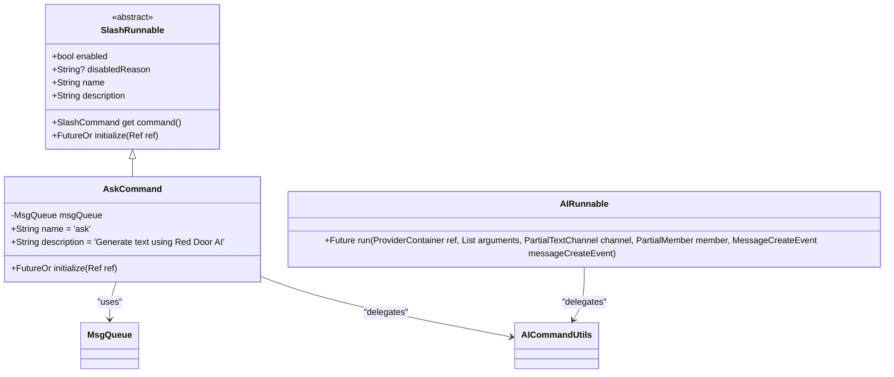
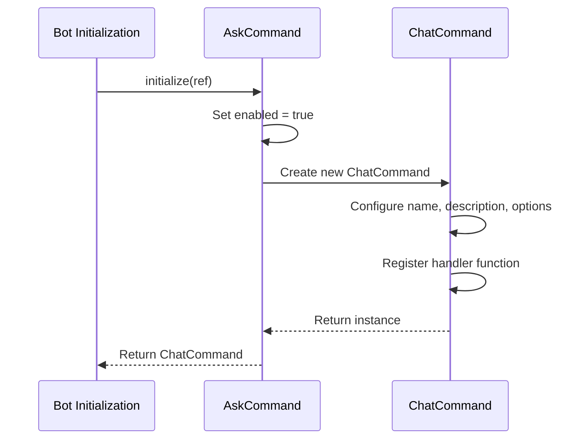
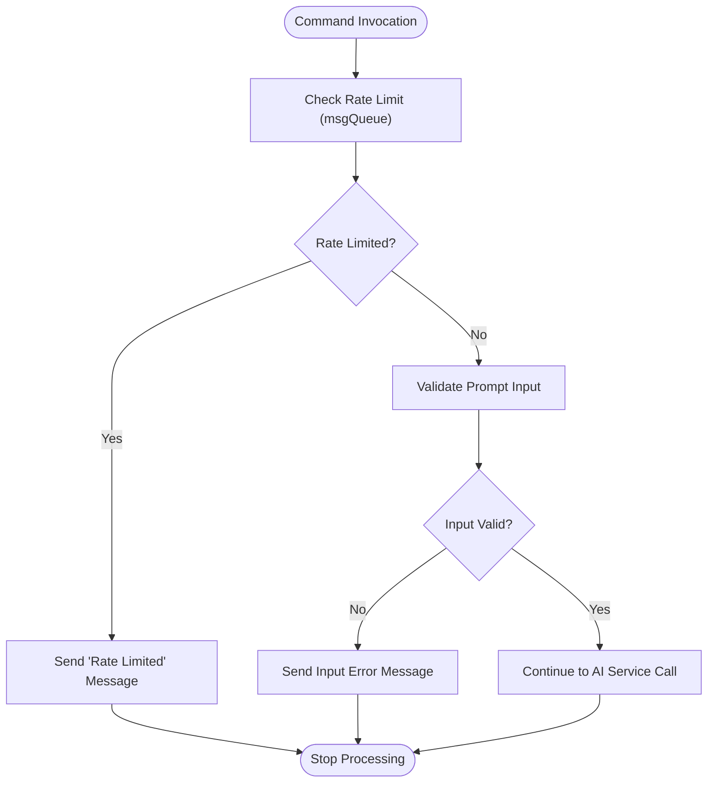
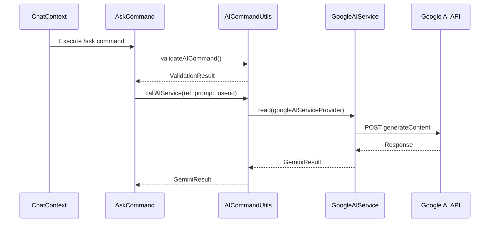
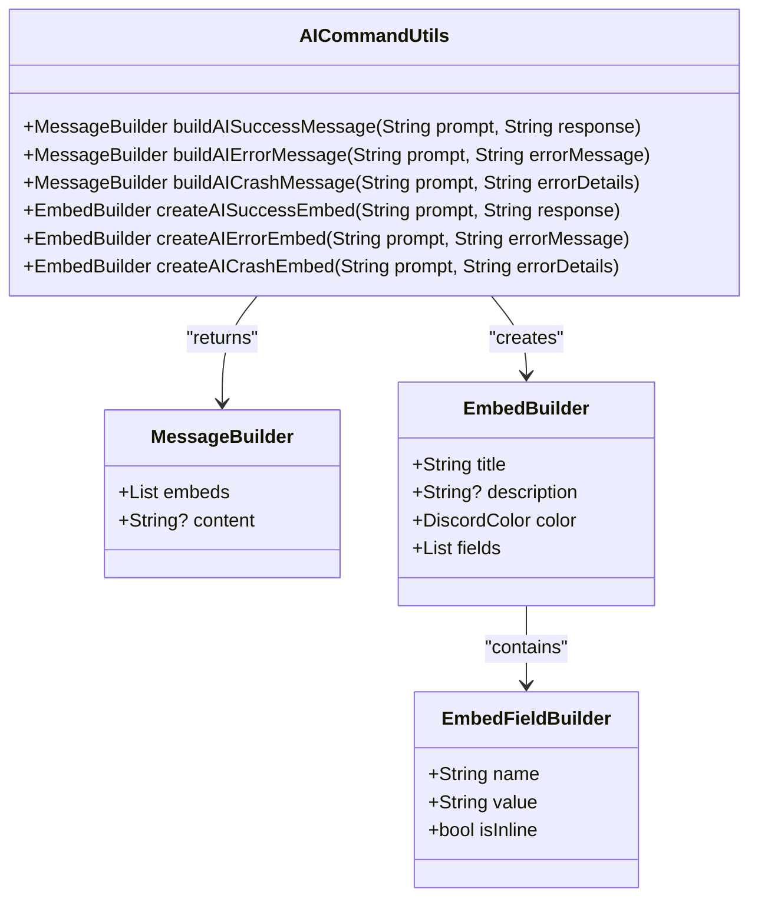
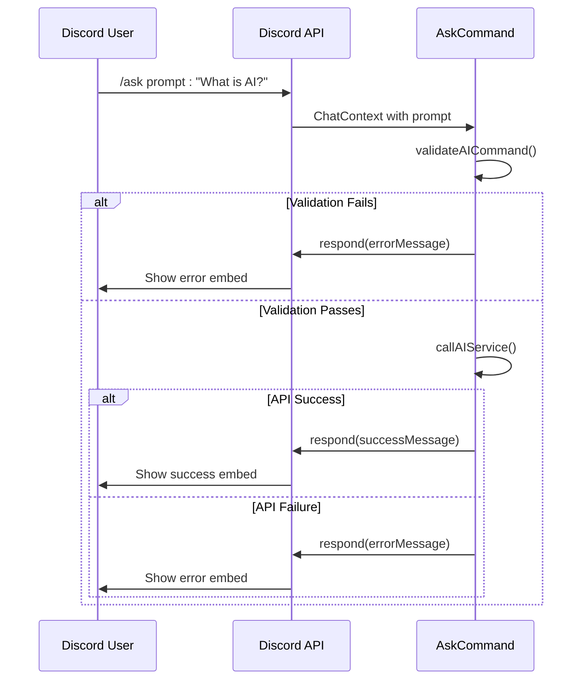
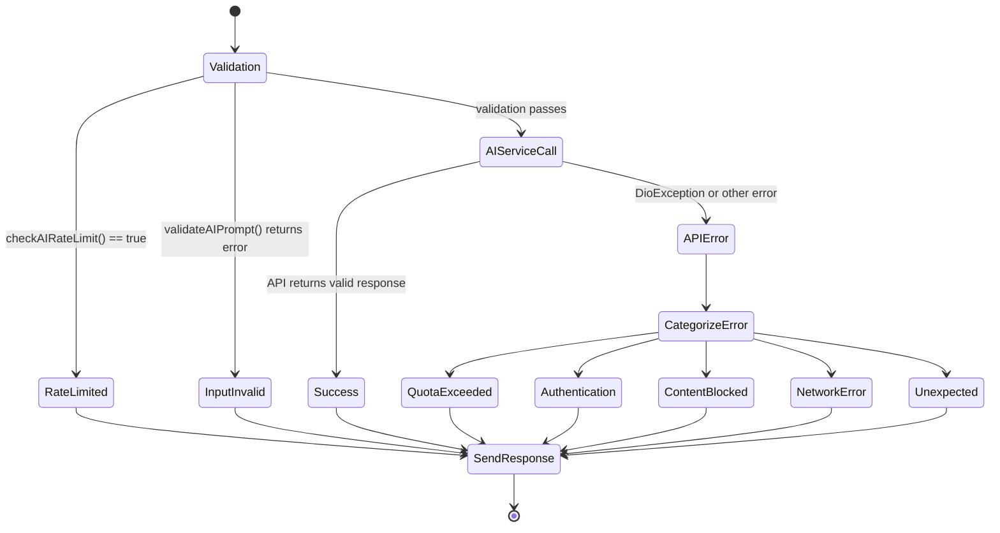

# /ask Command

<cite>
**Referenced Files in This Document**   
- [ask_command.dart](file://src/commands/ask_command.dart)
- [ask.dart](file://src/runnables/ask.dart)
- [discord_response_utils.dart](file://src/utils/discord_response_utils.dart)
- [google_ai_service.dart](file://src/google_ai_service.dart)
- [config_runnable.dart](file://src/runnables/config_runnable.dart)
- [cron.dart](file://src/cron.dart)
</cite>

## Table of Contents
1. [Introduction](#introduction)
2. [Command Architecture](#command-architecture)
3. [Initialization and Registration](#initialization-and-registration)
4. [Argument Handling and Validation](#argument-handling-and-validation)
5. [AI Service Integration](#ai-service-integration)
6. [Response Construction](#response-construction)
7. [Interaction Patterns](#interaction-patterns)
8. [Error Handling](#error-handling)
9. [Performance Considerations](#performance-considerations)
10. [Conclusion](#conclusion)

## Introduction

The `/ask` command in the Discord bot provides users with an interface to generate text using Google's AI service through a slash command interface. This documentation details the implementation architecture, focusing on the `AskCommand` class that extends `SlashRunnable` and its integration with various utility components for validation, AI service calls, and response generation. The command follows a structured flow from initialization to response delivery, incorporating rate limiting, input validation, and error handling mechanisms to ensure reliable operation.

**Section sources**
- [ask_command.dart](file://src/commands/ask_command.dart#L1-L71)
- [ask.dart](file://src/runnables/ask.dart#L1-L65)

## Command Architecture

The `/ask` command is implemented as the `AskCommand` class, which extends the `SlashRunnable` abstract class. This inheritance establishes the command's role within the bot's command system, providing the necessary interface for slash command registration and execution. The architecture separates concerns between command definition (`AskCommand`) and underlying functionality (`AIRunnable` in `ask.dart`), allowing for both slash command and message-based invocation of similar AI generation capabilities.

The `AskCommand` class maintains a dependency on `MsgQueue` for rate limiting purposes, instantiated during construction. This design follows dependency injection principles, making the rate limiting mechanism configurable and testable. The relationship between `AskCommand` and `AIRunnable` demonstrates a pattern of code reuse, where core AI interaction logic is shared between different command interfaces.

**Diagram sources**
- [ask_command.dart](file://src/commands/ask_command.dart#L1-L71)
- [ask.dart](file://src/runnables/ask.dart#L1-L65)
- [commands.dart](file://src/commands/commands.dart#L44-L54)

**Section sources**
- [ask_command.dart](file://src/commands/ask_command.dart#L1-L71)
- [ask.dart](file://src/runnables/ask.dart#L1-L65)

## Initialization and Registration

The `/ask` command is registered through the `initialize` method of the `AskCommand` class, which returns a `ChatCommand` instance. This method is called during the bot's startup process, establishing the command's presence in the Discord interface. The `enabled` flag is set to `true`, activating the command for use.

The `ChatCommand` constructor configures the command with its name, description, and options. The command handler is defined as an anonymous function that takes a `ChatContext` and a `prompt` parameter. The `@Description` annotation is used to provide user-facing guidance for the prompt parameter, which appears in the Discord UI when users interact with the command.

**Diagram sources**
- [ask_command.dart](file://src/commands/ask_command.dart#L15-L71)

**Section sources**
- [ask_command.dart](file://src/commands/ask_command.dart#L15-L71)

## Argument Handling and Validation

The `/ask` command accepts a single required argument: `prompt`, which captures the user's input for AI generation. This parameter is annotated with `@Description('Your prompt for AI generation')` to provide contextual help in the Discord UI.

Validation is performed through the `AICommandUtils.validateAICommand` utility method, which handles both rate limiting and input sanitization. The validation flow first checks rate limits using the `msgQueue` instance, preventing users from making excessive requests within a 10-minute window. If rate limited, an appropriate error message is sent and processing stops.

Input validation ensures the prompt is not empty and does not exceed 4000 characters. The validation process returns an `AICommandValidationResult` object that indicates whether processing should continue and includes an error message if validation fails. This structured approach separates validation logic from command execution, promoting code reuse across different AI commands.

**Diagram sources**
- [ask_command.dart](file://src/commands/ask_command.dart#L25-L35)
- [discord_response_utils.dart](file://src/utils/discord_response_utils.dart#L167-L187)

**Section sources**
- [ask_command.dart](file://src/commands/ask_command.dart#L25-L35)
- [discord_response_utils.dart](file://src/utils/discord_response_utils.dart#L167-L187)

## AI Service Integration

The `/ask` command integrates with Google's AI service through the `AICommandUtils.callAIService` method, which acts as an abstraction layer between the command and the underlying `GoogleAIService`. This method accepts either a Riverpod `Ref` or `ProviderContainer`, enabling dependency injection from different contexts (slash commands use `Ref`, while message-based commands use `ProviderContainer`).

The `GoogleAIService` class handles the actual HTTP communication with Google's Generative Language API. It constructs a request body that includes the user's prompt, contextual information from the environment configuration (`aiPersona`), and safety settings that control content filtering. The service uses the `dio` HTTP client with an API key from the environment configuration for authentication.

**Diagram sources**
- [ask_command.dart](file://src/commands/ask_command.dart#L45-L50)
- [discord_response_utils.dart](file://src/utils/discord_response_utils.dart#L189-L205)
- [google_ai_service.dart](file://src/google_ai_service.dart#L120-L165)

**Section sources**
- [ask_command.dart](file://src/commands/ask_command.dart#L45-L50)
- [discord_response_utils.dart](file://src/utils/discord_response_utils.dart#L189-L205)
- [google_ai_service.dart](file://src/google_ai_service.dart#L120-L165)

## Response Construction

Successful responses are constructed using `AICommandUtils.buildAISuccessMessage`, which creates a rich embed containing the user's original prompt and the AI-generated response. The embed uses predefined styling constants for consistent appearance across the bot's responses. For long prompts or responses, content is truncated to fit Discord's embed limitations (1024 characters for fields, 4096 for descriptions).

Error responses are handled through specialized utility methods that categorize different types of failures. Network errors, quota limits, authentication issues, and content filtering are mapped to appropriate user-friendly messages with distinct visual indicators (colors and icons). This categorization helps users understand the nature of the failure without exposing technical details.

The response construction process is decoupled from the command execution, allowing the same response formatting logic to be reused across different command types. This ensures a consistent user experience regardless of how the AI functionality is invoked.

**Diagram sources**
- [discord_response_utils.dart](file://src/utils/discord_response_utils.dart#L207-L224)

**Section sources**
- [discord_response_utils.dart](file://src/utils/discord_response_utils.dart#L207-L224)

## Interaction Patterns

The `/ask` command follows Discord's interaction response patterns, using immediate responses for errors and processing feedback. When validation fails, the command sends an immediate response using `context.respond()` with an appropriate error message. For successful requests, the same method is used to deliver the AI-generated content.

The command does not use deferred responses (acknowledgment followed by edit) for successful completions, opting instead for direct responses. However, the underlying architecture in `config_runnable.dart` demonstrates the use of timers for handling extended user interactions, suggesting a pattern that could be adopted for long-running AI requests if needed.

The response pattern includes proper message referencing, ensuring replies are visually connected to the original command invocation. This maintains context in busy channels and improves user experience by clearly associating responses with their triggers.

**Diagram sources**
- [ask_command.dart](file://src/commands/ask_command.dart#L37-L65)
- [config_runnable.dart](file://src/runnables/config_runnable.dart#L25-L45)

**Section sources**
- [ask_command.dart](file://src/commands/ask_command.dart#L37-L65)
- [config_runnable.dart](file://src/runnables/config_runnable.dart#L25-L45)

## Error Handling

The `/ask` command implements comprehensive error handling at multiple levels. The validation phase catches rate limiting and input issues before any external service calls are made. The AI service integration wraps the HTTP request in a try-catch block, converting exceptions into structured `GeminiResult` objects with appropriate error messages.

Error responses are categorized and formatted differently based on the error type. Quota exceeded, authentication issues, content filtering, network problems, and unexpected errors each have distinct visual treatments to help users understand the problem. The error handling also includes detailed logging for debugging purposes, with relevant information printed to the console.

The `GeminiResult` class serves as a wrapper for API responses, standardizing success and failure cases. This pattern prevents unhandled exceptions from crashing the command and ensures users always receive a meaningful response, even when the AI service fails.

**Diagram sources**
- [discord_response_utils.dart](file://src/utils/discord_response_utils.dart#L189-L205)
- [google_ai_service.dart](file://src/google_ai_service.dart#L145-L165)

**Section sources**
- [discord_response_utils.dart](file://src/utils/discord_response_utils.dart#L189-L205)
- [google_ai_service.dart](file://src/google_ai_service.dart#L145-L165)

## Performance Considerations

The `/ask` command incorporates several performance considerations to ensure responsive operation and efficient resource usage. The 10-minute rate limiting window prevents abuse and protects both the bot's resources and the Google AI service quota. Input validation limits prompt length to 4000 characters, preventing excessively large requests that could impact performance.

The command relies on external API calls to Google's AI service, making network latency a primary performance factor. While the current implementation does not include explicit timeout handling for the API call, the underlying `dio` client likely has default timeout settings. The lack of deferred responses means users must wait for the complete AI generation before receiving a response, which could lead to interaction timeouts for slow responses.

The architecture separates the command interface from the AI service integration, allowing for potential optimizations such as response caching or queuing for high-load scenarios. The use of Riverpod for dependency injection enables efficient service instantiation and lifecycle management.

**Section sources**
- [ask_command.dart](file://src/commands/ask_command.dart#L25-L35)
- [discord_response_utils.dart](file://src/utils/discord_response_utils.dart#L167-L187)
- [google_ai_service.dart](file://src/google_ai_service.dart#L120-L165)

## Conclusion

The `/ask` command demonstrates a well-structured implementation of a Discord slash command with AI integration. By extending the `SlashRunnable` base class and leveraging utility components for validation and response generation, the command maintains clean separation of concerns while providing robust functionality. The integration with Google's AI service through a dedicated service class enables reliable text generation with proper error handling and user feedback.

The architecture supports both immediate feedback for errors and successful responses, with comprehensive validation to prevent invalid requests. Future enhancements could include support for deferred responses to handle longer processing times, response caching to reduce API calls for repeated prompts, and more sophisticated rate limiting based on user tiers or server-wide quotas.

The command's design allows for easy extension and modification, with clear separation between the command interface, business logic, and external service integration. This modular approach facilitates maintenance and enables the addition of new AI-powered features with minimal code duplication.