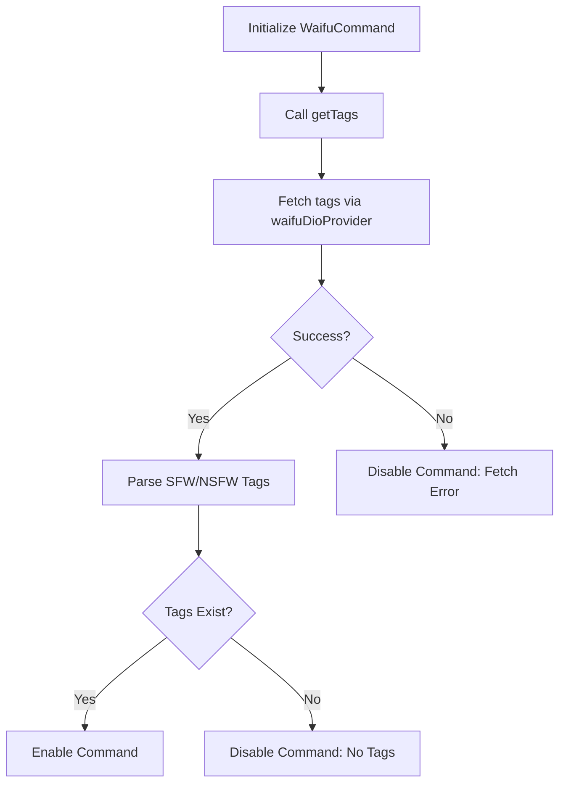
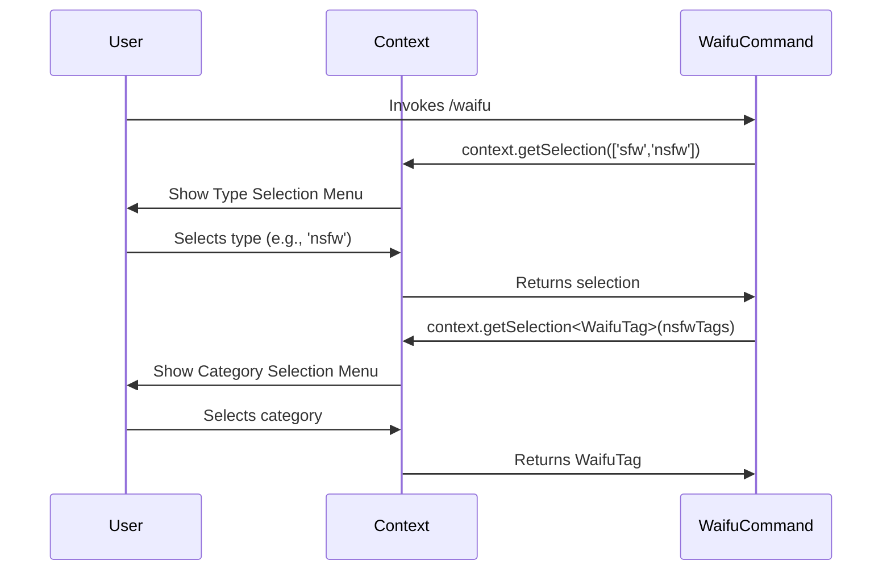
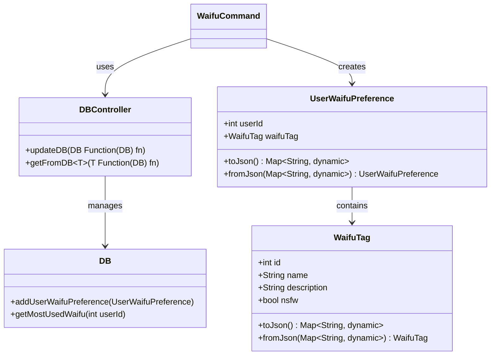
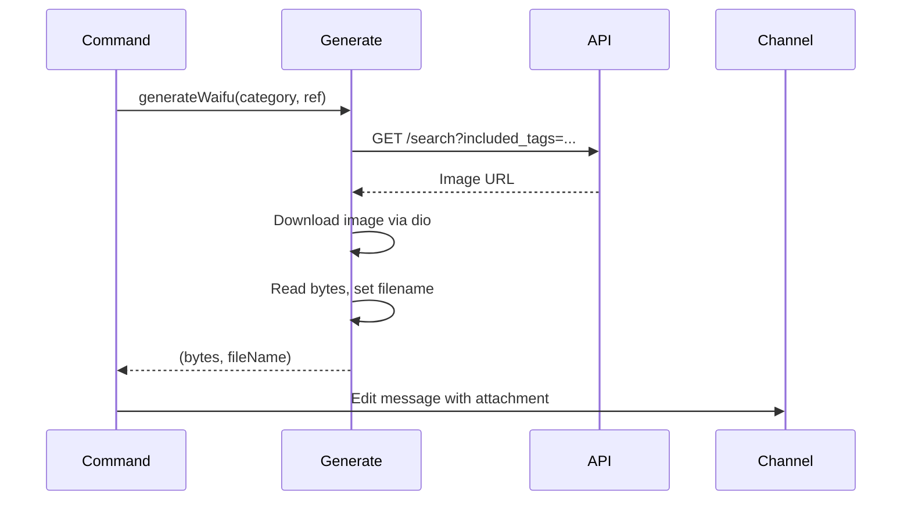
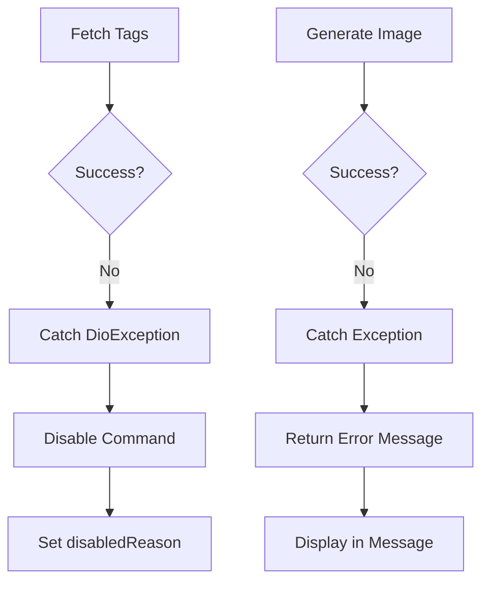

# /waifu Command

<cite>
**Referenced Files in This Document**   
- [waifu_command.dart](file://src/commands/waifu_command.dart)
- [generate_waifu.dart](file://src/generate_waifu.dart)
- [db.dart](file://src/db.dart)
- [msg_queue.dart](file://src/msg_queue.dart)
- [user_waifu_preference.dart](file://src/user_waifu_preference.dart)
- [waifu_celebrate.dart](file://src/waifu_celebrate.dart)
- [dio.dart](file://src/dio.dart)
</cite>

## Table of Contents
1. [Introduction](#introduction)
2. [Command Initialization and Tag Fetching](#command-initialization-and-tag-fetching)
3. [Interactive Selection Flow](#interactive-selection-flow)
4. [User Preference Persistence](#user-preference-persistence)
5. [Image Generation and Delivery](#image-generation-and-delivery)
6. [Waifu Point Tracking System](#waifu-point-tracking-system)
7. [Rate Limiting Mechanism](#rate-limiting-mechanism)
8. [Error Handling and Command States](#error-handling-and-command-states)
9. [User Experience Considerations](#user-experience-considerations)
10. [Execution Flow Overview](#execution-flow-overview)

## Introduction
The `/waifu` command in the Discord bot provides users with a dynamic and interactive way to retrieve waifu images from an external API. It features a multi-step selection process, persistent user preferences, point tracking, celebration mechanics, and anti-spam rate limiting. This document details the full implementation and integration of these systems, focusing on how components interact to deliver a seamless user experience.

## Command Initialization and Tag Fetching

The `WaifuCommand` class initializes by fetching SFW and NSFW tags from an external API via the `waifuDioProvider`. During initialization in the `initialize` method, it calls `getTags`, which uses the `waifuDioProvider` to make a GET request to the `tags?full=true` endpoint. The response contains two arrays: `versatile` (SFW) and `nsfw` (NSFW), which are parsed into `List<WaifuTag>` objects using the `WaifuTag.fromJson` factory constructor.

If either tag list is empty, the command disables itself by setting `enabled = false` and assigning a `disabledReason`. This ensures the command only remains active when valid data is available. Any `DioException` during the fetch also disables the command with an appropriate error message.



**Diagram sources**
- [waifu_command.dart](file://src/commands/waifu_command.dart#L47-L75)

**Section sources**
- [waifu_command.dart](file://src/commands/waifu_command.dart#L47-L75)

## Interactive Selection Flow

After initialization, the command uses `context.getSelection` to present users with interactive dropdown menus. The first selection prompts the user to choose between "sfw" and "nsfw" image types using a simple string-based menu. Based on this choice, the second selection dynamically populates a dropdown with relevant `WaifuTag` options.

The `toSelectMenuOption` parameter maps each `WaifuTag` to a `SelectMenuOptionBuilder`, using the tag's name as the label and truncating its description to 90 characters for display. This creates a user-friendly interface for category selection. Both selections are restricted to the original user (`authorOnly: true`) and time out after one minute to prevent stale interactions.



**Diagram sources**
- [waifu_command.dart](file://src/commands/waifu_command.dart#L95-L118)

**Section sources**
- [waifu_command.dart](file://src/commands/waifu_command.dart#L95-L118)

## User Preference Persistence

User selections are persisted using the `DBController` and `UserWaifuPreference` model. After the user selects a category, the command calls `dbController.updateDB` with a function that adds a new `UserWaifuPreference` entry. This model contains the `userId` and selected `WaifuTag`, allowing the system to track user behavior over time.

The `UserWaifuPreference` class supports serialization via `toJson` and `fromJson`, enabling persistence in the JSON-based database. This data is later used by the celebration system to determine the most frequently used category for a user.



**Diagram sources**
- [user_waifu_preference.dart](file://src/user_waifu_preference.dart#L1-L25)
- [db.dart](file://src/db.dart#L1-L132)
- [waifu_command.dart](file://src/commands/waifu_command.dart#L119-L120)

**Section sources**
- [user_waifu_preference.dart](file://src/user_waifu_preference.dart#L1-L25)
- [db.dart](file://src/db.dart#L1-L132)
- [waifu_command.dart](file://src/commands/waifu_command.dart#L119-L120)

## Image Generation and Delivery

The selected `WaifuTag` is passed to the `generateWaifu` function, which constructs a query to the external API using the tag name, minimum height, and NSFW status. The function uses `waifuDio` to fetch image metadata and `dio` to download the actual image file.

Once downloaded, the image is read into memory, optionally prefixed with "SPOILER_" if NSFW, and returned as a byte array and filename. The command then edits the initial "Generating..." message to include the image as an attachment, along with a contextual message that includes an NSFW warning when applicable.



**Diagram sources**
- [generate_waifu.dart](file://src/generate_waifu.dart#L1-L55)
- [waifu_command.dart](file://src/commands/waifu_command.dart#L123-L135)

**Section sources**
- [generate_waifu.dart](file://src/generate_waifu.dart#L1-L55)

## Waifu Point Tracking System

Each invocation of the `/waifu` command increments the user's waifu point count via `dbController.updateDB((db) => db.addWaifuPoint(member))`. The `DB` class maintains a `Map<int, int>` for `waifuPoints`, incrementing the count for the user's ID.

When the point total reaches a multiple of 10, the `waifuCelebrateProvider` triggers a celebration. The `WaifuCelebrate` service retrieves the user's most-used waifu category using `getMostUsedWaifu`, generates a reward image, and posts it in a dedicated celebration channel, which is created automatically if it doesn't exist.

```mermaid
flowchart TD
A[/waifu invoked] --> B[Increment User Points]
B --> C{Points % 10 == 0?}
C --> |Yes| D[Get Most Used Category]
D --> E[Generate Reward Image]
E --> F[Post in Celebration Channel]
C --> |No| G[Normal Flow]
```

**Diagram sources**
- [db.dart](file://src/db.dart#L1-L132)
- [waifu_celebrate.dart](file://src/waifu_celebrate.dart#L1-L71)
- [waifu_command.dart](file://src/commands/waifu_command.dart#L80-L83)

**Section sources**
- [db.dart](file://src/db.dart#L1-L132)
- [waifu_celebrate.dart](file://src/waifu_celebrate.dart#L1-L71)

## Rate Limiting Mechanism

To prevent spamming, the command uses the `MsgQueue` class to track user requests over a rolling 10-minute window. Each invocation calls `msgQueue.addMessage(member)`, which increments a counter for the user ID.

If a user exceeds 10 requests within 10 minutes, `addMessage` returns `true`, triggering a warning message: "You have requested too many waifu images in the last 10 minutes." A `Timer.periodic` task automatically clears the queue every 10 minutes, ensuring the counter resets appropriately.

```mermaid
flowchart LR
A[User Requests Image] --> B[MsgQueue.addMessage(userId)]
B --> C{Count > 10?}
C --> |Yes| D[Send Rate Limit Warning]
C --> |No| E[Proceed Normally]
F[Every 10 Minutes] --> G[MsgQueue.clear()]
```

**Diagram sources**
- [msg_queue.dart](file://src/msg_queue.dart#L1-L39)
- [waifu_command.dart](file://src/commands/waifu_command.dart#L84-L90)

**Section sources**
- [msg_queue.dart](file://src/msg_queue.dart#L1-L39)

## Error Handling and Command States

The system implements robust error handling at multiple levels. During tag fetching, `DioException` is caught and results in command disablement with a descriptive reason. During image generation, both `DioException` and general `Exception` are caught, returning a left `Either` value with an error message.

The command respects its enabled state: if disabled due to missing tags or API errors, it returns `null` during initialization, preventing registration. The `listen_to_message.dart` file ensures disabled commands show appropriate messages when invoked via text prefix.



**Section sources**
- [waifu_command.dart](file://src/commands/waifu_command.dart#L62-L75)
- [generate_waifu.dart](file://src/generate_waifu.dart#L35-L50)
- [listen_to_message.dart](file://src/listen_to_message.dart#L100-L110)

## User Experience Considerations

The command enhances UX through several features:
- **Typing Indicators**: `channel.manager.triggerTyping(channel.id)` simulates typing to provide immediate feedback during image generation.
- **NSFW Warnings**: Messages include "**WARNING: NSFW**" when applicable, and filenames are prefixed with "SPOILER_" to hide content.
- **Interactive Menus**: Select menus guide users through choices with clear labels and descriptions.
- **Immediate Feedback**: Points are incremented instantly, and celebrations are automated for milestone achievements.
- **Graceful Degradation**: Disabled commands show clear reasons, and rate limiting provides constructive feedback.

These elements combine to create an engaging, responsive, and user-friendly experience.

**Section sources**
- [waifu_command.dart](file://src/commands/waifu_command.dart#L121-L135)

## Execution Flow Overview

The complete flow from command invocation to image delivery involves multiple integrated systems:
1. Command initialization fetches and validates tags.
2. User selects image type (SFW/NSFW).
3. User selects category from dynamically populated menu.
4. User's preference is saved to the database.
5. Waifu points are incremented.
6. Rate limiting checks prevent spam.
7. Typing indicator provides feedback.
8. Image is fetched and processed.
9. Final message is delivered with attachment and context.

This end-to-end process demonstrates a well-architected command with clear separation of concerns and robust integration between components.

```mermaid
flowchart TD
A[/waifu] --> B[Fetch Tags]
B --> C{Valid?}
C --> |No| D[Disable Command]
C --> |Yes| E[User Selects Type]
E --> F[User Selects Category]
F --> G[Save Preference]
G --> H[Increment Points]
H --> I[Check Rate Limit]
I --> |Exceeded| J[Show Warning]
I --> |OK| K[Trigger Typing]
K --> L[Generate Image]
L --> M{Success?}
M --> |Yes| N[Send Image]
M --> |No| O[Send Error]
H --> P{Points % 10 == 0?}
P --> |Yes| Q[Send Celebration]
```

**Diagram sources**
- [waifu_command.dart](file://src/commands/waifu_command.dart#L77-L135)
- [generate_waifu.dart](file://src/generate_waifu.dart#L1-L55)