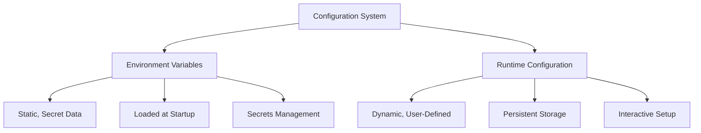
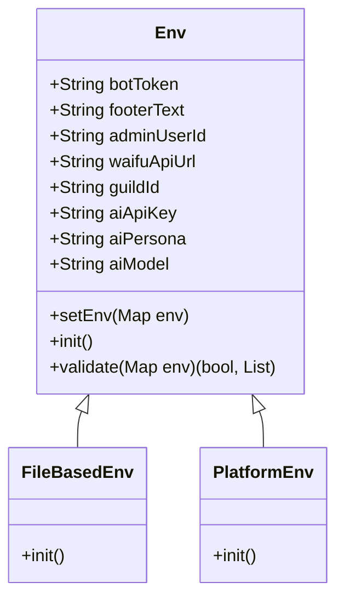
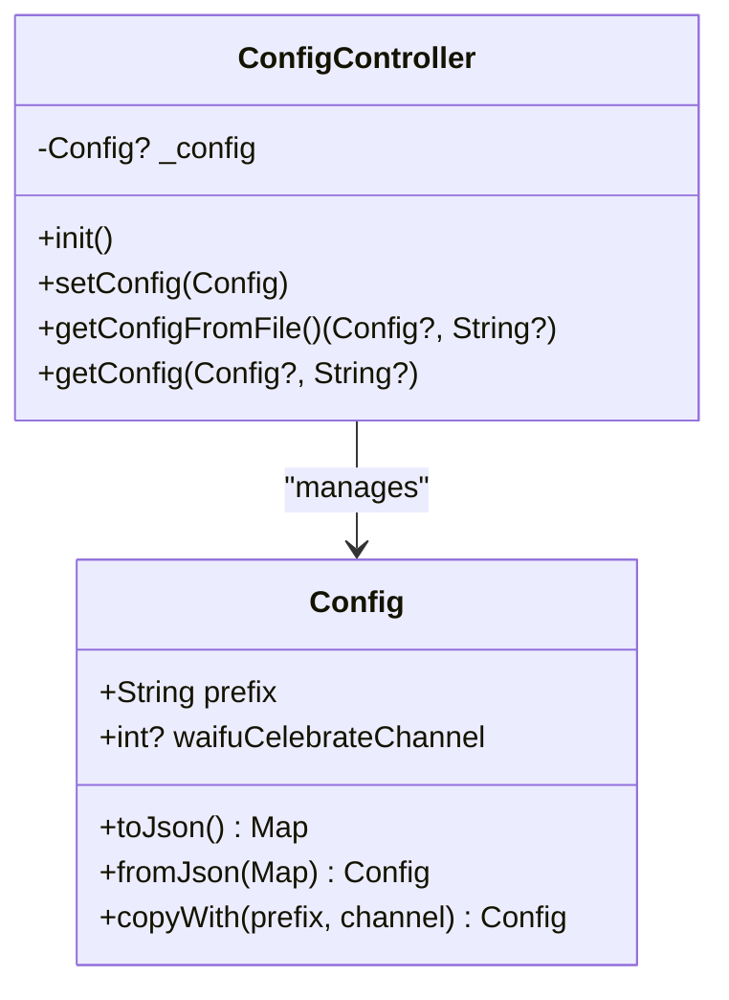
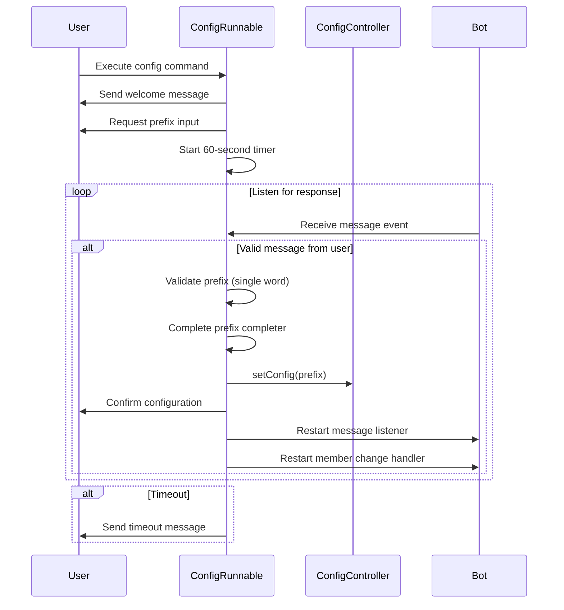

# Configuration Management

<cite>
**Referenced Files in This Document**   
- [env.dart](file://src/env.dart)
- [config.dart](file://src/config.dart)
- [config_runnable.dart](file://src/runnables/config_runnable.dart)
- [config.json](file://config.json)
</cite>

## Table of Contents
1. [Introduction](#introduction)
2. [Two-Tier Configuration System](#two-tier-configuration-system)
3. [Environment Variables (Static Configuration)](#environment-variables-static-configuration)
4. [Runtime Configuration (Dynamic Configuration)](#runtime-configuration-dynamic-configuration)
5. [Interactive Configuration Flow](#interactive-configuration-flow)
6. [Security Considerations](#security-considerations)
7. [Conclusion](#conclusion)

## Introduction
The Discord bot implements a two-tier configuration system that separates static, secret environment variables from dynamic runtime configuration. This design provides flexibility across different deployment scenarios while maintaining security for sensitive credentials. The system consists of environment variables loaded via the Env interface for static configuration and runtime settings stored in config.json for dynamic configuration. This document details the architecture, implementation, and usage patterns of this configuration system.

## Two-Tier Configuration System
The bot employs a dual-layer configuration approach that distinguishes between environment variables and runtime configuration. This separation ensures that sensitive credentials remain secure while allowing users to customize bot behavior through interactive commands. The system is designed to support multiple deployment scenarios, from local development to production environments, while providing a seamless setup experience for users.

**Diagram sources**
- [env.dart](file://src/env.dart#L1-L100)
- [config.dart](file://src/config.dart#L1-L80)

**Section sources**
- [env.dart](file://src/env.dart#L1-L100)
- [config.dart](file://src/config.dart#L1-L80)

## Environment Variables (Static Configuration)
The environment configuration layer handles static, secret data that should not be exposed or modified during runtime. This includes API keys, tokens, and other sensitive credentials required for the bot's operation.

### Env Abstract Class and Implementations
The `Env` abstract class defines the interface for environment configuration with concrete implementations for different deployment scenarios. The class declares late variables for all required environment keys and provides a validation mechanism to ensure all necessary variables are present.

**Diagram sources**
- [env.dart](file://src/env.dart#L30-L100)

**Section sources**
- [env.dart](file://src/env.dart#L30-L100)

### Deployment-Specific Implementations
The system provides two implementations of the Env interface to accommodate different deployment environments:

- **FileBasedEnv**: Reads environment variables from a `.env` file, suitable for development and testing environments
- **PlatformEnv**: Uses the platform's environment variables, appropriate for production deployments in containerized or cloud environments

The default implementation in the codebase uses `PlatformEnv`, indicating a production-oriented deployment strategy.

### Validation Process
The configuration system includes a comprehensive validation process that checks for the presence of all required environment keys before initialization. The validation occurs in the `validate` method, which iterates through the predefined `envKeys` map and verifies that each required key exists in the environment. If any required keys are missing, the method returns a tuple containing `false` and a list of error messages, preventing the application from starting with incomplete configuration.

**Section sources**
- [env.dart](file://src/env.dart#L70-L75)

## Runtime Configuration (Dynamic Configuration)
The runtime configuration layer manages dynamic settings that can be modified by users during the bot's operation. This configuration is stored in `config.json` and includes user-defined settings such as command prefixes and channel configurations.

### Config Class Structure
The `Config` class encapsulates the runtime configuration with the following properties:

- **prefix**: The command prefix that triggers bot commands (required)
- **waifuCelebrateChannel**: The channel ID where celebration messages are sent (optional)

The class implements standard serialization patterns with `toJson()` and `fromJson()` methods for persistence, and a `copyWith()` method for immutable updates.

**Diagram sources**
- [config.dart](file://src/config.dart#L1-L80)

**Section sources**
- [config.dart](file://src/config.dart#L1-L80)

### Persistence Mechanism
Runtime configuration is persisted to `config.json` through the `ConfigController` class. The controller implements a singleton pattern with lazy loading, ensuring the configuration is only read from disk when needed. The `setConfig` method writes the configuration to `config.json` using the `encodeJson` utility function, while `getConfigFromFile` handles reading and parsing the configuration file. If the file doesn't exist, the method returns an error message prompting the user to run the configuration command.

**Section sources**
- [config.dart](file://src/config.dart#L50-L77)

## Interactive Configuration Flow
The bot provides an interactive configuration experience through the `config` command, which guides users through the setup process with real-time feedback and validation.

### Command Execution Flow
When a user invokes the `config` command, the `ConfigRunnable` class initiates a step-by-step configuration process:

1. Display welcome message and instructions
2. Prompt user for command prefix input
3. Implement timeout protection (60 seconds)
4. Validate input (single word, non-empty)
5. Confirm settings and update configuration
6. Restart dependent services

**Diagram sources**
- [config_runnable.dart](file://src/runnables/config_runnable.dart#L1-L136)

**Section sources**
- [config_runnable.dart](file://src/runnables/config_runnable.dart#L1-L136)

### Timer-Based Input Collection
The configuration flow uses Dart's `Timer` class to implement timeout protection, ensuring the process doesn't hang indefinitely if a user doesn't respond. The `_timerForEachInteraction` variable tracks the current timer, which is canceled when a valid response is received or when the process completes. The system also supports cancellation through a dedicated cancel command, providing users with control over the configuration process.

### Configuration Updates and Service Restart
After successfully collecting and validating the prefix, the system updates the configuration by calling `setConfig` on the `ConfigController`. This triggers the persistence of the new configuration to `config.json`. The process concludes by restarting the message listener and member change services to ensure they operate with the updated configuration, maintaining consistency across the application.

## Security Considerations
The configuration system implements several security measures to protect sensitive data:

- **Environment Variable Protection**: Sensitive credentials are stored as environment variables rather than in code or configuration files, reducing the risk of accidental exposure
- **Validation of Required Keys**: The system validates the presence of all required environment variables at startup, preventing operation with incomplete or potentially insecure configuration
- **Separation of Concerns**: By separating static secrets from dynamic configuration, the system minimizes the attack surface and ensures that user-modifiable settings cannot compromise security credentials
- **File-Based Environment Loading**: The `FileBasedEnv` implementation allows for secure management of development credentials without hardcoding them in source control

**Section sources**
- [env.dart](file://src/env.dart#L1-L100)

## Conclusion
The two-tier configuration system in the Discord bot effectively separates static, secret environment variables from dynamic, user-defined runtime settings. This architecture provides flexibility across deployment scenarios while maintaining security for sensitive credentials. The interactive configuration flow simplifies setup for users, while the validation and persistence mechanisms ensure reliable operation. The clear separation between environment variables and runtime configuration represents a robust approach to configuration management in bot applications.