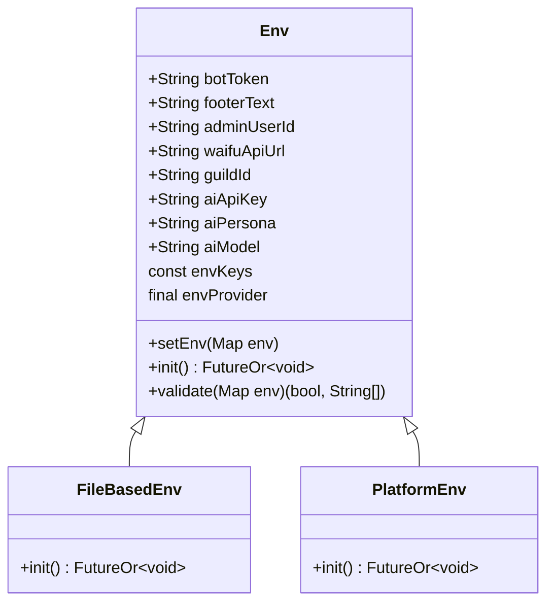
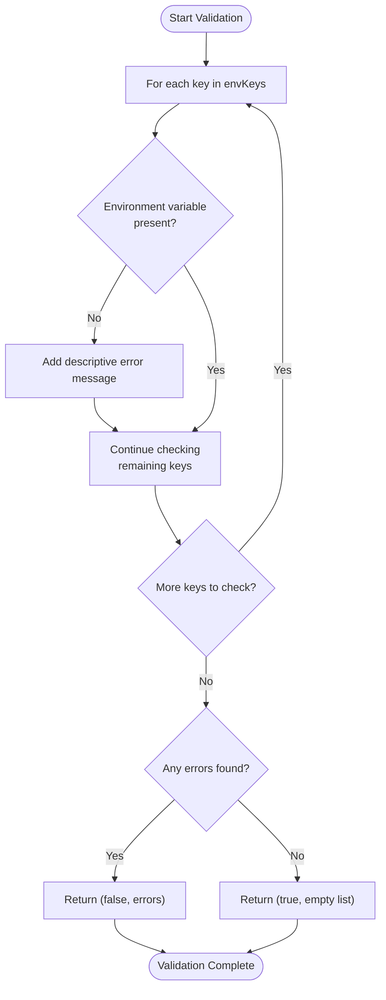
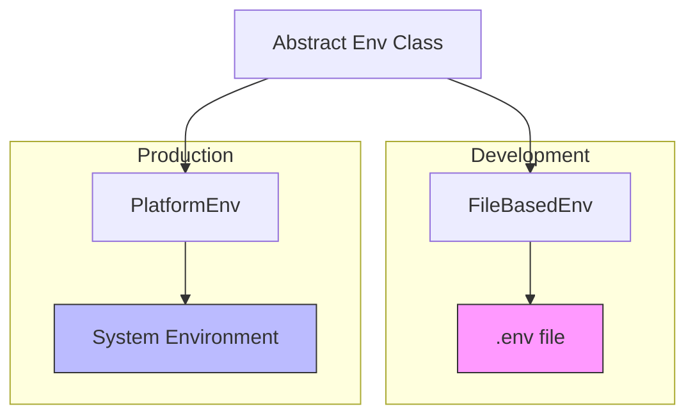
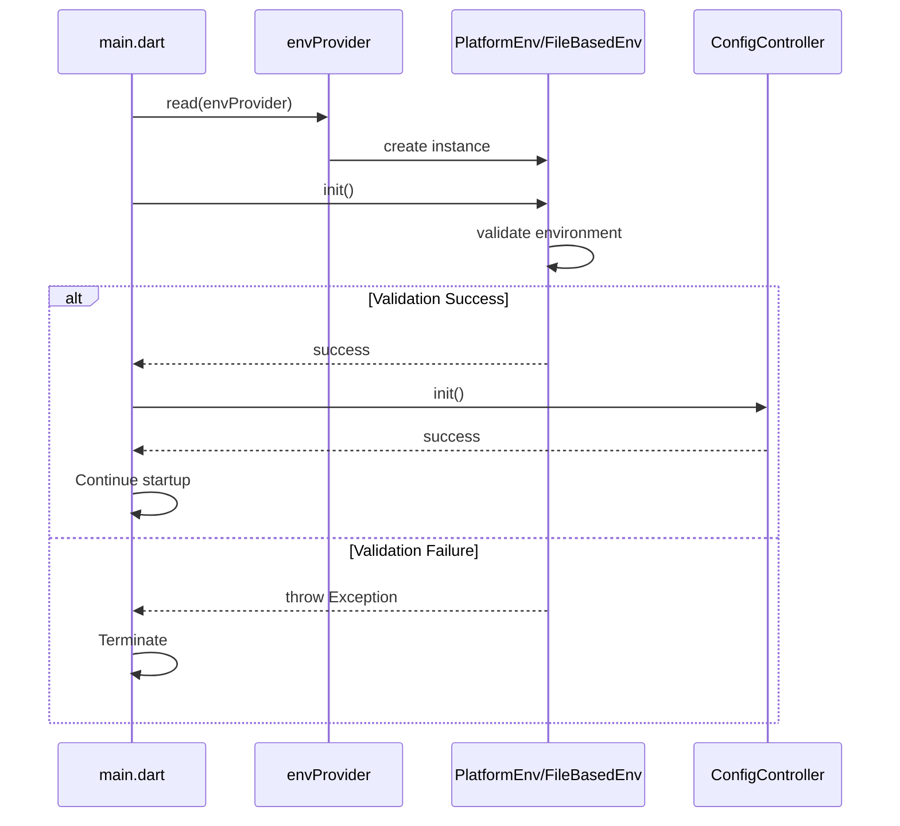

# Environment Configuration

<cite>
**Referenced Files in This Document**   
- [src/env.dart](file://src/env.dart)
- [src/config.dart](file://src/config.dart)
- [bin/main.dart](file://bin/main.dart)
- [create_secrets.sh](file://create_secrets.sh)
</cite>

## Table of Contents
1. [Introduction](#introduction)
2. [Core Components](#core-components)
3. [Environment Variable Contract](#environment-variable-contract)
4. [Validation Process](#validation-process)
5. [Implementation Strategies](#implementation-strategies)
6. [Dependency Injection with Riverpod](#dependency-injection-with-riverpod)
7. [Initialization Flow](#initialization-flow)
8. [Security Best Practices](#security-best-practices)
9. [Conclusion](#conclusion)

## Introduction

The environment configuration system in the discord_bot project provides a robust mechanism for managing environment variables across different deployment environments. This system ensures that critical configuration values are properly loaded, validated, and made available to the application components through a dependency injection framework. The design supports both local development and production deployments through interchangeable implementations that adhere to a common contract.

**Section sources**
- [src/env.dart](file://src/env.dart#L1-L100)

## Core Components

The environment configuration system consists of several key components that work together to provide a flexible and secure way to manage configuration data. At the heart of this system is an abstract `Env` class that defines the contract for environment variable management, along with two concrete implementations for different deployment scenarios. The system integrates with Riverpod for dependency injection, allowing components to access configuration values without tight coupling to the underlying implementation.

**Diagram sources**
- [src/env.dart](file://src/env.dart#L15-L100)

**Section sources**
- [src/env.dart](file://src/env.dart#L15-L100)

## Environment Variable Contract

The `Env` abstract class defines a comprehensive contract for environment variable management, specifying all required configuration keys that must be present for the application to function correctly. This contract ensures consistency across different deployment environments by standardizing the names and purposes of critical configuration values. The class exposes properties for essential configuration items including authentication tokens, API endpoints, and operational parameters.

The contract is enforced through a centralized `envKeys` constant that maps logical configuration names to their corresponding environment variable names and metadata. This mapping provides a single source of truth for all environment variables used in the application, making it easier to maintain and extend the configuration system over time.

**Section sources**
- [src/env.dart](file://src/env.dart#L15-L45)

## Validation Process

The environment configuration system includes a robust validation process that checks for the presence of all required environment variables before the application starts. The `validate` method iterates through the defined `envKeys` and verifies that each corresponding environment variable is present in the provided environment map. When validation fails, the system collects descriptive error messages for all missing variables, providing clear feedback about configuration issues.

This validation occurs during the initialization phase of both environment implementations, ensuring that the application fails fast if critical configuration is missing. The validation process returns a tuple containing a boolean indicating overall validity and a list of error messages, allowing for comprehensive error reporting that helps developers quickly identify and resolve configuration problems.

**Diagram sources**
- [src/env.dart](file://src/env.dart#L47-L60)

**Section sources**
- [src/env.dart](file://src/env.dart#L47-L60)

## Implementation Strategies

The environment configuration system provides two distinct implementations to support different deployment scenarios: `FileBasedEnv` for local development and `PlatformEnv` for production environments.

### File-Based Environment

The `FileBasedEnv` implementation loads configuration from a `.env` file in the project root directory. This approach is ideal for local development, as it allows developers to easily manage environment variables without modifying system settings. The implementation reads the file synchronously, parses each line into key-value pairs, and performs validation before setting the configuration values.

### Platform Environment

The `PlatformEnv` implementation retrieves environment variables from the system's environment using Dart's `Platform.environment`. This approach is suitable for production deployments where environment variables are typically managed by the hosting platform or container orchestration system. By using system environment variables, this implementation enhances security by preventing sensitive credentials from being stored in files.

**Diagram sources**
- [src/env.dart](file://src/env.dart#L62-L98)

**Section sources**
- [src/env.dart](file://src/env.dart#L62-L98)

## Dependency Injection with Riverpod

The environment configuration system integrates with Riverpod, a state management and dependency injection framework for Dart and Flutter applications. The `envProvider` is a Riverpod provider that supplies instances of the `Env` interface to other components in the application. This design enables deployment flexibility by allowing the implementation to be easily switched between development and production configurations.

The current configuration in the codebase uses `PlatformEnv` as the default implementation, but includes a commented alternative for `FileBasedEnv`, making it simple to switch between implementations based on the deployment context. This dependency injection approach ensures that components receive the environment configuration they need without being tightly coupled to a specific implementation, promoting testability and maintainability.

**Section sources**
- [src/env.dart](file://src/env.dart#L7-L13)
- [src/env.dart](file://src/env.dart#L15-L100)

## Initialization Flow

The environment configuration system is initialized during the application startup process in the main function. The initialization flow follows a specific sequence to ensure that all dependencies are properly resolved before the application becomes operational. First, the environment configuration is initialized through the `envProvider`, which triggers the `init` method on the selected implementation. Only after successful environment initialization does the application proceed to initialize other components like the configuration controller.

This sequential initialization ensures that critical configuration values are available to all components that depend on them. The flow is designed to fail fast if environment variables are missing or invalid, preventing the application from starting in a misconfigured state.

**Diagram sources**
- [bin/main.dart](file://bin/main.dart#L15-L25)
- [src/env.dart](file://src/env.dart#L15-L100)

**Section sources**
- [bin/main.dart](file://bin/main.dart#L15-L25)

## Security Best Practices

The environment configuration system incorporates several security best practices to protect sensitive credentials and configuration data. The most critical practice is the separation of configuration from code, ensuring that sensitive information like API keys and authentication tokens are not hardcoded in the source code. This separation is reinforced by the use of `.env` files in development and system environment variables in production.

The project includes a `create_secrets.sh` script that automates the process of transferring environment variables from a `.env` file to Google Secret Manager, providing a secure way to manage secrets in production. This script reads the `.env` file, converts variable names to a secret-friendly format, and creates corresponding secrets in the cloud platform. Developers are advised to add `.env` files to `.gitignore` to prevent accidental exposure of sensitive credentials in version control.

**Section sources**
- [create_secrets.sh](file://create_secrets.sh#L1-L51)
- [src/env.dart](file://src/env.dart#L1-L100)

## Conclusion

The environment configuration system in the discord_bot project provides a well-structured, secure, and flexible approach to managing application configuration. By defining a clear contract through the abstract `Env` class and providing multiple implementations for different deployment scenarios, the system supports both local development and production deployments with minimal configuration changes. The integration with Riverpod enables clean dependency injection, while the comprehensive validation process ensures that the application fails fast when configuration is missing or incorrect. Following security best practices, the system helps protect sensitive credentials and promotes safe deployment patterns.