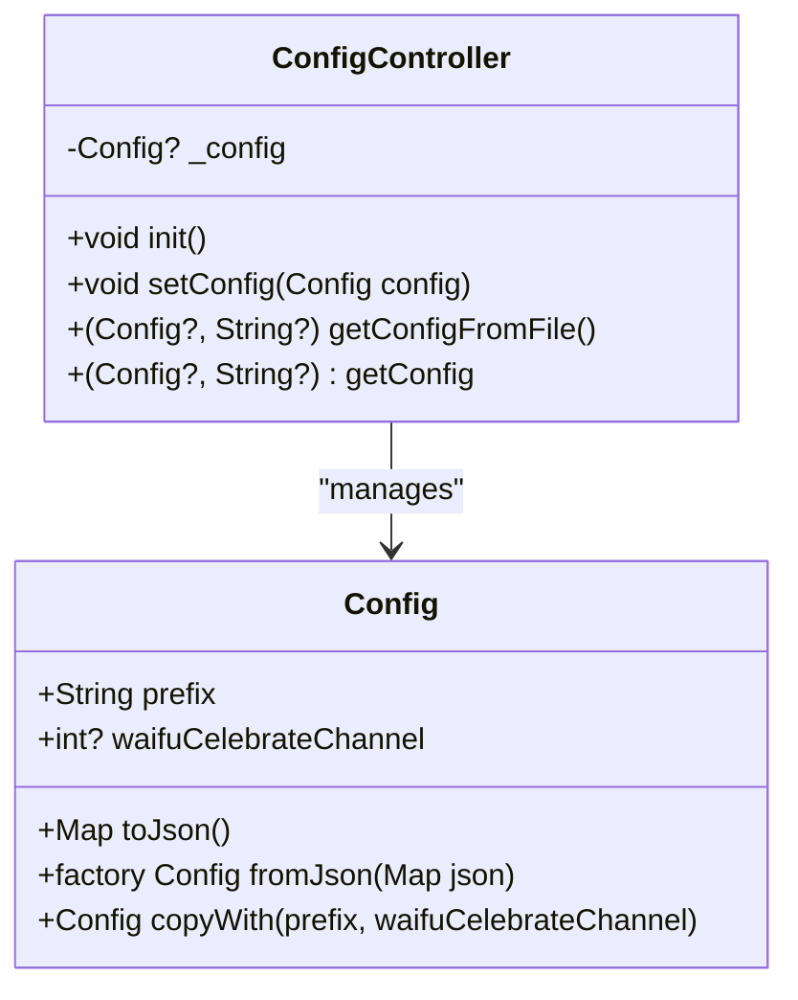
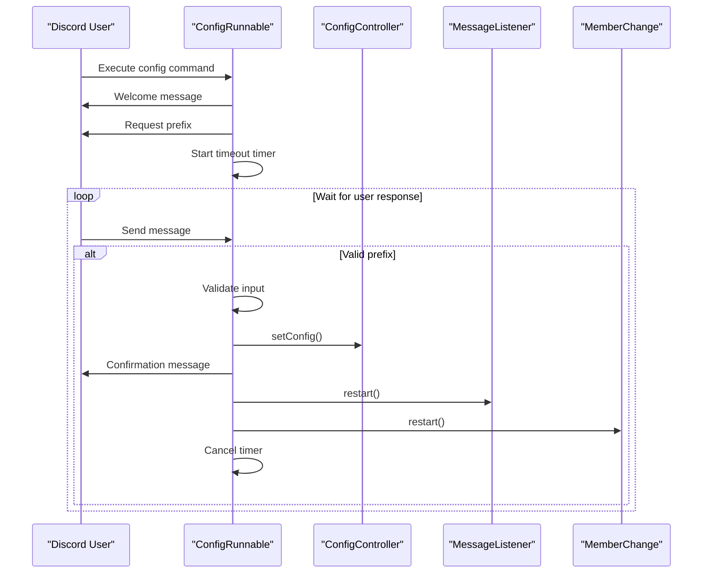
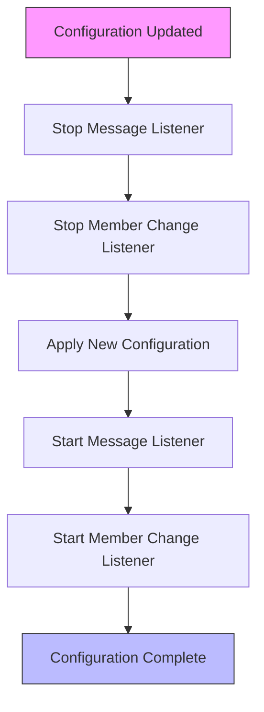

# Runtime Configuration

<cite>
**Referenced Files in This Document**   
- [config.dart](file://src/config.dart)
- [config_runnable.dart](file://src/runnables/config_runnable.dart)
- [bot.dart](file://src/bot.dart)
- [config.json](file://config.json)
- [listen_to_message.dart](file://src/listen_to_message.dart)
- [member_change.dart](file://src/member_change.dart)
- [waifu_celebrate.dart](file://src/waifu_celebrate.dart)
</cite>

## Table of Contents
1. [Introduction](#introduction)
2. [Config Class Structure](#config-class-structure)
3. [ConfigController and Configuration Persistence](#configcontroller-and-configuration-persistence)
4. [Interactive Configuration Flow](#interactive-configuration-flow)
5. [Configuration Lifecycle Management](#configuration-lifecycle-management)
6. [Error Handling and Recovery](#error-handling-and-recovery)
7. [Dependent Services Restart Mechanism](#dependent-services-restart-mechanism)
8. [User Experience Design](#user-experience-design)
9. [Conclusion](#conclusion)

## Introduction
The runtime configuration system in the discord_bot application provides a dynamic way to manage bot settings that can be modified during operation. This system enables users to customize key aspects of the bot's behavior, such as the command prefix and channel configurations, through an interactive setup process. The configuration is persisted to a JSON file, allowing settings to survive application restarts. This document details the architecture and implementation of this configuration system, focusing on the core components that enable flexible and user-friendly bot customization.

## Config Class Structure
The Config class serves as the central data structure for storing the bot's runtime configuration. It encapsulates essential settings that determine the bot's behavior in the Discord environment. The class is designed with immutability in mind, ensuring that configuration changes are handled in a predictable and thread-safe manner.



**Diagram sources**
- [config.dart](file://src/config.dart#L1-L78)

**Section sources**
- [config.dart](file://src/config.dart#L1-L78)

### Core Properties
The Config class contains two primary properties:
- **prefix**: A required string that defines the command prefix for the bot. All bot commands must be prefixed with this string to be recognized.
- **waifuCelebrateChannel**: An optional integer representing the Discord channel ID where waifu celebration messages should be sent.

### Serialization and Deserialization
The Config class implements JSON serialization through the `toJson()` method, which converts the configuration object into a JSON-compatible map. The serialization process uses conditional inclusion to only include the `waifu-celebrate-channel` field when it has a value, maintaining clean JSON output. The companion `fromJson` factory constructor enables deserialization from JSON data, reconstructing a Config object from stored configuration data.

### Immutability Pattern
The class employs an immutability pattern through the `copyWith` method, which creates a new Config instance with updated values while preserving unchanged properties. This approach ensures that configuration changes are atomic and prevents unintended side effects from partial updates.

## ConfigController and Configuration Persistence
The ConfigController class manages the lifecycle of configuration data, handling both persistence to storage and retrieval for application use. It acts as a singleton service through the Riverpod dependency injection framework, ensuring consistent access to configuration data across the application.

### File-Based Persistence
Configuration data is persisted to a JSON file named `config.json` in the application's root directory. The `setConfig` method writes the current configuration to this file using the `encodeJson` utility function, which formats the JSON output in a readable manner. This persistence mechanism allows configuration changes to survive application restarts.

```json
{
  "prefix": "!rd",
  "waifu-celebrate-channel": 1367078744010915890
}
```

**Section sources**
- [config.json](file://config.json#L1-L4)

### Lazy Loading and Caching
The ConfigController implements a lazy loading pattern with in-memory caching. When configuration is requested through the `getConfig` getter, the controller first checks if a configuration object is already cached in memory. If not, it attempts to load the configuration from the `config.json` file. This caching strategy improves performance by avoiding repeated file I/O operations during normal operation.

### Error Handling for Missing Configuration
When the configuration file does not exist, the `getConfigFromFile` method returns a tuple containing null configuration and an error message. This graceful degradation allows the application to continue running while informing users that configuration is required. The error message provides specific instructions for resolving the issue, including which command to run and how to access help documentation.

## Interactive Configuration Flow
The ConfigRunnable class implements an interactive configuration wizard that guides users through the setup process. This flow is triggered when users execute the configuration command and provides a step-by-step interface for setting up the bot.



**Diagram sources**
- [config_runnable.dart](file://src/runnables/config_runnable.dart#L1-L136)

**Section sources**
- [config_runnable.dart](file://src/runnables/config_runnable.dart#L1-L136)

### Step-by-Step Setup Process
The configuration flow begins with a welcome message that explains the purpose of the command. The system then prompts the user to provide a command prefix, which is the string that must precede all bot commands. The input validation ensures that the prefix is a single word, preventing potential parsing issues.

### Input Validation
The configuration process includes robust input validation to ensure data integrity. The system checks that the provided prefix consists of a single word by splitting the input on spaces and verifying that only one element exists. If the input is invalid, the system provides immediate feedback with a descriptive error message and allows the user to try again.

## Configuration Lifecycle Management
The configuration system integrates with the application's lifecycle through the `getConfig` and `setConfig` methods, which serve as the primary interfaces for accessing and modifying configuration data.

### getConfig Method
The `getConfig` getter provides a safe way to access the current configuration. It returns a tuple containing the configuration object and an optional error message. This pattern allows callers to handle both successful retrieval and error conditions in a structured manner. The method delegates to `getConfigFromFile` but benefits from the caching mechanism implemented in the ConfigController.

### setConfig Method
The `setConfig` method handles the complete process of updating the configuration. When called, it performs the following steps:
1. Serializes the new configuration to JSON format
2. Writes the JSON data to the `config.json` file
3. Updates the in-memory cache with the new configuration object

This atomic update process ensures that the file system and in-memory representations remain consistent.

## Error Handling and Recovery
The configuration system implements comprehensive error handling to maintain application stability and provide clear feedback to users.

### Timeout Handling
The interactive configuration flow includes a 60-second timeout mechanism to prevent the process from hanging indefinitely. A timer is started when the system waits for user input, and if no response is received within the timeout period, the system sends a notification message and terminates the configuration process. This prevents resource leaks and allows users to restart the process.

### Cancellation Support
Users can cancel the configuration process at any time by sending a cancellation command. The system recognizes cancellation requests and gracefully terminates the process, cleaning up any active subscriptions or timers. This flexibility improves the user experience by allowing users to abort the process if they make a mistake or change their mind.

### File System Error Recovery
When the configuration file is missing, the system provides a clear error message that includes specific instructions for resolution. The error message references the exact command needed to reconfigure the bot and suggests using the help command for additional information. This self-contained guidance enables users to recover from configuration issues without external assistance.

## Dependent Services Restart Mechanism
After configuration changes are applied, the system restarts dependent services to ensure they operate with the updated settings. This mechanism is critical for maintaining consistency between the configuration and service behavior.

### Message Listener Restart
The message listener service, responsible for processing incoming messages, is restarted after configuration changes. This restart ensures that the service uses the updated command prefix when filtering messages. The restart process follows a stop-then-start pattern, first canceling the existing message subscription and then establishing a new one with the current configuration.

### Member Change Listener Restart
Similarly, the member change listener service is restarted to ensure it operates with the latest configuration. This service monitors Discord member events and updates the database with nickname changes. Restarting the service ensures that any configuration-dependent behavior is updated to reflect the current settings.



**Diagram sources**
- [config_runnable.dart](file://src/runnables/config_runnable.dart#L128-L134)
- [listen_to_message.dart](file://src/listen_to_message.dart#L25-L32)
- [member_change.dart](file://src/member_change.dart#L25-L32)

**Section sources**
- [listen_to_message.dart](file://src/listen_to_message.dart#L1-L141)
- [member_change.dart](file://src/member_change.dart#L1-L59)

## User Experience Design
The configuration system prioritizes user experience through clear communication, intuitive interaction patterns, and helpful feedback.

### Interactive Guidance
The step-by-step nature of the configuration process provides users with clear guidance at each stage. Each step includes a specific prompt that tells users exactly what information is needed, reducing confusion and errors. The system uses Discord's message referencing feature to clearly associate responses with the original command, maintaining context in busy channels.

### Visual Feedback
The system uses color-coded alert messages to convey different types of information:
- Green alerts for successful operations and progress updates
- Red alerts for errors and warnings
- Appropriate descriptions for each message type

This visual language helps users quickly understand the status of the configuration process without reading extensive text.

### Context Preservation
Throughout the configuration process, the system maintains context by referencing the original command message. This ensures that users can easily track the configuration flow even in channels with high message volume. The use of threaded replies keeps the configuration conversation organized and prevents it from disrupting other channel activity.

## Conclusion
The runtime configuration system in the discord_bot application provides a robust and user-friendly way to manage bot settings. By combining a well-structured data model with an interactive setup process and comprehensive error handling, the system enables users to customize the bot's behavior without requiring technical expertise. The integration with dependent services ensures that configuration changes take effect immediately, while the file-based persistence allows settings to survive application restarts. This architecture balances flexibility with reliability, providing a solid foundation for bot customization and management.