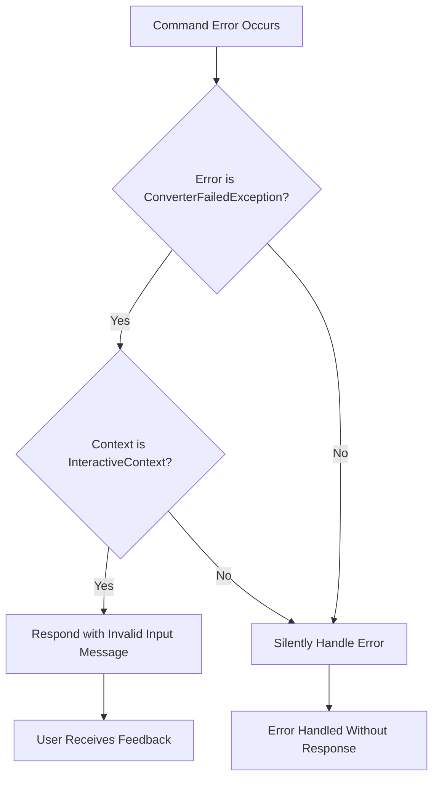

# Bot Connection Management

<cite>
**Referenced Files in This Document**   
- [bot.dart](file://src/bot.dart)
- [env.dart](file://src/env.dart)
- [commands/commands.dart](file://src/commands/commands.dart)
- [bin/main.dart](file://bin/main.dart)
- [config.dart](file://src/config.dart)
</cite>

## Table of Contents
1. [Introduction](#introduction)
2. [Bot Initialization with Riverpod](#bot-initialization-with-riverpod)
3. [Gateway Connection and Intents Configuration](#gateway-connection-and-intents-configuration)
4. [Command System Integration](#command-system-integration)
5. [Slash Commands Initialization](#slash-commands-initialization)
6. [Error Handling in Command Execution](#error-handling-in-command-execution)
7. [Environment and Token Management](#environment-and-token-management)
8. [Application Lifecycle and Plugin Registration](#application-lifecycle-and-plugin-registration)
9. [Common Connection Issues and Troubleshooting](#common-connection-issues-and-troubleshooting)
10. [Conclusion](#conclusion)

## Introduction
This document provides a comprehensive overview of the bot connection management system in the Discord bot application. It details how the Nyxx client is initialized using Riverpod, how gateway connections are established with proper intents, and how command systems are integrated. The documentation covers secure environment handling, slash command registration, error handling mechanisms, and common troubleshooting scenarios related to bot connectivity and permissions.

## Bot Initialization with Riverpod

The bot initialization process leverages Riverpod's `FutureProvider` to asynchronously instantiate the NyxxGateway client. The `botProvider` serves as the central dependency that manages the bot's lifecycle and connection state. This provider ensures that the bot instance is created only once and can be safely accessed throughout the application via Riverpod's dependency injection system.

The initialization sequence begins when other components read from `botProvider.future`, triggering the asynchronous connection process. This design pattern enables proper separation of concerns and facilitates testing by allowing mock implementations to be injected during development.

**Section sources**
- [bot.dart](file://src/bot.dart#L6-L52)

## Gateway Connection and Intents Configuration

The gateway connection is established using `Nyxx.connectGateway()` with a carefully configured set of gateway intents. The bot requests three specific intent flags:
- `GatewayIntents.allUnprivileged`: Enables all non-sensitive gateway events
- `GatewayIntents.messageContent`: Required to access message content in text channels
- `GatewayIntents.guildMembers`: Necessary for member-related events and data access

This combination of intents ensures the bot can properly interact with messages and member data while adhering to Discord's privileged intent requirements. The configuration reflects Discord API v10 requirements where message content access must be explicitly requested and approved.

The connection process also configures several plugins that enhance the bot's functionality:
- `Logging`: Provides diagnostic output for debugging
- `CliIntegration`: Enables command-line interface integration
- `IgnoreExceptions`: Prevents unhandled exceptions from crashing the bot
- `commandsPlugin`: Handles both prefix-based and slash command routing

**Section sources**
- [bot.dart](file://src/bot.dart#L45-L52)

## Command System Integration

The command system is built around the `CommandsPlugin` class from the nyxx_commands package. This plugin implements a hybrid command architecture that supports both mention-based and prefix-based command invocation. The prefix configuration uses `mentionOr((_) => '!')`, which means commands can be triggered either by mentioning the bot or using the exclamation mark prefix.

The plugin is configured with `CommandsOptions(logErrors: false)` to disable automatic error logging, giving the application full control over error handling and user feedback. This allows for customized error responses that provide meaningful information to users while maintaining clean logs.

All registered commands are processed through the plugin's execution pipeline, which handles parsing, validation, and execution of command callbacks in a consistent manner.

**Section sources**
- [bot.dart](file://src/bot.dart#L10-L13)

## Slash Commands Initialization

Slash commands are managed through the `slashCommandsProvider`, which provides a `SlashCommands` instance responsible for initializing and registering all available slash commands. The initialization process follows these steps:

1. The `slashCommandsProvider` is read from the Riverpod container
2. The `initialize()` method is called, which asynchronously prepares all slash commands
3. Commands are filtered into enabled and disabled lists based on their `enabled` flag and initialization success
4. Successfully initialized commands are added to the `commandsPlugin` for routing

Currently, the system registers two primary slash commands:
- `waifu`: For retrieving waifu images with configurable tags and NSFW filtering
- `ask`: For generating AI-powered responses through an integrated AI service

Each command's `initialize` method returns a `ChatCommand` instance that defines the command's behavior, parameters, and execution logic.

**Section sources**
- [commands/commands.dart](file://src/commands/commands.dart#L10-L54)
- [bot.dart](file://src/bot.dart#L14-L28)

## Error Handling in Command Execution

The bot implements comprehensive error handling through the `onCommandError` event listener on the `commandsPlugin`. This listener specifically handles `ConverterFailedException`, which typically occurs during command autocomplete operations when user input cannot be properly parsed.

The error handling logic includes a critical check for `InteractiveContext` to ensure that error responses can be properly sent. When an interactive context is available (such as during autocomplete), the bot responds with a user-friendly message indicating invalid input. This prevents silent failures and provides immediate feedback to users.

For other types of command errors, the system currently suppresses output (commented out print statements), indicating a deliberate design choice to handle errors silently unless they require user intervention.

**Diagram sources**
- [bot.dart](file://src/bot.dart#L29-L43)

## Environment and Token Management

Environment variables and the bot token are securely managed through the `envProvider`, which implements a Provider pattern for configuration data. The system supports multiple environment sources through abstract `Env` class implementations:

- `PlatformEnv`: Reads variables from the system environment (default)
- `FileBasedEnv`: Reads variables from a `.env` file (currently commented out)

The environment validation system checks for 8 required configuration keys:
- `BOT_TOKEN`: Authentication token for the Discord bot
- `FOOTER_TEXT`: Default footer text for embeds
- `ADMIN_USER_ID`: Identifier for the bot administrator
- `WAIFU_API_URL`: Endpoint for waifu image API
- `GUILD_ID`: Target server identifier
- `AI_API_KEY`: Authentication for AI services
- `RED_DOOR_AI_PERSONA`: AI personality configuration
- `AI_MODEL`: AI model specification

The validation process occurs during initialization and throws descriptive exceptions if required variables are missing, preventing the bot from starting with incomplete configuration.

**Section sources**
- [env.dart](file://src/env.dart#L1-L99)

## Application Lifecycle and Plugin Registration

The application lifecycle is orchestrated in `bin/main.dart`, where all major components are initialized in sequence. The startup process follows this order:

1. Create a Riverpod `ProviderContainer`
2. Initialize environment variables
3. Initialize configuration system
4. Connect to Discord gateway via `botProvider.future`
5. Start message listener
6. Start member change listener
7. Setup waifu celebration system
8. Initialize nickname storage

This sequential initialization ensures that dependencies are available before components that rely on them are started. The use of `await` for `botProvider.future` guarantees that the gateway connection is established before any event listeners are registered.

The plugin system in Nyxx allows for modular functionality through the `GatewayClientOptions.plugins` list, enabling features like logging, CLI integration, and exception handling to be composed as separate concerns.

**Section sources**
- [bin/main.dart](file://bin/main.dart#L1-L29)
- [bot.dart](file://src/bot.dart#L44-L52)

## Common Connection Issues and Troubleshooting

### Invalid Token Errors
Authentication failures typically occur due to:
- Expired or revoked bot tokens
- Incorrect token format
- Missing `BOT_TOKEN` environment variable

Ensure the token is properly set in environment variables and has not been regenerated in the Discord Developer Portal.

### Intent Configuration Issues
Common intent-related problems include:
- Missing `messageContent` intent approval in Discord Developer Portal
- Not enabling privileged intents for the bot application
- Incorrect intent combination in code

Verify that both `messageContent` and `guildMembers` intents are enabled in the Discord application dashboard and that the code correctly combines these intents using bitwise OR operations.

### Rate Limiting
The bot implements rate limiting through the `MsgQueue` system, particularly for the waifu command. Users who exceed request limits within a 10-minute window receive a warning message. Monitor console output for rate limit warnings and adjust the `MsgQueue` configuration if necessary.

### Command Registration Failures
Commands may fail to initialize due to:
- Network issues when fetching required data (e.g., waifu tags)
- Disabled commands in the `SlashRunnable.enabled` flag
- Initialization errors in command-specific logic

Check console logs for initialization messages and error outputs during startup to diagnose command registration issues.

**Section sources**
- [bot.dart](file://src/bot.dart#L1-L52)
- [env.dart](file://src/env.dart#L1-L99)
- [commands/commands.dart](file://src/commands/commands.dart#L1-L54)

## Conclusion
The bot connection management system demonstrates a well-architected approach to Discord bot development using modern Dart practices. By leveraging Riverpod for dependency injection, the system achieves clean separation of concerns and testability. The hybrid command architecture supports both traditional prefix-based commands and modern slash commands, while comprehensive error handling ensures robust operation. Secure environment management and proper intent configuration enable reliable connectivity, and the modular plugin system allows for extensible functionality. This foundation provides a solid base for further feature development and maintenance.