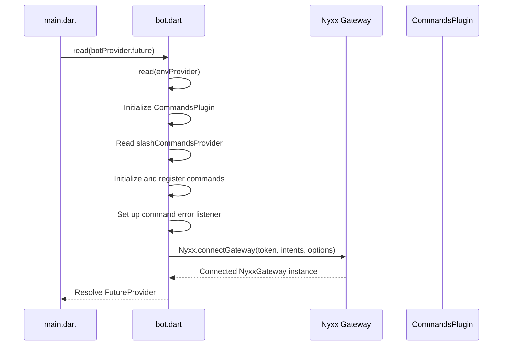
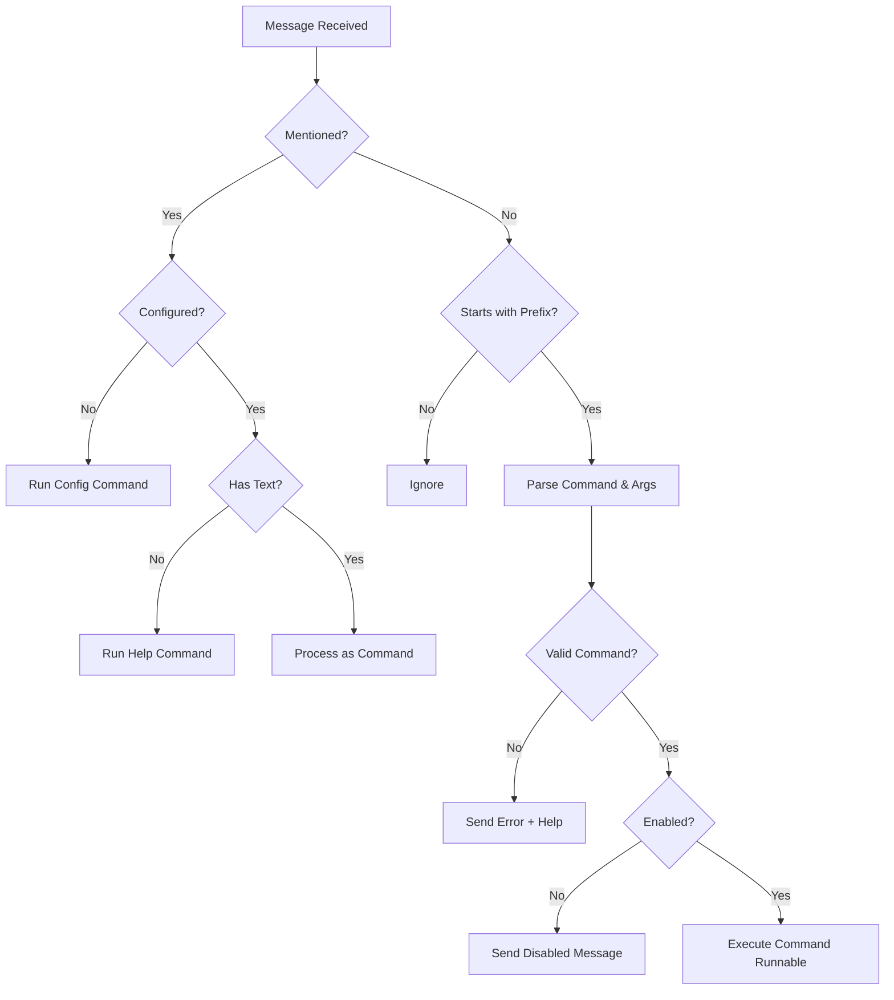
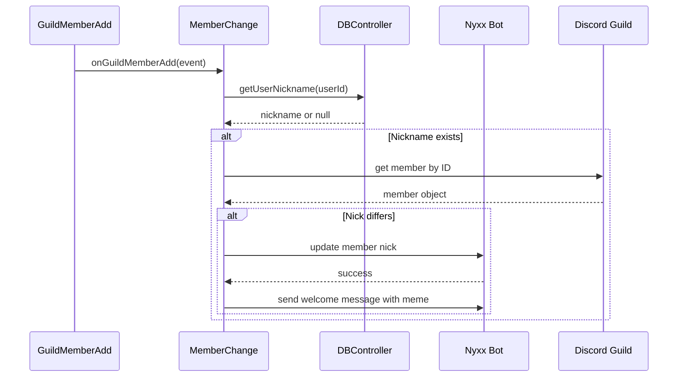
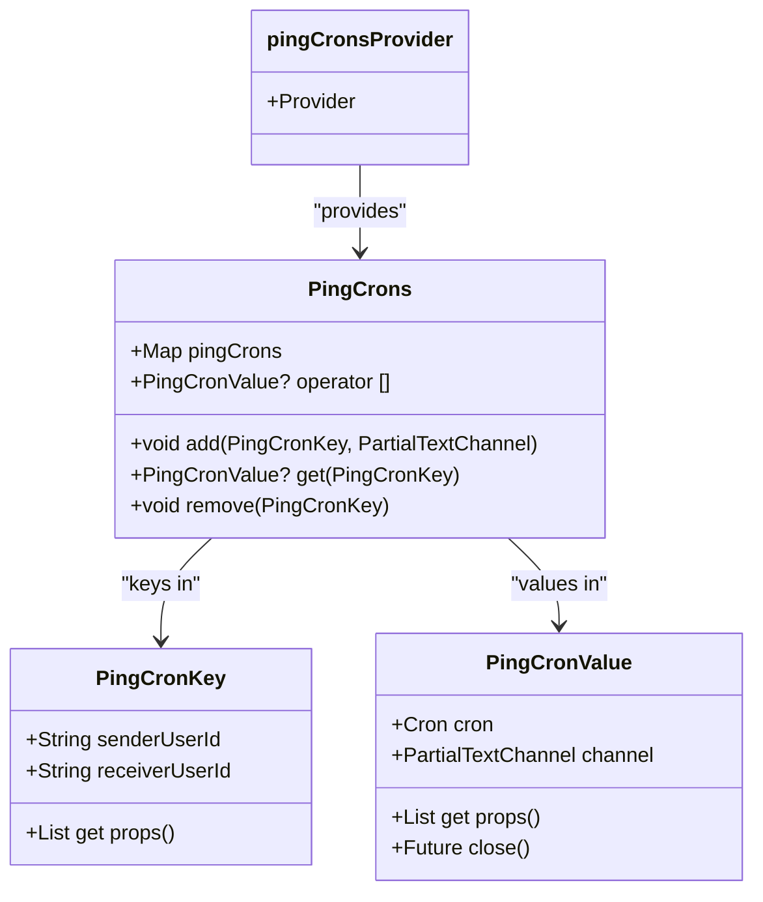
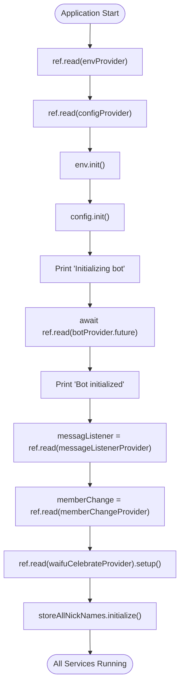

# Core Services

<cite>
**Referenced Files in This Document**   
- [bin/main.dart](file://bin/main.dart)
- [src/bot.dart](file://src/bot.dart)
- [src/listen_to_message.dart](file://src/listen_to_message.dart)
- [src/member_change.dart](file://src/member_change.dart)
- [src/cron.dart](file://src/cron.dart)
- [src/config.dart](file://src/config.dart)
- [src/db.dart](file://src/db.dart)
- [src/commands/commands.dart](file://src/commands/commands.dart)
- [src/env.dart](file://src/env.dart)
</cite>

## Table of Contents
1. [Introduction](#introduction)
2. [Bot Initialization and Gateway Management](#bot-initialization-and-gateway-management)
3. [Message Listener and Command Routing](#message-listener-and-command-routing)
4. [Member Change Handler and Nickname Restoration](#member-change-handler-and-nickname-restoration)
5. [Cron Scheduling System for Mass-Ping Tasks](#cron-scheduling-system-for-mass-ping-tasks)
6. [Service Registration and Startup in Main](#service-registration-and-startup-in-main)
7. [Event Subscription Patterns and Error Handling](#event-subscription-patterns-and-error-handling)
8. [Conclusion](#conclusion)

## Introduction
This document provides a comprehensive analysis of the core operational services within the Discord bot application. The system is architected using Riverpod for state and service management, enabling clean separation of concerns and dependency injection. The bot leverages the Nyxx framework for Discord API interactions and implements a modular design where distinct services handle specific responsibilities such as message processing, member state changes, scheduled tasks, and configuration management. This documentation details how these services are implemented, initialized, and interconnected through Riverpod providers, with a focus on event-driven patterns and robust error handling.

## Bot Initialization and Gateway Management

The `bot.dart` module is responsible for initializing the Nyxx client and establishing a connection to the Discord gateway. It exports the `botProvider`, a `FutureProvider<NyxxGateway>` that asynchronously creates and connects the bot instance. The provider reads environment variables via `envProvider` to obtain the bot token and configures the Nyxx client with all unprivileged gateway intents plus `messageContent` and `guildMembers` for comprehensive event access.

The bot is configured with a command system using `nyxx_commands`, where the prefix is set to respond to mentions or the "!" character. Slash commands are initialized through `slashCommandsProvider`, and each enabled command is registered with the commands plugin. The system includes error handling for command execution failures, particularly catching `ConverterFailedException` during autocomplete scenarios and providing user-friendly error responses when possible.

**Diagram sources**
- [src/bot.dart](file://src/bot.dart#L1-L54)
- [src/env.dart](file://src/env.dart#L1-L100)

**Section sources**
- [src/bot.dart](file://src/bot.dart#L1-L54)
- [src/env.dart](file://src/env.dart#L1-L100)

## Message Listener and Command Routing

The `listen_to_message.dart` module implements the `MessageListener` class, which subscribes to the `onMessageCreate` event stream from the Nyxx gateway. It uses the `messageListenerProvider` to make the listener instance available throughout the application. The listener dynamically responds to the configured prefix, which is retrieved from `configProvider`, and processes messages that either mention the bot or start with the configured prefix.

When a message is received, the listener parses the command and arguments by splitting the message content. It supports both primary commands and aliases, using a case-insensitive lookup against the `Command.values` enum. If a valid command is found, it executes the corresponding `runnable` with the provided arguments, channel, member, and event context. For invalid commands, it automatically responds with an error message and invokes the help command. The system also checks for disabled slash commands and prevents their execution with appropriate feedback.

**Diagram sources**
- [src/listen_to_message.dart](file://src/listen_to_message.dart#L1-L142)
- [src/config.dart](file://src/config.dart#L1-L79)

**Section sources**
- [src/listen_to_message.dart](file://src/listen_to_message.dart#L1-L142)
- [src/commands/commands.dart](file://src/commands/commands.dart#L1-L56)

## Member Change Handler and Nickname Restoration

The `member_change.dart` module implements the `MemberChange` class, which monitors two key Discord events: `onGuildMemberUpdate` and `onGuildMemberAdd`. It uses `memberChangeProvider` to expose the service instance. When a member's nickname is changed, the handler persists the new nickname to the database via `dbProvider`. This ensures that nickname preferences are remembered across sessions.

The most critical functionality is triggered when a member rejoins the server (`onGuildMemberAdd`). The handler queries the database for any previously stored nickname associated with the user ID. If a nickname is found and differs from the current one, the bot automatically restores it using the guild member update API. Upon successful restoration, the bot sends a humorous welcome message with a meme GIF to the designated welcome channel, creating a playful user experience that reinforces the bot's memory capabilities.

**Diagram sources**
- [src/member_change.dart](file://src/member_change.dart#L1-L78)
- [src/db.dart](file://src/db.dart#L1-L133)

**Section sources**
- [src/member_change.dart](file://src/member_change.dart#L1-L78)
- [src/db.dart](file://src/db.dart#L1-L133)

## Cron Scheduling System for Mass-Ping Tasks

The `cron.dart` module implements a scheduling system for recurring mass-ping tasks using the `cron` package. It defines two key data classes: `PingCronKey` and `PingCronValue`. The `PingCronKey` uniquely identifies a scheduled ping by the sender and receiver user IDs, while `PingCronValue` encapsulates the actual `Cron` scheduler instance and the target text channel.

The `PingCrons` class acts as a registry, maintaining a map of active cron jobs. It provides methods to add, retrieve, and remove scheduled pings. The `pingCronsProvider` exposes this registry as a singleton service, allowing other components to manage scheduled tasks. When a new ping is scheduled, a `Cron` instance is created with the specified schedule and configured to execute a ping message in the target channel. The system supports graceful shutdown through the `close()` method on `PingCronValue`.

**Diagram sources**
- [src/cron.dart](file://src/cron.dart#L1-L44)

**Section sources**
- [src/cron.dart](file://src/cron.dart#L1-L44)

## Service Registration and Startup in Main

The `main.dart` file serves as the application entry point and orchestrates the startup of all core services through Riverpod's `ProviderContainer`. It imports all necessary service providers and initializes them in a specific sequence. First, it reads the `envProvider` and `configProvider` to ensure environment and configuration are loaded. After initializing these, it awaits the `botProvider.future` to establish the Discord connection.

Once the bot is connected, the main function sequentially starts the message listener, member change handler, waifu celebration system, and nickname storage service by reading their respective providers and calling their `start()` methods. This centralized startup pattern ensures that services are initialized in the correct dependency order and that any initialization errors are caught at startup. The use of Riverpod enables clean dependency injection, where each service can access the bot instance and other dependencies through the `Ref` object.

**Diagram sources**
- [bin/main.dart](file://bin/main.dart#L1-L30)

**Section sources**
- [bin/main.dart](file://bin/main.dart#L1-L30)
- [src/bot.dart](file://src/bot.dart#L1-L54)

## Event Subscription Patterns and Error Handling

The bot employs consistent event subscription patterns across its services, using the `StreamSubscription` pattern from Dart's async library. Each service that listens to Discord events maintains a reference to its subscription, allowing for clean cancellation and restart through `stop()` and `start()` methods. This pattern enables dynamic restarts, such as when configuration changes require reinitializing listeners.

Error handling is implemented at multiple levels. At the command level, the `CommandsPlugin` has an `onCommandError` listener that specifically handles `ConverterFailedException` during argument parsing, providing user-friendly feedback when input is invalid. Environment and configuration loading include validation with descriptive error messages, throwing exceptions if required variables are missing. Database operations are wrapped in try-catch blocks within the `DBController`, and the system uses Riverpod's error handling capabilities to manage asynchronous initialization failures. This layered approach ensures that errors are caught close to their source and handled appropriately, whether by logging, user notification, or application shutdown.

**Section sources**
- [src/bot.dart](file://src/bot.dart#L1-L54)
- [src/listen_to_message.dart](file://src/listen_to_message.dart#L1-L142)
- [src/member_change.dart](file://src/member_change.dart#L1-L78)
- [src/env.dart](file://src/env.dart#L1-L100)

## Conclusion
The Discord bot's core services demonstrate a well-structured, event-driven architecture built on Riverpod and Nyxx. The separation of concerns through dedicated providers for bot connection, message handling, member state management, and task scheduling enables maintainable and scalable code. The system effectively uses event subscription patterns with proper lifecycle management and implements comprehensive error handling to ensure reliability. The integration of persistent storage for user preferences and the use of cron scheduling for automated tasks showcase the bot's advanced capabilities beyond simple command-response interactions. This architecture provides a solid foundation for extending functionality while maintaining code clarity and robustness.