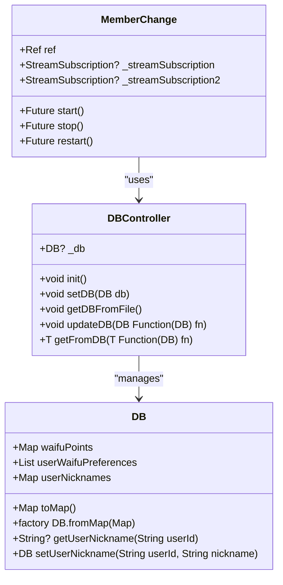
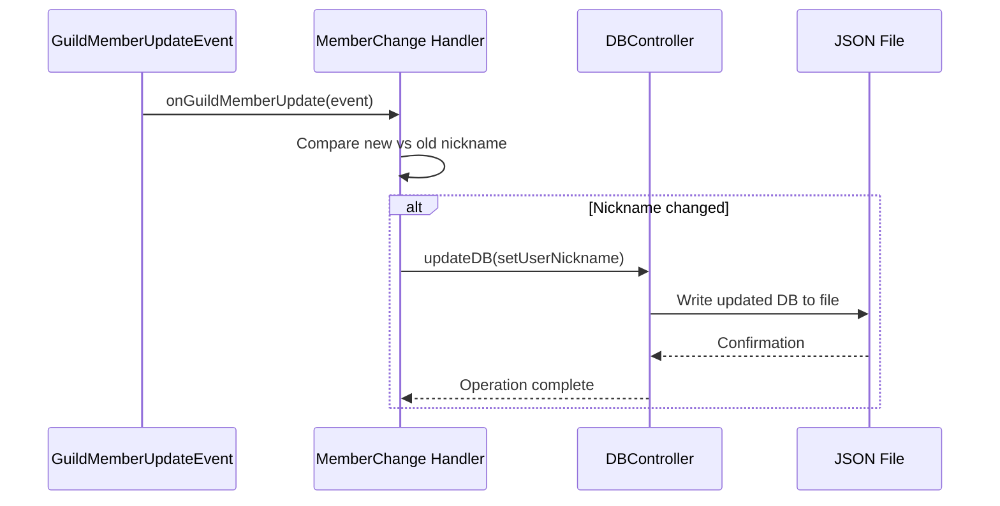
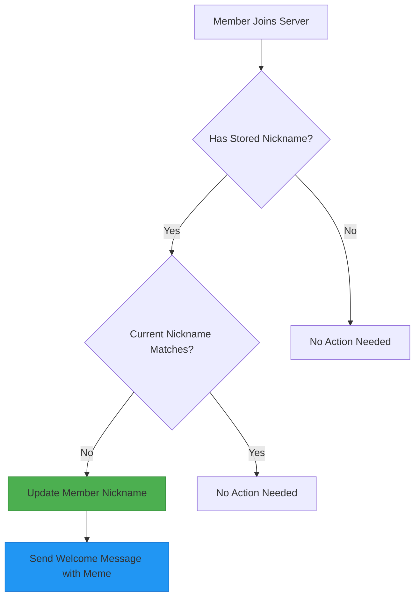

# Member Event Handling

<cite>
**Referenced Files in This Document**   
- [member_change.dart](file://src/member_change.dart)
- [db.dart](file://src/db.dart)
- [bot.dart](file://src/bot.dart)
- [config.dart](file://src/config.dart)
</cite>

## Table of Contents
1. [Introduction](#introduction)
2. [MemberChange Class Architecture](#memberchange-class-architecture)
3. [Event Subscription and Lifecycle Management](#event-subscription-and-lifecycle-management)
4. [Nickname Change Tracking and Persistence](#nickname-change-tracking-and-persistence)
5. [Member Restoration Workflow](#member-restoration-workflow)
6. [Efficient API Operations with Partial Entities](#efficient-api-operations-with-partial-entities)
7. [Database Interaction and Data Access](#database-interaction-and-data-access)
8. [Error Handling and Permission Considerations](#error-handling-and-permission-considerations)
9. [Integration with Discord API](#integration-with-discord-api)
10. [Conclusion](#conclusion)

## Introduction
The MemberChange class implements a comprehensive member event handling system for a Discord bot, designed to track and respond to user membership changes within a server. This document details the implementation of event listeners for member updates and additions, the persistence mechanism for user nicknames, and the automated restoration workflow for returning members. The system leverages Riverpod for state management, implements efficient API operations through partial entity loading, and maintains user data in a persistent JSON-based database. The solution demonstrates effective event-driven architecture patterns within the Discord bot ecosystem.

## MemberChange Class Architecture

The MemberChange class serves as the central component for handling member-related events in the Discord bot. Implemented as a Riverpod provider, it follows a dependency injection pattern that allows for clean separation of concerns and testability. The class maintains two stream subscriptions to monitor distinct Discord events: onGuildMemberUpdate for tracking nickname modifications and onGuildMemberAdd for detecting new member joins. The architecture supports dynamic lifecycle management through start, stop, and restart methods, enabling the bot to reinitialize event listeners when necessary without requiring a full application restart.



**Diagram sources**
- [member_change.dart](file://src/member_change.dart#L1-L77)
- [db.dart](file://src/db.dart#L1-L132)

**Section sources**
- [member_change.dart](file://src/member_change.dart#L1-L77)

## Event Subscription and Lifecycle Management

The MemberChange class implements a robust event subscription system that listens to two critical Discord events: onGuildMemberUpdate and onGuildMemberAdd. These event streams are managed through StreamSubscription objects that can be properly canceled and recreated as needed. The lifecycle management methods (start, stop, and restart) provide control over when the event listeners are active, allowing for graceful shutdowns and reinitialization. When starting, the system retrieves the bot instance through the Riverpod dependency injection system and establishes listeners for both member update and addition events, ensuring comprehensive coverage of membership changes.

**Section sources**
- [member_change.dart](file://src/member_change.dart#L25-L33)
- [bot.dart](file://src/bot.dart#L1-L53)

## Nickname Change Tracking and Persistence

The system implements automatic tracking of nickname changes through the onGuildMemberUpdate event listener. When a member modifies their nickname, the event handler compares the new nickname with the previous value to detect actual changes. Upon detecting a nickname modification, the system persists this information to the database using the dbProvider for data access. The persistence operation is wrapped in an updateDB callback that ensures thread-safe modification of the database state. This mechanism creates a historical record of user nicknames, enabling the restoration feature for returning members.



**Diagram sources**
- [member_change.dart](file://src/member_change.dart#L35-L47)
- [db.dart](file://src/db.dart#L100-L115)

**Section sources**
- [member_change.dart](file://src/member_change.dart#L35-L47)

## Member Restoration Workflow

The restoration workflow automatically reapplies stored nicknames when a returning member rejoins the server. When a new member joins (onGuildMemberAdd event), the system queries the database for any previously stored nickname associated with the user ID. If a nickname is found and differs from the current member nickname, the system updates the member's nickname to the stored value. Following a successful nickname restoration, the bot sends a welcome message with a meme GIF to a designated channel, creating an engaging user experience. This workflow ensures consistency in user identification across sessions and reinforces community identity.



**Diagram sources**
- [member_change.dart](file://src/member_change.dart#L48-L75)

**Section sources**
- [member_change.dart](file://src/member_change.dart#L48-L75)

## Efficient API Operations with Partial Entities

The implementation utilizes PartialGuild and PartialTextChannel classes to perform efficient API operations without loading complete entity data. PartialGuild allows the system to reference a specific guild using only its ID and the guild manager, avoiding the need to fetch the entire guild object. Similarly, PartialTextChannel enables message sending to a specific channel with minimal data overhead. This approach optimizes performance by reducing API calls and network bandwidth usage, particularly important in bot applications where efficiency directly impacts responsiveness and rate limit consumption.

**Section sources**
- [member_change.dart](file://src/member_change.dart#L58-L60)
- [member_change.dart](file://src/member_change.dart#L68-L70)

## Database Interaction and Data Access

The system employs a structured database interaction pattern through the DBController class, which serves as an intermediary between the application logic and persistent storage. The controller implements two key methods: updateDB for write operations and getFromDB for read operations. These methods encapsulate the database modification logic, ensuring that all changes are properly serialized to the JSON file. The DB class maintains user nicknames in a Map<String, String> structure, providing efficient O(1) lookup performance. This architecture separates data access concerns from business logic, promoting maintainability and testability.

```mermaid
classDiagram
class DBController {
+void updateDB(DB Function(DB) fn)
+T getFromDB(T Function(DB) fn)
+void setDB(DB db)
+void getDBFromFile()
}
class DB {
+Map<String, String> userNicknames
+String? getUserNickname(String userId)
+DB setUserNickname(String userId, String nickname)
}
DBController --> DB : "manages"
MemberChange --> DBController : "reads/writes"
note right of DBController
Encapsulates database operations
Handles file I/O and serialization
Provides thread-safe access
end
note right of DB
In-memory representation
Simple key-value storage
Automatic JSON serialization
end
```

**Diagram sources**
- [db.dart](file://src/db.dart#L1-L132)

**Section sources**
- [db.dart](file://src/db.dart#L1-L132)

## Error Handling and Permission Considerations

While the current implementation includes basic logging for debugging purposes, it lacks comprehensive error handling for member update operations. The system assumes successful API calls when updating member nicknames and sending welcome messages. In production environments, proper error handling should be implemented to catch and respond to Discord API rate limits, permission errors, and network issues. The bot requires appropriate permissions (MANAGE_NICKNAMES) to modify member nicknames, which should be documented and verified during setup. Additionally, the hard-coded channel ID and guild ID in the configuration represent potential points of failure if server structure changes.

**Section sources**
- [member_change.dart](file://src/member_change.dart#L65-L75)
- [config.dart](file://src/config.dart#L1-L78)

## Integration with Discord API

The MemberChange class integrates with Discord's member management API through the Nyxx library, subscribing to gateway events for real-time updates. The implementation uses GatewayIntents.guildMembers to receive member-related events, ensuring the bot has access to the necessary data. The system constructs PartialGuild and PartialTextChannel objects with specific IDs to target operations, demonstrating efficient use of Discord's partial entity pattern. Member updates are performed using MemberUpdateBuilder, which provides a type-safe interface for modifying member properties. This integration enables the bot to respond immediately to membership changes with minimal latency.

**Section sources**
- [member_change.dart](file://src/member_change.dart#L35-L75)
- [bot.dart](file://src/bot.dart#L30-L32)

## Conclusion

The MemberChange implementation demonstrates an effective approach to handling Discord member events with persistence and restoration capabilities. By leveraging event-driven architecture, the system automatically tracks nickname changes and restores them for returning members, enhancing user experience and community consistency. The use of partial entities optimizes API operations, while the Riverpod-based dependency injection promotes clean code organization. Future improvements could include more robust error handling, configurable channel IDs, and enhanced logging for production monitoring. The current implementation provides a solid foundation for member management functionality in Discord bots.