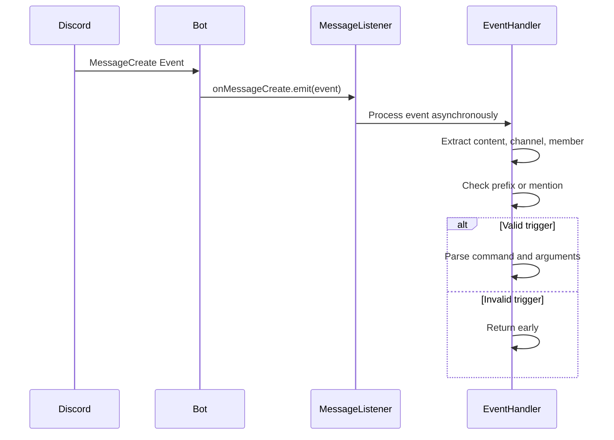
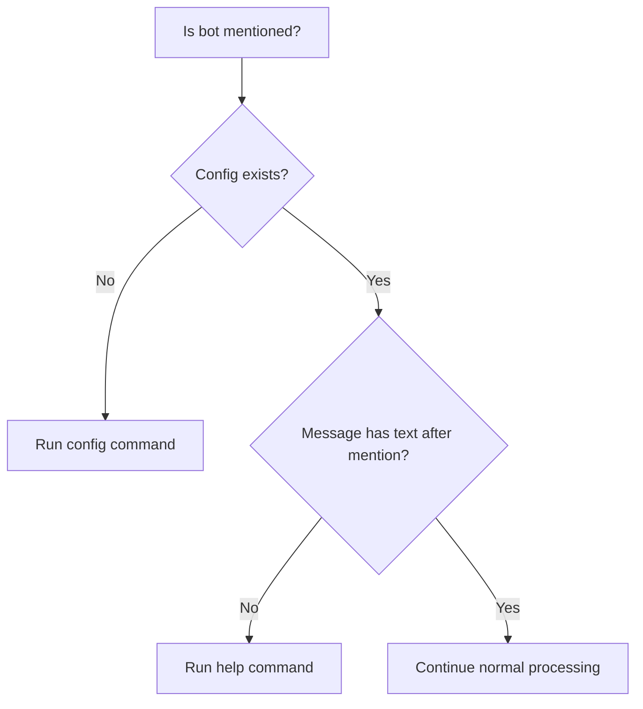
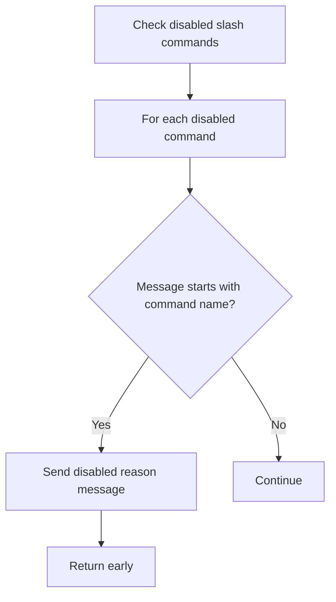
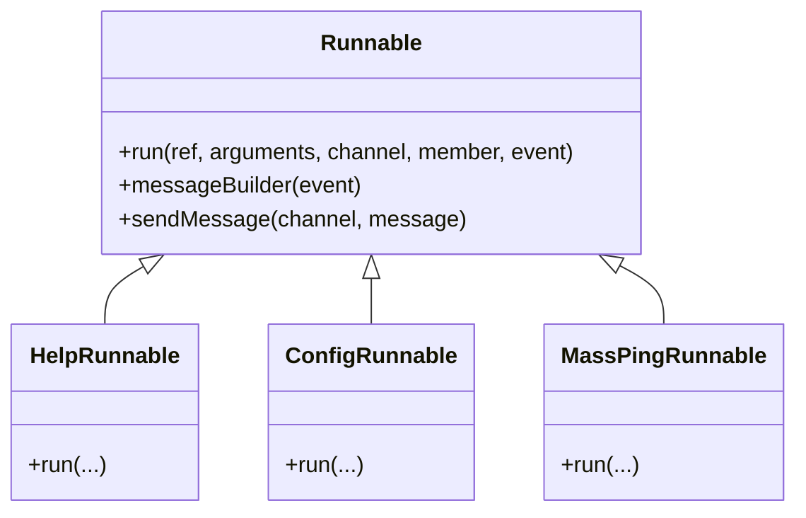
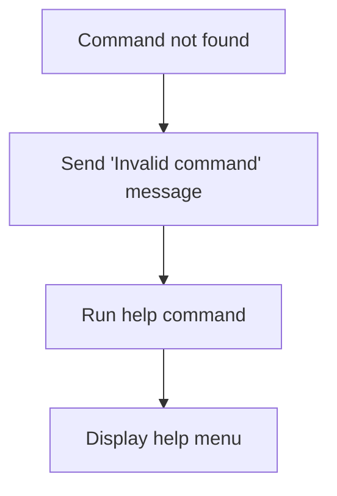
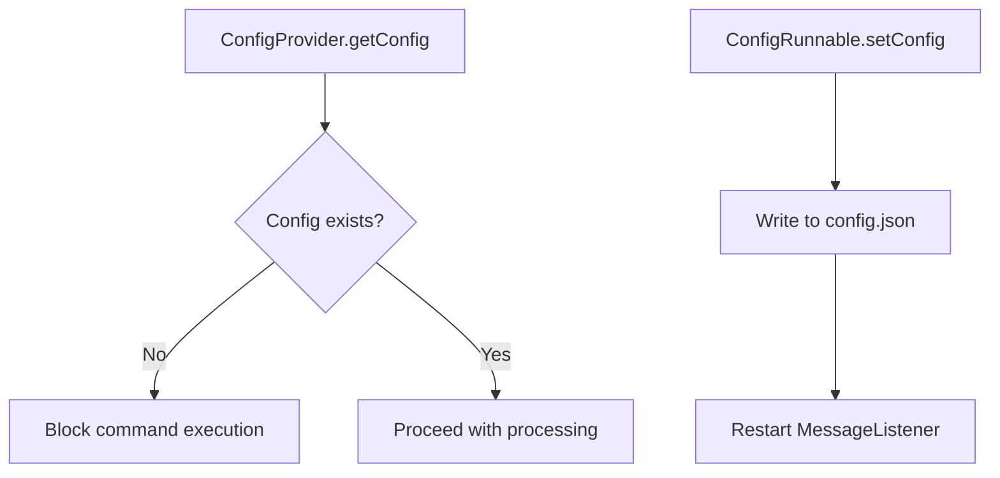
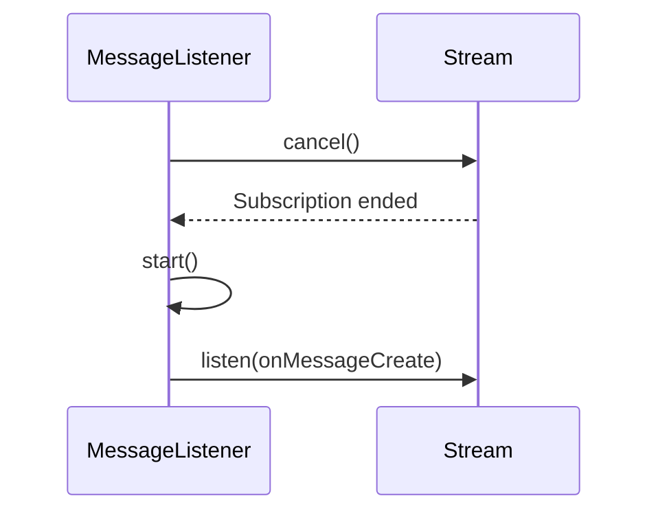

# Message Processing

<cite>
**Referenced Files in This Document**   
- [listen_to_message.dart](file://src/listen_to_message.dart)
- [config.dart](file://src/config.dart)
- [commands.dart](file://src/commands.dart)
- [runnables/help_runnable.dart](file://src/runnables/help_runnable.dart)
- [runnables/config_runnable.dart](file://src/runnables/config_runnable.dart)
- [bot.dart](file://src/bot.dart)
- [commands/commands.dart](file://src/commands/commands.dart)
</cite>

## Table of Contents
1. [Introduction](#introduction)
2. [Message Listener Initialization](#message-listener-initialization)
3. [Message Subscription and Event Handling](#message-subscription-and-event-handling)
4. [Message Routing and Command Parsing](#message-routing-and-command-parsing)
5. [Bot Mention Handling](#bot-mention-handling)
6. [Disabled Slash Command Detection](#disabled-slash-command-detection)
7. [Command Execution and Argument Extraction](#command-execution-and-argument-extraction)
8. [Error and Unknown Command Handling](#error-and-unknown-command-handling)
9. [Integration with Configuration System](#integration-with-configuration-system)
10. [Restart Mechanism and Stream Management](#restart-mechanism-and-stream-management)
11. [Performance Considerations](#performance-considerations)

## Introduction
The message listener system in the Discord bot is responsible for processing incoming messages, parsing commands, and routing them to appropriate handlers. Built using Dart and the Nyxx library, the system leverages Riverpod for state and dependency management. This document details the architecture and behavior of the `MessageListener` class, focusing on how it subscribes to message events, processes user input, and executes commands based on prefix or mention triggers.

**Section sources**
- [listen_to_message.dart](file://src/listen_to_message.dart#L1-L140)

## Message Listener Initialization
The `MessageListener` class is instantiated via Riverpod's `messageListenerProvider`, receiving a `Ref` object for dependency resolution. During initialization, it retrieves the current configuration through `configProvider` to determine the command prefix. If no prefix is set, the bot prompts the user to configure it via the `config` command.

The listener uses `botProvider` to access the Nyxx `NyxxGateway` instance, which emits message events. Before establishing a new subscription, any existing stream subscription is canceled to prevent memory leaks or duplicate event handling.

```mermaid
flowchart TD
A[MessageListener.start()] --> B[Read configProvider.getConfig]
B --> C{Config exists?}
C --> |No| D[Log prefix not set]
C --> |Yes| E[Get bot instance via botProvider]
E --> F[Cancel existing subscription]
F --> G[Subscribe to onMessageCreate stream]
G --> H[Process incoming messages]
```

**Diagram sources**
- [listen_to_message.dart](file://src/listen_to_message.dart#L20-L45)

**Section sources**
- [listen_to_message.dart](file://src/listen_to_message.dart#L20-L45)
- [config.dart](file://src/config.dart#L50-L78)
- [bot.dart](file://src/bot.dart#L10-L53)

## Message Subscription and Event Handling
The core of the message processing system is the subscription to `bot.onMessageCreate`, which listens for new messages in Discord channels. Each message event is processed asynchronously, extracting key components such as message content, channel, and member information.

The subscription ensures that only messages matching the configured prefix or mentioning the bot are processed. This filtering reduces unnecessary computation and improves responsiveness.



**Diagram sources**
- [listen_to_message.dart](file://src/listen_to_message.dart#L39-L45)

**Section sources**
- [listen_to_message.dart](file://src/listen_to_message.dart#L39-L45)

## Message Routing and Command Parsing
When a message begins with the configured prefix, the system splits the content into tokens and attempts to match the second token (the command name) against registered `Command` values. Matching is case-insensitive and supports both the primary command name and optional aliases.

Arguments are extracted as all tokens following the command name. If no arguments are present, an empty list is passed to the command handler.

```mermaid
flowchart TD
A[Message starts with prefix] --> B[Split content by space]
B --> C[commandList = tokens]
C --> D{Length > 1?}
D --> |No| E[Invalid command]
D --> |Yes| F[Look up Command by commandList[1]]
F --> G{Match found?}
G --> |Yes| H[Extract arguments = sublist(2)]
G --> |No| I[Trigger help command]
```

**Diagram sources**
- [listen_to_message.dart](file://src/listen_to_message.dart#L90-L104)

**Section sources**
- [listen_to_message.dart](file://src/listen_to_message.dart#L90-L104)
- [commands.dart](file://src/commands.dart#L50-L70)

## Bot Mention Handling
The system detects when the bot is mentioned in a message. If the bot is mentioned without any additional text, it automatically triggers the `help` command, providing users with guidance on available commands.

If the bot has not been configured (i.e., no prefix is set), mentioning the bot initiates the configuration workflow via the `config` command, ensuring the bot becomes operational.



**Diagram sources**
- [listen_to_message.dart](file://src/listen_to_message.dart#L55-L62)

**Section sources**
- [listen_to_message.dart](file://src/listen_to_message.dart#L55-L62)
- [runnables/help_runnable.dart](file://src/runnables/help_runnable.dart#L5-L78)

## Disabled Slash Command Detection
Before processing prefix-based commands, the system checks if the message starts with the name of any disabled slash command. If a match is found, the user receives a message indicating the command is disabled, along with an optional reason.

This prevents users from accidentally triggering disabled functionality and provides transparency about command availability.



**Diagram sources**
- [listen_to_message.dart](file://src/listen_to_message.dart#L70-L85)
- [commands/commands.dart](file://src/commands/commands.dart#L20-L55)

**Section sources**
- [listen_to_message.dart](file://src/listen_to_message.dart#L70-L85)

## Command Execution and Argument Extraction
Once a valid command is identified, its associated `Runnable` implementation is executed with the parsed arguments, channel, member, and event context. The `Runnable` abstract class defines a uniform interface for command execution, enabling consistent handling across different command types.

Commands such as `help`, `config`, and `mass-ping` implement their logic within their respective `run` methods, allowing modular and testable command design.



**Diagram sources**
- [runnables/runnables.dart](file://src/runnables/runnables.dart#L5-L28)
- [runnables/help_runnable.dart](file://src/runnables/help_runnable.dart#L5-L78)
- [runnables/config_runnable.dart](file://src/runnables/config_runnable.dart#L5-L135)

**Section sources**
- [runnables/runnables.dart](file://src/runnables/runnables.dart#L5-L28)

## Error and Unknown Command Handling
When a user inputs an unrecognized command, the system responds with an error message and automatically invokes the `help` command to guide the user. This improves usability by reducing confusion and providing immediate assistance.

Malformed input, such as commands without a name after the prefix, results in early return without processing, preventing exceptions.



**Diagram sources**
- [listen_to_message.dart](file://src/listen_to_message.dart#L115-L125)

**Section sources**
- [listen_to_message.dart](file://src/listen_to_message.dart#L115-L125)

## Integration with Configuration System
The `MessageListener` integrates tightly with the `configProvider` to ensure commands are only processed when the bot is properly configured. The `ConfigController` reads and writes configuration to `config.json`, maintaining persistence across restarts.

Commands like `config` modify this configuration and trigger a restart of the message listener to apply changes immediately.



**Diagram sources**
- [config.dart](file://src/config.dart#L1-L78)
- [runnables/config_runnable.dart](file://src/runnables/config_runnable.dart#L100-L135)

**Section sources**
- [config.dart](file://src/config.dart#L1-L78)

## Restart Mechanism and Stream Management
The `restart()` method allows dynamic reloading of the message listener, essential after configuration changes. It cancels the current stream subscription and reinitializes the listener, ensuring the latest prefix and settings are applied.

This mechanism prevents stale state and ensures consistent behavior without requiring a full bot restart.



**Diagram sources**
- [listen_to_message.dart](file://src/listen_to_message.dart#L15-L19)

**Section sources**
- [listen_to_message.dart](file://src/listen_to_message.dart#L15-L19)

## Performance Considerations
The system efficiently manages stream subscriptions by canceling old listeners before creating new ones, preventing memory leaks. The use of asynchronous processing ensures non-blocking execution, maintaining bot responsiveness.

The `restart()` mechanism minimizes downtime during reconfiguration, while early return conditions reduce unnecessary computation for irrelevant messages. Future optimizations could include debouncing rapid-fire messages or caching command lookups.

**Section sources**
- [listen_to_message.dart](file://src/listen_to_message.dart#L15-L140)