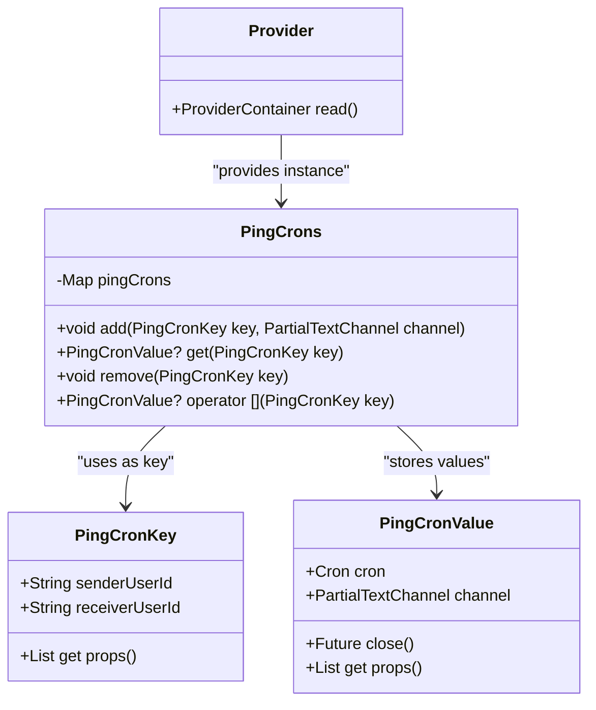
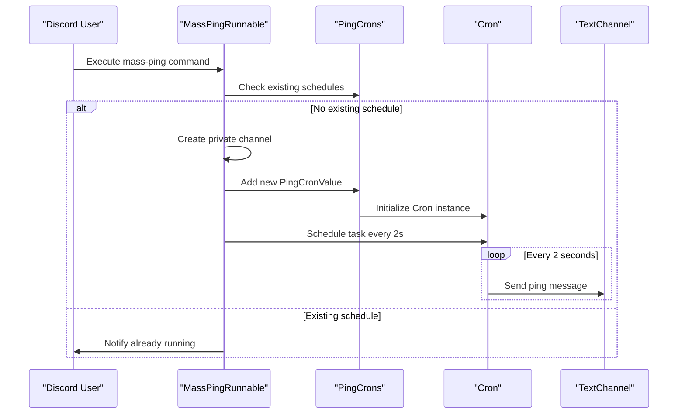
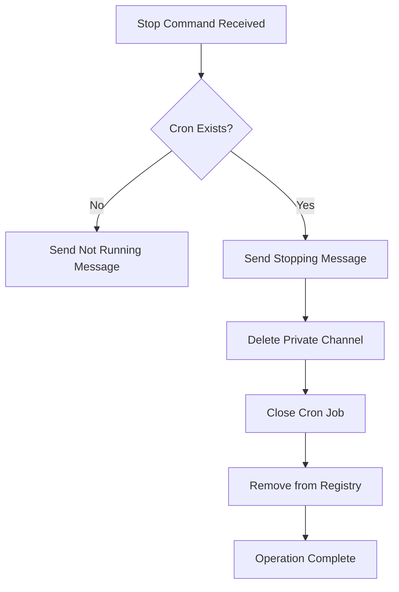

# Scheduling System

<cite>
**Referenced Files in This Document**   
- [cron.dart](file://src/cron.dart)
- [mass_ping_runnable.dart](file://src/runnables/mass_ping_runnable.dart)
</cite>

## Table of Contents
1. [Introduction](#introduction)
2. [Core Data Models](#core-data-models)
3. [PingCrons Registry and State Management](#pingcrons-registry-and-state-management)
4. [Cron Job Lifecycle and Execution](#cron-job-lifecycle-and-execution)
5. [Integration with Mass-Ping Command](#integration-with-mass-ping-command)
6. [Resource Management and Cleanup](#resource-management-and-cleanup)
7. [Thread Safety and Concurrency Considerations](#thread-safety-and-concurrency-considerations)
8. [Prevention of Duplicate Schedules](#prevention-of-duplicate-schedules)
9. [Usage Examples](#usage-examples)
10. [Conclusion](#conclusion)

## Introduction

The scheduling system in the Discord bot implements a robust mechanism for managing recurring tasks, specifically focused on the mass-ping functionality. Built on the `cron` package, this system enables precise timing control for automated messages while maintaining clean separation of concerns through data modeling and state management. The architecture leverages Dart's object-oriented features and the Riverpod framework to ensure type safety, testability, and efficient state propagation. This document provides comprehensive documentation of the system's components, their interactions, and operational characteristics.

## Core Data Models

The foundation of the scheduling system consists of two equatable data models: `PingCronKey` and `PingCronValue`. These classes serve as the primary identifiers and containers for scheduled ping tasks.

### PingCronKey

`PingCronKey` uniquely identifies a scheduled ping task based on the sender-receiver user pair. It encapsulates two string identifiers: `senderUserId` and `receiverUserId`. By extending `Equatable`, it ensures value-based equality comparison, which is essential for reliable map lookups in the registry. This prevents duplicate entries and enables accurate retrieval and removal operations.

### PingCronValue

`PingCronValue` represents the active state of a scheduled task, containing both the `Cron` instance responsible for execution scheduling and the `PartialTextChannel` where messages will be sent. It also provides a `close()` method that properly terminates the cron job, ensuring resource cleanup. The class implements value equality through `Equatable`, making it suitable for use in collections and comparisons.

**Section sources**
- [cron.dart](file://src/cron.dart#L5-L18)
- [cron.dart](file://src/cron.dart#L20-L30)

## PingCrons Registry and State Management

The `PingCrons` class serves as a central registry for all active ping cron jobs, implemented as a simple wrapper around a `Map<PingCronKey, PingCronValue>`. It provides methods for adding, retrieving, and removing scheduled tasks, abstracting the underlying map operations. The registry is exposed to the application through `pingCronsProvider`, a Riverpod `Provider` that manages the lifecycle and dependency injection of the `PingCrons` instance.

Riverpod enables efficient state management by allowing components to read the current state of the registry without direct instantiation. This promotes loose coupling and makes the system easily testable, as dependencies can be mocked or overridden in test environments. The provider pattern ensures that all parts of the application access a single, consistent instance of the registry.

**Diagram sources**
- [cron.dart](file://src/cron.dart#L5-L42)

**Section sources**
- [cron.dart](file://src/cron.dart#L32-L42)

## Cron Job Lifecycle and Execution

The system utilizes the `Cron` class from the `cron` package to manage the execution of recurring tasks. When a new ping schedule is created, a `Cron` instance is initialized and stored within a `PingCronValue`. The scheduling occurs through the `schedule()` method, which accepts a `Schedule` object parsed from a cron expression and a callback function to execute at each interval.

In the mass-ping implementation, tasks are scheduled to run every 2 seconds using the cron expression `'*/2 * * * * *'`. This high-frequency scheduling enables rapid message delivery while remaining within Discord's rate limits when properly managed. The callback function sends a predefined message to the designated text channel, maintaining the context of the original command invocation.

**Diagram sources**
- [cron.dart](file://src/cron.dart#L20-L30)
- [mass_ping_runnable.dart](file://src/runnables/mass_ping_runnable.dart#L173)

**Section sources**
- [cron.dart](file://src/cron.dart#L20-L30)
- [mass_ping_runnable.dart](file://src/runnables/mass_ping_runnable.dart#L173)

## Integration with Mass-Ping Command

The scheduling system is primarily utilized by the `MassPingRunnable` class, which handles the mass-ping command execution. When invoked, this component checks for existing schedules using the `PingCronKey` derived from the sender and receiver IDs. If no active schedule exists, it creates a private text channel with restricted permissions and registers the new cron job in the `PingCrons` registry.

The integration demonstrates a clean separation of concerns: the `MassPingRunnable` handles command logic and channel management, while the `cron.dart` module manages scheduling and state persistence. This modular design allows for independent testing and modification of each component.

**Section sources**
- [mass_ping_runnable.dart](file://src/runnables/mass_ping_runnable.dart#L21-L22)
- [mass_ping_runnable.dart](file://src/runnables/mass_ping_runnable.dart#L173)

## Resource Management and Cleanup

Proper resource management is critical for long-running cron jobs. The system implements a comprehensive cleanup strategy that addresses both the cron job itself and associated Discord resources. When a user stops a mass-ping session, the system performs the following operations:

1. Sends a notification message to the original channel
2. Deletes the private text channel used for pinging
3. Calls `close()` on the `Cron` instance to terminate scheduling
4. Removes the entry from the `PingCrons` registry

The `close()` method in `PingCronValue` ensures that the underlying cron job is properly shut down, preventing memory leaks and unnecessary processing. Channel deletion maintains server cleanliness and respects Discord's resource limits.

**Diagram sources**
- [mass_ping_runnable.dart](file://src/runnables/mass_ping_runnable.dart#L130-L150)

**Section sources**
- [cron.dart](file://src/cron.dart#L27-L30)
- [mass_ping_runnable.dart](file://src/runnables/mass_ping_runnable.dart#L130-L150)

## Thread Safety and Concurrency Considerations

While Dart's single-threaded event loop model reduces the complexity of concurrency issues, the system still requires careful consideration of race conditions. The `PingCrons` registry is accessed and modified from asynchronous contexts, making it potentially vulnerable to timing issues when multiple commands are executed simultaneously.

The current implementation does not include explicit synchronization mechanisms, relying instead on the atomicity of map operations in Dart's runtime. However, in high-concurrency scenarios, additional safeguards such as mutexes or isolates might be necessary to prevent race conditions during registry modifications.

Memory management is addressed through proper cleanup of cron jobs and Discord channels. The use of `Future<void>` for cleanup operations ensures that resource release is handled asynchronously without blocking the event loop. The equatable data models prevent memory bloat from duplicate entries by ensuring proper equality comparison.

**Section sources**
- [cron.dart](file://src/cron.dart#L32-L40)
- [mass_ping_runnable.dart](file://src/runnables/mass_ping_runnable.dart#L130-L150)

## Prevention of Duplicate Schedules

The system employs multiple strategies to prevent duplicate schedules:

1. **Key-based Uniqueness**: The `PingCronKey` ensures that each sender-receiver pair can have only one active schedule at a time.
2. **Registry Lookup**: Before creating a new schedule, the system checks for existing entries using both user-specific and admin-specific keys.
3. **Conditional Execution**: The `MassPingRunnable` explicitly checks for existing cron jobs and notifies users if a schedule is already running.

This multi-layered approach effectively prevents accidental duplication while allowing administrative override through the admin key mechanism.

**Section sources**
- [mass_ping_runnable.dart](file://src/runnables/mass_ping_runnable.dart#L90-L110)

## Usage Examples

### Starting a Mass-Ping Session
When a user executes the mass-ping command with a target user mention, the system:
1. Creates a private channel with the target user and sender
2. Registers a new cron job that sends a message every 2 seconds
3. Stores the job in the registry with both user and admin keys

### Stopping a Mass-Ping Session
When a user adds 'stop' to the command:
1. The system locates the existing cron job using the user or admin key
2. Sends a stopping notification
3. Deletes the private channel
4. Closes the cron job and removes it from the registry

### Checking Active Schedules
Components can check for active schedules by creating a `PingCronKey` with the relevant user IDs and querying the registry through `pingCronsProvider`.

**Section sources**
- [mass_ping_runnable.dart](file://src/runnables/mass_ping_runnable.dart#L60-L150)

## Conclusion

The scheduling system provides a robust foundation for managing recurring tasks in the Discord bot, with a particular focus on the mass-ping functionality. By combining equatable data models, a centralized registry, and Riverpod state management, the system achieves a balance of type safety, maintainability, and performance. The integration with Discord's channel system ensures proper resource isolation, while the cleanup mechanisms prevent resource leaks. Future enhancements could include more sophisticated scheduling options, persistence across bot restarts, and enhanced concurrency controls.