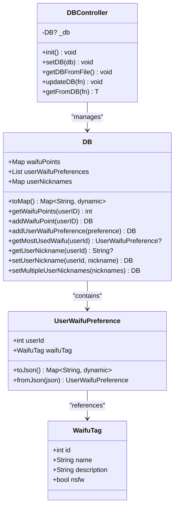
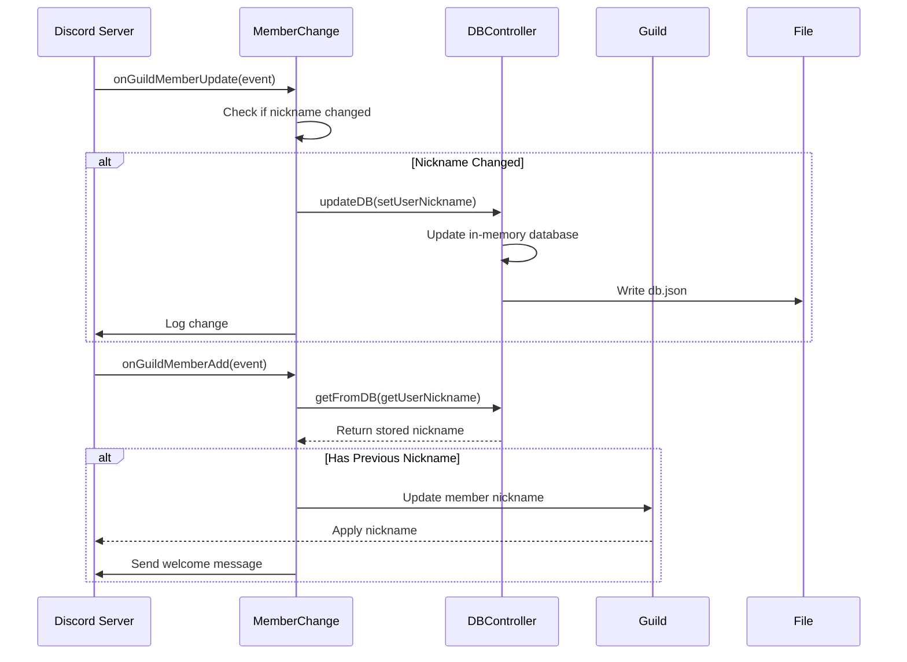
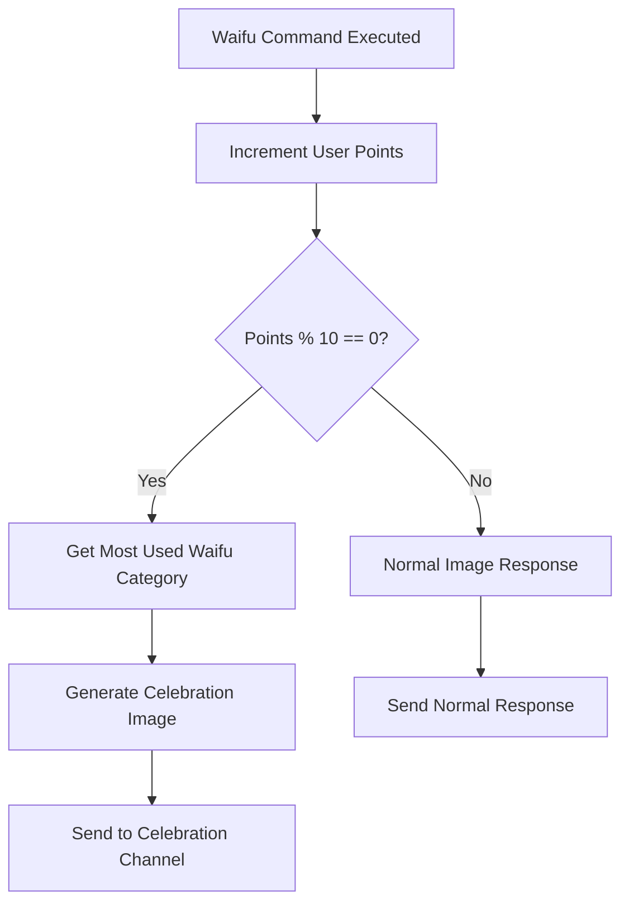

# Data Management

<cite>
**Referenced Files in This Document**   
- [db.dart](file://src/db.dart)
- [store_all_nick_names.dart](file://src/store_all_nick_names.dart)
- [user_waifu_preference.dart](file://src/user_waifu_preference.dart)
- [waifu_celebrate.dart](file://src/waifu_celebrate.dart)
- [member_change.dart](file://src/member_change.dart)
- [bot.dart](file://src/bot.dart)
- [runnables/waifu_points.dart](file://src/runnables/waifu_points.dart)
- [commands/waifu_command.dart](file://src/commands/waifu_command.dart)
</cite>

## Table of Contents
1. [Introduction](#introduction)
2. [Core Data Model Structure](#core-data-model-structure)
3. [In-Memory Database Implementation](#in-memory-database-implementation)
4. [Nickname Persistence System](#nickname-persistence-system)
5. [Waifu Points Tracking and Celebration](#waifu-points-tracking-and-celebration)
6. [User Waifu Preferences Management](#user-waifu-preferences-management)
7. [Data Access and Dependency Injection](#data-access-and-dependency-injection)
8. [Initialization and Data Loading](#initialization-and-data-loading)
9. [Data Consistency and Concurrency](#data-consistency-and-concurrency)
10. [Conclusion](#conclusion)

## Introduction
The Discord bot implements a comprehensive data management system for tracking user interactions, preferences, and achievements within a Discord server. This documentation details the persistent data systems that manage user waifu points, nickname history, and user-specific waifu preferences. The system uses an in-memory database structure with persistent JSON storage, leveraging the Riverpod state management framework for dependency injection and data access. The architecture captures user data through event listeners and command interactions, persisting it for later retrieval and restoration.

## Core Data Model Structure

The data model is centered around the `DB` class in `db.dart`, which maintains three primary data structures:

1. **Waifu Points**: A map of user IDs to their accumulated waifu points
2. **User Waifu Preferences**: A list of user preference records for waifu categories
3. **User Nicknames**: A map of user IDs to their current nicknames

These data structures are serialized to and deserialized from a JSON file (`db.json`) for persistence across bot restarts. The model supports operations for retrieving and updating each data type, with methods specifically designed for common access patterns.

**Diagram sources**
- [db.dart](file://src/db.dart#L1-L132)
- [user_waifu_preference.dart](file://src/user_waifu_preference.dart#L1-L25)

**Section sources**
- [db.dart](file://src/db.dart#L1-L132)
- [user_waifu_preference.dart](file://src/user_waifu_preference.dart#L1-L25)

## In-Memory Database Implementation

The in-memory database is implemented through the `DB` and `DBController` classes, providing a structured approach to data management with persistence capabilities. The `DB` class serves as a data transfer object, encapsulating all persistent data in memory with methods for serialization and deserialization. The `DBController` class manages the lifecycle of the database instance, handling initialization, persistence to disk, and thread-safe access patterns.

Data persistence is achieved through JSON serialization, with the database state written to `db.json` whenever modifications occur. The controller provides two primary access methods: `updateDB` for modifying the database state and `getFromDB` for reading data. This pattern ensures that all modifications go through a controlled update process, maintaining data consistency.

The implementation uses Riverpod's `Provider` pattern to make the database controller available throughout the application, allowing any component to access the database through dependency injection rather than direct instantiation.

**Section sources**
- [db.dart](file://src/db.dart#L1-L132)

## Nickname Persistence System

The nickname persistence system captures and stores user nickname changes through event-driven architecture. Implemented in `store_all_nick_names.dart` and `member_change.dart`, the system listens for Discord member update and member add events to track nickname changes.

During initialization, the `StoreAllNickNames` provider queries all current server members and captures existing nicknames, populating the database with initial nickname data. The system then listens for `onGuildMemberUpdate` events to detect nickname changes, updating the database whenever a user changes their nickname.

A key feature of this system is nickname restoration: when a user rejoins the server, the `member_change.dart` implementation checks the database for their previous nickname and automatically restores it. This creates a persistent identity experience, maintaining user nicknames across server leaves and rejoins.

**Diagram sources**
- [store_all_nick_names.dart](file://src/store_all_nick_names.dart#L1-L37)
- [member_change.dart](file://src/member_change.dart#L1-L77)

**Section sources**
- [store_all_nick_names.dart](file://src/store_all_nick_names.dart#L1-L37)
- [member_change.dart](file://src/member_change.dart#L1-L77)

## Waifu Points Tracking and Celebration

The waifu points system tracks user engagement through the `WaifuCommand` implementation, awarding points each time a user requests a waifu image. Points are stored in the `waifuPoints` map within the `DB` class, with each user identified by their Discord user ID.

The celebration logic, implemented in `waifu_celebrate.dart`, triggers special rewards when users reach milestone points (multiples of 10). When a user reaches such a milestone, the system automatically generates and sends a personalized waifu image based on their most frequently used waifu category.

The celebration process involves several components working together:
1. The `WaifuCommand` increments the user's points after each image request
2. The command calls `waifuCelebrate.celebrate()` with the updated point total
3. The `WaifuCelebrate` class checks if the points reach a milestone
4. If so, it retrieves the user's most used waifu category from their preferences
5. It then generates and sends a special celebration image in the designated channel

**Diagram sources**
- [commands/waifu_command.dart](file://src/commands/waifu_command.dart#L1-L166)
- [waifu_celebrate.dart](file://src/waifu_celebrate.dart#L1-L71)
- [runnables/waifu_points.dart](file://src/runnables/waifu_points.dart#L1-L46)

**Section sources**
- [commands/waifu_command.dart](file://src/commands/waifu_command.dart#L1-L166)
- [waifu_celebrate.dart](file://src/waifu_celebrate.dart#L1-L71)
- [runnables/waifu_points.dart](file://src/runnables/waifu_points.dart#L1-L46)

## User Waifu Preferences Management

User waifu preferences are managed through the `UserWaifuPreference` class and associated database methods. Each preference record associates a user ID with a specific waifu tag (category), allowing the system to track user preferences over time.

When a user requests a waifu image, the selected category is recorded in the database through the `addUserWaifuPreference` method. This creates a history of user choices that can be analyzed to determine their most frequently used categories.

The key functionality for preference analysis is the `getMostUsedWaifu` method in the `DB` class, which aggregates all preference records for a user, counts occurrences of each waifu tag, and returns the most frequently used one. This analysis powers the celebration system, ensuring that milestone rewards are personalized to the user's demonstrated preferences.

The preference system supports multiple selections per user, creating a rich dataset of user interests that evolves over time as users interact with the bot. This historical data enables increasingly personalized experiences as the user continues to engage with the system.

**Section sources**
- [user_waifu_preference.dart](file://src/user_waifu_preference.dart#L1-L25)
- [db.dart](file://src/db.dart#L1-L132)
- [commands/waifu_command.dart](file://src/commands/waifu_command.dart#L1-L166)

## Data Access and Dependency Injection

Data access throughout the application is managed through Riverpod's dependency injection framework, with the `dbProvider` serving as the central access point for the database controller. This pattern ensures that all components access the same database instance, maintaining data consistency across the application.

The `ProviderContainer` is used to read the database provider in various components, allowing for testable and decoupled code. Components obtain database access through `ref.read(dbProvider)`, which returns the singleton `DBController` instance.

This dependency injection approach enables several benefits:
- Centralized database management
- Easy testing through provider overrides
- Clear dependency relationships
- Prevention of multiple database instances
- Controlled access patterns through the controller interface

The pattern is consistently applied across all components that require database access, including the nickname storage system, waifu command, and celebration logic, creating a cohesive and maintainable architecture.

**Section sources**
- [db.dart](file://src/db.dart#L1-L132)
- [bot.dart](file://src/bot.dart#L1-L53)
- [store_all_nick_names.dart](file://src/store_all_nick_names.dart#L1-L37)
- [member_change.dart](file://src/member_change.dart#L1-L77)

## Initialization and Data Loading

The data system initializes through a well-defined startup sequence that ensures all persistent data is loaded before the bot becomes fully operational. The `DBController`'s `init()` method is called during provider creation, triggering the `getDBFromFile()` process.

During initialization, the system:
1. Checks for the existence of `db.json`
2. Creates the file if it doesn't exist
3. Reads the JSON content and parses it into a map
4. Constructs a `DB` instance from the parsed data using `DB.fromMap()`
5. Stores the instance in the controller's private field

Concurrently, the nickname system initializes by querying all current server members and capturing their nicknames. This two-phase initialization ensures that both historical data (from the JSON file) and current state data (from the server) are incorporated into the database.

The use of Riverpod's provider initialization ensures that all dependent components wait for the database to be fully loaded before attempting to access it, preventing race conditions during startup.

**Section sources**
- [db.dart](file://src/db.dart#L1-L132)
- [store_all_nick_names.dart](file://src/store_all_nick_names.dart#L1-L37)

## Data Consistency and Concurrency

The current implementation addresses data consistency through several mechanisms, though it has limitations in highly concurrent scenarios. The primary consistency mechanism is the use of the `updateDB` method, which ensures that all modifications go through a single code path that handles both the in-memory update and file persistence.

However, the implementation has potential race conditions when multiple events occur simultaneously:
- The lack of explicit locking mechanisms
- Sequential read-modify-write operations without atomicity
- Potential for file write conflicts

The system mitigates some risks through its event-driven architecture, where most updates are triggered by Discord events that are processed sequentially by the bot framework. Additionally, the relatively low frequency of updates (user interactions) reduces the likelihood of conflicts.

For improved concurrency safety, the system could benefit from:
- Implementing explicit locking around database operations
- Using atomic file operations for persistence
- Adding retry logic for failed updates
- Implementing a queue for database operations

Despite these potential improvements, the current implementation provides adequate consistency for the expected usage patterns of a Discord bot.

**Section sources**
- [db.dart](file://src/db.dart#L1-L132)
- [member_change.dart](file://src/member_change.dart#L1-L77)
- [commands/waifu_command.dart](file://src/commands/waifu_command.dart#L1-L166)

## Conclusion

The Discord bot's data management system provides a robust foundation for tracking user interactions, preferences, and achievements. The in-memory database with JSON persistence offers a simple yet effective solution for maintaining state across bot restarts. The integration of event-driven nickname tracking, engagement-based points systems, and preference-aware celebration logic creates a rich user experience that rewards continued interaction.

Key strengths of the implementation include its clear separation of concerns, consistent use of dependency injection, and thoughtful initialization sequence. The system effectively balances persistence needs with performance considerations, using an in-memory model for fast access while ensuring durability through regular file writes.

Future improvements could focus on enhancing data consistency under concurrency, adding backup mechanisms, and expanding the analytics capabilities of the preference tracking system. Overall, the current implementation successfully meets the core requirements for user data management in a Discord bot environment.