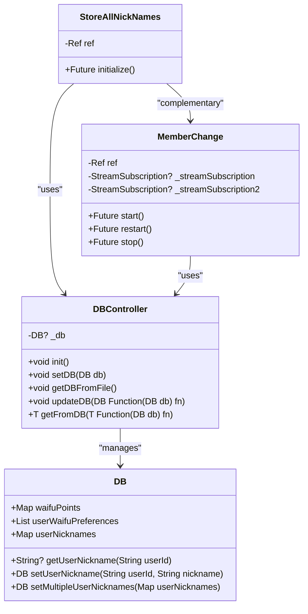
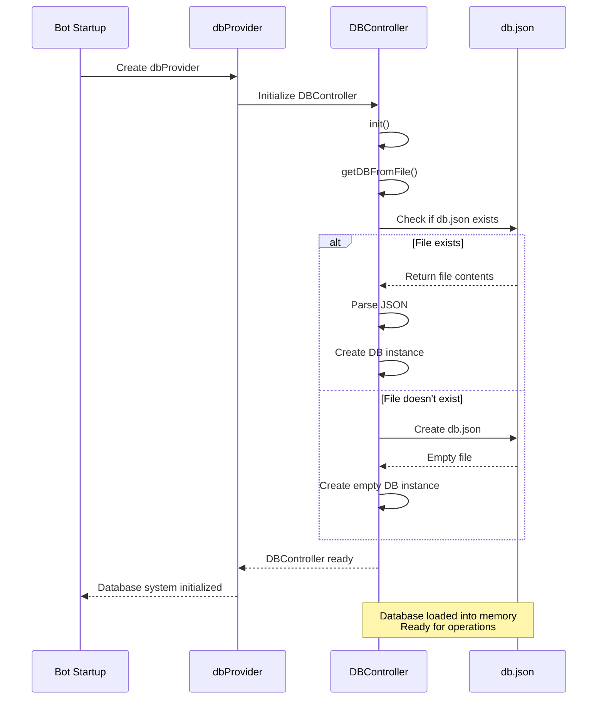
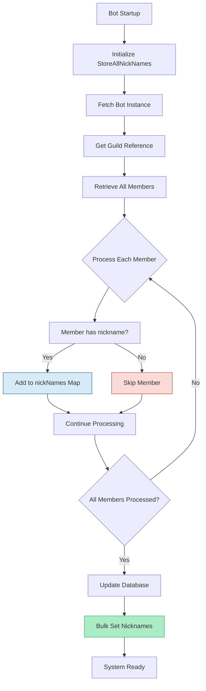
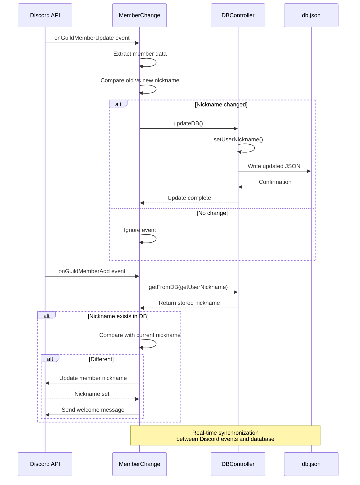
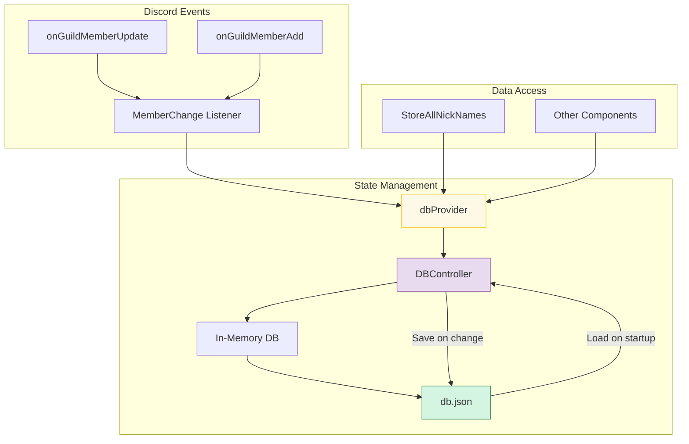
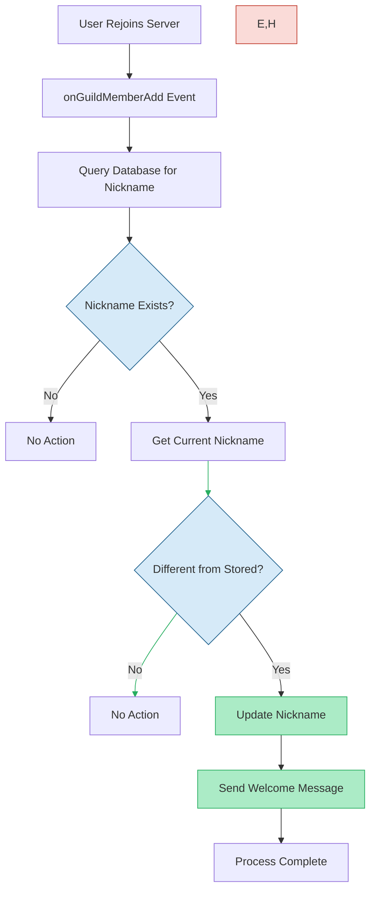
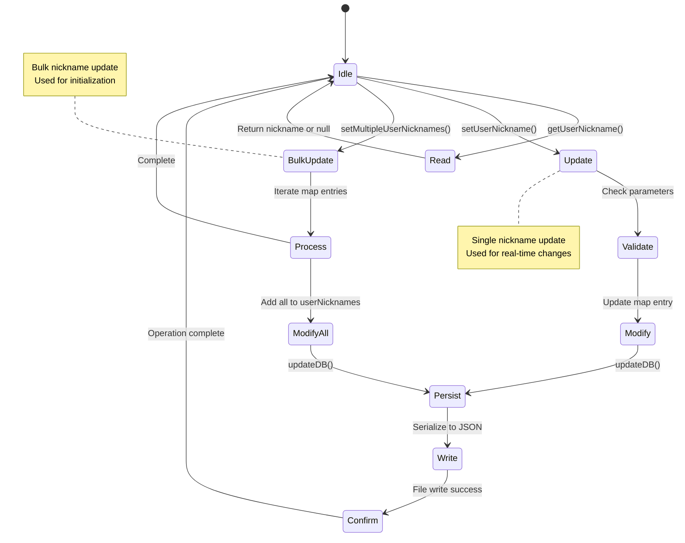

# Nickname Persistence

<cite>
**Referenced Files in This Document**   
- [db.dart](file://src/db.dart)
- [store_all_nick_names.dart](file://src/store_all_nick_names.dart)
- [member_change.dart](file://src/member_change.dart)
- [db.json](file://db.json)
</cite>

## Table of Contents
1. [Introduction](#introduction)
2. [Data Model Overview](#data-model-overview)
3. [Initialization Process](#initialization-process)
4. [Nickname Collection on Startup](#nickname-collection-on-startup)
5. [Real-time Nickname Updates](#real-time-nickname-updates)
6. [Data Flow and State Management](#data-flow-and-state-management)
7. [User Rejoin Restoration Logic](#user-rejoin-restoration-logic)
8. [CRUD Operations](#crud-operations)
9. [Persistence Mechanism](#persistence-mechanism)
10. [Concurrency and Data Consistency](#concurrency-and-data-consistency)

## Introduction
The nickname persistence system in the Discord bot maintains user nickname history across server sessions. This documentation details how the system captures, stores, and restores user nicknames using an in-memory database with file-based persistence. The system ensures that users cannot evade their established nicknames by leaving and rejoining the server, maintaining social accountability within the community.

**Section sources**
- [db.dart](file://src/db.dart#L1-L132)
- [store_all_nick_names.dart](file://src/store_all_nick_names.dart#L1-L38)
- [member_change.dart](file://src/member_change.dart#L1-L78)

## Data Model Overview

The nickname persistence system centers around the `DB` class which maintains a `userNicknames` map as part of its state. This map stores Discord user IDs as string keys and their corresponding nicknames as string values.



**Diagram sources**
- [db.dart](file://src/db.dart#L1-L132)

**Section sources**
- [db.dart](file://src/db.dart#L1-L132)

## Initialization Process

The nickname persistence system initializes through Riverpod's dependency injection framework. The `dbProvider` creates a `DBController` instance that automatically calls its `init()` method, which in turn invokes `getDBFromFile()` to load existing data from `db.json`. If the file doesn't exist, it's created with empty data structures.

When the bot starts, the system reads the JSON file and deserializes it into the in-memory `DB` object, making all previously stored nicknames immediately available for use. This initialization occurs before any other components attempt to access the database.



**Diagram sources**
- [db.dart](file://src/db.dart#L65-L88)

**Section sources**
- [db.dart](file://src/db.dart#L65-L88)

## Nickname Collection on Startup

The `StoreAllNickNames` class is responsible for collecting nicknames from all guild members when the bot starts. It uses the Discord API to fetch the complete list of members and their current nicknames, then bulk-populates the database.



The initialization process begins by obtaining the bot instance and environment configuration through Riverpod providers. It then creates a reference to the guild using the configured guild ID and retrieves all members with a single API call. For each member, it checks if both the user object and nickname are present, then stores the mapping of user ID to nickname in a temporary map. After processing all members, it updates the database atomically using the `setMultipleUserNicknames` method.

**Section sources**
- [store_all_nick_names.dart](file://src/store_all_nick_names.dart#L1-L38)

## Real-time Nickname Updates

The `MemberChange` class listens for Discord events that indicate nickname changes. It subscribes to two event streams: `onGuildMemberUpdate` for nickname modifications and `onGuildMemberAdd` for users rejoining the server.



When a member updates their nickname, the listener compares the old and new values. If a change is detected (and the new nickname is not null), it updates the database through the `updateDB` method, which ensures thread-safe modification of the shared state.

**Diagram sources**
- [member_change.dart](file://src/member_change.dart#L40-L55)

**Section sources**
- [member_change.dart](file://src/member_change.dart#L40-L55)

## Data Flow and State Management

The system uses Riverpod for state management, providing a clean separation between data access and business logic. The `dbProvider` serves as the single source of truth, accessible to all components that need to read or modify nickname data.



All components interact with the database through the provider system, ensuring consistent access patterns and proper dependency injection. The `updateDB` method provides a transaction-like interface for modifying the database, while `getFromDB` allows safe reading of data.

**Diagram sources**
- [db.dart](file://src/db.dart#L90-L132)
- [member_change.dart](file://src/member_change.dart#L1-L78)

**Section sources**
- [db.dart](file://src/db.dart#L90-L132)
- [member_change.dart](file://src/member_change.dart#L1-L78)

## User Rejoin Restoration Logic

When users leave and rejoin the server, the system automatically restores their previous nickname. This anti-evasion mechanism is implemented in the `onGuildMemberAdd` event listener.

The restoration process first checks the database for a stored nickname associated with the returning user. If found, it compares this stored nickname with the user's current nickname (which is typically null or their username when rejoining). If they differ, the system programmatically sets the nickname back to the original value and sends a humorous welcome message with a meme GIF to the designated channel.

This feature ensures that users cannot avoid their established nicknames by temporarily leaving the server, maintaining the social dynamics and inside jokes that have developed within the community.



**Diagram sources**
- [member_change.dart](file://src/member_change.dart#L57-L77)

**Section sources**
- [member_change.dart](file://src/member_change.dart#L57-L77)

## CRUD Operations

The nickname persistence system provides standard CRUD (Create, Read, Update) operations through the `DB` class methods:



The `getUserNickname` method retrieves a nickname by user ID, returning null if no nickname is stored. The `setUserNickname` method creates or updates a single nickname mapping, while `setMultipleUserNicknames` efficiently adds multiple nickname mappings at once, used primarily during the startup collection process.

**Diagram sources**
- [db.dart](file://src/db.dart#L115-L130)

**Section sources**
- [db.dart](file://src/db.dart#L115-L130)

## Persistence Mechanism

The system uses a file-based persistence approach with JSON serialization. The `DBController` class handles all file operations, ensuring that the in-memory database state is synchronized with the `db.json` file on disk.

```mermaid
erDiagram
DATABASE {
string user_id PK
string nickname
datetime last_updated
}
PERSISTENCE {
string filename PK
string format
datetime last_write
int file_size
}
DATABASE ||--o{ PERSISTENCE : "serialized_as"
class DATABASE {
+Map<String, String> userNicknames
+Map<int, int> waifuPoints
+List<UserWaifuPreference> userWaifuPreferences
}
class PERSISTENCE {
+File db.json
+JSON format
+Atomic writes
}
```

The persistence mechanism works as follows:
1. All modifications go through the `updateDB` method
2. After each modification, `setDB` serializes the entire database state to JSON
3. The JSON string is written to `db.json` using `writeAsStringSync`
4. The file is created if it doesn't exist during initialization

This approach ensures data durability but may impact performance with frequent writes, as the entire database is written to disk for each change.

**Diagram sources**
- [db.dart](file://src/db.dart#L65-L88)
- [db.json](file://db.json)

**Section sources**
- [db.dart](file://src/db.dart#L65-L88)
- [db.json](file://db.json)

## Concurrency and Data Consistency

The current implementation addresses concurrency through Riverpod's provider system and the `updateDB` method's design. The `DBController` maintains a single instance of the database state, preventing multiple concurrent modifications.

However, the file-based persistence approach introduces potential race conditions. Since the entire database is written to disk after each change, rapid successive modifications could theoretically result in lost updates if the file system operations don't complete in sequence.

The system mitigates this risk through:
1. Synchronous file operations that block until completion
2. Single-threaded event processing from Discord
3. Atomic updates through the `updateDB` transaction pattern

Despite these measures, the lack of explicit locking mechanisms means that under high load, there's a small window for data inconsistency. Future improvements could include implementing a write queue or using a proper database system with transaction support.

The in-memory nature of the database provides fast read access but creates a single point of failure. If the bot crashes before a write operation completes, recent changes could be lost. The frequent serialization to disk minimizes this risk by ensuring most changes are persisted quickly.

**Section sources**
- [db.dart](file://src/db.dart#L90-L113)
- [member_change.dart](file://src/member_change.dart#L40-L55)