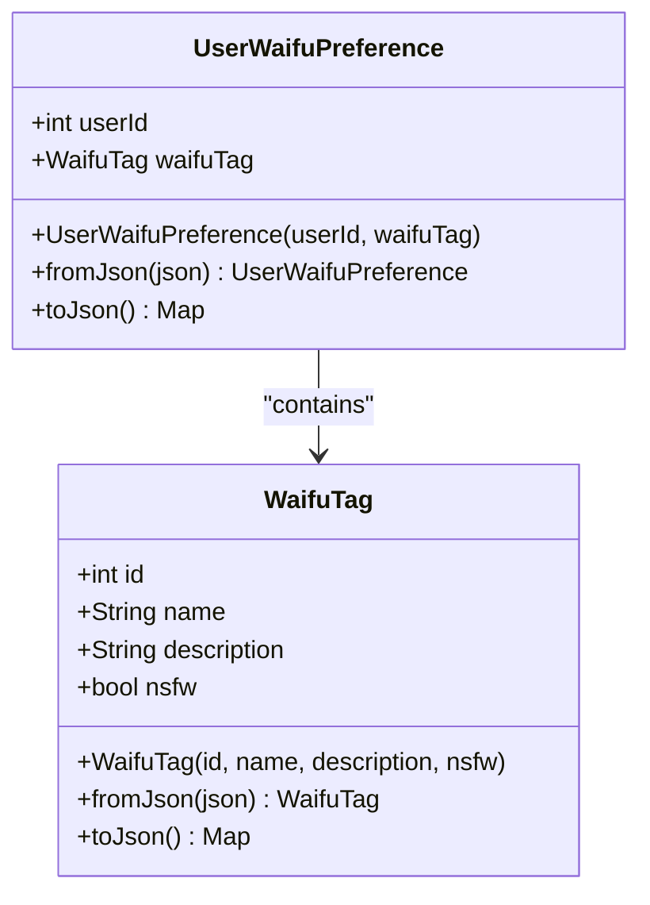
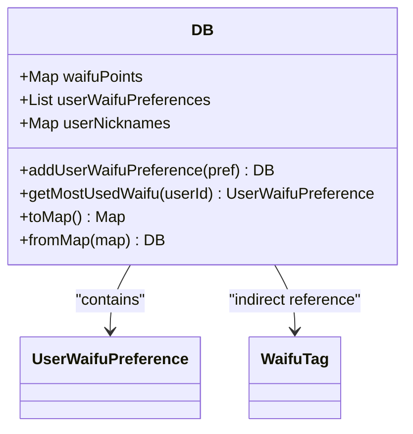
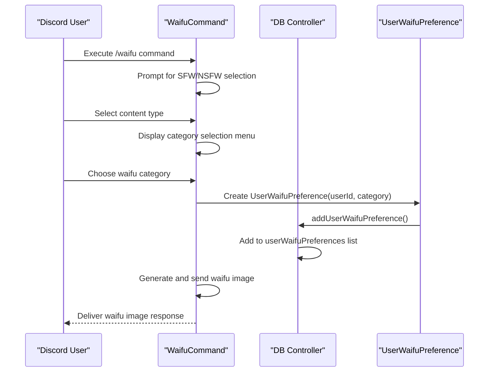
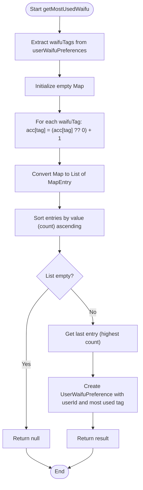
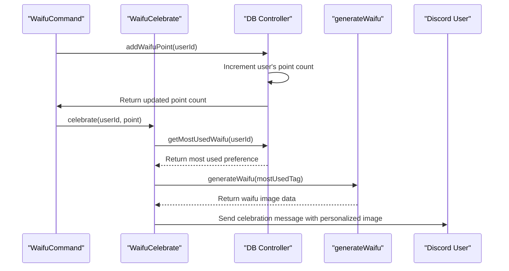

# User Waifu Preferences

<cite>
**Referenced Files in This Document**   
- [user_waifu_preference.dart](file://src/user_waifu_preference.dart)
- [db.dart](file://src/db.dart)
- [waifu_command.dart](file://src/commands/waifu_command.dart)
- [waifu_celebrate.dart](file://src/waifu_celebrate.dart)
</cite>

## Table of Contents
1. [Introduction](#introduction)
2. [Core Data Model](#core-data-model)
3. [Storage and Serialization](#storage-and-serialization)
4. [Data Flow and User Interaction](#data-flow-and-user-interaction)
5. [Analytical Capabilities](#analytical-capabilities)
6. [Personalization and User Experience](#personalization-and-user-experience)
7. [Current Limitations and Improvement Opportunities](#current-limitations-and-improvement-opportunities)
8. [Conclusion](#conclusion)

## Introduction

The User Waifu Preferences system in the Discord bot tracks user selections of waifu images to enable personalized experiences and celebrations. This documentation details the implementation of the preference tracking mechanism, from data model definition through storage, analysis, and application in user-facing features. The system captures user choices, analyzes patterns in preferences, and leverages this data to enhance user engagement through tailored content delivery.

## Core Data Model

The UserWaifuPreference class serves as the fundamental data structure for capturing user waifu selections. This class is designed as a composite entity that combines a user identifier with their selected waifu category.

**Diagram sources**
- [user_waifu_preference.dart](file://src/user_waifu_preference.dart#L3-L24)
- [waifu_command.dart](file://src/commands/waifu_command.dart#L3-L35)

The UserWaifuPreference class contains two primary properties: userId (an integer identifier for the Discord user) and waifuTag (an instance of the WaifuTag class representing the selected category). The class implements standard serialization patterns with fromJson and toJson methods, enabling persistence to JSON format. The WaifuTag class encapsulates metadata about waifu categories including ID, name, description, and NSFW status, providing rich context for each preference record.

**Section sources**
- [user_waifu_preference.dart](file://src/user_waifu_preference.dart#L1-L25)

## Storage and Serialization

Preferences are stored within the central DB class, which maintains a list of UserWaifuPreference objects as one of its core data collections. This design enables efficient aggregation and analysis of user preference patterns across the entire user base.

**Diagram sources**
- [db.dart](file://src/db.dart#L3-L14)
- [user_waifu_preference.dart](file://src/user_waifu_preference.dart#L1-L24)

The DB class manages the userWaifuPreferences list as a first-class data collection alongside other user metrics like waifu points and nicknames. The class provides methods for adding new preferences and retrieving analytical insights. Serialization to JSON is handled through the toMap method, which converts the list of UserWaifuPreference objects to a JSON-serializable format by calling each object's toJson method. Deserialization is implemented in the fromMap factory constructor, which reconstructs UserWaifuPreference instances from JSON data using the fromJson factory method.

**Section sources**
- [db.dart](file://src/db.dart#L1-L30)

## Data Flow and User Interaction

The data flow begins when a user invokes the waifu slash command, initiating a sequence that captures their category selection and records it as a preference. This process integrates preference recording with the core waifu image generation functionality.

**Diagram sources**
- [waifu_command.dart](file://src/commands/waifu_command.dart#L100-L145)
- [db.dart](file://src/db.dart#L50-L53)

When a user requests a waifu image, the WaifuCommand first prompts them to select between SFW and NSFW content, then presents a menu of available categories. After the user makes their selection, the command creates a new UserWaifuPreference instance with the user's ID and selected category, then adds it to the database through the addUserWaifuPreference method. This integration ensures that every waifu image request contributes to the user's preference profile, creating a comprehensive record of their choices over time.

**Section sources**
- [waifu_command.dart](file://src/commands/waifu_command.dart#L100-L145)

## Analytical Capabilities

The system provides analytical capabilities through the getMostUsedWaifu method, which calculates the most frequently selected waifu category for a given user. This method implements a fold operation to count category frequencies, followed by sorting to identify the most popular choice.

**Diagram sources**
- [db.dart](file://src/db.dart#L55-L68)

The getMostUsedWaifu method works by first extracting all waifu tags associated with a specific user from the userWaifuPreferences list. It then uses the fold method to create a frequency map, counting occurrences of each unique WaifuTag. The resulting map entries are converted to a list and sorted by count in ascending order. Since Dart's sort is ascending by default, the most frequently used tag appears as the last element in the sorted list. If preferences exist, the method returns a new UserWaifuPreference instance containing the user ID and their most-used category; otherwise, it returns null.

**Section sources**
- [db.dart](file://src/db.dart#L55-L68)

## Personalization and User Experience

The preference data enables personalized user experiences, most notably through the celebration system that rewards users when they reach milestone waifu points. The system uses the user's most frequently selected waifu category to generate a personalized reward image, creating a meaningful connection between user behavior and system response.

**Diagram sources**
- [waifu_command.dart](file://src/commands/waifu_command.dart#L105-L110)
- [waifu_celebrate.dart](file://src/waifu_celebrate.dart#L41-L70)
- [db.dart](file://src/db.dart#L55-L68)

When a user earns waifu points by requesting images, the system checks if they have reached a milestone (multiples of 10 points). If so, it triggers the celebration flow, which retrieves the user's most frequently selected waifu category using getMostUsedWaifu. The system then generates a waifu image from this preferred category and sends it with a personalized celebration message. This creates a feedback loop that acknowledges and rewards user engagement while reinforcing their preferred content type.

**Section sources**
- [waifu_command.dart](file://src/commands/waifu_command.dart#L105-L110)
- [waifu_celebrate.dart](file://src/waifu_celebrate.dart#L41-L70)

## Current Limitations and Improvement Opportunities

The current implementation of the user waifu preference system has several limitations that present opportunities for enhancement. The most significant limitation is the lack of temporal weighting, as all preferences are treated equally regardless of when they were made. This means older preferences from months or years ago carry the same weight as recent selections, potentially leading to inaccurate representations of current user interests.

Additional improvement opportunities include:
- Implementing expiration policies for older preferences to ensure the data remains relevant
- Adding weighting algorithms that give higher priority to recent selections
- Introducing category affinity scores that track preference strength over time
- Supporting preference categories beyond waifu tags, such as artistic style or character attributes
- Providing users with visibility into their preference profile and the ability to reset or modify it
- Implementing batch processing for analytical operations to improve performance with large datasets

These enhancements would make the preference system more dynamic and responsive to evolving user interests while maintaining the core functionality that enables personalized user experiences.

## Conclusion

The User Waifu Preferences system effectively captures and leverages user choices to enhance engagement through personalized content delivery. By tracking category selections in a structured data model and providing analytical capabilities to identify user preferences, the system enables meaningful interactions such as personalized celebration rewards. The integration of preference recording within the core waifu command ensures comprehensive data collection, while the serialization infrastructure supports reliable persistence. Future improvements should focus on adding temporal awareness to the preference model to ensure recommendations remain aligned with current user interests.