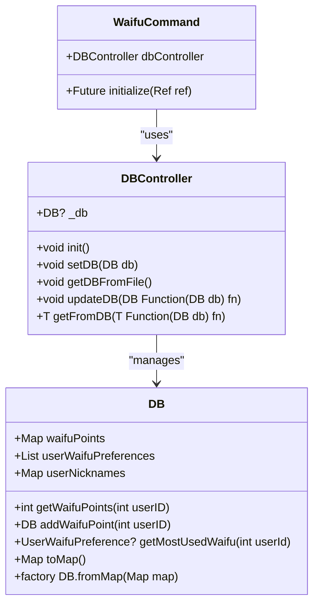
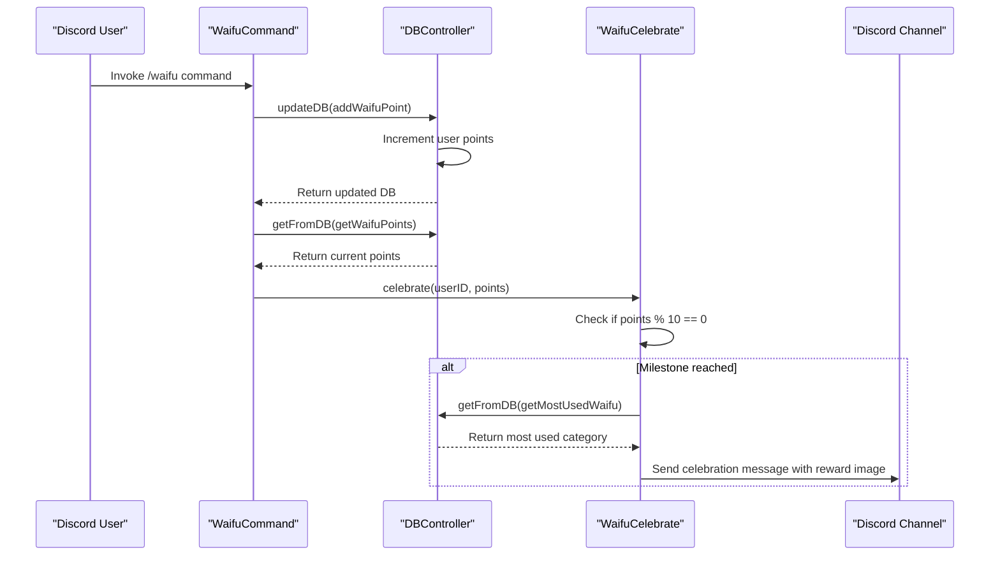
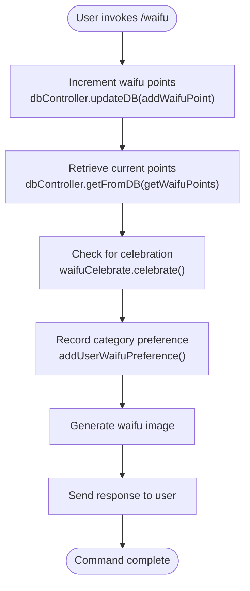

# Waifu Points Tracking

<cite>
**Referenced Files in This Document**   
- [db.dart](file://src/db.dart)
- [waifu_celebrate.dart](file://src/waifu_celebrate.dart)
- [waifu_command.dart](file://src/commands/waifu_command.dart)
- [commands.dart](file://src/commands.dart)
- [db.json](file://db.json)
</cite>

## Table of Contents
1. [Introduction](#introduction)
2. [Data Model Overview](#data-model-overview)
3. [Waifu Points Tracking Implementation](#waifu-points-tracking-implementation)
4. [Point Increment Mechanism](#point-increment-mechanism)
5. [Celebration Logic and Milestone Detection](#celebration-logic-and-milestone-detection)
6. [Data Access and Atomic Operations](#data-access-and-atomic-operations)
7. [Command Integration and Usage Flow](#command-integration-and-usage-flow)
8. [User Preference Tracking and Most Used Waifu](#user-preference-tracking-and-most-used-waifu)
9. [Data Persistence and JSON Serialization](#data-persistence-and-json-serialization)
10. [Potential Race Conditions and Concurrency Considerations](#potential-race-conditions-and-concurrency-considerations)

## Introduction
The waifu points tracking system in the Discord bot implements a gamified feature that rewards users for interacting with the waifu command. This documentation details the data model, implementation logic, and integration points for tracking user points, celebrating milestones, and maintaining user preferences. The system leverages Riverpod for state management and ensures data persistence through JSON serialization.

**Section sources**
- [db.dart](file://src/db.dart#L10-L132)
- [waifu_command.dart](file://src/commands/waifu_command.dart#L1-L166)

## Data Model Overview
The core data model is encapsulated in the DB class, which maintains three primary data structures: waifuPoints, userWaifuPreferences, and userNicknames. The waifuPoints map stores user IDs as integer keys and their corresponding point counts as integer values, forming the foundation of the points tracking system.

```mermaid
erDiagram
DB {
map<int, int> waifuPoints
list<UserWaifuPreference> userWaifuPreferences
map<string, string> userNicknames
}
USER_WAIFU_PREFERENCE {
int userId
WaifuTag waifuTag
}
WAIFU_TAG {
int id
string name
string description
boolean nsfw
}
DB ||--o{ USER_WAIFU_PREFERENCE : contains
USER_WAIFU_PREFERENCE }|--|| WAIFU_TAG : references
```

**Diagram sources**
- [db.dart](file://src/db.dart#L10-L132)
- [waifu_command.dart](file://src/commands/waifu_command.dart#L1-L166)

**Section sources**
- [db.dart](file://src/db.dart#L10-L132)

## Waifu Points Tracking Implementation
The waifuPoints data structure is implemented as a Map<int, int> within the DB class, where the key represents the Discord user ID and the value represents the accumulated waifu points. This map is initialized as an empty map when no data exists and is populated from the JSON database file on startup.

The system provides two primary methods for interacting with waifu points: getWaifuPoints for retrieving a user's current point count and addWaifuPoint for incrementing a user's points. These methods are accessed through the DBController's getFromDB and updateDB methods, ensuring proper encapsulation and data consistency.



**Diagram sources**
- [db.dart](file://src/db.dart#L10-L132)

**Section sources**
- [db.dart](file://src/db.dart#L10-L132)

## Point Increment Mechanism
The addWaifuPoint method in the DB class handles the increment logic for waifu points. When invoked with a user ID, it retrieves the current point count (defaulting to 0 if the user doesn't exist in the map), increments the value by 1, and updates the map with the new point total. The method returns the modified DB instance to support method chaining.

This increment operation is triggered whenever a user successfully invokes the waifu command, serving as the primary mechanism for point accumulation. The atomic nature of the updateDB operation ensures that the point increment is applied consistently to the shared database state.

**Section sources**
- [db.dart](file://src/db.dart#L43-L49)
- [waifu_command.dart](file://src/commands/waifu_command.dart#L108-L109)

## Celebration Logic and Milestone Detection
The system includes a celebration mechanism that triggers special events when users reach milestone points. The WaifuCelebrate class monitors point values and activates celebrations when a user's point count reaches multiples of 10, as defined by the celebratePointsMod constant.

When a milestone is reached, the celebration process fetches the user's most frequently used waifu category through the getMostUsedWaifu method and generates a reward image from that category. The celebration message is sent to a dedicated waifu-celebrate channel, which is created automatically if it doesn't exist.



**Diagram sources**
- [waifu_celebrate.dart](file://src/waifu_celebrate.dart#L1-L71)
- [waifu_command.dart](file://src/commands/waifu_command.dart#L110-L111)

**Section sources**
- [waifu_celebrate.dart](file://src/waifu_celebrate.dart#L1-L71)

## Data Access and Atomic Operations
The DBController class provides a thread-safe interface for database operations through two key methods: updateDB and getFromDB. The updateDB method applies a function to the current database state and persists the result atomically to the JSON file, preventing race conditions during write operations.

The getFromDB method allows read-only access to database values without modifying the state. Both methods operate on the singleton DB instance managed by the controller, ensuring consistency across concurrent accesses. The Riverpod provider pattern (dbProvider) facilitates dependency injection and state management throughout the application.

**Section sources**
- [db.dart](file://src/db.dart#L100-L115)

## Command Integration and Usage Flow
The waifu command integration demonstrates the complete flow of point tracking. When a user invokes the waifu command, the system immediately increments their point count using updateDB with addWaifuPoint, then retrieves the updated point total with getFromDB and getWaifuPoints. These values are passed to the celebration system to check for milestones.

The command also tracks user preferences by recording the selected waifu category in the userWaifuPreferences list, which later informs the celebration reward selection. This integration occurs within the initialize method of the WaifuCommand class, which orchestrates the entire interaction flow.



**Diagram sources**
- [waifu_command.dart](file://src/commands/waifu_command.dart#L108-L112)
- [db.dart](file://src/db.dart#L52-L58)

**Section sources**
- [waifu_command.dart](file://src/commands/waifu_command.dart#L108-L112)

## User Preference Tracking and Most Used Waifu
In addition to point tracking, the system maintains user preferences for waifu categories through the userWaifuPreferences list. Each time a user selects a category, a UserWaifuPreference record is added to track their choice. The getMostUsedWaifu method analyzes this history to determine the user's most frequently selected category.

This information is used during milestone celebrations to personalize the reward by generating a waifu image from the user's preferred category. The method employs a fold operation to count category occurrences, sorts the results, and returns the most frequently used category, or null if no preferences exist.

**Section sources**
- [db.dart](file://src/db.dart#L52-L67)

## Data Persistence and JSON Serialization
Data persistence is implemented through JSON serialization to a db.json file. The DB class provides toMap and fromMap methods to convert between object state and JSON-compatible structures. The toMap method transforms the waifuPoints map keys to strings (as JSON requires string keys) while preserving integer values.

The DBController handles file operations, creating the database file if it doesn't exist and reading/writing JSON content. On initialization, it loads existing data from db.json, and after each update, it serializes the entire database state and writes it back to the file, ensuring durability of all changes.

```mermaid
flowchart LR
A[DB Object] --> B[toMap()]
B --> C[Map<String, dynamic>]
C --> D[encodeJson()]
D --> E[JSON String]
E --> F[Write to db.json]
F --> G[Read from db.json]
G --> H[jsonDecode()]
H --> I[Map<String, dynamic>]
I --> J[DB.fromMap()]
J --> K[DB Object]
```

**Diagram sources**
- [db.dart](file://src/db.dart#L18-L36)
- [db.dart](file://src/db.dart#L116-L128)

**Section sources**
- [db.dart](file://src/db.dart#L18-L36)
- [db.json](file://db.json#L1-L31)

## Potential Race Conditions and Concurrency Considerations
While the updateDB method provides atomic updates to the database, potential race conditions could occur under high concurrency due to the file-based persistence model. Since each update reads the entire database, applies changes, and writes back the complete state, simultaneous updates from multiple commands could result in lost updates.

The current implementation mitigates this risk through synchronous file operations and the Riverpod provider's singleton pattern, which ensures a single DBController instance. However, in high-traffic scenarios, additional synchronization mechanisms or a more robust database solution might be necessary to guarantee data consistency.

The system's design favors simplicity and reliability over high-performance concurrency, which aligns with typical Discord bot usage patterns where command invocation rates are relatively low.

**Section sources**
- [db.dart](file://src/db.dart#L100-L115)
- [waifu_command.dart](file://src/commands/waifu_command.dart#L108-L109)