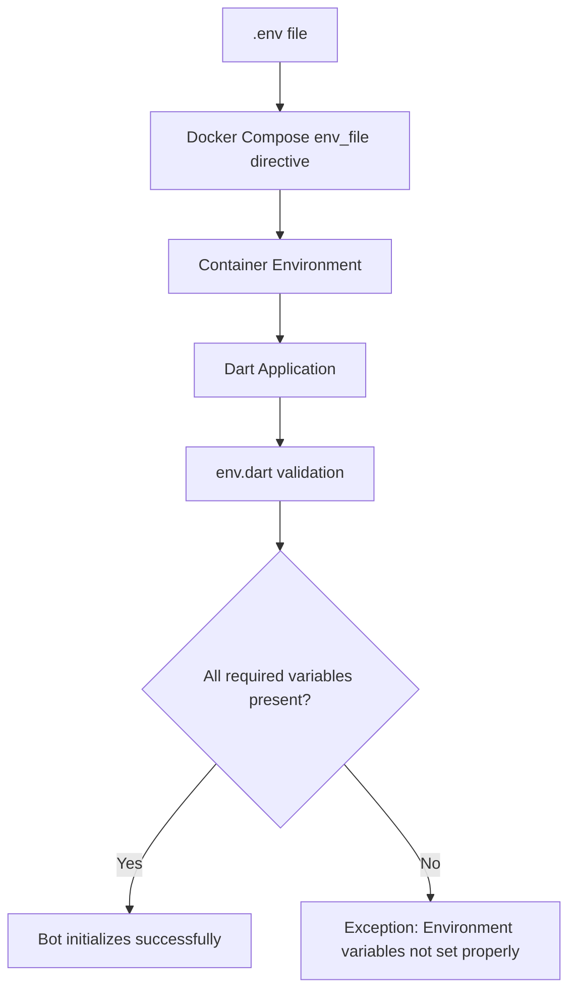

# Docker Compose Orchestration

<cite>
**Referenced Files in This Document**   
- [docker-compose.yml](file://docker-compose.yml)
- [Dockerfile](file://Dockerfile)
- [.env](file://.env)
- [src/env.dart](file://src/env.dart)
- [README.md](file://README.md)
</cite>

## Table of Contents
1. [Introduction](#introduction)
2. [Service Definition and Build Configuration](#service-definition-and-build-configuration)
3. [Environment Variable Management](#environment-variable-management)
4. [Port Mapping and Network Configuration](#port-mapping-and-network-configuration)
5. [Restart Policy and Reliability](#restart-policy-and-reliability)
6. [Configuration Extensions](#configuration-extensions)
7. [Networking and Dependencies](#networking-and-dependencies)
8. [Scaling Considerations](#scaling-considerations)
9. [Common Issues and Troubleshooting](#common-issues-and-troubleshooting)
10. [Conclusion](#conclusion)

## Introduction
This document provides comprehensive documentation for the `docker-compose.yml` file that orchestrates the `red-door-bot` Discord bot service. The configuration defines how the bot is built, deployed, and maintained in containerized environments. The bot, implemented in Dart, provides various functionalities including mass pinging, AI interactions, and game-related information services for a group of friends. This documentation explains the technical aspects of the Docker Compose configuration, including service definition, environment management, port mapping, and restart policies, while also providing guidance for development, production, and troubleshooting scenarios.

## Service Definition and Build Configuration

The `red-door-bot` service is defined in the Docker Compose configuration with a build specification that points to the current directory as the build context and explicitly specifies the `Dockerfile` for the build process. The service uses a multi-stage build approach with the official Dart stable image as the base. The build process first installs dependencies using `dart pub get`, then copies the application source code, and finally sets the command to run the bot using `dart run bin/main.dart`. This configuration ensures that the bot is built with the correct dependencies and runtime environment. The commented-out image directive suggests that the service can also be deployed using a pre-built image when needed.

**Section sources**
- [docker-compose.yml](file://docker-compose.yml#L2-L7)
- [Dockerfile](file://Dockerfile#L1-L24)

## Environment Variable Management

The bot's configuration is managed through environment variables loaded from the `.env` file using the `env_file` directive in the Docker Compose configuration. The `.env` file contains essential credentials and configuration parameters including the bot token, AI API key, admin user ID, and other service-specific settings. The Dart application code in `src/env.dart` validates these environment variables at startup, ensuring that all required keys are present before the bot initializes. This validation process checks for eight required environment variables: `BOT_TOKEN`, `FOOTER_TEXT`, `ADMIN_USER_ID`, `WAIFU_API_URL`, `GUILD_ID`, `AI_API_KEY`, `RED_DOOR_AI_PERSONA`, and `AI_MODEL`. The environment loading mechanism supports both file-based and platform-based environments, with the current configuration using the file-based approach.



**Diagram sources**
- [docker-compose.yml](file://docker-compose.yml#L8)
- [.env](file://.env#L1-L8)
- [src/env.dart](file://src/env.dart#L0-L98)

**Section sources**
- [docker-compose.yml](file://docker-compose.yml#L8)
- [.env](file://.env#L1-L8)
- [src/env.dart](file://src/env.dart#L0-L98)

## Port Mapping and Network Configuration

The Docker Compose configuration maps port 24000 on the host to port 24000 in the container. This port mapping allows external access to services running within the container on the specified port. While the current Dart application does not appear to expose an HTTP server or network service that would require this port mapping (as indicated by the commented-out EXPOSE instruction in the Dockerfile), the port is still mapped in the configuration. This suggests that the port mapping may be intended for future functionality or debugging purposes. The choice of port 24000, described as "some random port" in the comments, avoids conflicts with well-known services while providing a stable endpoint for potential inter-service communication or monitoring.

**Section sources**
- [docker-compose.yml](file://docker-compose.yml#L9-L11)
- [Dockerfile](file://Dockerfile#L22)

## Restart Policy and Reliability

The `red-door-bot` service is configured with a restart policy of `unless-stopped`, which provides high reliability for production deployment. This policy ensures that the container will automatically restart after unexpected termination, system reboot, or Docker daemon restart, except when the container has been explicitly stopped by a user or administrator. This configuration is ideal for a Discord bot that needs to maintain continuous availability, as it automatically recovers from crashes, temporary resource constraints, or system maintenance events. The policy strikes a balance between reliability and administrative control, allowing operators to perform maintenance by explicitly stopping the container while ensuring automatic recovery from all other failure scenarios.

**Section sources**
- [docker-compose.yml](file://docker-compose.yml#L12)

## Configuration Extensions

The base Docker Compose configuration can be extended for different deployment scenarios. For development environments, volume mounts can be added to enable live code reloading and easier debugging:

```yaml
services:
  red-door-bot:
    # ... existing configuration
    volumes:
      - .:/app
    environment:
      - DART_DEBUG=true
```

For production deployments, resource limits and logging configurations should be added to ensure stability and observability:

```yaml
services:
  red-door-bot:
    # ... existing configuration
    deploy:
      resources:
        limits:
          cpus: '0.5'
          memory: 512M
    logging:
      driver: "json-file"
      options:
        max-size: "10m"
        max-file: "3"
```

These extensions maintain the core functionality while adding environment-specific optimizations and operational requirements.

## Networking and Dependencies

The current configuration does not define explicit network settings or service dependencies, indicating that the `red-door-bot` operates as a standalone service that communicates externally through the Discord API. The bot does not appear to depend on other internal services within the Docker Compose setup, as it connects directly to external APIs (Discord, Google AI, Waifu.im) using the credentials provided in the environment variables. This architecture simplifies deployment and reduces inter-service dependencies, making the bot more resilient to infrastructure changes. However, for future enhancements, network configuration could be added to create isolated networks for service-to-service communication or to integrate with other internal components.

**Section sources**
- [docker-compose.yml](file://docker-compose.yml#L2-L12)
- [src/env.dart](file://src/env.dart#L32-L74)

## Scaling Considerations

The current configuration is designed for a single instance deployment, which is appropriate for a Discord bot that maintains stateful connections to the Discord gateway. Discord bots typically cannot be easily scaled horizontally due to the nature of the WebSocket connections and state management required by the Discord API. The `unless-stopped` restart policy ensures high availability of the single instance. If future requirements necessitate scaling, a more complex architecture with message queues and shared state storage would be required, but this would represent a significant architectural change beyond the scope of the current configuration.

## Common Issues and Troubleshooting

### Environment File Not Being Read
If the bot fails to start with environment variable validation errors, verify that:
1. The `.env` file exists in the same directory as `docker-compose.yml`
2. The file has correct read permissions
3. All required variables are present and correctly formatted
4. There are no syntax errors in the `.env` file (each line should be `KEY=VALUE`)

Diagnostic command: `docker-compose config` to verify the configuration is parsed correctly.

### Port Conflicts
If port 24000 is already in use, either:
1. Stop the conflicting process using `lsof -i :24000`
2. Change the host port mapping in `docker-compose.yml` to an available port
3. Remove the port mapping entirely if not needed

Diagnostic command: `docker-compose ps` to check container status and ports.

### Container Restart Loops
If the container continuously restarts, check the logs:
```bash
docker-compose logs red-door-bot
```
Common causes include:
- Invalid environment variables
- Missing dependencies
- Code errors in the application
- Network connectivity issues to external APIs

The restart policy will continue attempting to start the container, so resolving the underlying issue is necessary.

**Section sources**
- [docker-compose.yml](file://docker-compose.yml#L8)
- [.env](file://.env#L1-L8)
- [src/env.dart](file://src/env.dart#L76-L98)
- [README.md](file://README.md#L1-L27)

## Conclusion
The Docker Compose configuration for the `red-door-bot` service provides a robust foundation for deploying and maintaining the Discord bot in containerized environments. The configuration effectively manages the build process, environment variables, and service reliability through thoughtful use of Docker Compose features. While the current setup is relatively simple, it includes appropriate production-ready features like the `unless-stopped` restart policy. The configuration can be extended for different environments as needed, and the clear separation of configuration from code enhances security and maintainability. Understanding this configuration is essential for reliable operation of the bot and for implementing future enhancements.