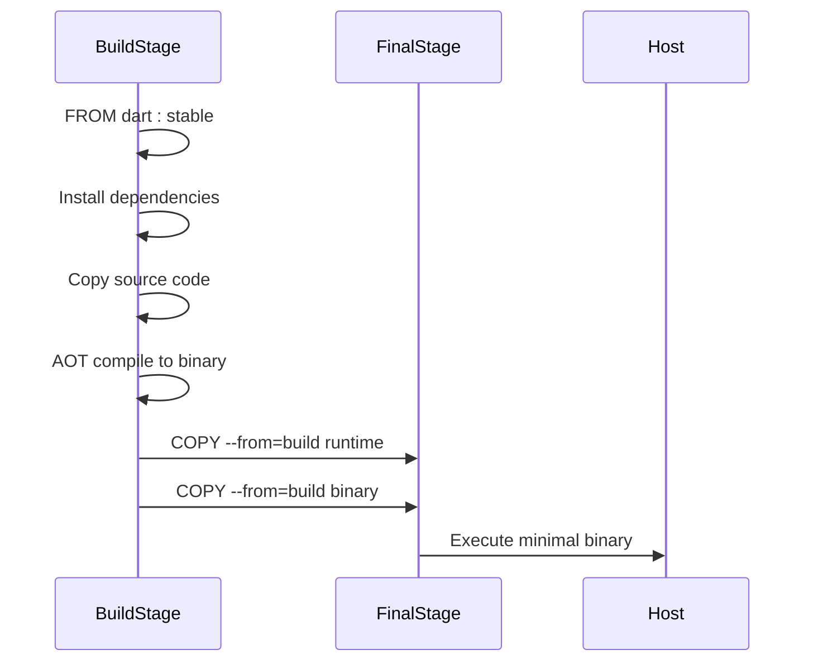

# Docker Configuration

<cite>
**Referenced Files in This Document**   
- [Dockerfile](file://Dockerfile)
- [pubspec.yaml](file://pubspec.yaml)
- [bin/main.dart](file://bin/main.dart)
</cite>

## Table of Contents
1. [Introduction](#introduction)
2. [Multi-Stage Build Process](#multi-stage-build-process)
3. [Build Stage Analysis](#build-stage-analysis)
4. [Entry Point Configuration](#entry-point-configuration)
5. [Commented-Out Production Optimization](#commented-out-production-optimization)
6. [Best Practices for Dockerfile Extension](#best-practices-for-dockerfile-extension)
7. [Troubleshooting Common Build Issues](#troubleshooting-common-build-issues)
8. [Conclusion](#conclusion)

## Introduction
This document provides comprehensive documentation for the Docker configuration used in the discord_bot project. It details the multi-stage Docker build process, explains the purpose and function of each instruction in the Dockerfile, and provides guidance on extending and troubleshooting the containerization setup. The analysis covers both the active development-oriented configuration and the commented-out production optimization sections.

**Section sources**
- [Dockerfile](file://Dockerfile#L1-L22)

## Multi-Stage Build Process
The Dockerfile implements a multi-stage build strategy using the official Dart SDK image as the foundation. This approach separates dependency resolution and compilation from the final runtime environment, enabling efficient layer caching during development while providing options for minimal production images. The current configuration focuses on developer convenience by directly executing Dart source code, while the commented-out final stage suggests a path toward AOT-compiled, scratch-based deployment for production environments.

```mermaid
flowchart TD
A["FROM dart:stable AS build"] --> B["WORKDIR /app"]
B --> C["COPY pubspec.* ./"]
C --> D["RUN dart pub get"]
D --> E["COPY . ."]
E --> F["RUN dart pub get --offline"]
F --> G["CMD ['dart', 'run', 'bin/main.dart']"]
G --> H["Final Image (Commented Out)"]
H --> I["FROM scratch"]
I --> J["COPY --from=build /runtime/ /"]
I --> K["COPY --from=build /app/bin/main /app/bin/"]
K --> L["CMD [\"/app/bin/main\"]"]
```

**Diagram sources**
- [Dockerfile](file://Dockerfile#L1-L22)

**Section sources**
- [Dockerfile](file://Dockerfile#L1-L22)

## Build Stage Analysis
The build stage begins with the `dart:stable` base image, establishing a reliable Dart development environment. The working directory is set to `/app` to provide a consistent location for application files. The Dockerfile employs an optimized layering strategy by copying `pubspec.*` files before the full source code, enabling Docker's layer cache to preserve resolved dependencies when only application code changes. The initial `dart pub get` command installs all declared dependencies from pubspec.yaml, while the subsequent `dart pub get --offline` ensures dependency integrity without network access, failing the build if any required packages are missing.

**Section sources**
- [Dockerfile](file://Dockerfile#L1-L9)
- [pubspec.yaml](file://pubspec.yaml#L1-L22)

## Entry Point Configuration
The container entry point is defined using the `CMD` instruction with JSON array syntax: `["dart", "run", "bin/main.dart"]`. This configuration executes the Dart VM to run the application source code directly, which is ideal for development and testing scenarios where rapid iteration is prioritized over startup performance. The entry point references the main application file, which initializes the Riverpod container, loads environment configuration, and starts the Discord bot with various listeners and services.

**Section sources**
- [Dockerfile](file://Dockerfile#L11)
- [bin/main.dart](file://bin/main.dart#L10-L28)

## Commented-Out Production Optimization
The Dockerfile contains commented instructions that outline a production optimization strategy. This approach involves Ahead-of-Time (AOT) compilation of the Dart application using `nyxx_commands:compile`, which would generate a standalone executable. The final stage would use a `scratch` image—essentially an empty container—to maximize security and minimize image size. The compiled binary and Dart runtime would be copied from the build stage, resulting in a minimal attack surface and reduced resource footprint. This configuration is currently disabled, indicating the project is in development mode rather than production deployment.



**Diagram sources**
- [Dockerfile](file://Dockerfile#L13-L22)

**Section sources**
- [Dockerfile](file://Dockerfile#L13-L22)

## Best Practices for Dockerfile Extension
To enhance the Docker configuration for production use, several best practices should be considered. Environment variables should be injected through Docker's `--env` flag or `.env` files to separate configuration from code. Health checks can be implemented using the `HEALTHCHECK` instruction to monitor bot connectivity and message processing. Image size can be minimized by implementing the commented AOT compilation and scratch image approach, potentially reducing the final image size by over 90%. Additionally, specific Dart SDK versions should be pinned (e.g., `dart:3.3.2`) rather than using `stable` to ensure build reproducibility.

**Section sources**
- [Dockerfile](file://Dockerfile#L1-L22)
- [docker-compose.yml](file://docker-compose.yml#L1-L11)

## Troubleshooting Common Build Issues
Common Docker build failures typically stem from dependency resolution problems or incorrect entry point configuration. If `dart pub get` fails, verify that `pubspec.yaml` and `pubspec.lock` are present and that all dependencies are accessible. The `--offline` flag will cause the build to fail if dependencies were not properly cached in the previous step, so ensure the initial `dart pub get` completes successfully. If the container fails to start, verify that `bin/main.dart` exists and contains a valid `main()` function. Network issues during dependency installation can be mitigated by using Docker build caches or hosting a private pub server. Missing environment variables at runtime can be addressed by ensuring the `.env` file is properly mounted in production deployments.

**Section sources**
- [Dockerfile](file://Dockerfile#L4-L9)
- [bin/main.dart](file://bin/main.dart#L10-L28)
- [.env](file://.env)

## Conclusion
The current Docker configuration prioritizes development agility by using interpreted Dart execution within a full SDK image. While functional for testing and development, the commented production optimization sections indicate awareness of performance and security considerations for deployment. By implementing the suggested AOT compilation and minimal image strategy, along with proper environment management and health monitoring, this Docker setup can be evolved into a robust production-ready deployment configuration that balances performance, security, and maintainability.