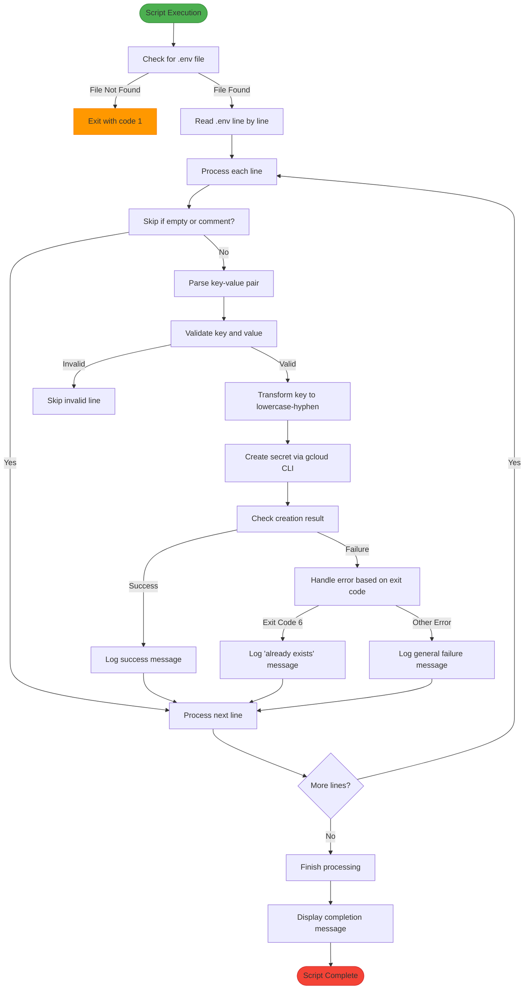

# Secrets Management with Google Cloud

<cite>
**Referenced Files in This Document**   
- [create_secrets.sh](file://create_secrets.sh)
- [README.md](file://README.md)
</cite>

## Table of Contents
1. [Introduction](#introduction)
2. [Script Workflow](#script-workflow)
3. [Error Handling](#error-handling)
4. [Prerequisites](#prerequisites)
5. [Execution Instructions](#execution-instructions)
6. [Security Best Practices](#security-best-practices)
7. [Troubleshooting Guide](#troubleshooting-guide)

## Introduction
The `create_secrets.sh` script is a Bash utility designed to securely integrate the discord_bot application with Google Cloud Secret Manager. It automates the process of reading environment variables from a `.env` file and creating corresponding secrets in Google Cloud, enabling secure configuration management for cloud deployments. This document provides comprehensive documentation on the script's functionality, usage, and integration requirements.

**Section sources**
- [create_secrets.sh](file://create_secrets.sh#L1-L51)

## Script Workflow
The script follows a structured workflow to transform environment variables into Google Cloud secrets. It begins by validating the presence of the `.env` file in the current directory, ensuring the source configuration exists before proceeding. The script then processes the file line by line, implementing filtering logic to skip empty lines and comments (lines beginning with #).

For each valid line, the script parses the key-value pair by splitting at the first equals sign (=), preserving values that may contain additional equals signs. The environment variable keys undergo transformation from uppercase with underscores (e.g., BOT_TOKEN) to lowercase with hyphens (e.g., bot-token), following Google Cloud naming conventions. The script then uses the gcloud CLI to create each secret with automatic replication policy in the specified project (red-door-bot), streaming the secret value securely through stdin to avoid exposure in command history.



**Diagram sources**
- [create_secrets.sh](file://create_secrets.sh#L5-L51)

**Section sources**
- [create_secrets.sh](file://create_secrets.sh#L5-L51)

## Error Handling
The script implements robust error handling for various failure scenarios during secret creation. When the gcloud CLI command fails, the script examines the exit code to determine the appropriate response. A specific exit code of 6 indicates that the secret already exists in the project, prompting the script to log a non-critical message and continue processing subsequent variables. This prevents script termination on duplicate secrets, allowing batch processing to complete.

For all other error conditions, the script logs a generic failure message suggesting potential issues with permissions or gcloud output. The initial validation also checks for the presence of the `.env` file, exiting with code 1 if not found, providing clear feedback about the missing configuration source. Invalid lines that cannot be parsed into key-value pairs are skipped with a descriptive message, ensuring malformed entries do not halt the entire process.

```mermaid
stateDiagram-v2
[*] --> InitialValidation
InitialValidation --> |.env file missing| ExitCode1
InitialValidation --> |.env file found| ProcessingLoop
ProcessingLoop --> LineProcessing
LineProcessing --> |Empty or comment| SkipLine
LineProcessing --> |Valid key-value| SecretCreation
LineProcessing --> |Invalid format| SkipInvalid
SecretCreation --> |Success| SuccessState
SecretCreation --> |Exit Code 6| SecretExists
SecretCreation --> |Other Failure| CreationFailed
SuccessState --> ProcessingLoop
SecretExists --> ProcessingLoop
CreationFailed --> ProcessingLoop
SkipLine --> ProcessingLoop
SkipInvalid --> ProcessingLoop
ProcessingLoop --> |No more lines| Completion
Completion --> [*]
note right of SecretExists
Exit code 6 : Secret already exists
Non-fatal error, continue processing
end note
note right of CreationFailed
Other exit codes : Permission issues,
network problems, or CLI errors
end note
classDef default fill : #f9f,stroke : #333,stroke-width : 1px;
classDef success fill : #d4edda,stroke : #c3e6cb;
classDef error fill : #f8d7da,stroke : #f5c6cb;
class ExitCode1,error
class SuccessState,success
class SecretExists,CreationFailed,error
```

**Diagram sources**
- [create_secrets.sh](file://create_secrets.sh#L7-L48)

**Section sources**
- [create_secrets.sh](file://create_secrets.sh#L7-L48)

## Prerequisites
Before executing the `create_secrets.sh` script, several prerequisites must be satisfied. The gcloud SDK must be installed and authenticated with appropriate credentials that have sufficient permissions for Secret Manager operations. The user or service account must possess the Secret Manager Admin role (roles/secretmanager.admin) or equivalent permissions to create secrets in the target project.

The script specifically targets the "red-door-bot" project, so the authenticated account must have access to this project. Additionally, the local environment must contain a properly formatted `.env` file in the same directory as the script, following the key=value format with one variable per line. Network connectivity to Google Cloud APIs is required during execution, and firewall rules must allow outbound connections to Google's services.

**Section sources**
- [create_secrets.sh](file://create_secrets.sh#L5-L7)
- [README.md](file://README.md#L8-L14)

## Execution Instructions
To execute the script, navigate to the project root directory containing both the `create_secrets.sh` script and the `.env` file. Ensure the gcloud CLI is properly configured by running `gcloud auth list` to verify the active account. Make the script executable with `chmod +x create_secrets.sh`, then run it with `./create_secrets.sh`.

The script will display progress messages for each secret being created, including the original environment variable name and the transformed secret name. Upon successful creation, it will confirm each secret with a success message. If a secret already exists, it will indicate this and continue with the remaining variables. After processing completes, the script outputs a summary message listing the created secret names, which are needed for subsequent configuration in workflow files.

To verify secret creation, use the command `gcloud secrets list --project=red-door-bot` to display all secrets in the project, or `gcloud secrets describe SECRET_NAME --project=red-door-bot` to inspect individual secret metadata.

**Section sources**
- [create_secrets.sh](file://create_secrets.sh#L1-L51)
- [README.md](file://README.md#L8-L14)

## Security Best Practices
The script incorporates several security best practices to protect sensitive information. It avoids logging secret values by only displaying key names and status messages, preventing accidental exposure in logs or terminal history. The use of stdin (`--data-file=-`) for secret values ensures credentials are not passed as command-line arguments, which could be visible in process lists.

For production environments, consider implementing project-specific quotas to limit the number of secrets and prevent abuse. Regularly rotate secrets by updating values through the script (after deleting old secrets) or using Google Cloud's secret versioning feature. Store the `.env` file with restrictive file permissions (e.g., 600) and exclude it from version control using `.gitignore`. When possible, use short-lived credentials for the gcloud authentication rather than long-term service account keys.

**Section sources**
- [create_secrets.sh](file://create_secrets.sh#L32-L37)

## Troubleshooting Guide
Common issues and their solutions include:

**Authentication Errors**: If the script fails with authentication-related messages, verify gcloud authentication status with `gcloud auth list`. If no account is listed, authenticate with `gcloud auth login` or `gcloud auth activate-service-account` with the appropriate service account key.

**Malformed .env Entries**: Lines that cannot be split into key and value will be skipped with a warning. Ensure all entries follow the format `KEY=VALUE` without spaces around the equals sign, and that no lines contain unescaped special characters that might interfere with parsing.

**Permission Issues**: If secret creation fails due to insufficient permissions, verify the authenticated account has the required IAM roles. The account needs at least `roles/secretmanager.secretAccessor` and `roles/secretmanager.admin` for full functionality. Check project access with `gcloud projects get-iam-policy red-door-bot`.

**Network Connectivity Problems**: If the script times out or cannot reach Google Cloud APIs, verify network connectivity and firewall rules. Test connectivity to Google endpoints with `gcloud info` and ensure any proxies are properly configured in the gcloud settings.

**Existing Secrets**: The script gracefully handles existing secrets (exit code 6) by skipping them. To update existing secrets, first delete them with `gcloud secrets delete SECRET_NAME --project=red-door-bot`, then re-run the script.

**Section sources**
- [create_secrets.sh](file://create_secrets.sh#L38-L46)
- [README.md](file://README.md#L8-L14)
- [test.sh](file://test.sh#L5-L12)