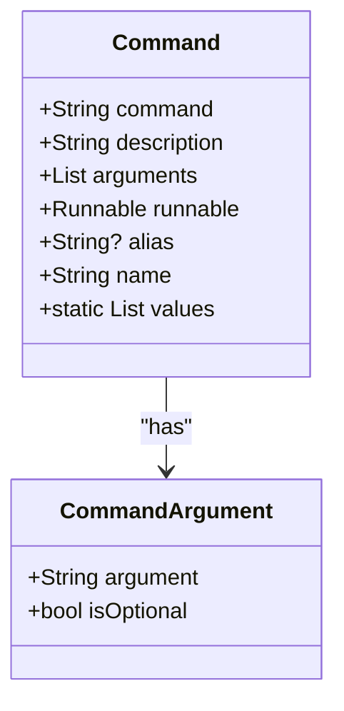
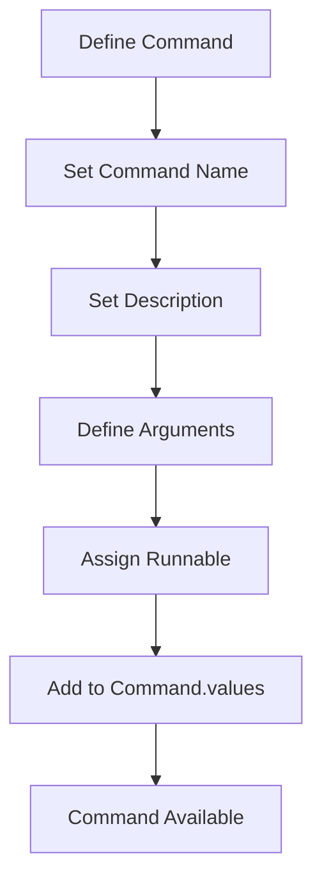
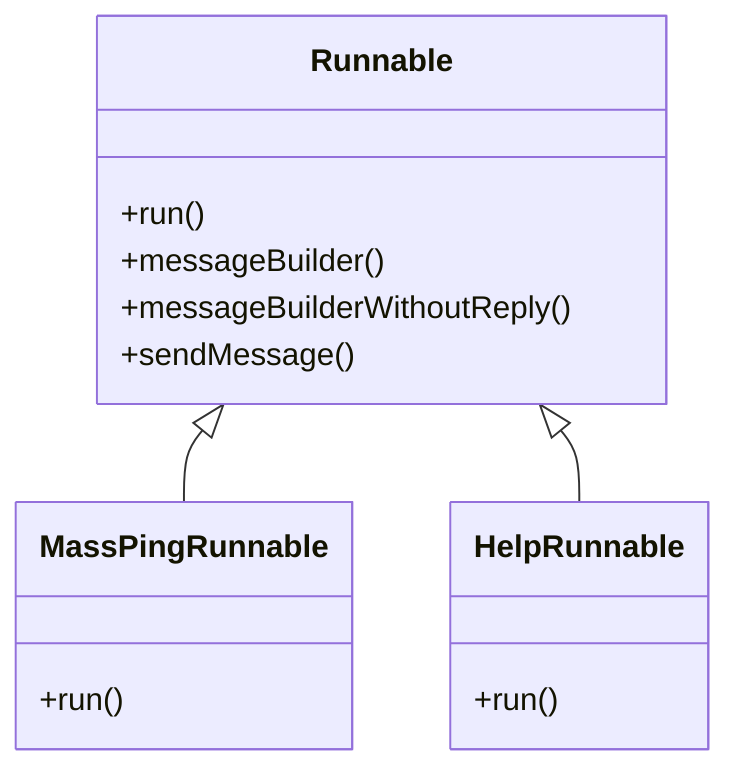
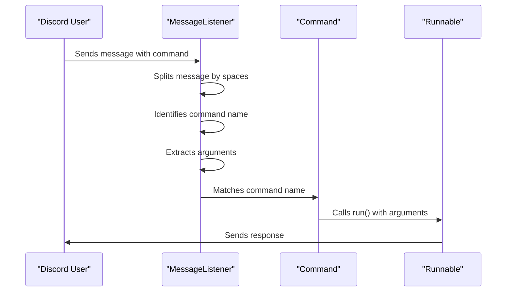
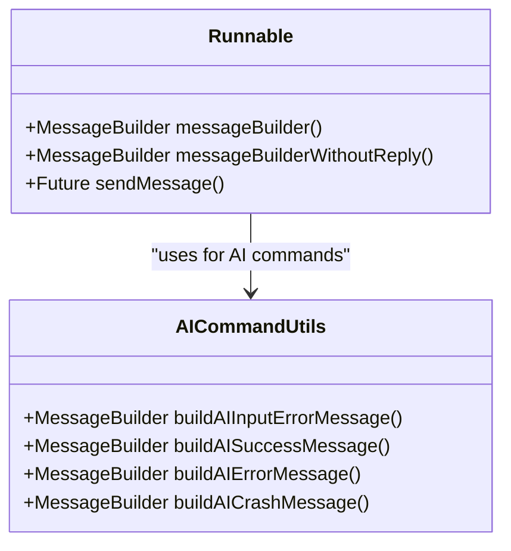
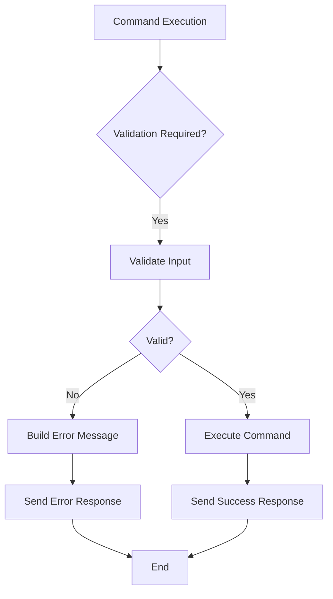
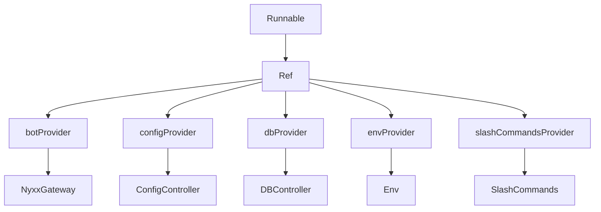

# Adding New Commands

<cite>
**Referenced Files in This Document**   
- [src/commands.dart](file://src/commands.dart)
- [src/commands/commands.dart](file://src/commands/commands.dart)
- [src/runnables/mass_ping_runnable.dart](file://src/runnables/mass_ping_runnable.dart)
- [src/runnables/help_runnable.dart](file://src/runnables/help_runnable.dart)
- [src/runnables/runnables.dart](file://src/runnables/runnables.dart)
- [src/utils/discord_response_utils.dart](file://src/utils/discord_response_utils.dart)
- [src/listen_to_message.dart](file://src/listen_to_message.dart)
- [src/bot.dart](file://src/bot.dart)
</cite>

## Table of Contents
1. [Command Class Structure](#command-class-structure)
2. [Creating and Registering Commands](#creating-and-registering-commands)
3. [Runnable Interface and Implementation](#runnable-interface-and-implementation)
4. [Argument Parsing and Command Execution](#argument-parsing-and-command-execution)
5. [Message Response Formatting](#message-response-formatting)
6. [Error Handling and Validation](#error-handling-and-validation)
7. [Dependency Injection with Riverpod](#dependency-injection-with-riverpod)
8. [Step-by-Step Guide: Creating a Sample Command](#step-by-step-guide-creating-a-sample-command)

## Command Class Structure

The Command class serves as the foundation for all bot commands, defining their metadata and behavior. It contains essential properties including the command name, description, argument definitions, and the associated Runnable implementation. The class structure enables consistent command registration and execution across the bot.

**Diagram sources**
- [src/commands.dart](file://src/commands.dart#L1-L70)

**Section sources**
- [src/commands.dart](file://src/commands.dart#L1-L70)

## Creating and Registering Commands

To add a new command to the bot, create a static instance within the Command class and register it in the static values list. Each command requires a unique name, descriptive text, and a Runnable implementation that defines its behavior. Optional aliases can be provided for alternative command invocation.

The registration process involves defining the command with its metadata and adding it to the Command.values list, which is used by the message listener to route incoming commands to their appropriate handlers. This centralized registration system ensures all commands are discoverable and properly initialized.

**Diagram sources**
- [src/commands.dart](file://src/commands.dart#L1-L70)

**Section sources**
- [src/commands.dart](file://src/commands.dart#L1-L70)

## Runnable Interface and Implementation

The Runnable interface defines the contract for command execution, requiring implementations to provide a run method that handles the command's logic. All Runnables inherit common utility methods for message building and sending, promoting code reuse and consistent response patterns.

The mass_ping_runnable.dart file provides a practical example of a Runnable implementation, demonstrating complex functionality including channel creation, permission management, and cron scheduling. This implementation shows how Runnables can leverage Discord's API to create private channels and manage recurring tasks.

**Diagram sources**
- [src/runnables/runnables.dart](file://src/runnables/runnables.dart#L1-L27)
- [src/runnables/mass_ping_runnable.dart](file://src/runnables/mass_ping_runnable.dart#L1-L176)
- [src/runnables/help_runnable.dart](file://src/runnables/help_runnable.dart#L1-L78)

**Section sources**
- [src/runnables/runnables.dart](file://src/runnables/runnables.dart#L1-L27)
- [src/runnables/mass_ping_runnable.dart](file://src/runnables/mass_ping_runnable.dart#L1-L176)

## Argument Parsing and Command Execution

Command arguments are parsed from the message content by splitting on whitespace and extracting parameters after the command name. The listen_to_message.dart file contains the logic that processes incoming messages, identifies commands, and routes them with their parsed arguments to the appropriate Runnable.

The argument parsing system supports both required and optional parameters, with validation handled within the Runnable implementation. When a command is invoked, the arguments list contains all parameters provided by the user, allowing the Runnable to validate and process them according to its requirements.

**Diagram sources**
- [src/listen_to_message.dart](file://src/listen_to_message.dart#L1-L141)
- [src/commands.dart](file://src/commands.dart#L1-L70)

**Section sources**
- [src/listen_to_message.dart](file://src/listen_to_message.dart#L1-L141)

## Message Response Formatting

The bot provides utility methods for consistent message formatting through the Runnable base class. The messageBuilder method creates responses that reference the original message, while messageBuilderWithoutReply creates standalone messages. The sendMessage utility handles the actual Discord API call, abstracting the communication layer.

For more complex responses, particularly those involving AI interactions, the discord_response_utils.dart file provides specialized formatting functions that create embeds with appropriate styling, colors, and structured content. These utilities ensure consistent visual presentation across different command types.

**Diagram sources**
- [src/runnables/runnables.dart](file://src/runnables/runnables.dart#L1-L27)
- [src/utils/discord_response_utils.dart](file://src/utils/discord_response_utils.dart#L1-L225)

**Section sources**
- [src/runnables/runnables.dart](file://src/runnables/runnables.dart#L1-L27)
- [src/utils/discord_response_utils.dart](file://src/utils/discord_response_utils.dart#L1-L225)

## Error Handling and Validation

Error handling is implemented at multiple levels, with validation occurring within Runnable implementations and error responses formatted using consistent patterns. The bot distinguishes between user input errors, system errors, and API limitations, providing appropriate feedback for each scenario.

Validation checks include argument presence, format correctness, and business logic constraints. When validation fails, Runnables construct informative error messages using the messageBuilder utilities, ensuring users understand how to correct their input. The system also handles API-level errors, such as rate limiting or authentication issues, with specialized response templates.

**Diagram sources**
- [src/runnables/mass_ping_runnable.dart](file://src/runnables/mass_ping_runnable.dart#L1-L176)
- [src/utils/discord_response_utils.dart](file://src/utils/discord_response_utils.dart#L1-L225)

**Section sources**
- [src/runnables/mass_ping_runnable.dart](file://src/runnables/mass_ping_runnable.dart#L1-L176)
- [src/utils/discord_response_utils.dart](file://src/utils/discord_response_utils.dart#L1-L225)

## Dependency Injection with Riverpod

The bot utilizes Riverpod for dependency injection, allowing Runnables to access shared resources through the Ref parameter. This system enables loose coupling between components while providing type-safe access to services like configuration, database connections, and external APIs.

When a command executes, the Ref container provides access to providers that manage the lifecycle of various services. This approach simplifies testing, promotes reusability, and ensures that dependencies are properly initialized before use. The bot's architecture separates concerns by having providers manage state while Runnables focus on command logic.

**Diagram sources**
- [src/bot.dart](file://src/bot.dart#L1-L53)
- [src/listen_to_message.dart](file://src/listen_to_message.dart#L1-L141)
- [src/runnables/mass_ping_runnable.dart](file://src/runnables/mass_ping_runnable.dart#L1-L176)

**Section sources**
- [src/bot.dart](file://src/bot.dart#L1-L53)
- [src/listen_to_message.dart](file://src/listen_to_message.dart#L1-L141)

## Step-by-Step Guide: Creating a Sample Command

Creating a new command involves several steps: defining the Command instance, implementing the Runnable, and ensuring proper registration. First, create a new Runnable class that extends the base Runnable and implements the run method with the desired functionality. Then, define a static Command instance with appropriate metadata and associate it with the new Runnable.

Finally, add the command to the Command.values list to make it available for execution. The system will automatically handle message routing, argument parsing, and dependency injection, allowing the new command to integrate seamlessly with existing functionality.

**Diagram sources**
- [src/commands.dart](file://src/commands.dart#L1-L70)
- [src/runnables/runnables.dart](file://src/runnables/runnables.dart#L1-L27)

**Section sources**
- [src/commands.dart](file://src/commands.dart#L1-L70)
- [src/runnables/runnables.dart](file://src/runnables/runnables.dart#L1-L27)