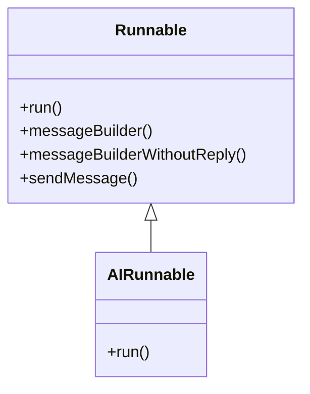
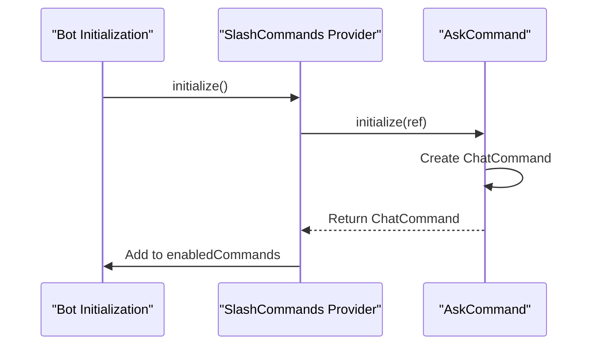
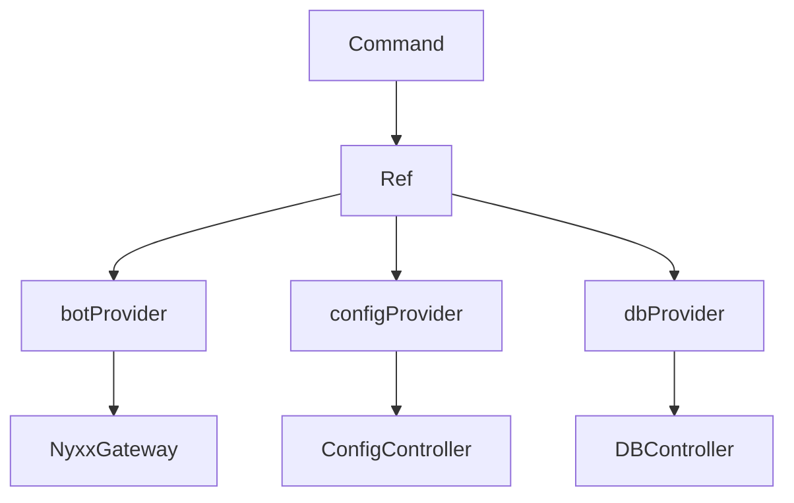

# Extending the Bot

<cite>
**Referenced Files in This Document**   
- [runnables.dart](file://src/runnables/runnables.dart)
- [commands.dart](file://src/commands/commands.dart)
- [ask.dart](file://src/runnables/ask.dart)
- [ask_command.dart](file://src/commands/ask_command.dart)
- [discord_response_utils.dart](file://src/utils/discord_response_utils.dart)
- [bot.dart](file://src/bot.dart)
- [config.dart](file://src/config.dart)
- [db.dart](file://src/db.dart)
- [listen_to_message.dart](file://src/listen_to_message.dart)
</cite>

## Table of Contents
1. [Introduction](#introduction)
2. [Core Architecture Overview](#core-architecture-overview)
3. [Implementing New Prefix Commands](#implementing-new-prefix-commands)
4. [Creating Slash Commands](#creating-slash-commands)
5. [Service Injection with Riverpod](#service-injection-with-riverpod)
6. [Example: Adding a New Command](#example-adding-a-new-command)
7. [Testing Considerations](#testing-considerations)
8. [Best Practices for Code Organization](#best-practices-for-code-organization)

## Introduction

This document provides a comprehensive guide for extending the functionality of the Discord bot by implementing new commands and features. It details the foundational abstractions used in the codebase, including the `Runnable` class for prefix-based commands and the `SlashRunnable` interface for slash commands. The guide also covers service access patterns using Riverpod providers, demonstrates complete implementation workflows, and outlines best practices for maintaining a clean and scalable codebase.

## Core Architecture Overview

The bot architecture is built around two primary command paradigms: prefix-based text commands and Discord slash commands. Both are unified through abstract base classes and dependency injection via Riverpod. The system uses a message listener to intercept incoming messages, parse commands, and dispatch execution to appropriate handlers.

```mermaid
graph TB
A[Incoming Message] --> B{Is Slash Command?}
B --> |Yes| C[SlashCommands Provider]
B --> |No| D{Starts with Prefix?}
D --> |Yes| E[Parse Command]
E --> F[Find Runnable]
F --> G[Execute Runnable.run()]
C --> H[Initialize SlashRunnable]
H --> I[Execute ChatCommand]
```

**Diagram sources**
- [listen_to_message.dart](file://src/listen_to_message.dart#L40-L140)
- [commands.dart](file://src/commands/commands.dart#L10-L55)
- [bot.dart](file://src/bot.dart#L15-L50)

**Section sources**
- [listen_to_message.dart](file://src/listen_to_message.dart#L1-L142)
- [bot.dart](file://src/bot.dart#L1-L54)

## Implementing New Prefix Commands

To add a new prefix command (e.g., `!command`), developers must implement the `Runnable` abstract class defined in `runnables.dart`. This class requires overriding the `run` method, which contains the command logic and receives essential context parameters such as the message event, channel, member, arguments, and provider container.

The `Runnable` base class provides utility methods like `messageBuilder` for creating reply messages and `sendMessage` for sending them to channels. Commands are registered statically in the `Command.values` list, making them discoverable by the message listener.



**Diagram sources**
- [runnables.dart](file://src/runnables/runnables.dart#L1-L28)
- [ask.dart](file://src/runnables/ask.dart#L1-L65)

**Section sources**
- [runnables.dart](file://src/runnables/runnables.dart#L1-L28)
- [ask.dart](file://src/runnables/ask.dart#L1-L65)
- [commands.dart](file://src/commands.dart#L50-L70)

## Creating Slash Commands

Slash commands are implemented by extending the `SlashRunnable` abstract class. Unlike prefix commands, slash commands require registration through the `SlashCommands` provider, which initializes and manages enabled/disabled commands. Each `SlashRunnable` implementation must define a name, description, and override the `initialize` method to return a `ChatCommand` instance.

The initialization process allows for asynchronous setup and conditional enabling of commands based on configuration or external dependencies. Enabled commands are automatically added to the bot's command plugin during startup.



**Diagram sources**
- [commands.dart](file://src/commands/commands.dart#L1-L55)
- [ask_command.dart](file://src/commands/ask_command.dart#L1-L71)

**Section sources**
- [commands.dart](file://src/commands/commands.dart#L1-L55)
- [ask_command.dart](file://src/commands/ask_command.dart#L1-L71)

## Service Injection with Riverpod

The bot uses Riverpod for dependency injection, allowing commands to access shared services such as the bot client, configuration, and database. Services are exposed through providers like `botProvider`, `configProvider`, and `dbProvider`, which can be read from the `Ref` object passed to command methods.

This pattern ensures loose coupling between components and enables easy testing through dependency substitution. Providers are typically accessed within the `run` or `initialize` methods using `ref.read(provider)` or `ref.container` for non-future contexts.



**Diagram sources**
- [bot.dart](file://src/bot.dart#L15-L50)
- [config.dart](file://src/config.dart#L1-L78)
- [db.dart](file://src/db.dart#L1-L132)

**Section sources**
- [bot.dart](file://src/bot.dart#L1-L54)
- [config.dart](file://src/config.dart#L1-L78)
- [db.dart](file://src/db.dart#L1-L132)

## Example: Adding a New Command

To create a new command from scratch, follow these steps:

1. **Implement a Runnable**: Create a new class extending `Runnable` in the `runnables` directory and override the `run` method with your logic.
2. **Register the Command**: Add a new static const to the `Command` class with a unique command string, description, and instance of your runnable.
3. **Add to Values List**: Include the new command in the `Command.values` list for automatic discovery.
4. **Implement Slash Variant (Optional)**: For slash command support, create a class extending `SlashRunnable` and register it in `SlashCommands.initialize()`.

For example, adding a simple `ping` command would involve creating a `PingRunnable` class that replies with "Pong!" and registering it under the `ping` command keyword.

**Section sources**
- [runnables.dart](file://src/runnables/runnables.dart#L1-L28)
- [commands.dart](file://src/commands.dart#L50-L70)
- [ask.dart](file://src/runnables/ask.dart#L1-L65)
- [ask_command.dart](file://src/commands/ask_command.dart#L1-L71)

## Testing Considerations

When implementing new features, consider the following testing strategies:

- **Unit Testing Runnables**: Mock the `ProviderContainer`, `PartialTextChannel`, and `MessageCreateEvent` to test command logic in isolation.
- **Integration Testing**: Verify that commands are properly registered and dispatched by simulating message events.
- **Error Handling**: Test edge cases such as invalid input, rate limiting, and service failures using the utilities in `discord_response_utils.dart`.
- **Provider Injection**: Use Riverpod's testing utilities to override providers with mock implementations during tests.

The `AICommandUtils` class provides reusable validation and error handling patterns that should be leveraged to ensure consistent user feedback across AI-related commands.

**Section sources**
- [utils/discord_response_utils.dart](file://src/utils/discord_response_utils.dart#L1-L225)
- [ask_command.dart](file://src/commands/ask_command.dart#L1-L71)
- [ask.dart](file://src/runnables/ask.dart#L1-L65)

## Best Practices for Code Organization

Maintain code quality and scalability by following these best practices:

- **Separate Concerns**: Keep command logic in `runnables/` and command definitions in `commands/`.
- **Reuse Utilities**: Leverage existing helper classes like `AICommandUtils` for common operations.
- **Consistent Naming**: Follow the naming convention where `Runnable` classes end with `Runnable` and command files use `_command.dart` suffix.
- **Error Handling**: Always handle exceptions gracefully and provide meaningful feedback to users.
- **Configuration Awareness**: Check configuration state before executing commands that depend on it.
- **Rate Limiting**: Implement rate limiting for resource-intensive operations using tools like `MsgQueue`.

By adhering to these patterns, new features will integrate seamlessly with the existing architecture and remain maintainable as the codebase grows.

**Section sources**
- [runnables/](file://src/runnables/)
- [commands/](file://src/commands/)
- [utils/discord_response_utils.dart](file://src/utils/discord_response_utils.dart#L1-L225)
- [listen_to_message.dart](file://src/listen_to_message.dart#L1-L142)