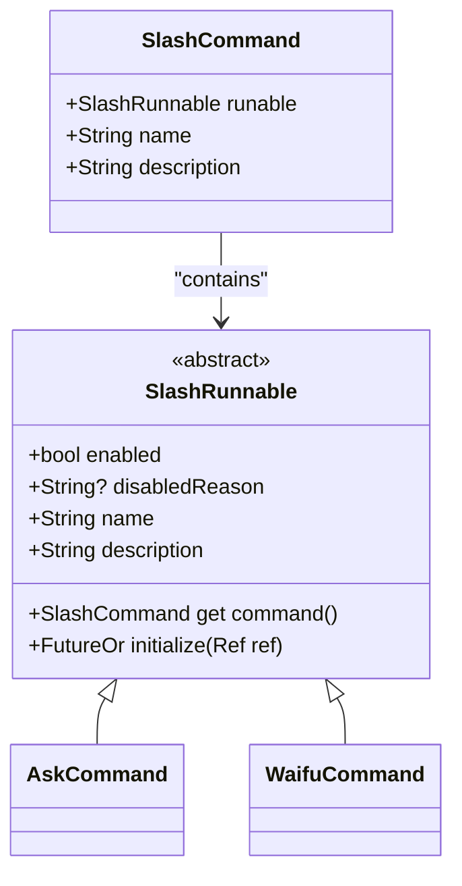
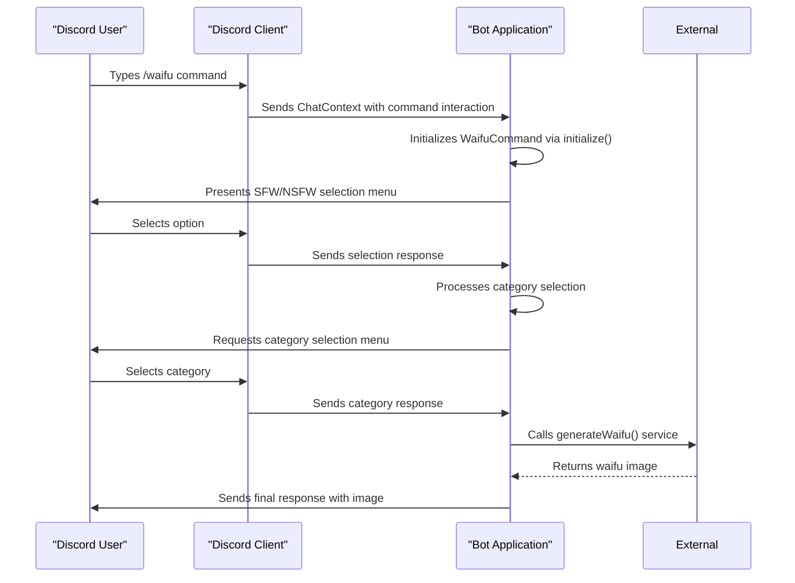
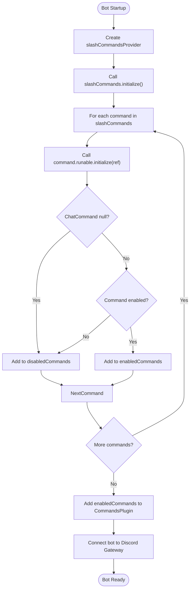
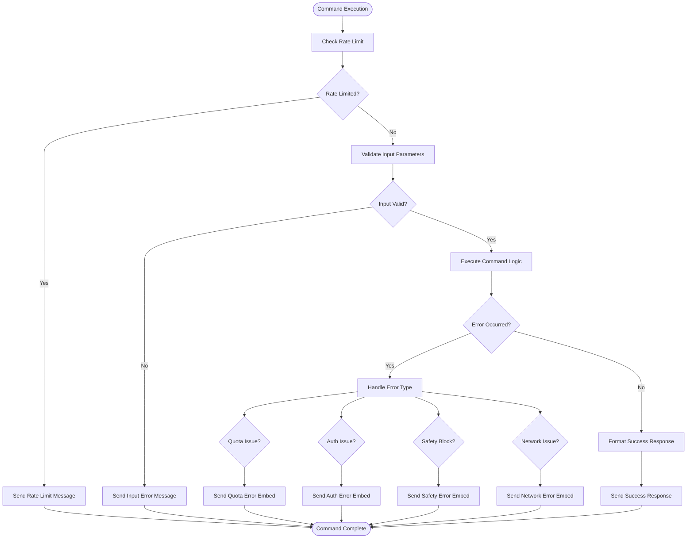

# Implementing Slash Commands

<cite>
**Referenced Files in This Document**   
- [ask_command.dart](file://src/commands/ask_command.dart)
- [waifu_command.dart](file://src/commands/waifu_command.dart)
- [commands.dart](file://src/commands/commands.dart)
- [bot.dart](file://src/bot.dart)
- [discord_response_utils.dart](file://src/utils/discord_response_utils.dart)
- [ask.dart](file://src/runnables/ask.dart)
- [waifu_points.dart](file://src/runnables/waifu_points.dart)
- [config.dart](file://src/config.dart)
</cite>

## Table of Contents
1. [Introduction](#introduction)
2. [Core Components](#core-components)
3. [SlashRunnable Abstract Class](#slashrunnable-abstract-class)
4. [Defining Slash Commands with SlashCommandBuilder](#defining-slash-commands-with-slashcommandbuilder)
5. [Command Registration and Initialization](#command-registration-and-initialization)
6. [Interaction Response Handling](#interaction-response-handling)
7. [Option Parsing and Command Logic](#option-parsing-and-command-logic)
8. [Validation and Error Handling](#validation-and-error-handling)
9. [Adding a New Slash Command](#adding-a-new-slash-command)
10. [Conclusion](#conclusion)

## Introduction

This document provides comprehensive guidance on implementing slash commands in the Discord bot application. It covers the architecture, implementation patterns, and best practices for creating interactive Discord commands using the nyxx_commands framework. The documentation focuses on the slash command system, contrasting it with traditional prefix-based commands, and provides detailed examples from the existing codebase to illustrate proper implementation techniques.

## Core Components

The slash command system in this Discord bot is built around several key components that work together to provide a robust command execution framework. The architecture leverages Riverpod for dependency injection and state management, enabling clean separation of concerns and testable code. The core components include the SlashRunnable abstract class, SlashCommandBuilder pattern, command registration provider, and interaction handling utilities.

**Section sources**
- [commands.dart](file://src/commands/commands.dart#L1-L55)
- [bot.dart](file://src/bot.dart#L1-L53)

## SlashRunnable Abstract Class

The SlashRunnable abstract class serves as the foundation for all slash commands in the application. It defines a standardized interface that all slash commands must implement, ensuring consistency across command implementations. Unlike prefix command Runnables which extend the Runnable base class, SlashRunnable is specifically designed for Discord's interaction-based command system.

The abstract class requires concrete implementations to provide a name and description for the command, and defines an initialize method that returns a ChatCommand instance. It also includes properties for enabling/disabling commands and specifying disablement reasons. The command property automatically creates a SlashCommand wrapper that associates the runnable with its metadata.

**Diagram sources**
- [commands.dart](file://src/commands/commands.dart#L45-L55)

**Section sources**
- [commands.dart](file://src/commands/commands.dart#L45-L55)
- [ask_command.dart](file://src/commands/ask_command.dart#L1-L71)
- [waifu_command.dart](file://src/commands/waifu_command.dart#L1-L166)

## Defining Slash Commands with SlashCommandBuilder

Slash commands are defined using the ChatCommand class from the nyxx_commands package, which functions as a command builder. Commands like AskCommand and WaifuCommand demonstrate how to configure command options, parameters, and execution logic. The builder pattern allows for fluent configuration of command properties including name, description, options, and the execution callback.

Command options are configured through the CommandOptions parameter, which can specify command type restrictions (e.g., CommandType.all for both guild and direct messages). The id function is used to create a unique identifier for the command and define its execution callback. Parameters in the callback function can be annotated with @Description to provide user-facing descriptions in the Discord client.

For commands requiring user input, the builder supports various parameter types including strings, numbers, and selections. The WaifuCommand demonstrates interactive selection with getSelection, allowing users to choose from predefined options through Discord's selection menu interface.

**Diagram sources**
- [waifu_command.dart](file://src/commands/waifu_command.dart#L1-L166)
- [ask_command.dart](file://src/commands/ask_command.dart#L1-L71)

**Section sources**
- [waifu_command.dart](file://src/commands/waifu_command.dart#L1-L166)
- [ask_command.dart](file://src/commands/ask_command.dart#L1-L71)

## Command Registration and Initialization

The slash command registration process is managed through the SlashCommands provider in bot.dart. This provider follows a dependency injection pattern using Riverpod, allowing commands to be properly initialized with required dependencies. During bot startup, the initialize method of SlashCommands iterates through all registered commands, calls their initialize method with the Ref context, and collects enabled commands for registration.

The bot.dart file orchestrates the entire command registration process. It creates a CommandsPlugin instance, initializes the slashCommandsProvider, and adds each enabled command to the plugin. This initialization occurs during the botProvider creation, ensuring commands are ready when the bot connects to Discord.

The registration flow ensures that commands can perform asynchronous initialization, such as fetching external data or validating dependencies, before being made available. Commands that fail initialization or are disabled are moved to the disabledCommands list, preventing them from being registered while preserving them for potential later activation.

**Diagram sources**
- [bot.dart](file://src/bot.dart#L1-L53)
- [commands.dart](file://src/commands/commands.dart#L1-L55)

**Section sources**
- [bot.dart](file://src/bot.dart#L1-L53)
- [commands.dart](file://src/commands/commands.dart#L1-L55)

## Interaction Response Handling

Interaction responses are handled asynchronously through the ChatContext provided by the nyxx_commands framework. When a user invokes a slash command, Discord sends an interaction event that the bot receives and processes. The context.respond method is used to send initial responses, with support for deferred responses when command execution may take longer than the 3-second acknowledgment window.

The ask_command.dart implementation demonstrates proper response handling patterns, including immediate validation responses and asynchronous processing of AI requests. The waifu_command.dart shows more complex interaction flows with multiple user inputs through selection menus. Both commands use proper error handling to ensure users receive feedback even when operations fail.

Deferred responses are managed automatically by the framework when responses are sent after the initial acknowledgment period. The message.edit method is used to update initial responses with final results, providing a seamless user experience. The triggerTyping method is also used to indicate ongoing processing, improving perceived responsiveness.

**Section sources**
- [ask_command.dart](file://src/commands/ask_command.dart#L1-L71)
- [waifu_command.dart](file://src/commands/waifu_command.dart#L1-L166)
- [discord_response_utils.dart](file://src/utils/discord_response_utils.dart#L1-L225)

## Option Parsing and Command Logic

Command logic is implemented within the execution callback defined during command creation. The callback receives a ChatContext containing all interaction data, including user input options. Parameters in the callback signature are automatically populated by the framework based on the command's parameter definitions.

The ask_command.dart demonstrates simple parameter parsing with a required string prompt parameter annotated with @Description. The waifu_command.dart shows more complex parsing with interactive selections for command options. The getSelection method handles the asynchronous process of presenting choices to users and returning their selections.

Command logic should be separated from response formatting when possible, as demonstrated by the AICommandUtils class in discord_response_utils.dart. This utility class contains methods for building standardized response messages, promoting consistency across commands and simplifying testing. Business logic is kept in the command classes while presentation logic is delegated to utility functions.

**Section sources**
- [ask_command.dart](file://src/commands/ask_command.dart#L1-L71)
- [waifu_command.dart](file://src/commands/waifu_command.dart#L1-L166)
- [discord_response_utils.dart](file://src/utils/discord_response_utils.dart#L1-L225)

## Validation and Error Handling

Robust validation and error handling are critical for a reliable slash command system. The implementation follows best practices for both input validation and runtime error management. The AICommandUtils class provides a comprehensive validation framework that checks rate limits and input validity before processing requests.

Rate limiting is implemented through the MsgQueue class, which tracks user requests over time. Input validation ensures prompts meet length requirements and are not empty. Validation results are encapsulated in AICommandValidationResult objects, providing both a continue flag and optional error message.

Error responses are standardized through utility methods that create consistent embeds for different error types (quota exceeded, authentication issues, content blocked, etc.). The framework also handles ConverterFailedException errors globally through the onCommandError listener in bot.dart, providing feedback when parameter conversion fails.

**Diagram sources**
- [discord_response_utils.dart](file://src/utils/discord_response_utils.dart#L1-L225)
- [ask_command.dart](file://src/commands/ask_command.dart#L1-L71)

**Section sources**
- [discord_response_utils.dart](file://src/utils/discord_response_utils.dart#L1-L225)
- [ask_command.dart](file://src/commands/ask_command.dart#L1-L71)

## Adding a New Slash Command

To add a new slash command, follow these steps:

1. Create a new class that extends SlashRunnable in the src/commands directory
2. Implement the required name and description properties
3. Override the initialize method to return a configured ChatCommand
4. Define command parameters and execution logic in the callback
5. Add the command to the slashCommands list in commands.dart
6. Ensure all dependencies are available through Riverpod providers

The process leverages the existing architecture to ensure consistency and proper dependency management. New commands automatically participate in the registration flow and benefit from the established error handling and response patterns.

**Section sources**
- [commands.dart](file://src/commands/commands.dart#L1-L55)
- [ask_command.dart](file://src/commands/ask_command.dart#L1-L71)
- [waifu_command.dart](file://src/commands/waifu_command.dart#L1-L166)

## Conclusion

The slash command implementation in this Discord bot provides a robust, scalable framework for creating interactive commands. By leveraging the SlashRunnable abstract class, command builder pattern, and Riverpod dependency injection, the system enables clean, maintainable command implementations. The architecture supports asynchronous initialization, proper error handling, and consistent user feedback, making it well-suited for complex command workflows. Following the patterns demonstrated in the existing commands ensures new features integrate seamlessly with the established codebase.