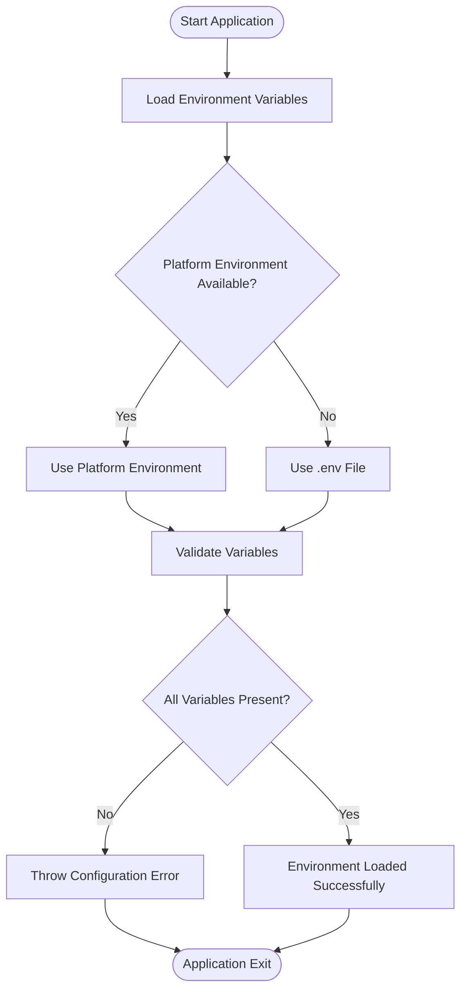
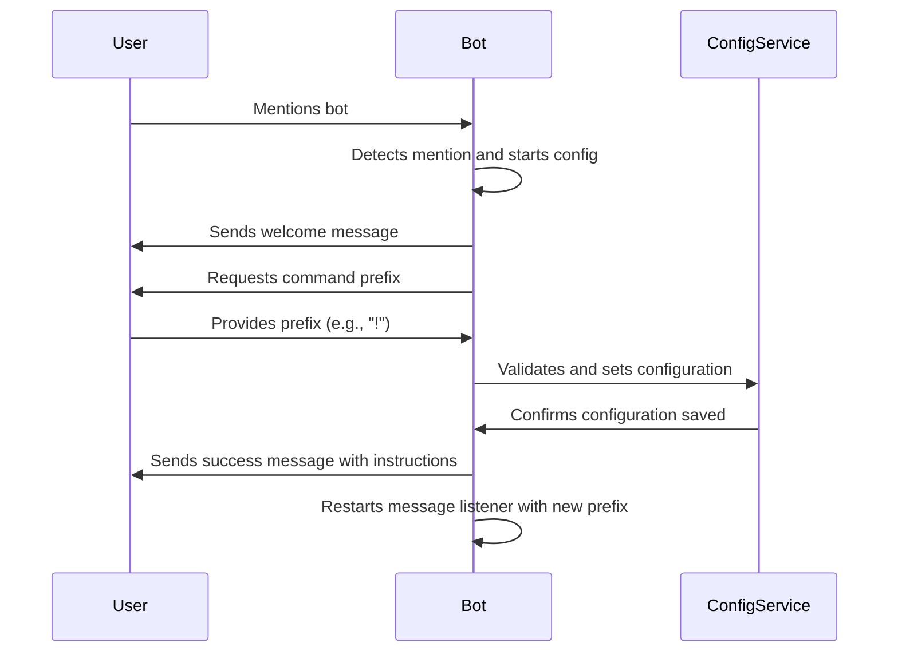
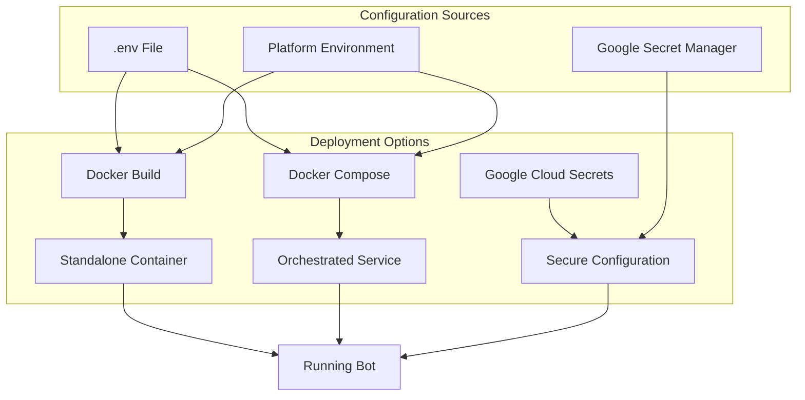
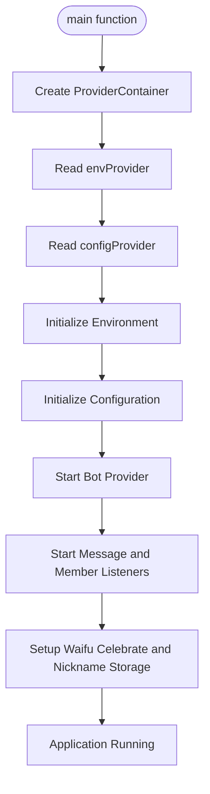

# Getting Started

<cite>
**Referenced Files in This Document**   
- [README.md](file://README.md)
- [bin/main.dart](file://bin/main.dart)
- [src/env.dart](file://src/env.dart)
- [src/config.dart](file://src/config.dart)
- [src/runnables/config_runnable.dart](file://src/runnables/config_runnable.dart)
- [Dockerfile](file://Dockerfile)
- [docker-compose.yml](file://docker-compose.yml)
- [create_secrets.sh](file://create_secrets.sh)
</cite>

## Table of Contents
1. [Introduction](#introduction)
2. [Prerequisites](#prerequisites)
3. [Repository Setup](#repository-setup)
4. [Environment Configuration](#environment-configuration)
5. [Bot Initialization](#bot-initialization)
6. [Deployment Methods](#deployment-methods)
7. [Code Architecture Overview](#code-architecture-overview)
8. [Troubleshooting Guide](#troubleshooting-guide)
9. [Conclusion](#conclusion)

## Introduction

This guide provides comprehensive instructions for setting up and running the Discord bot application. The documentation covers the complete setup process from repository cloning to deployment, with detailed explanations of configuration requirements and system architecture. The bot is designed to provide various interactive features including mass ping functionality, AI integration, and configurable command prefixes.

The application is built using Dart with Riverpod for state management and Nyxx for Discord API integration. It supports multiple deployment methods including Docker and docker-compose, making it suitable for both development and production environments.

**Section sources**
- [README.md](file://README.md#L1-L26)

## Prerequisites

Before setting up the Discord bot, ensure you have the following prerequisites installed and configured:

1. **Dart SDK**: The application is built using Dart, so you'll need the Dart SDK installed on your system. The Docker image uses `dart:stable`, so ensure your local Dart version is compatible.

2. **Docker**: Required for containerized deployment. The application provides both a Dockerfile and docker-compose.yml for easy container management.

3. **Discord Bot Registration**: You must register a bot application on the Discord Developer Portal to obtain a bot token. This involves:
   - Creating a new application
   - Adding a bot to the application
   - Copying the bot token for use in configuration
   - Configuring appropriate bot permissions

4. **Basic Command Line Knowledge**: Familiarity with terminal commands for file manipulation, environment variable management, and Docker operations.

These prerequisites are essential for both local development and containerized deployment of the bot.

**Section sources**
- [README.md](file://README.md#L4-L7)

## Repository Setup

To begin setting up the Discord bot, follow these steps to clone and prepare the repository:

1. Clone the repository to your local machine:
```bash
git clone https://github.com/your-username/discord_bot.git
cd discord_bot
```

2. Verify the repository structure contains all necessary files:
   - `bin/main.dart`: Application entry point
   - `Dockerfile`: Container build instructions
   - `docker-compose.yml`: Container orchestration configuration
   - `src/`: Source code directory with bot functionality
   - `create_secrets.sh`: Script for Google Cloud Secret Manager integration

3. Ensure you have the correct file permissions for execution scripts:
```bash
chmod +x create_secrets.sh
```

The repository is now ready for environment configuration and deployment.

**Section sources**
- [README.md](file://README.md#L10-L11)

## Environment Configuration

Proper environment configuration is critical for the bot's operation. The application supports two methods for providing environment variables: `.env` file and platform environment variables.

### Environment Variables

The following environment variables must be configured:

- `BOT_TOKEN`: The authentication token for your Discord bot (required)
- `PREFIX`: The command prefix for bot interactions (required)
- `FOOTER_TEXT`: Text displayed in the footer of bot responses (required)
- `ADMIN_USER_ID`: Discord user ID of the bot administrator (required)
- `WAIFU_API_URL`: Endpoint URL for the waifu API service (required)
- `GUILD_ID`: Discord server (guild) ID where the bot operates (required)
- `AI_API_KEY`: Authentication key for the AI service (required)
- `RED_DOOR_AI_PERSONA`: Personality configuration for the AI (required)
- `AI_MODEL`: AI model identifier to use (required)

### Configuration Methods

#### Method 1: .env File
Create a `.env` file in the root directory with the following format:
```env
BOT_TOKEN=your_bot_token_here
PREFIX=!
FOOTER_TEXT=Bot Footer Text
ADMIN_USER_ID=1234567890
WAIFU_API_URL=https://api.example.com/waifu
GUILD_ID=0987654321
AI_API_KEY=your_ai_api_key
RED_DOOR_AI_PERSONA=default
AI_MODEL=gpt-3.5-turbo
```

#### Method 2: Platform Environment
Set the variables directly in your shell or deployment platform:
```bash
export BOT_TOKEN="your_bot_token_here"
export PREFIX="!"
export FOOTER_TEXT="Bot Footer Text"
# ... set all required variables
```

The application validates all required environment variables on startup and will fail to start if any are missing.



**Diagram sources**
- [src/env.dart](file://src/env.dart#L32-L98)

**Section sources**
- [README.md](file://README.md#L12-L19)
- [src/env.dart](file://src/env.dart#L1-L98)

## Bot Initialization

After configuring the environment, the bot requires initial setup through an interactive configuration process.

### Interactive Configuration

1. Start the bot using your preferred deployment method
2. Once the bot is online, mention the bot in any channel
3. The bot will respond with a welcome message and prompt for configuration
4. Provide a command prefix when prompted (e.g., "!")
5. The bot will confirm the prefix and complete setup

The configuration is stored in `config.json` and includes:
- Command prefix
- Optional waifu celebrate channel ID

### Configuration Process Flow



**Diagram sources**
- [src/runnables/config_runnable.dart](file://src/runnables/config_runnable.dart#L1-L135)
- [src/config.dart](file://src/config.dart#L1-L78)

**Section sources**
- [src/runnables/config_runnable.dart](file://src/runnables/config_runnable.dart#L1-L135)
- [src/config.dart](file://src/config.dart#L1-L78)

## Deployment Methods

The Discord bot can be deployed using multiple methods, with Docker-based deployment being the recommended approach.

### Docker Deployment

Build and run the container using the provided Dockerfile:
```bash
docker build -t discord-bot .
docker run -d --env-file .env discord-bot
```

### Docker Compose Deployment

Use docker-compose for easier management:
```bash
docker-compose up --build -d
```

The docker-compose.yml configuration exposes port 24000 and sets the restart policy to "unless-stopped" for reliability.

### Google Cloud Secret Manager Integration

For enhanced security, use the provided script to create secrets in Google Cloud:
```bash
./create_secrets.sh
```

This script reads the .env file and creates corresponding secrets in Google Secret Manager with names converted from underscores to hyphens (e.g., BOT_TOKEN becomes bot-token).



**Diagram sources**
- [Dockerfile](file://Dockerfile#L1-L24)
- [docker-compose.yml](file://docker-compose.yml#L1-L13)
- [create_secrets.sh](file://create_secrets.sh#L1-L51)

**Section sources**
- [Dockerfile](file://Dockerfile#L1-L24)
- [docker-compose.yml](file://docker-compose.yml#L1-L13)
- [create_secrets.sh](file://create_secrets.sh#L1-L51)

## Code Architecture Overview

The application follows a modular architecture with clear separation of concerns, leveraging Riverpod for state management and dependency injection.

### ProviderContainer Initialization

The main.dart file demonstrates the application's startup sequence using Riverpod's ProviderContainer:



**Diagram sources**
- [bin/main.dart](file://bin/main.dart#L10-L28)

### Service Startup Sequence

The startup process follows this sequence:
1. Initialize environment variables
2. Initialize configuration
3. Start the main bot service
4. Start message listener
5. Start member change listener
6. Setup waifu celebrate functionality
7. Initialize nickname storage

This sequential initialization ensures all dependencies are properly configured before services that depend on them are started.

**Section sources**
- [bin/main.dart](file://bin/main.dart#L10-L28)

## Troubleshooting Guide

This section addresses common issues encountered during setup and deployment.

### Missing Environment Variables

**Symptom**: Application fails to start with "Environment variables are not set properly" error

**Solution**: 
- Verify all required environment variables are defined
- Check for typos in variable names
- Ensure the .env file is in the correct location
- Validate that platform environment variables are properly exported

### Permission Errors

**Symptom**: Docker commands fail with permission denied errors

**Solution**:
- Run Docker commands with sudo if necessary
- Ensure your user is part of the docker group
- Verify file permissions for the create_secrets.sh script

### Bot Not Responding

**Symptom**: Bot appears online but doesn't respond to commands

**Solution**:
- Verify the bot token is correct and the bot has proper permissions
- Check that the command prefix matches what was configured
- Ensure the config.json file was created successfully
- Verify the bot has read and send message permissions in the channel

### Configuration Issues

**Symptom**: Configuration process fails or doesn't save

**Solution**:
- Ensure the application has write permissions to create config.json
- Verify the configuration command is being used correctly
- Check that the bot has permission to create private channels for mass ping functionality

**Section sources**
- [src/env.dart](file://src/env.dart#L76-L98)
- [README.md](file://README.md#L22-L23)

## Conclusion

This guide has provided comprehensive instructions for setting up and running the Discord bot application. The deployment process involves configuring environment variables, initializing the bot through the interactive configuration process, and deploying via Docker or docker-compose.

The application's architecture leverages Riverpod for dependency management and follows a clean, modular structure that separates concerns between environment configuration, bot functionality, and command execution. With proper setup, the bot will be fully operational and ready to handle user interactions according to the configured command prefix and settings.

For ongoing maintenance, remember to keep environment variables secure, monitor the bot's performance, and update the application as needed to incorporate new features or security improvements.