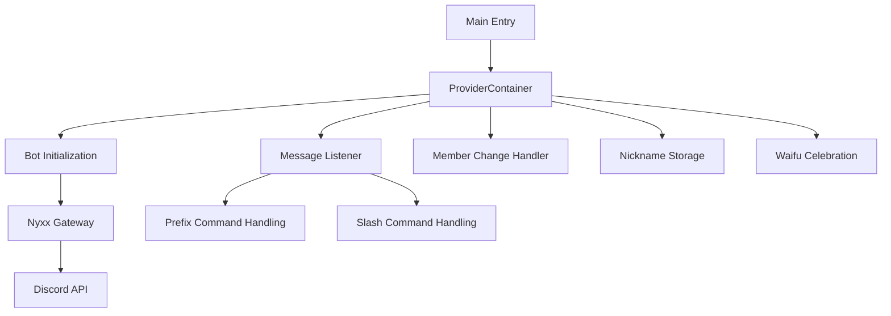
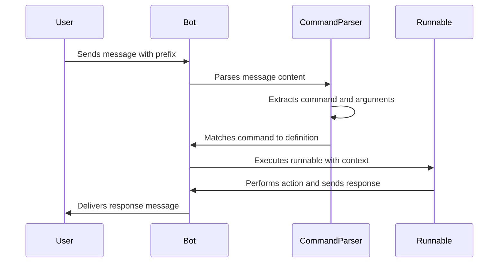
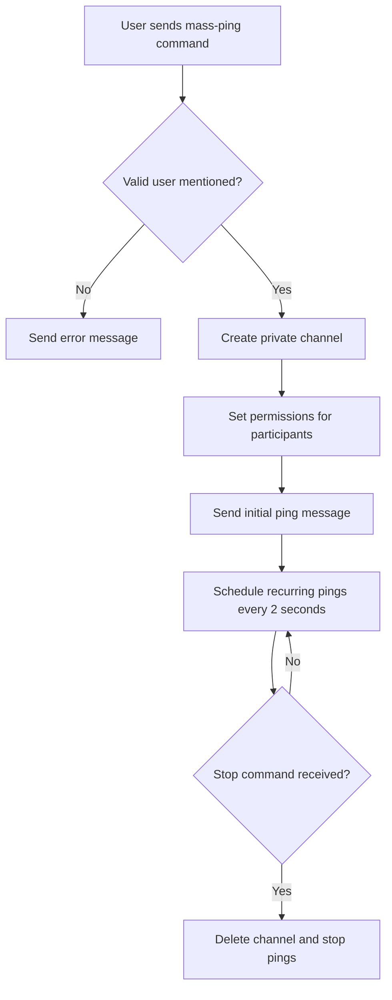
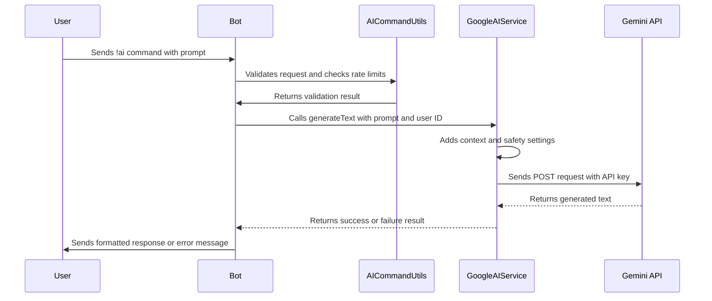

# Project Overview

<cite>
**Referenced Files in This Document**  
- [bin/main.dart](file://bin/main.dart)
- [src/bot.dart](file://src/bot.dart)
- [src/commands.dart](file://src/commands.dart)
- [src/commands/ask_command.dart](file://src/commands/ask_command.dart)
- [src/runnables/mass_ping_runnable.dart](file://src/runnables/mass_ping_runnable.dart)
- [src/runnables/ask.dart](file://src/runnables/ask.dart)
- [src/google_ai_service.dart](file://src/google_ai_service.dart)
- [src/cron.dart](file://src/cron.dart)
- [src/db.dart](file://src/db.dart)
- [src/listen_to_message.dart](file://src/listen_to_message.dart)
- [src/config.dart](file://src/config.dart)
- [src/env.dart](file://src/env.dart)
- [pubspec.yaml](file://pubspec.yaml)
- [README.md](file://README.md)
</cite>

## Table of Contents
1. [Introduction](#introduction)
2. [Core Architecture](#core-architecture)
3. [Command System](#command-system)
4. [Key Features](#key-features)
5. [Dependency Injection and State Management](#dependency-injection-and-state-management)
6. [Event Handling and Automation](#event-handling-and-automation)
7. [Data Persistence](#data-persistence)
8. [AI Integration](#ai-integration)
9. [Deployment and Configuration](#deployment-and-configuration)
10. [Use Cases and Scenarios](#use-cases-and-scenarios)

## Introduction

The Discord bot project is a Dart-based application designed to enhance Discord server interactions through automation, personalization, and entertainment features. At its core, the bot provides a mass-pinging functionality that allows users to repeatedly ping a target user in a private channel, while also offering additional features such as AI-powered responses, waifu point tracking, and nickname persistence. The bot leverages the Nyxx framework for Discord API interactions and Riverpod for dependency injection and state management, creating a modular and maintainable architecture.

**Section sources**  
- [README.md](file://README.md#L1-L26)

## Core Architecture

The application follows a modular architecture with clear separation between command definitions, runnable implementations, and service providers. The entry point at `bin/main.dart` initializes the Riverpod container and orchestrates the startup of various services including message listening, member change tracking, and nickname storage. The core bot instance is provided via `botProvider`, which configures the Nyxx gateway with necessary intents and plugins, including command handling through `CommandsPlugin`.

The architecture emphasizes separation of concerns by decoupling command declarations from their execution logic. Commands are defined as static constants in `src/commands.dart`, while their actual behavior is implemented in separate runnable classes within `src/runnables/`. This design allows for easy extension and modification of bot functionality without affecting the core command registration system.

**Diagram sources**  
- [bin/main.dart](file://bin/main.dart#L1-L30)
- [src/bot.dart](file://src/bot.dart#L1-L54)
- [src/listen_to_message.dart](file://src/listen_to_message.dart#L1-L142)

**Section sources**  
- [bin/main.dart](file://bin/main.dart#L1-L30)
- [src/bot.dart](file://src/bot.dart#L1-L54)

## Command System

The bot supports both prefix-based and slash commands, providing flexibility in user interaction. Command definitions are centralized in `src/commands.dart`, where each command is represented as a constant with metadata including name, description, arguments, and associated runnable. The system includes built-in commands such as `mass-ping`, `config`, `help`, `waifu-points`, and `ai`, each mapped to a corresponding runnable implementation.

The command execution flow begins with message reception in the `MessageListener` class, which parses incoming messages for the configured prefix and matches them against registered commands. When a match is found, the associated runnable's `run` method is invoked with relevant context including arguments, channel, member, and message event. This separation allows for clean command registration while keeping implementation details encapsulated within runnable classes.

**Diagram sources**  
- [src/commands.dart](file://src/commands.dart#L1-L71)
- [src/listen_to_message.dart](file://src/listen_to_message.dart#L1-L142)
- [src/runnables/runnables.dart](file://src/runnables/runnables.dart#L1-L29)

**Section sources**  
- [src/commands.dart](file://src/commands.dart#L1-L71)
- [src/listen_to_message.dart](file://src/listen_to_message.dart#L1-L142)

## Key Features

### Mass-Ping Functionality

The bot's primary feature is the mass-ping capability, implemented in `MassPingRunnable`. When activated, this feature creates a private text channel with restricted permissions where the target user is repeatedly pinged every two seconds. The channel is configured to be visible only to the bot, the sender, and the target user, ensuring privacy while maintaining the disruptive effect. Users can stop the mass-ping by including the "stop" argument in a subsequent command invocation.

**Diagram sources**  
- [src/runnables/mass_ping_runnable.dart](file://src/runnables/mass_ping_runnable.dart#L1-L177)

**Section sources**  
- [src/runnables/mass_ping_runnable.dart](file://src/runnables/mass_ping_runnable.dart#L1-L177)

### Waifu Points and Nickname Persistence

The bot tracks user interactions through waifu points and maintains nickname history. The `DBController` class manages persistence of this data in JSON files, storing waifu points, user waifu preferences, and nickname mappings. This data is used to recognize user patterns and maintain personalization across sessions, with the ability to identify a user's most frequently used waifu tag and restore previous nicknames.

**Section sources**  
- [src/db.dart](file://src/db.dart#L1-L133)

## Dependency Injection and State Management

The application utilizes Riverpod for dependency injection and state management, providing a clean and testable architecture. Providers are defined for core services including the bot instance, configuration controller, database controller, and various feature-specific controllers. The `ProviderContainer` initialized in `main.dart` serves as the root container for all dependencies, allowing for easy access to services throughout the application.

Key providers include:
- `botProvider`: Manages the Nyxx gateway connection
- `configProvider`: Handles bot configuration loading and persistence
- `dbProvider`: Manages data persistence for waifu points and nicknames
- `pingCronsProvider`: Tracks active mass-ping cron jobs
- `googleAIServiceProvider`: Provides access to AI generation services

This dependency injection pattern enables loose coupling between components and facilitates testing by allowing providers to be overridden in test environments.

**Section sources**  
- [bin/main.dart](file://bin/main.dart#L1-L30)
- [src/bot.dart](file://src/bot.dart#L1-L54)
- [src/config.dart](file://src/config.dart#L1-L79)
- [src/db.dart](file://src/db.dart#L1-L133)
- [src/cron.dart](file://src/cron.dart#L1-L44)
- [src/google_ai_service.dart](file://src/google_ai_service.dart#L1-L167)

## Event Handling and Automation

The bot implements event-driven message handling through the `MessageListener` class, which subscribes to Discord's message creation events. This listener processes both prefix commands and bot mentions, routing them to appropriate handlers. When the bot is mentioned without a specific command, it responds with help information. The listener also handles disabled slash commands by providing appropriate feedback to users.

Scheduled automation is implemented using the cron package, particularly for the mass-ping feature. The `PingCrons` class manages a collection of cron jobs, each associated with a specific sender-receiver pair. These cron jobs execute every two seconds to send ping messages in the private channel created for mass-pinging.

**Section sources**  
- [src/listen_to_message.dart](file://src/listen_to_message.dart#L1-L142)
- [src/cron.dart](file://src/cron.dart#L1-L44)
- [src/runnables/mass_ping_runnable.dart](file://src/runnables/mass_ping_runnable.dart#L1-L177)

## Data Persistence

Data persistence is handled through JSON file storage, with separate files for configuration (`config.json`) and user data (`db.json`). The `ConfigController` manages bot configuration including the command prefix and celebration channel, while the `DBController` handles user-specific data such as waifu points, preferences, and nicknames.

The persistence system follows a simple pattern: data is loaded from JSON files at startup, modifications are made in memory, and changes are written back to files when updated. This approach provides reliable data storage without the complexity of a database system, suitable for the bot's scale and requirements.

**Section sources**  
- [src/config.dart](file://src/config.dart#L1-L79)
- [src/db.dart](file://src/db.dart#L1-L133)

## AI Integration

The bot features AI-powered responses through integration with Google's Generative AI (Gemini) API. The `GoogleAIService` class handles communication with the Gemini API, sending user prompts with contextual information and processing the responses. The AI functionality can be accessed through both the `ai` prefix command and the `/ask` slash command.

The AI system includes several important features:
- Contextual awareness with user identification
- Safety settings configuration to control content filtering
- Rate limiting and input validation through `MsgQueue`
- Error handling and fallback responses
- Configurable AI persona through environment variables

When a user submits a prompt, the service enriches it with context about the AI's persona and the user, sends it to the Gemini API, and returns the generated response in a formatted embed message.

**Diagram sources**  
- [src/google_ai_service.dart](file://src/google_ai_service.dart#L1-L167)
- [src/commands/ask_command.dart](file://src/commands/ask_command.dart#L1-L72)
- [src/runnables/ask.dart](file://src/runnables/ask.dart#L1-L66)

**Section sources**  
- [src/google_ai_service.dart](file://src/google_ai_service.dart#L1-L167)
- [src/commands/ask_command.dart](file://src/commands/ask_command.dart#L1-L72)
- [src/runnables/ask.dart](file://src/runnables/ask.dart#L1-L66)

## Deployment and Configuration

The bot is designed for containerized deployment using Docker, with configuration managed through environment variables and JSON files. The `Dockerfile` and `docker-compose.yml` files enable easy deployment, while the `.env` file contains sensitive credentials and configuration options.

Required environment variables include:
- `BOT_TOKEN`: Discord bot token for authentication
- `PREFIX`: Command prefix for prefix-based commands
- `FOOTER_TEXT`: Text to include in message footers
- `AI_API_KEY`: API key for Google's Generative AI service
- `AI_MODEL`: Gemini model identifier
- `AI_PERSONA`: Contextual persona for AI responses
- `ADMIN_USER_ID`: User ID with administrative privileges

The bot initializes its configuration by checking for `config.json`, creating it if necessary, and allowing users to modify settings through the `config` command. This hybrid approach of environment variables for secrets and JSON files for user-modifiable settings provides both security and flexibility.

**Section sources**  
- [README.md](file://README.md#L1-L26)
- [Dockerfile](file://Dockerfile)
- [docker-compose.yml](file://docker-compose.yml)
- [.env](file://.env)
- [src/env.dart](file://src/env.dart)

## Use Cases and Scenarios

### Mass-Ping Use Case

A user wants to playfully harass a friend by repeatedly pinging them. They use the command `!mass-ping @friend` which triggers the creation of a private channel where the friend is pinged every two seconds with the message "ANSWER ME!!!!!!!!!!". The channel is only visible to the bot, the sender, and the target, maintaining server cleanliness while delivering the intended annoyance. The sender can later stop the pings with `!mass-ping @friend stop`.

### AI Interaction Scenario

A server member wants to ask a question that requires knowledge beyond what the community can provide. They use the `/ask` command with their question, which routes through the bot to the Gemini API. The bot returns a well-formatted response with the original question, generated answer, and attribution, enhancing the server's utility without requiring human intervention.

### Waifu Point Tracking

Server members participate in waifu-related discussions, and the bot automatically tracks their preferences and assigns points. Over time, the bot can identify patterns in user behavior and potentially recognize a user's "most used waifu" based on their message history and explicit preferences, adding a layer of personalization to interactions.

### Nickname Persistence

When a user changes their nickname, the bot stores this information. If the user later reverts to a previous nickname or wants to recall what they were previously called, the bot can retrieve this historical information, helping maintain continuity in server relationships and inside jokes.

These use cases demonstrate how the bot enhances Discord server interactions through automation, personalization, and entertainment features, creating a more engaging and dynamic community environment.

**Section sources**  
- [src/runnables/mass_ping_runnable.dart](file://src/runnables/mass_ping_runnable.dart#L1-L177)
- [src/google_ai_service.dart](file://src/google_ai_service.dart#L1-L167)
- [src/db.dart](file://src/db.dart#L1-L133)
- [src/store_all_nick_names.dart](file://src/store_all_nick_names.dart)